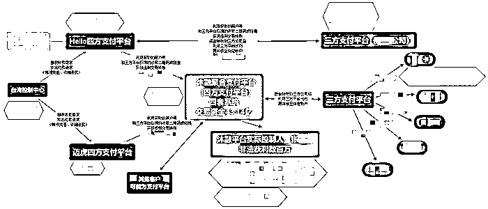

# 为跨境赌博团伙“洗钱”逾 43 亿元， 14 人一审被判刑，这位三方支付副总也栽了

> 原文：[`mp.weixin.qq.com/s?__biz=MzIyMDYwMTk0Mw==&mid=2247532301&idx=6&sn=6547f04faee7f56533509948bd07825d&chksm=97cbb435a0bc3d2374a44137f55f4318b1d4e05d8cefe9a7f20f5de5910ac45f1f0b97ffd210&scene=27#wechat_redirect`](http://mp.weixin.qq.com/s?__biz=MzIyMDYwMTk0Mw==&mid=2247532301&idx=6&sn=6547f04faee7f56533509948bd07825d&chksm=97cbb435a0bc3d2374a44137f55f4318b1d4e05d8cefe9a7f20f5de5910ac45f1f0b97ffd210&scene=27#wechat_redirect)

图片来源：视觉中国

> 记者 | 张晓云

3 月 23 日，湖北省宜昌市公安局官方微信公众号“平安宜昌”通报，广东汇卡商务服务有限公司（下称广东汇卡）涉嫌帮助网络犯罪活动罪被宜都市人民法院一审判决。

“沐融”“helloepay”“迈虎”三个非法第四方支付平台持有人张某某、白某某、尹某某分别被判有期徒刑 10 年、7 年和 6 年，其余 11 名涉案人员分别被判处有期徒刑 10 个月至 2 年 3 个月不等。该团伙为跨境赌博团伙“洗钱”逾 43 亿元。

通报称，2020 年初，宜都市公安局根据公安部推送的线索，摧毁了以郭某为首的贩卖对公账户犯罪团伙。案件侦办过程中，民警发现郭某跟福建安溪白某某有对公账户非法交易的线索。

来源：宜昌市公安局官方微信

经过深挖，发现白某某不仅有收购对公账户的非法行为，而且还存在搭建第四方支付平台，为境外跨境赌博团伙非法“洗钱”的行为，其犯罪组织成员遍布全国多地。

在宜昌市公安局反诈中心的支持下，宜都市公安局成立“白某某”专案组，多警种“一体化”合成作战，50 余名干警分赴福建安溪、江苏徐州、北京、广州、上海、河南郑州、厦门等地，抓获白某某、张某某、尹某某等 10 余名犯罪嫌疑人，扣押电脑 32 台、手机 40 余部、银行卡 100 余张，扣押、冻结资金近 3500 万元。

来源：宜昌市公安局官方微信

什么是第四方支付？第四方支付是相对第三方而言的，作为对第三方支付平台服务的拓展。第三方支付介于银行和商户之间，而第四方支付是介于第三方支付和商户之间，没有支付许可牌照的限制。

第四方支付集成了各种三方支付平台、合作银行、合作电信运营商、其他服务商接口，集合了各个第三方支付及多种支付渠道的优势，提供适合商户的支付解决方案。

因此，在巨大的诱惑之下，不少人员依托第三方支付平台，通过大量注册商户、个人账户等手段搭建支付通道，非法从事资金结算业务，为某些黑灰产业违法犯罪提供资金结算，引发了一系列诈骗、洗钱等案件。

本案中也少不了第三方支付公司的配合。

据通报，2019 年以来，张某某、白某某、尹某某等人高薪聘请第三方支付公司技术人员为其搭建“沐融”“helloepay”“迈虎”等第四方支付平台供境外人员操纵，为跨境赌博等违法犯罪活动提供资金通道。

期间，第三方支付公司广东汇卡副总裁刘某某向控制“沐融”第四方支付平台的张某某提供 3687 个商户号，与“helloepay”和尹某某控制的“迈虎”第四方支付平台对接，帮助境外违法人员收付非法资金 43.14 亿元。

公开资料显示，广东汇卡成立于 2010 年，是一家以支付结算为核心的技术服务提供商，2013 年获得中国人民银行颁发的《支付业务许可证》，业务类型银行卡收单，不过业务范围仅限于广东省内。

因为此案，广东汇卡被控“非法经营罪”。

2021 年 8 月，公开信息显示，广东汇卡开庭公告则显示为“非法经营罪”。

公告信息中，接受审判的 14 人中，刘某某在广东汇卡担任董事及副总裁等职务。一审宣判中，刘某某属于被判处有期徒刑 10 个月至 2 年 3 个月不等的“其余涉案人员”。

在该案件发生之前，广东汇卡曾有卖牌照的打算。

3 月 23 日，未来金融科技(FTFT.US)宣布，公司全资子公司富册商业集团有限公司与广州汇卡计算机网络服务有限公司签署股权收购框架协议，收购广东汇卡商务服务有限公司 60%的股权。

根据协议，收购价格为人民币 6000 万元（约 920 万美元），双方将根据审计及尽职调查结果来确定最终收购价格；购买价格的一半将以现金来支付，另一半将以未来金融科技等值的股票来支付；未来金融科技的股票价格将根据其在最终收购协议签署日前的 10 个交易日在纳斯达克的平均收盘价计算。

据了解，该案是坚决清理整治第四方支付等涉赌资金流转通道的典型案例。而清理整治第四方支付正是公安部 2022 年打击治理跨境赌博的重点之一。

3 月 21 日，公安部召开 2022 年全国公安机关打击治理跨境赌博工作视频会议，会议要求中提及要治理好资金链，与有关单位密切配合，坚决清理整治第四方支付等涉赌资金流转通道。要治理好技术链、推广链，大力封堵涉赌网站和应用程序，依法打击跨境赌博直播活动，坚决遏制跨境网络赌博蔓延之势。

来源：界面新闻

← 向右滑动与灰产圈互动交流 →

