# 悲痛！东航失事航班人员已全部遇难…家属发怀念视频竟遭网暴

> 原文：[`mp.weixin.qq.com/s?__biz=MzIyMDYwMTk0Mw==&mid=2247532356&idx=1&sn=3f67623514cc0a7e7c6bc026db2d1749&chksm=97cbb47ca0bc3d6ab4464fef9619df2f807f525d63a4f01a9e40a772ca0740878e232e25d2f2&scene=27#wechat_redirect`](http://mp.weixin.qq.com/s?__biz=MzIyMDYwMTk0Mw==&mid=2247532356&idx=1&sn=3f67623514cc0a7e7c6bc026db2d1749&chksm=97cbb47ca0bc3d6ab4464fef9619df2f807f525d63a4f01a9e40a772ca0740878e232e25d2f2&scene=27#wechat_redirect)

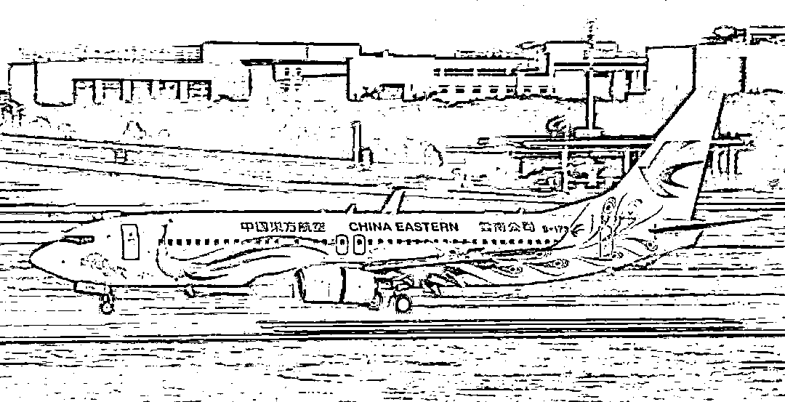

**万分悲痛**

**已经确认** 

**MU5735 的失联人员** 

**已全部遇难**

就在刚刚，从东航失事航班指挥部确认，东航 MU5735 航班上的人员已经全部遇难。 

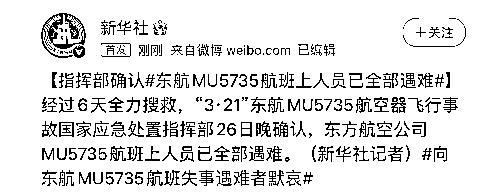

在此，我们要向全体 MU5735 航班遇难人员默哀……

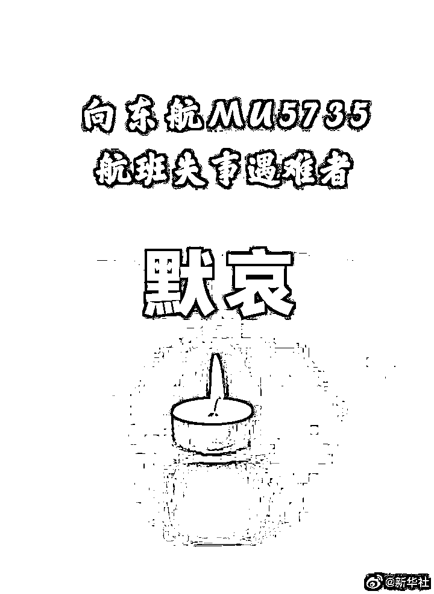

 3 月 21 日，一架从昆明飞往广州的东航 MU5735 在广西上空失联意外发生坠毁，飞机上的 132 名乘客和机组人员牵动着无数人的心。

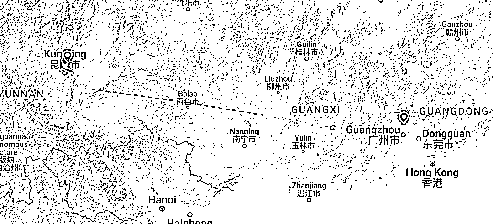

（Flightradar24 显示的航路）

3 月 23 日，据新华社消息，东航 MU5735 失事飞机中的一个黑匣子已经找到，还有另一个黑匣子正在积极寻找中。

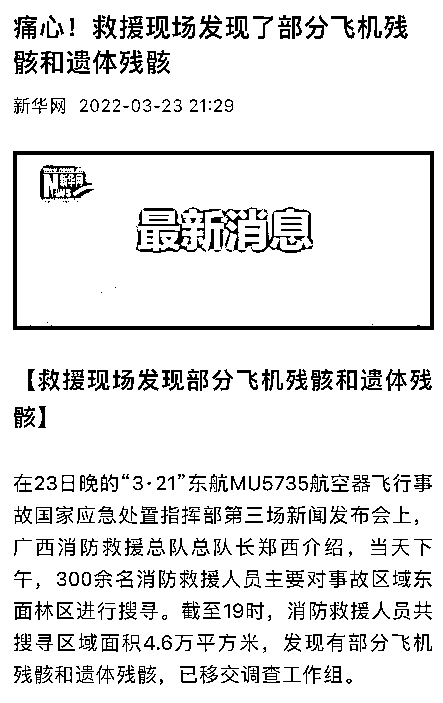

“飞机的部分残骸和遗体残骸，已经找到了。”

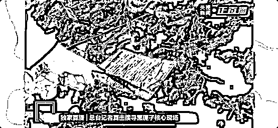

听到这几个字的时候，真的是扎心了。

这意味着，飞机上的这些生命，可能已经化成了碎片和残骸......

不禁感叹：我们永远不知道明天和意外哪个先来临...... 

随后，一段 ATC 管制录音曝光，这段录音是机雷达信号消失之后， 

录音中，空管与附近机组接力呼叫 MU5735，呼叫持续了 40 分钟...... 

[`v.qq.com/iframe/preview.html?width=500&height=375&auto=0&vid=p33299gv3nv`](https://v.qq.com/iframe/preview.html?width=500&height=375&auto=0&vid=p33299gv3nv)

收到了请回答...

多希望有奇迹的发生...

事故发生后，救援团队很快来到事故发生的现场，由于整个搜寻工作仍然停留在表层，并没有使用大型挖掘器械。

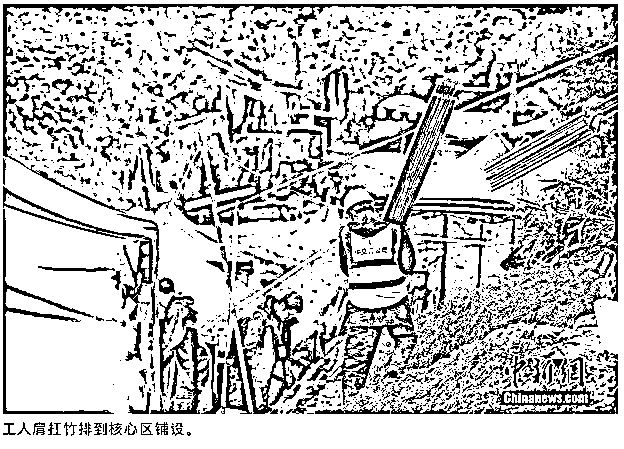

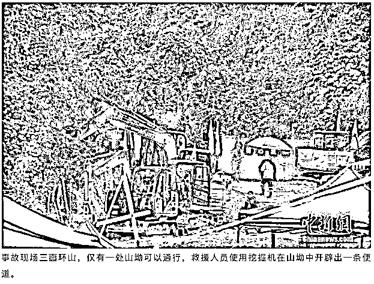

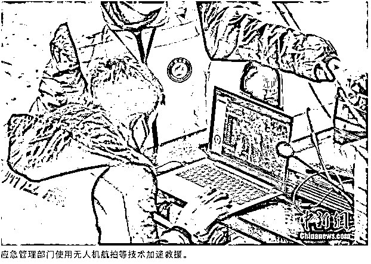

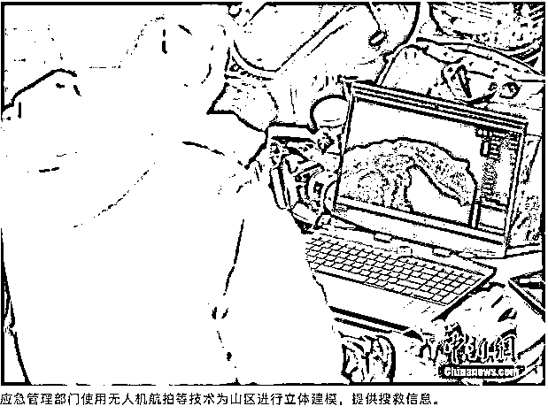

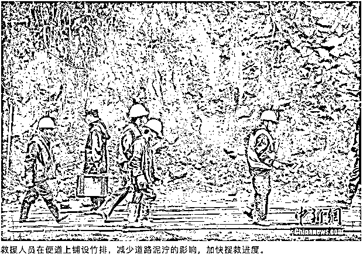

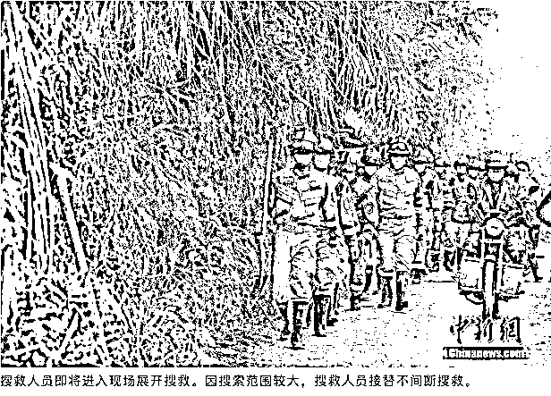

根据专家制定的详细计划，不放过每一寸的区域进行搜寻，第一个黑匣子就是搜寻人员通过肉眼一点点排查发现的。

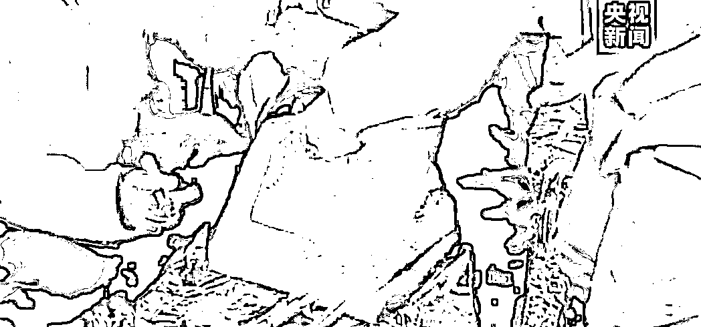

搜救工作进入第六天，，救援人员依旧全方位搜寻失联者及第二部黑匣子。 

由于现场淤泥太厚，搜救工作主要还是通过人工。

大型机械在核心区进行挖掘工作，继续挖掘搜集飞机残骸、碎片和机上物件。

就在刚刚，央视网快看发布了最新消息：

3 月 26 日，据总台记者从东航坠机事故核心现场发回的报道，撞击点附近经反复探测确定已经无生命迹象，正采用人机协同的方式加紧搜寻。搜救现场淤积深，作业困难，消防搜救人员在大型机械翻找出来的淤泥中仔细翻找关键物证，翻找之后的泥土清运到集中堆放区还会进行二次搜寻，不放过任何一些发现关键物证的可能。

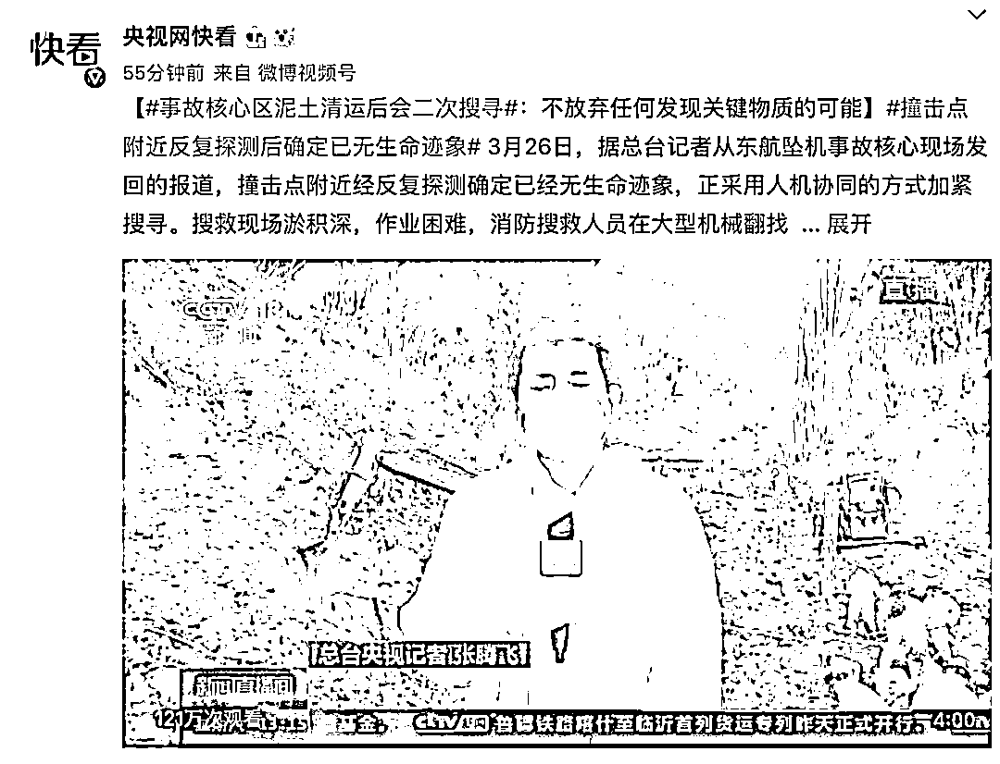

遇难家属也纷纷来到了现场，现场格外沉重。 

有家属对着山谷高喊：“我们过来接你啊！记得跟我们回家啊！”

还有遇难者家属带走一罐现场的泥土，对他们来说，一捧泥土让逝者落叶归根……

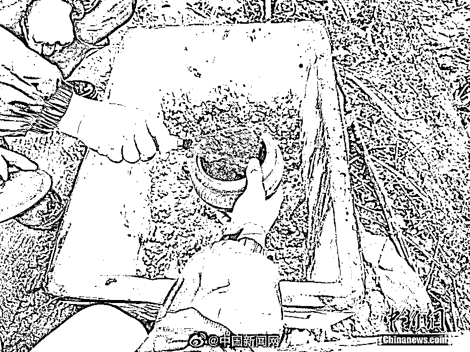

“我甚至无法亲吻你的骨灰，只能在废墟中悲鸣。愿平行时空里，能与爱的人相逢。”

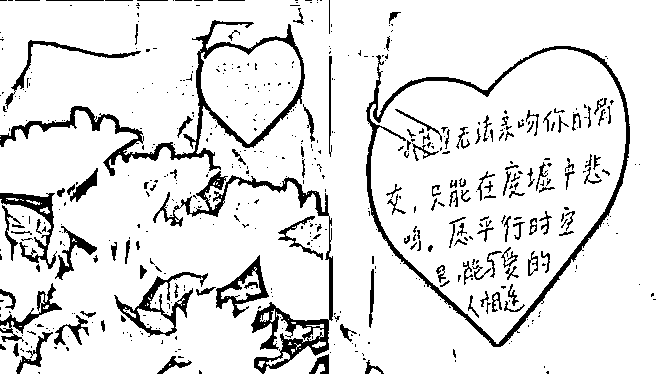

听得人好心碎，忍不住酸了眼眶。

有的网友说： 

> 也许在另一个平行时空里 MU5735 平安落地， 人们有序下了飞机;
> 
> 那个改签的姑娘见到了她四个月没见的未婚夫...
> 
>  那位老人接到了他的三个孩子， 孩子搀扶着老人回家准备饭菜;
> 
>  那位即将和国外女儿见面的母亲也在落地后给女儿致电告诉她就要见到了;
> 
>  出去游玩的一家三口也能手拉手回到他们爱的小家;
> 
>  那位即将举行婚礼的准新郎也在不久后迎来他们的婚礼;
> 
> 人们见到了深爱的人 ,大家彼此拥抱, 厨房里身影忙碌 ,为爱人的到来接风洗尘......

这是对家属的慰藉，也是对活着的人的宽慰。 

可是，这份对失去亲人的怀念也遭到了一些网友的抨击。

就在飞机意外坠毁后的第二天，小月在个人社交平台上发表了一个怀念小姨的视频，视频中是一些截图包括和小姨过往的聊天记录； 

整个视频中，小月将小姨的头像名字都被隐去了。

原本是对小姨怀念的视频却成为了热门视频，这也让很多键盘侠们操碎了心；

有的网友回复到： 

“家里人去世你在社交平台上发这种视频不叫蹭热度叫什么？”

“你在社交平台上守孝吗？” 

“你蹭热度还不让人说吗？”

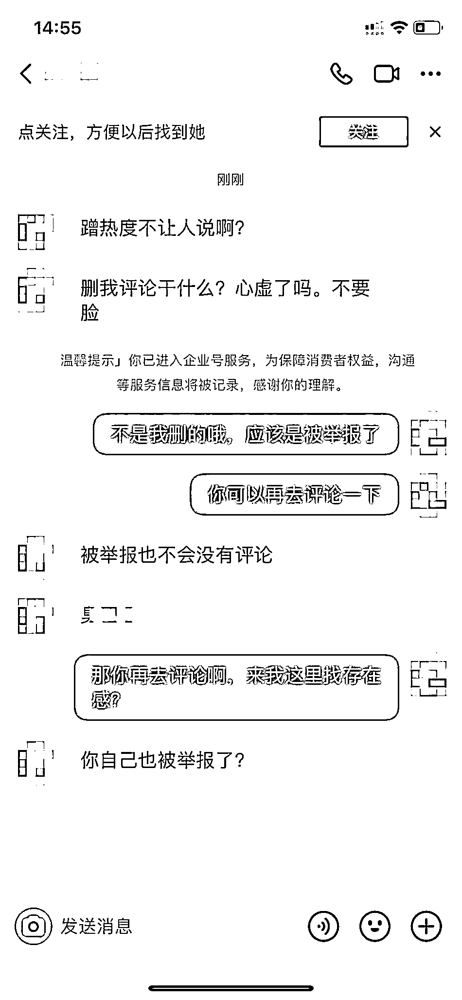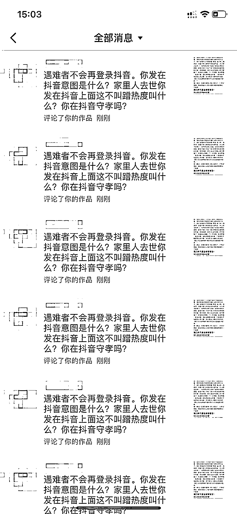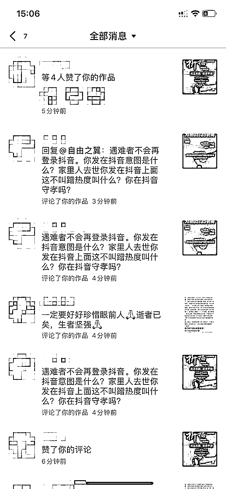

小月（化名）发布怀念小姨的视频后，遭到个别网友的持续“攻击”。本文图片均由受访者提供，图源：澎湃新闻

这种恶意的网暴也让小月更加难过，无奈之下写下了一封道歉信，随后在社交平台上发布。 

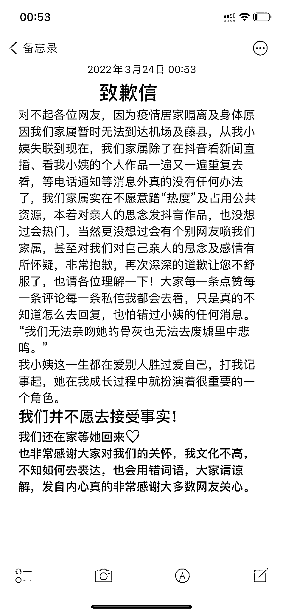

小月还表示：“不应该占用公共资源“蹭热度”，本着对亲人的思念发的视频，自己也没想过会成为热门视频，更没想搞有些人会对自己对亲人的感谢产生质疑，甚至遭受到网络攻击，不过还是为自己的言行向大家道歉，自己的文化水平不高，不知道如何去表达，也会用错词语，请大家谅解。”

然而，这种对遇难家属网暴的事情还不止小月一个。 

有的乘客家属在接受媒体采访时讲述了自己的故事，报道后也曾遭遇到一些来自网友们的抨击，认为“不够悲伤”；

对于遇难的家属来说，本来还沉寂在失去亲人的痛苦中，还要遭受到其他人的指指点点，心里更加难受了。

对于这次不幸的空难，其实更多的人还是痛苦悲伤的。

对于那位 36 岁的女士来说，已经两个多月没见过自己的未婚夫了，这一次她是特意请好假飞去广州，未婚夫就在白云机场等她； 

荣先生的妻子是这趟航班的空姐已经执飞 10 年，他们最后一次联系的时候，妻子告诉他“我起飞了”，可这一次却再没有了音讯；

那对马上迎来婚礼的准新郎来说，他再也见不到自己的新娘了，这一次，他们终究是错过了；

对于王小姐来说，她再也吃不到爷爷给她炖的肉了，早知道春节的时候就要多吃上几口..... 

这场谁都无法预料的灾难带走了是无数人的欢笑与幸福；

**这些别人身上的悲痛轮不到键盘侠的指指点点！因为那些网暴的人永远做不到感同身受！** 

对于我们来说， 

**你永远不知道，明天和意外，哪个先来临。**

**那么就请不留遗憾，珍惜现在,活在当下,就是对自己最大的报答。**

珍惜在一起时候的每一分每一秒，分开的时候好好说再见，不留遗憾。 

因为有的人，错过了就是一辈子。

生命并没有我们想象的那么漫长，别把时间浪费在争吵、误解、遗憾中；（键盘侠们请绕过）

**逝者已逝，生者如斯，愿天上人间，共安好。** 

**祝愿所有读到此文的人都能此生“起落安妥”。**

来源：北美留学生日报

← 向右滑动与灰产圈互动交流 →

