# 又一真实案例：女子一周前卸载了反诈 App，一周后就被骗了 92 万

> 原文：[`mp.weixin.qq.com/s?__biz=MzIyMDYwMTk0Mw==&mid=2247532356&idx=3&sn=c9f21638e41065202f2460d1fe7d4a6f&chksm=97cbb47ca0bc3d6a575f4d5a5936a5312d71137a6ee035e5faece2e7221535a8a546386a246f&scene=27#wechat_redirect`](http://mp.weixin.qq.com/s?__biz=MzIyMDYwMTk0Mw==&mid=2247532356&idx=3&sn=c9f21638e41065202f2460d1fe7d4a6f&chksm=97cbb47ca0bc3d6a575f4d5a5936a5312d71137a6ee035e5faece2e7221535a8a546386a246f&scene=27#wechat_redirect)

“你下载国家反诈中心 App 了吗？”

这句话一度火遍全网

然而却还是有人不以为然

30 岁的江苏姑娘小金就因此栽了跟头

2022 年 1 月 24 日晚上九点多

小金来到派出所里做笔录...

据透露，她曾经下载过

国家反诈中心 App

**然而，就在一个星期前卸载了**

不曾想...没过几天

就被骗子骗走了 92 万元

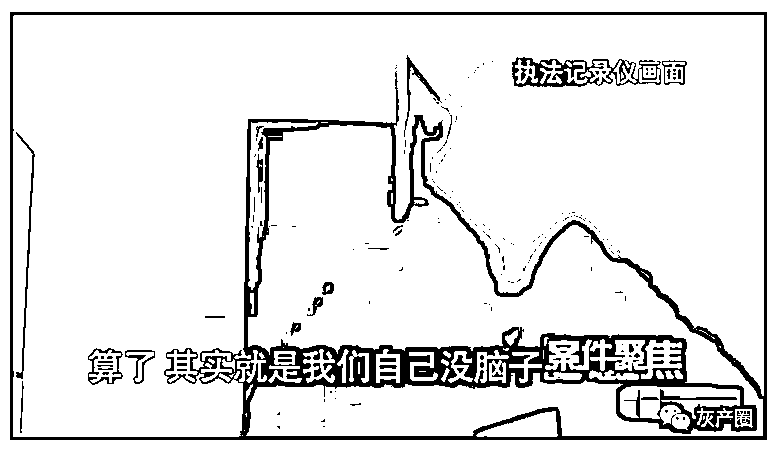

原来此前小金因为有多次、大额的转账，**被反诈中心锁定**。随后，她所在辖区的上海铁路公安处客技站派出所的民警找到她。起初，小金不以为然，丝毫没有觉得自己被骗，可是几个问题问下来，小金才反应过来自己真的被骗了。

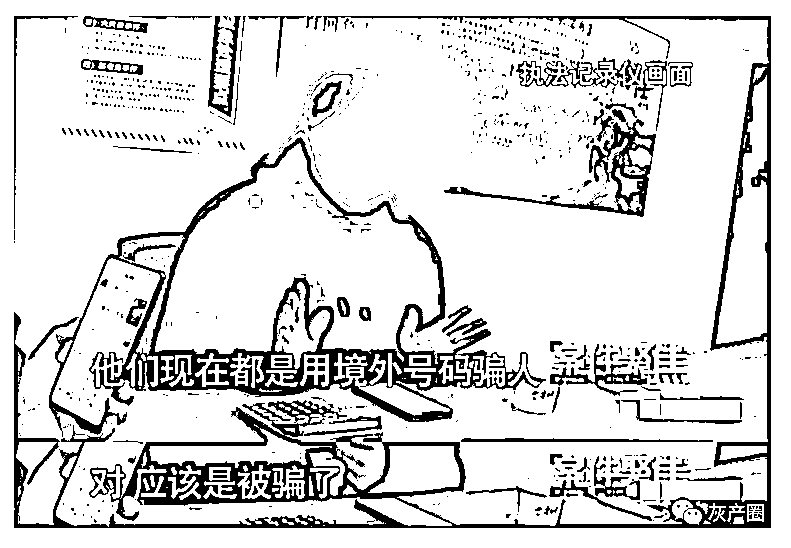

小金遭遇的正是**典型的“杀猪盘”**。所谓“杀猪盘”说白了就是“放长线钓大鱼”，骗子通过网络交友和被害人培养感情，随后诱骗被害人进行投资……

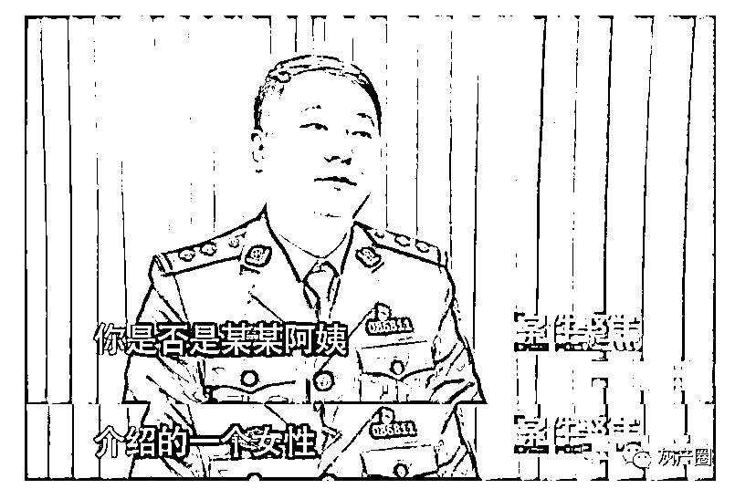

2022 年 1 月 14 日晚上，小金的微信跳出一条好友申请：一个名叫施志超的人加她为好友。施志超巧妙的设计了**一种“偶遇”的方式**，浪漫的邂逅让小金觉得这就是巧合、天意，一度让小金放松了警惕。

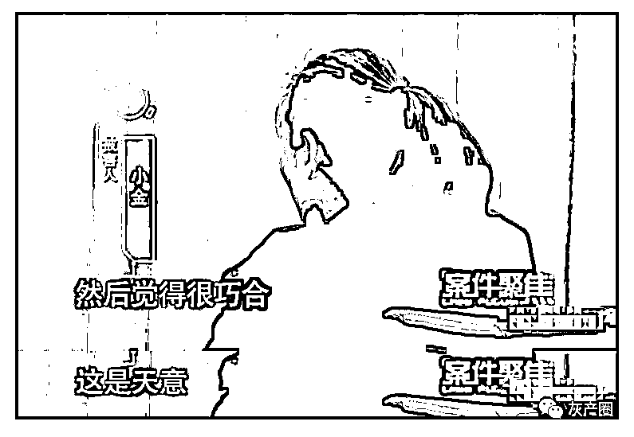

成为好友后，施志超这样介绍自己：**多金、丧偶、有个女儿、家人都是高学历……随后，还给小金发来了生活照。**

**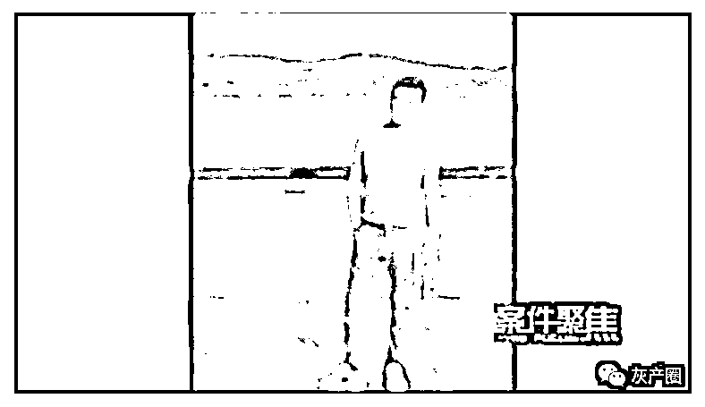**

就这样，两人每天都在聊天，再加上小金本来就没有防备，两人变得越来越热络，关系也变得非常暧昧……

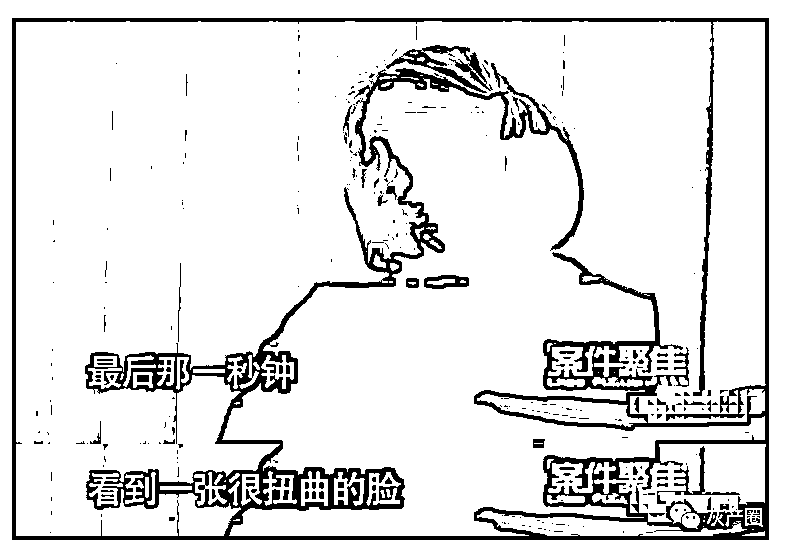

随着两人越来越熟悉，施志超开始有意无意地给小金灌输一些投资理念，起初，小金还是有所防备的，直到有一天，施志超突然说要送给小金礼物，这个礼物存在她的账户里，怎么才能进入账户呢，**要通过一个二维码，扫码进入网页**。

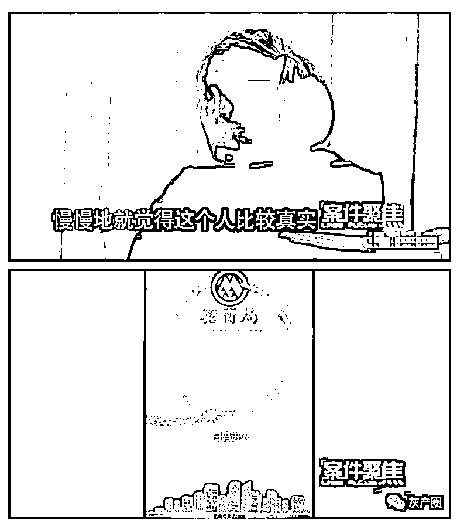

很显然，这个二维码是小金落入陷阱非常重要的一步。

进入网页以后，这是一个能够炒虚拟货币的投资网站，中文、英文都有，页面上还有一些金融资讯。

那送的礼物到底是什么呢？完成网站实名认证后，小金果然在自己的账户里看到了 5200 元的“大礼”。随后，按照施志超的引导，小金把这 5200 元作为本金，尝试购买了点**虚拟货币，果然赚钱了**。

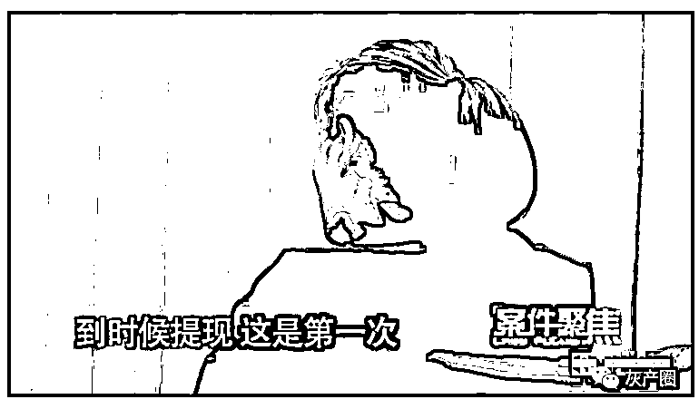

这也让本来有所防备的小金有所松动，毕竟自己按照施志超的说法，不仅赚了钱，还提现了。但大大咧咧的小金没有发现，她所谓的提现，其实是一个来自个人账户的转账。

紧接着，小金在施志超的指引下又赚了第二桶金，而施志超也开始趁热打铁，他以想要了解小金喜好为由，让她把手机的桌面做个截屏，而在小金手机里恰好有一个国家反诈中心 App，**在施志超的忽悠下，小金将 App 卸载了**。

卸载掉反诈 App 以后，施志超隔三差五就给小金发来利好行情，**让她追加投资**，看着自己的账户里，钱越来越多，小金几乎是完全放松了警惕，就这样，她将自己的五六十万的积蓄全部投了进去，但她万万没有想到，自己的钱早就进了骗子的口袋，而**账户上显示的不过是个数字而已**。

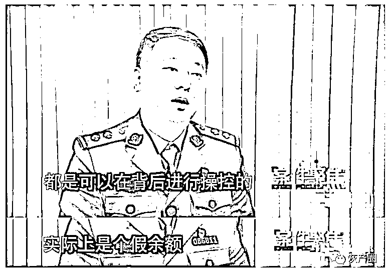

**最终，经过日复一日的投资，小金的账户显示，已有 190 多万。**可当小金想要提现时，钱却取不出来了。客服开始以“需要缴税”“开通大额快速提现通道”为由，进行推脱。此外，客服还表示，追加充值成为 vip 就能快速提现。

想来这种情况，应该有所警觉了，但小金丝毫没有怀疑，依旧进行了充值，就这样充值金额达到 92 万多。然而，即使是这样小金依旧没有提现成功。钱是没等到，倒是等来了上门的民警。

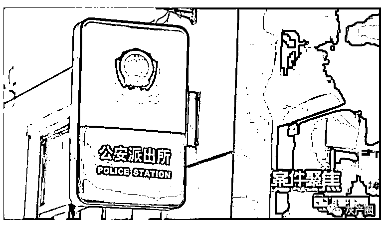

在后来的沟通中，小金透露：其实，聊了这么久，一直到后来被骗了这么多钱，她一直没有和这个男人见过面，甚至都没有视频过。小金难道没有怀疑吗？

原来施志超声称老婆在一次车祸去世，至于为什么发生车祸，主要是因为他和正在开车的老婆发视频，这才酿成惨祸，这也导致了他多年不敢和别人视频。而小金也相信了这套说辞。

小金告诉记者，她曾在 6 年前有过一段短暂的婚姻，这几年感情一直在空窗期。虽然身边不乏许多追求者，但都不是自己想要的那个人。刚好这时候施志超出现了，在和他的交流中，对方的嘘寒问暖以及自己对待生活的态度，都让自己沦陷了。

但属实没想到这些都是昙花一现，对方只是骗子，只想骗自己的钱，而那些温暖的话语也只是骗子话书本里的台词。

唯一值得庆幸的是，小金最后转给骗子的 5 万元被成功拦截了下来。随后，上海铁路警方展开深入调查，发现所谓的“施志超”不过是骗子们虚构的一个身份，至于那些发给小金的视频和照片都是从一些视频网站上下载下来的，视频的发布者并不叫施志超。

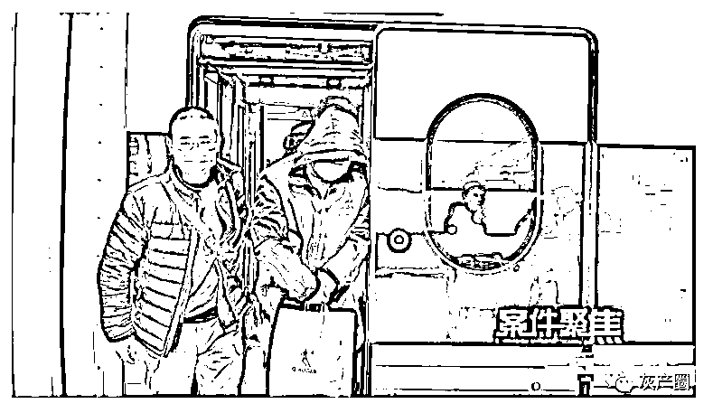

通过技术手段，警方确认，骗子们是在境外从事诈骗犯罪活动，想要抓到这些设局的骗子，暂时有些困难；

但另一方面，通过资金流，警方发现这 92 万元共流向了**5 名持卡人的多个账户**，由于**涉嫌帮助信息网络犯罪活动罪**，上海铁路警方决定，先对这**5 名犯罪嫌疑人实施抓捕**。

目前，对小金实施诈骗的犯罪嫌疑人，警方仍在追查，但 5 名涉嫌帮助信息网络犯罪活动罪的嫌疑人，已经为自己的行为付出代价。 

如何才能预防这些“杀猪盘”，归根结底还是那两点，**一是不要轻易扫码和点击网址，还有就是一****定要安装国家反诈中心 app。守住这两个底线，再狡猾的骗子也骗不过你**。

来源：案件聚焦，防骗每日电讯，阻击诈骗

← 向右滑动与灰产圈互动交流 →

