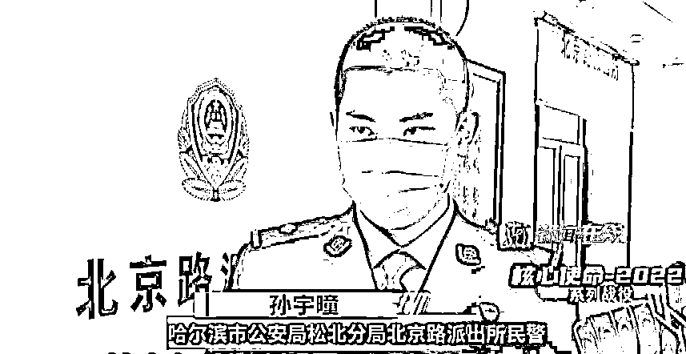
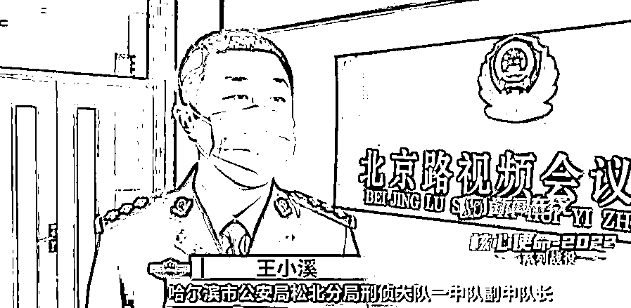
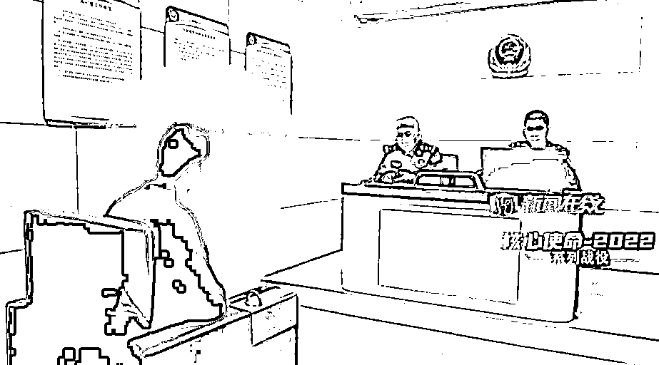
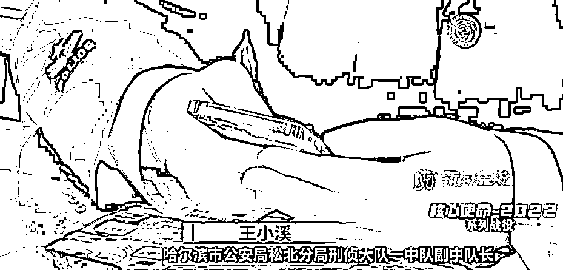
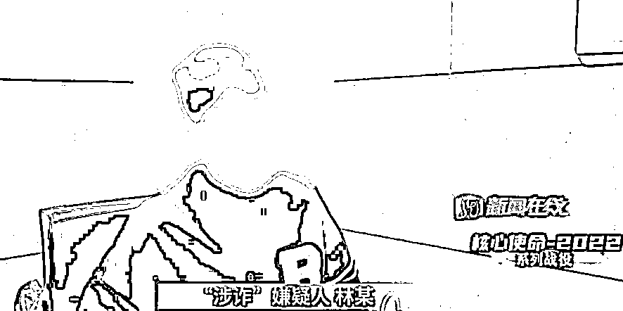
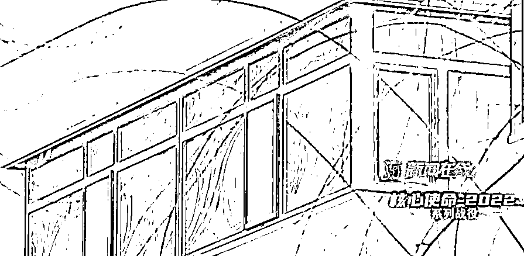
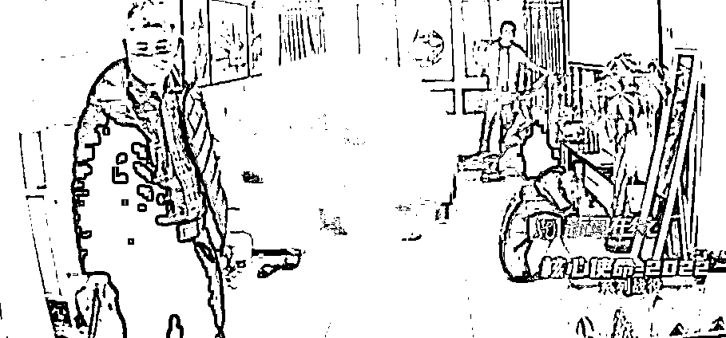
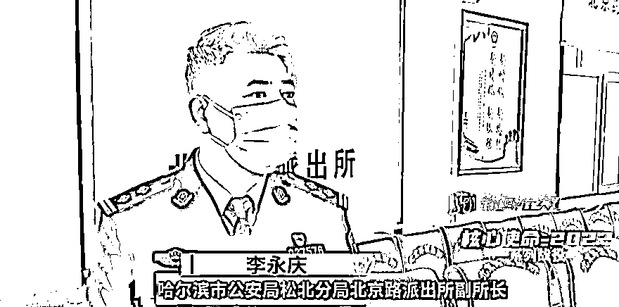
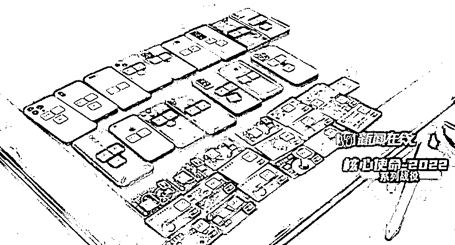

# 涉案近千万！嫌犯藏在哈尔滨一公寓里！

> 原文：[`mp.weixin.qq.com/s?__biz=MzIyMDYwMTk0Mw==&mid=2247532356&idx=5&sn=a0dfcfe8da3947bf78747100ef60ab25&chksm=97cbb47ca0bc3d6afb0cc65a1622f495365129d8b5d896e07e9c273c805df26aae2f82892a73&scene=27#wechat_redirect`](http://mp.weixin.qq.com/s?__biz=MzIyMDYwMTk0Mw==&mid=2247532356&idx=5&sn=a0dfcfe8da3947bf78747100ef60ab25&chksm=97cbb47ca0bc3d6afb0cc65a1622f495365129d8b5d896e07e9c273c805df26aae2f82892a73&scene=27#wechat_redirect)

3 月 5 日下午 2 点多，哈尔滨市松北公安分局北京路派出所的民警成功打掉了一个洗钱窝点，抓获犯罪嫌疑人 12 名，其中，邬某和张某是这次行动的主要目标人物。 

> **哈尔滨市公安局松北分局北京路派出所民警孙宇曈：**邬某和张某是这 12 人的大老板，其中邬某负责与缅北境外人员进行联络，境外老板金主负责给他开支，他负责再把钱开给下面的“卡农”，干活的人。

办案人员介绍，大约 4 个小时前，公安部向他们反诈中心推送了线索，辖区一个叫林某的男子，他的银行卡在两天之内转进转出的资金高达上百万元。经过调查，这些钱全部是境外犯罪集团诈骗得来的赃款。

> **哈尔滨市公安局松北分局刑侦大队一中队副中队长王小溪：**这个银行卡的卡主叫林某，他二十岁左右，无业，他的银行卡在南方涉案了，应该是十多起案件。

这些案件的受害人有老人、有学生，他们被骗的钱财少的几千，多的有几十万。面对民警的讯问，林某说，他压根就不知道一百多万流水的事，但在半个月前，有一伙人曾经使用过他的银行卡。

> “**涉诈”嫌疑人林某：**（当时你怎么跟这伙人接触上的？）我朋友找我去的。（过程说一下，具体点。）他说有活，问我去不去，然后就去了。（啥活啊？）没说具体的。

林某说，他是通过姜某认识的这伙人。事发当天，姜某告诉他，自己手里有个十分赚钱的好活，只需要提供银行卡就能赚到上千元。在姜某的带领下，两人来到了松北区的一处公寓。

> **哈尔滨市公安局松北分局刑侦大队一中队副中队长王小溪：**到达了地点之后，有专业的看护人员看着林某，不让林某出屋，像林某这样的角色，里面还有很多人。

> **“涉诈”嫌疑人林某：**去的时候把我手机还有银行卡给了他们，他整完之后，我就走了，钱是我朋友晚上给的我。

事后，林某得到了一千块钱的报酬，从姜某的口中，林某也了解到，公寓里的那伙人干的绝对不是什么正经事。

[`mp.weixin.qq.com/mp/readtemplate?t=pages/video_player_tmpl&action=mpvideo&auto=0&vid=wxv_2326519337085517825`](https://mp.weixin.qq.com/mp/readtemplate?t=pages/video_player_tmpl&action=mpvideo&auto=0&vid=wxv_2326519337085517825)

> **哈尔滨市公安局松北分局刑侦大队一中队副中队长王小溪：**根据林某的供述，屋里的环境还有人员构架，通过我们深入的分析和研判，可以初步确定，该地点就是一个比较成熟的洗钱窝点。

根据林某提供的线索，抓捕组来到了洗钱窝点所在的公寓，由于不确定屋内是否有人，警方没有冒然行动。

> **哈尔滨市公安局松北分局北京路派出所副所长李永庆：**随后我让林某给他发小打电话，说“你在哪呢？”他发小在电话里说“我在开工呢”。

> **哈尔滨市公安局松北分局北京路派出所民警孙宇曈：**我们面前正好路过两个人，跟林某打电话的声音一致，对上了，这时候我们直接对他们两人实施抓捕，抓捕完之后在车上突审，屋内大概有 10 人左右，正在实施洗钱的违法犯罪。

在得知这一情况后，抓捕人员立即冲进了公寓内。

> **哈尔滨市公安局松北分局北京路派出所副所长李永庆：**都是男生，11 人，身上全是纹身，处于即将开工的状态，很多“卡农”都拿着银行卡，等待着开工。‍

经过审讯，11 个人里，其中有 6 人是出卖银行卡的“卡农”，剩下的 5 人都是洗钱的犯罪成员，其中，邬某和张某是该团伙的组织者。

> **哈尔滨市公安局松北分局北京路派出所副所长李永庆：**他们作案的方式主要是以境外人员提供银行卡号，这张银行卡号转账，之后通过“卡农”的银行卡把银行卡的钱转出，获取转账流水的佣金一般在百分之一点五左右。

经过审讯，邬某、张某等 5 人洗钱团伙平均年龄 20 岁，他们彼此之间都是网友，为了能够不劳而获，甘心成为诈骗集团的工具，等待他们的必定是法律的严惩。

> **哈尔滨市公安局松北分局北京路派出所副所长李永庆：**后期我们通过电诈平台查找，每张银行卡涉案都得在一百万左右，整个十多个人加起来一千多万流水，而且时间非常短，短短一个月内就造成这么大的经济损失。

[`mp.weixin.qq.com/mp/readtemplate?t=pages/video_player_tmpl&action=mpvideo&auto=0&vid=wxv_2326516618052452354`](https://mp.weixin.qq.com/mp/readtemplate?t=pages/video_player_tmpl&action=mpvideo&auto=0&vid=wxv_2326516618052452354)

目前，该洗钱团伙的相关涉案人员已被警方依法采取强制措施。

来源：龙视新闻在线

← 向右滑动与灰产圈互动交流 →

