# 上海为何不封城？ 千万人的试错与豪赌

> 原文：[`mp.weixin.qq.com/s?__biz=MzIyMDYwMTk0Mw==&mid=2247532410&idx=1&sn=b1e346d8b68141b9717531af8ed3eb6f&chksm=97cbb442a0bc3d54d2d8bb5e1d5685f76975add49afc3308517991f181c42c6341e325107ff0&scene=27#wechat_redirect`](http://mp.weixin.qq.com/s?__biz=MzIyMDYwMTk0Mw==&mid=2247532410&idx=1&sn=b1e346d8b68141b9717531af8ed3eb6f&chksm=97cbb442a0bc3d54d2d8bb5e1d5685f76975add49afc3308517991f181c42c6341e325107ff0&scene=27#wechat_redirect)

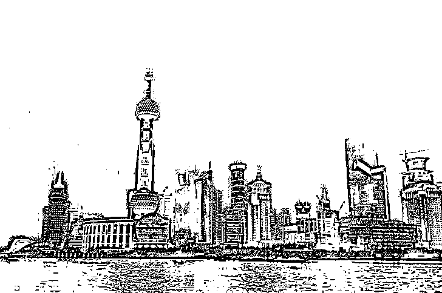

全国恐怕也只有上海有政治资本带头做对一些小区封控 48 小时就解封的尝试。 

——胡锡进

奥密克戎，是一个呼吸道传染的 R0 高达 9.5 的病毒，人类没有任何秘密武器让这个病毒暂停。

作为防疫标兵的上海，26 日新增本土新冠肺炎确诊病例 45 例和无症状感染者 2631 例。

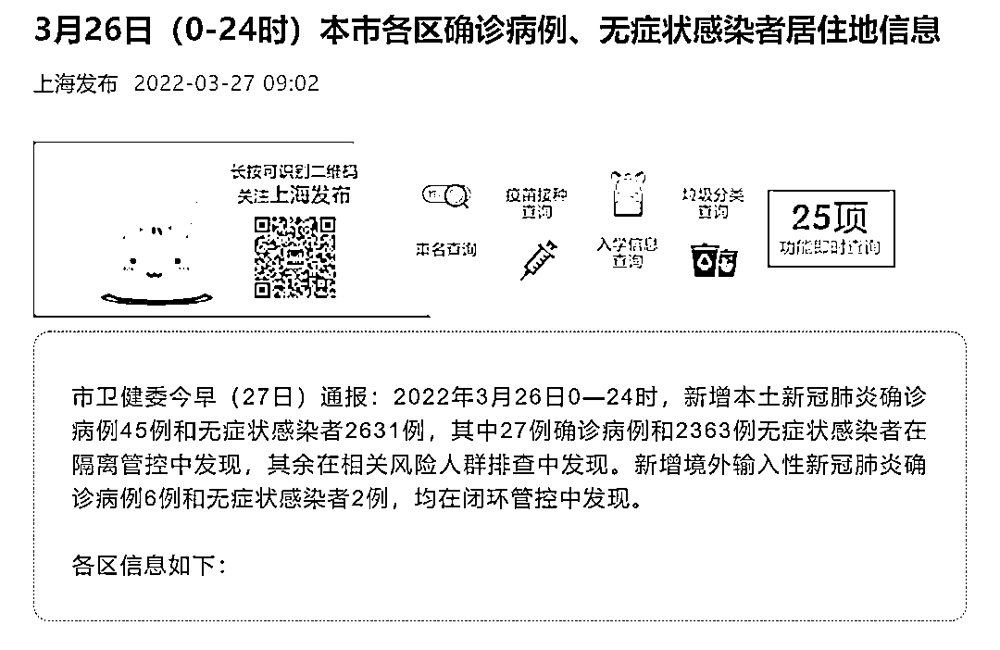

这两天，更是接连上热搜。 

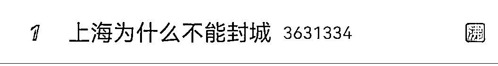

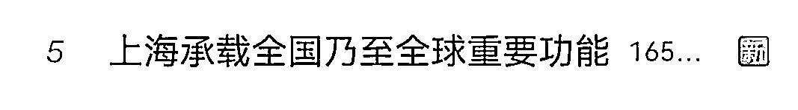

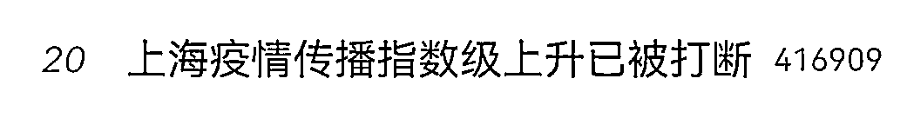

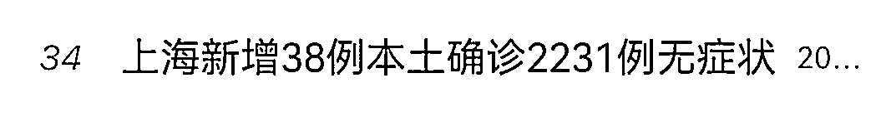

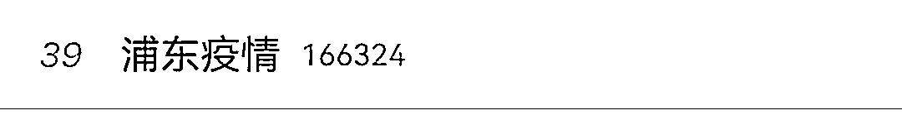

从最早 2020 年疫情到现在为止，奥密克戎已经到第二代了。

上海这次流行的是 BA.2，传播力度确切来说应该是 9.5 的 R0 值，意味着一个人可以传 10 个人，在 2020 年初期 1 个人 R0 值大概是 2.5-3 之间。

**这意味着，现在传播的力度几乎是早期传播力的 3-5 倍之间。**

目前中国被病毒紧紧相逼，三个特大城市同时摸着石头过河，进行了三种模式防疫。 

**香港：病毒共存**

**深圳：全员核酸** 

**上海：精准防控**

自上海本轮疫情暴发以来，封城与否一直是争论的重点话题。

香港暂不去说，已付出了惨痛的代价。 

现在国内大城市抗疫有两个模式：

**第一个是封城模式：城市停摆，全民核酸筛查，做 4-5 轮，筛查没问题就放开。**

3 月 13 日，深圳全市按下暂停键。

3 月 21 日，深圳宣布解封。

在这 7 天里，全员核酸 4 轮。

对了，目前南昌也是这么做的，七天五轮全民核酸，目前形势转好。

**第二个是精准模式：不全面封城，精准封小区，封区域，做滚动核酸筛查。**

封城，上海做不到。 

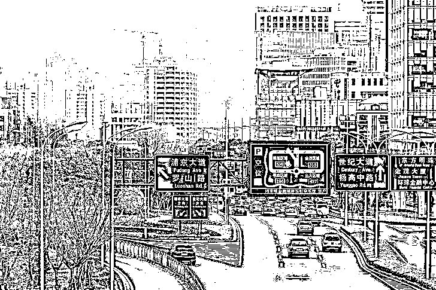

**-1-** 

**上海不会封城，也不必封城** 

封不封城？

对于网民封城的提议，复旦大学上海医学院副院长吴凡表示：**确实不行，因为上海这个城市承载了不仅仅是上海人民自己的上海，还在全国经济社会发展当中承载重要功能，甚至于对全球经济都有影响。**

上海，中国第一大城市，四个中央直辖市之一，是中国大陆的经济、金融、贸易和航运中心。

举个例子：如果上海这个城市停下来，东海上就会多出很多漂在海上的国际货轮，就会影响整个国家的经济和全球的经济。

**上海不是上海人的上海，是全国人民的上海，所以上海选择了一条最难的路。**

上海显然在坚持自己的防疫政策，争取不封城。

早在 3 月 15 日，上海市政府副秘书长顾洪辉就在疫情防控发布会上表示，**上海不会封城，也不必封城。**

而不封城，需要所有上海市民在后续的防疫中更加认真、仔细。

自检过程当中认认真真采样，仔仔细细采样，把结果做到非常准确。

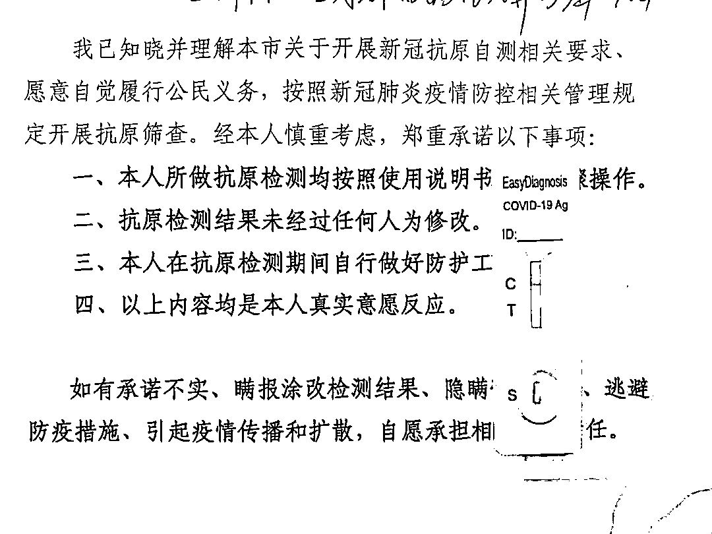

小到每个人，中到每一个基层干部管控过程当中、核酸筛查过程当中一个不落全覆盖”。

如果上海断然封城，控制住疫情或许不难，但那样做不仅经济损失更大，且更冲击整个中国的国际形象，而且对我们目前该如何应对奥密克戎提供不了进一步的回答。

在 26 日上午上海举行的疫情防控工作新闻发布会上，复旦大学上海医学院副院长吴凡也表示，**上海采用重点区域+非重点区域，核酸检测+抗原自检的方式，这是上海目前的一种探索。**

上海也在坚持属于自己的模式——**精准防控，滚动清零。**

上海的“滚动清零”，是把城市分成 n 份，轮流封小区，让这 n 个部分轮流做核酸，从中找出阳性人群单独隔离，从而阻断病毒传播。

但这种方法有可能造成：你第 n 份核酸还没做完，前面第 1 份做完核酸的人再感染的情况，面对传播力强的病毒，你可能得一直滚一直滚一直滚，持续不停。

但在不封城的情况下，这是没有办法的办法。

**毕竟这是个千万人口且不能停摆的大城市。**

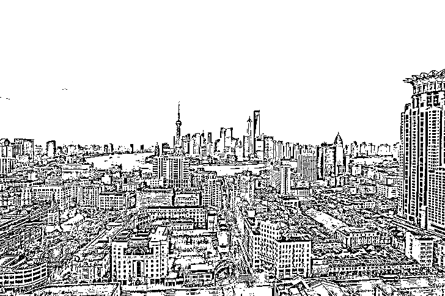

**-2-** 

**滚动式风险**

但我有个疑问，不封会不会是对周边城市的不负责任。

现在很流行的一个说法：**“你上海不封城扩散到各地，为什么全国人民要为你买单？”**

周边一串城市都封了，就上海不封，周边封了解封，再由上海输入，再封，无限循环下去？

尤其是战线拉的太长，一线人员真的会坚持不住的。

俗话说：只有千日做贼，哪有千日防贼。

真要长期这么滚动防疫，很容易就会出现各种社会问题。

这一点就不多说，怕事。

**-3-** 

**千万人的试错与豪赌**

我不是专家，不敢大放厥词，但愿意对上海市政府给予“理解性支持”。

**上海本次防疫的模式，更像是在探索大城市如何在不封城的情况下实现清零。**

这像一场千万人参与的赌局，如果成功，将会为国家防疫提供一个新的模式。

**不封城政策是中央默许的“试错”，突破和勇气是无论成败的。**

环球时报前主编胡锡进说，上海就是在帮国家试错，看能不能试出一条上海防疫模式，不然就只有走深圳全城封控的老办法了，不过封城的时间会缩短，一两周内结束，**希望上海真的能为全国防疫带出一个好的路线。**

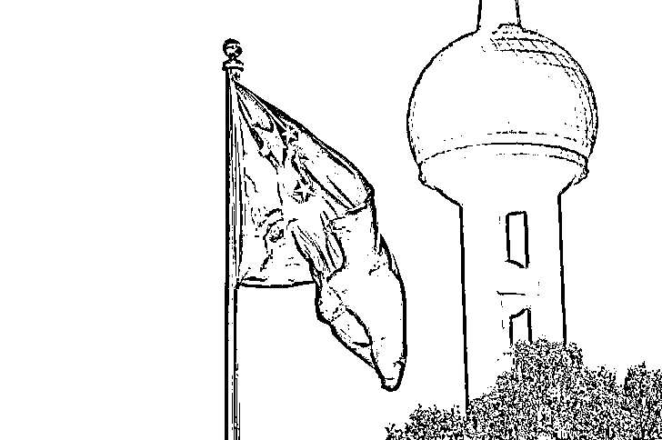

奥密克戎会是最后一个变异种吗？在人类历史中，唯一成功根除的病毒只有天花。

所以，很大可能病毒会长期共存，封城决不能成为面对病毒的唯一方式。 

**总不能一来就封城，也不能直接像西方国家那样躺平。** 

所以，只能去尝试走一条新路。

探索之路肯定不会一帆风顺，但希望不要以人民的生命安全为代价，在探索的过程中需要及时调整与反思，既然要保证将影响减到最少。

**如果可以，希望走出一条低成本的“上海抗疫路线”。**

黎明来临前的黑暗，很难，但是熬过去，就是曙光。

来源：昌南大队长，图源网络，如有侵权请联系删除。

← 向右滑动与灰产圈互动交流 →

# 原文：[`mp.weixin.qq.com/s?__biz=MzIyMDYwMTk0Mw==&mid=2247532410&idx=2&sn=b3b22b078103f41ed3c567ff831755a9&chksm=97cbb442a0bc3d54dc6b934b1a8810c53b68fb2d090d6199a290cd22c9bcb169742935a5a3c9&scene=27#wechat_redirect`](http://mp.weixin.qq.com/s?__biz=MzIyMDYwMTk0Mw==&mid=2247532410&idx=2&sn=b3b22b078103f41ed3c567ff831755a9&chksm=97cbb442a0bc3d54dc6b934b1a8810c53b68fb2d090d6199a290cd22c9bcb169742935a5a3c9&scene=27#wechat_redirect)