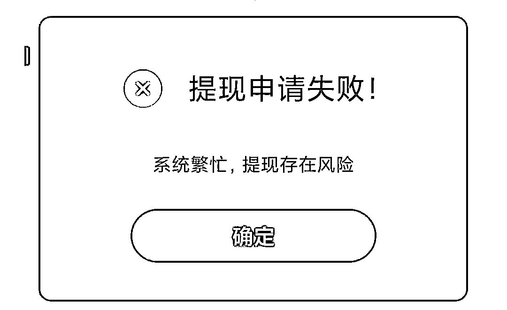
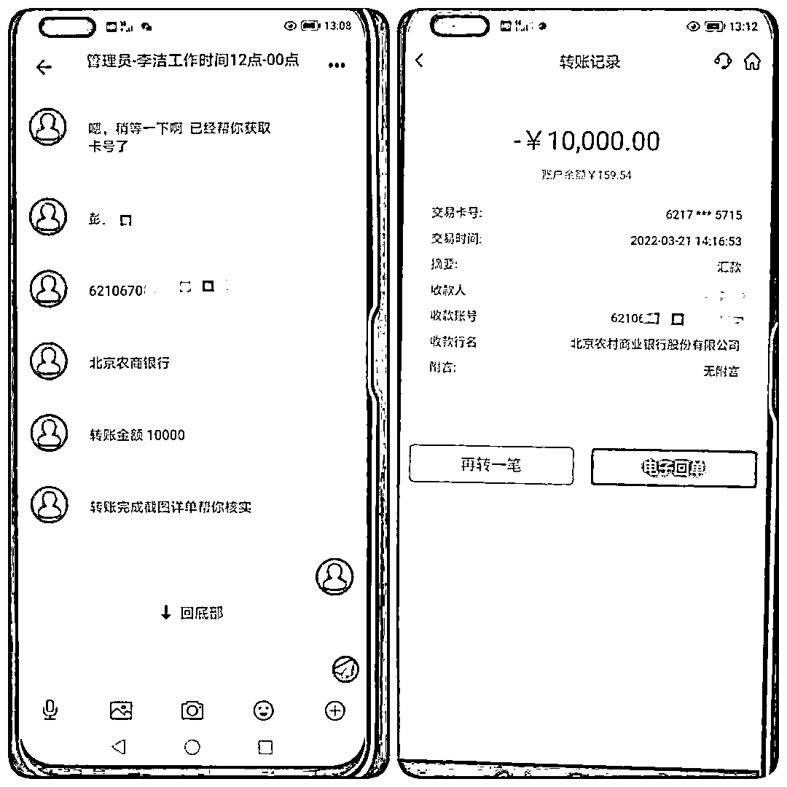

# 38 元？5 万？曲靖一小伙“梦回春宫”约见美女后......

> 原文：[`mp.weixin.qq.com/s?__biz=MzIyMDYwMTk0Mw==&mid=2247532410&idx=3&sn=bb52230c0e86e43c6bee914107aa6c70&chksm=97cbb442a0bc3d54da3f4ee282ca0b4caa1cf3a1426ccfc0280fc09e222fca739df1e5eff28b&scene=27#wechat_redirect`](http://mp.weixin.qq.com/s?__biz=MzIyMDYwMTk0Mw==&mid=2247532410&idx=3&sn=bb52230c0e86e43c6bee914107aa6c70&chksm=97cbb442a0bc3d54da3f4ee282ca0b4caa1cf3a1426ccfc0280fc09e222fca739df1e5eff28b&scene=27#wechat_redirect)

长夜漫漫无心睡眠

睡不着的你，孤单寂寞 

夜深人静

你掏出手机

浏览互联网站

精彩小视频放送 

身材火辣的她

同城私密约会 

让你不再“夜夜孤单”

面对这些挑逗的文字和美女图片

想不想马上见到真人美女？

等等 

别急！

完成几个小任务后

就能线下约会

还有这种好事？

3 月 22 日，曲靖一男子小帅（化名）在浏览某网站时，被跳出色情网站所吸引点击一链接，在手机内下载了“梦回春宫”APP，面对这些挑逗的文字和美女图片，迫不及待想要马上和美女线下约会了。（这界面谁看不迷糊……）

别急！“完成几项简单的任务后就能如愿以偿并且有返利”！既有美女约又有钱赚，这个世界简直太美好了！

很快，就有一名自称“莉莉”的客服主动添加小帅，询问是否想和小姐姐线下约会喜欢的类型是什么样的，推荐他办理一个 39 元的“A 套餐”，并告诉他有了这个套餐，就可以获得和女孩线下约会资格。小帅听后谨慎地充值了 39 元……

随后，客服告诉小帅，只需要完成三笔简单的刷单任务就可以“约会”了。而这些任务非常简单，只需要根据客服的提示，点击大小单双四个选项进行押注。

小帅答应后，第一单充值 100 元获利 20 元，接着第二单充值 500 元获利 100 元。 

但小帅在第三单充值 1000 元后准备提现时，系统多次显示提现失败。

对方开始以账户金额已被提空、数据出错，导致账户无法提现为由要求小帅多次转账解封。

当小帅将自己在各个平台的贷款和存款陆续转账给对方后，客服称他因信誉积分不足，需要支付 2 万元购买信誉积分，但小帅能借的都借了，最后给对方转账 1 万元。

直到小帅再次打开“梦回春宫”APP 显示异常，才意识到自己被骗，但他已经给对方银行卡转账 8 次，共计 5 万余元。 

先以“美色诱惑”

再来“刷单返利”

步步为营 处处陷阱

总有一款适合你

你以为的美人钱财全拥有

最终却是，人财两空

**警方提醒**

****近年来，诈骗手段“迭代”升级。公安部门接到多起受害人在浏览色情网站后被诈骗分子引导手机下载“某”APP，称要在 APP 上完成刷单任务以换取美女约会机会，在色和利的双重驱使下，受害人极易被欲望驱使，从而上当受骗。****

**来源：麒麟警方，昆明反电信网络诈骗中心**

****

**← 向右滑动与灰产圈互动交流 →**

****