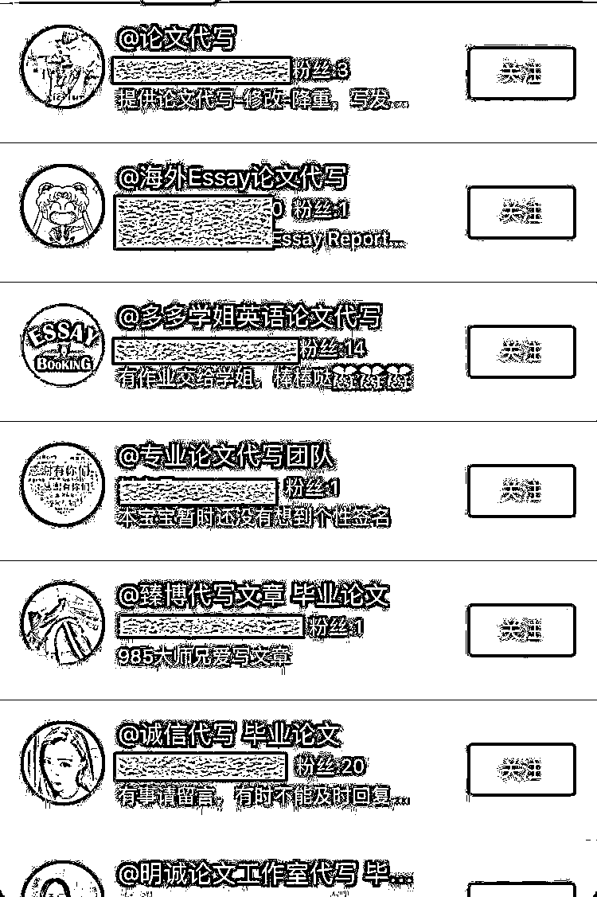
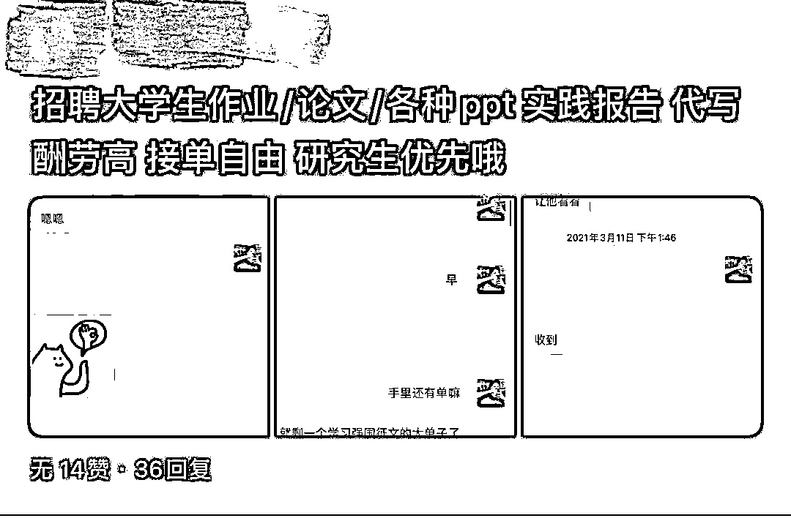
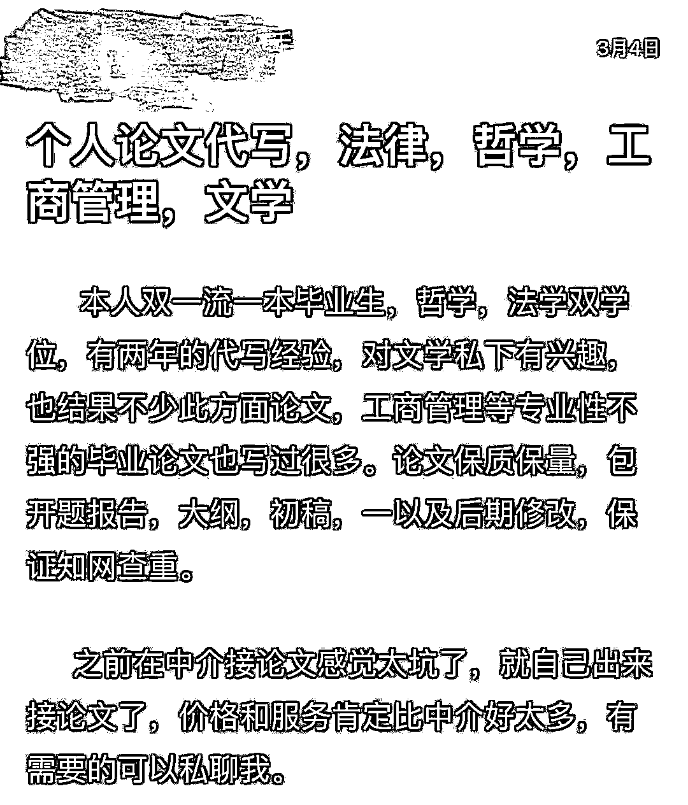
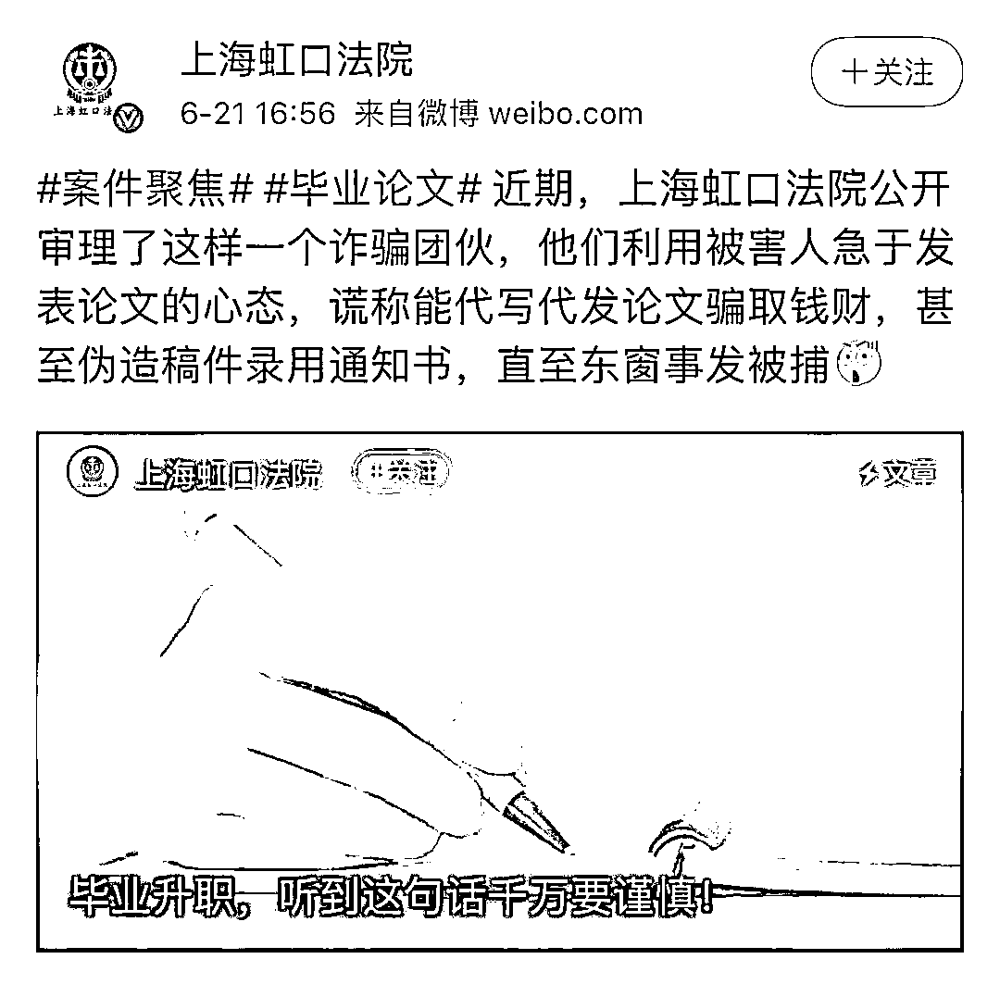

# 被骗数千元还被威胁“曝光”，这种事你还敢找人“帮忙”吗？

> 原文：[`mp.weixin.qq.com/s?__biz=MzIyMDYwMTk0Mw==&mid=2247532410&idx=4&sn=e247dcb86a92e31c00ef5f7f95f0d8c9&chksm=97cbb442a0bc3d545b7f9a0a7bb34e15ef540e17a50eea73aa7d652c6b553ea8e8dbb7f39df2&scene=27#wechat_redirect`](http://mp.weixin.qq.com/s?__biz=MzIyMDYwMTk0Mw==&mid=2247532410&idx=4&sn=e247dcb86a92e31c00ef5f7f95f0d8c9&chksm=97cbb442a0bc3d545b7f9a0a7bb34e15ef540e17a50eea73aa7d652c6b553ea8e8dbb7f39df2&scene=27#wechat_redirect)

一项价格几千元的“论文代写”服务，最终收到的是一篇大一新生写的“人生第一篇论文”，想退钱时，对方却“人间蒸发”。

每逢开学季或毕业季，潜伏在各个校园群及电商平台、社交平台的论文代写群体便活跃起来，“专业代写”“硕博团队”等字眼屡见不鲜。尤其是每年 3 月至 6 月，在毕业和求职的双重压力下，论文代写业务量及价格总是“水涨船高”。

多名被论文代写服务“坑”了的大学生告诉记者，他们少则被骗了数百元，多则被骗了数千元，**“基本不可能把钱要回来，对方还威胁称要找学校和网络曝光。”**

这背后究竟隐藏着一条怎样的灰色产业链？

**不堪压力寻找代写** ****为求捷径反入骗局**** 

**记者在调查中发现，虽然目前几大电商平台、论坛等均已杜绝了“论文代写”等相关搜索，但隐蔽的“论文代写”生意尚存，“论文代写”机构的手段越发隐蔽。学生和商家还是会用**“写作指导”“文章写作”**等词汇规避风险。同时，在网络搜索框中输入另一相似关键词，如“论文写作”等，就会出现“我们帮你写论文”“论文指导”等话题和小组，里面的帖子将近一半是关于寻找文章代写、招聘写手等内容。**

**在代写的文章类型中，大学通识课和拓展课的论文往往比重较高。但也有部分学生因为自身研究能力有限，“铤而走险”花重金请写手代写自己的毕业论文。学生们以为由此找到了代写论文的捷径，其实是踏入了骗局。**

****

**李然（化名）去年从浙江某高校本科毕业，回想临近毕业时找人代写毕业论文的经历，她至今懊恼不已。**

**“由于对毕业论文无从下手，而交论文的时间越来越近，所以萌生了找人代写的想法。一开始，我在电商平台上找了一个人代写，结果对方交稿迟缓，最后交来的稿子重复率极高。我随即又找了另外一个团队，对方声称自己是专业硕博团队，结果发来的文章逻辑混乱，重复率依旧居高不下。”李然说，她**前后共搭进去几千元，最后只能认栽。****

****

**实际上，几千元仅仅是代写本科毕业论文的价格。近日，记者以客户身份接近代写团队时发现，若是代写**硕博毕业论文，费用则高达数万元。****

**记者还接触了北京某高校 5 位曾经找过代写的学生，他们分别来自理工科、人文社科和艺术学科，代写人分别来自**校园群、电商平台以及二手交易平台。**他们的受骗经历有以下几个共性问题：**

****重复率过高。**上述受访学生均表示，在接洽初期，写手或中介都会以“写完文章后自己先查重一遍再交稿给客户”的回复来让客户放心。但最后到手的论文绝大部分是复制粘贴的，而写手给出的查重报告要么是在不正规的免费查重网站检测出具的，要么是直接虚假 P 图抹改真实数据得来的。**

****坐地起价。**交稿之后，客户发现文章质量不达标，要求整改，写手表示若要修改文章，则要重新付费，否则不予修改；文章写好之后，客户发现文章是**加密文件无法正常打开或者需要其他付费途径打开，**这时候客户往往需要额外支付一笔费用，作为文章的“浏览费”。**

****虚假“包装”。**“大学教授”“专业硕博团队”是写手和中介团队惯用的“头衔”，但最后的文章质量与对方所宣传的大相径庭。林朗(化名)是北京某高校一名大二学生，由于平常课业太重，为了完成课程论文，他便在网上找人代写，结果最后给的论文辞不达意、排版乱七八糟。后来他才知道，原来对方是一名刚上大一的新生，帮他代写的那篇文章居然是对方第一篇大学论文。**

****威胁买家。**被骗后，受访的 5 名学生都去质问写手或中介客服，最后都是不欢而散，要么被对方拉黑，要么查找店铺时发现早已“人去楼空”，有的甚至反被对方威胁要将文章上传至网络、告诉学校老师等。最后，找代写的学生往往选择暗自吃下闷亏。**

**记者询问这 5 名学生是否想过维护自己的“权益”，他们一致回复称“不敢”，因为寻找代写本身是错误的选择，一旦曝光后果更严重。**

********写手基数十分庞大** ****只求速度不管专业****** 

****在论文代写的整条产业链中，写手基数庞大，这个群体根据客户的需求生产文字稿件，借此赚取费用。****

****“最初接触代写，就是因为想赚点零花钱、生活费。这行入行门槛不高，算是操作比较简单的副业。”入行 3 年的写手小静告诉记者，**由于是低门槛，所以当写手的什么人都有。******

****记者调查发现，写手的工作模式主要包括两类：第一类是背靠大树型。这类写手的背后是中介团队，在论文代写的产业链中，中介本身不能直接为客户提供代写服务，而是替客户寻找并安排写手代写，他们不仅掌握大量的客户资源，还管理数量众多的写手。****

****记者通过公司名义在社交平台上发布的写手招聘帖，添加对方联系方式后，进入了一个被命名为“5 号群”的**写手群。**进群初期，对方简单询问了记者的学历及专业，要求记者提供本人的电话号码和相应作品。确认记者的基本情况后，对方发给记者一份详细的《写手兼职合作守则》，称“禁止接私单及私下添加客户微信”“时刻在线回复客户消息”“严格按照约定时间交稿”“维护好评率”等。根据团队规定，好评度越高的写手，越能获得稳定的优质客户，享受优先派单权以获得更高的结算奖励。****

****记者调查发现，**“禁止私自与客户联系”，这一条几乎是所有中介要求合作的写手必须遵守的铁律。******

****这类模式中还包括中介与写手合作方式，常见于长期从事代写论文的中介。由于近年论文审查要求愈加严格，为了安全起见，他们不再建立写手群，而是选择单独派单或者在朋友圈里派单，愿意接单的写手再与中介单独沟通。****

****记者联系了一位“专业”负责论文代写的中介米老师。米老师简单了解记者的学历水平后问道：“能否写一篇非相关学科的论文？”据其介绍，**重点并非是论文写得多专业，是否切题也不重要，而是要速度快，按时交稿。******

********

****第二类是单打独斗型。一些写手在与中介合作一段时间后，决定要“单打独斗”，背后原因大多是希望能获得更高收入。****

****小静刚刚接触论文代写时正读大三，采用与中介合作的模式，后来有一次她私下加了客户的联系方式，才发现中介在客户和写手之间赚取了超过 50%的差价，“而且群里的写手数量不断增加，每一单的均价一直在下降，写手赚得越来越少，而**中介作为中间商，手里不只有一个写手群，利润巨大”。******

**************中介团队分工明确** ****赚取差价获得收益******** 

******这些管理着众多写手的中介团队往往成规模地散布在电商平台、社交平台以及各大校园群中。通常，他们会用一些专业名称显示其专业性，如“某某教育”“某某科技有限公司”“某某工作室”等。******

******记者在写手群发现，代写论文的中介团队分别**由推广人员、人事专员、派单人员以及接待人员等组成。**推广人员向各高校的学生群体推广代写团队、寻找客源；人事专员管理写手；派单人员在写手群中派发代写任务；而接待人员则负责一系列维护客户关系和好评率的工作。对待不同的群体，团队人员便会使用不同的社交账号，而且对应聘写手的身份来源十分谨慎。******

******记者调查发现，有的中介因欺骗学生和写手被大量投诉曝光，但“改头换面”后依旧活跃在各电商平台及校园群，“生意”风生水起。******

******此外，还有一些中介承包了撰写、在学术期刊发表论文一整条“生产线”，这种模式的收费价格往往更高。******

******某期刊网客服人员介绍称，该公司一篇文章包写包发的价格为 7500 元，其中代写一篇 4000 字符至 5000 字符的论文价格为 1500 元，发表则需 6000 元起。******

******曾在某论文代写代发中介公司任职的“林编辑”告诉记者：“现在，期刊尤其是核心期刊太少，需要发论文的高校人员太多，一般作者自己投杂志社不太好投，又不想花精力动笔写，所以大多数会找中介。比如要在期刊杂志发一篇论文，找到中介，**中介会收作者一定的费用，再加上还能额外赚取找写手代写时的差价，这背后远不止双倍利润。”********

********想毕业要走正道** ****努力收获学术果实********** 

******对于代写论文乱象，国家相关部门一直在行动。******

******根据教育部 2013 年开始施行的《学位论文作假行为处理办法》(以下简称《办法》)，**学位申请人员**的学位论文出现购买、由他人代写等作假情形，**可以取消其学位申请资格，并且 3 年内，各学位授予单位不得再接受其学位申请。如果是在读学生，所在学校可以将其开除学籍。**《办法》还规定，**为他人代写学位论文、出售学位论文，属于在读学生的，可开除学籍；属于学校教师或其他工作人员的，可开除或解除聘任合同。********

******2020 年 9 月 1 日起施行的《科学技术活动违规行为处理暂行规定》明确，抄袭、剽窃、侵占、篡改他人科学技术成果、侵犯他人知识产权及从事学术论文买卖、代写代投等均属于**违规行为。********

******“本身就是不合规的事，骗子抓住这点钻了空子。”上海市法学会未成年人法研究会副秘书长郗培植说。这也成为许多学生在受骗后不敢报警、自吞苦果的主要原因。****** 

************

******毕业拿学位要走正道，不要总想着歪门邪道。唯有倾注努力，才能收获知识与梦想浇灌的真理之花！******

******来源：啄木鸟杂志社 ，南通反诈 拟稿：小薛、黄萧潇 策划：葛波 审核：周洲******

************

******← 向右滑动与灰产圈互动交流 →******

************