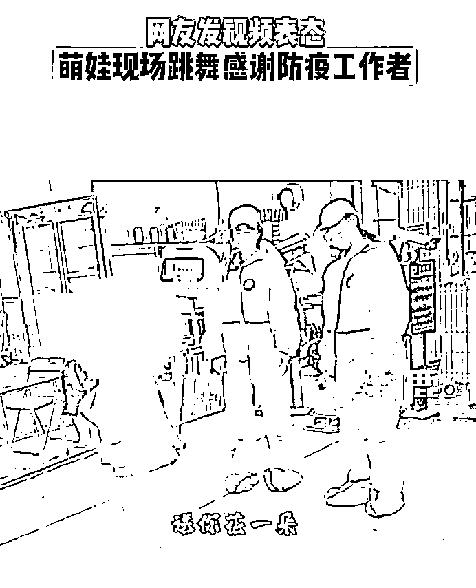
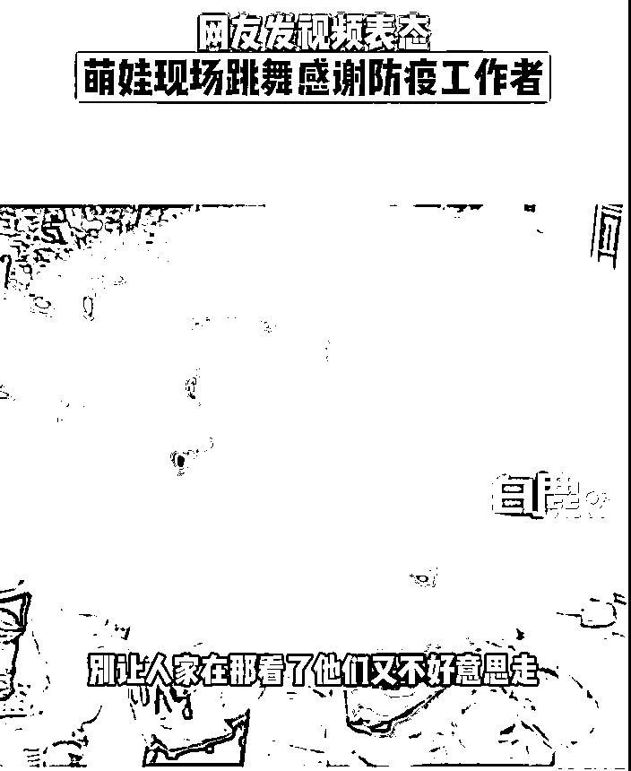
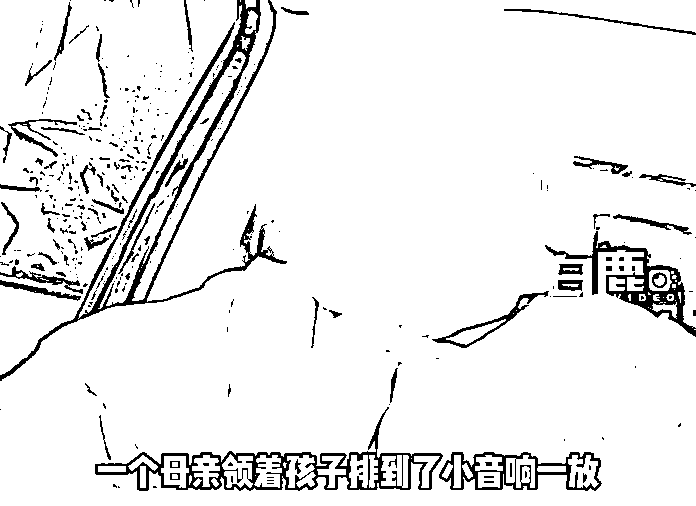
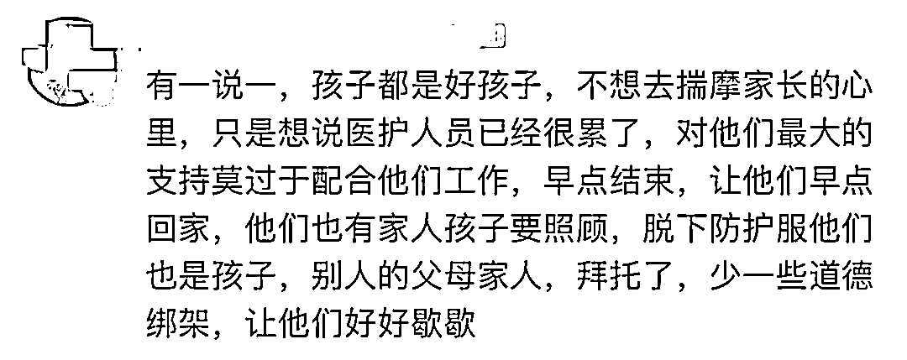
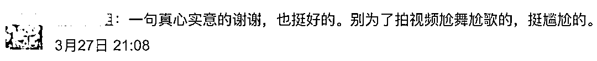
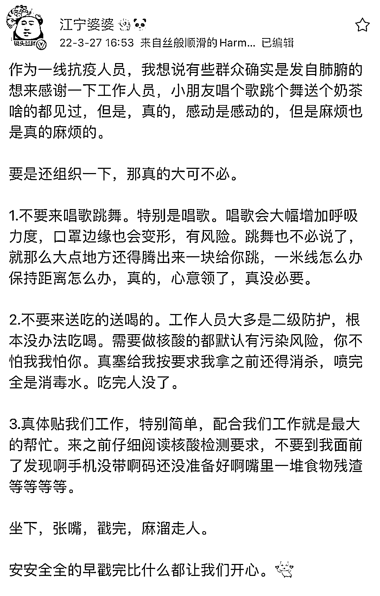

# “听我说谢谢你 因为有你”……

> 原文：[`mp.weixin.qq.com/s?__biz=MzIyMDYwMTk0Mw==&mid=2247532467&idx=1&sn=4451d05df4a0d8371e4b2c58105885f7&chksm=97cbb48ba0bc3d9d4a806f2e8e48ec407af97e512802af4d95f33be654cec068d13afbb8d431&scene=27#wechat_redirect`](http://mp.weixin.qq.com/s?__biz=MzIyMDYwMTk0Mw==&mid=2247532467&idx=1&sn=4451d05df4a0d8371e4b2c58105885f7&chksm=97cbb48ba0bc3d9d4a806f2e8e48ec407af97e512802af4d95f33be654cec068d13afbb8d431&scene=27#wechat_redirect)

**“听我说谢谢你**

**因为有你”**

**……** 

近日 

多段以此音乐为背景的

视频片段在网络引发关注

视频中的画面

有的在学校操场 

学生列成一排 

为身穿防护服人员跳舞

有的在社区 

不少舞者是未成年人

[`mp.weixin.qq.com/mp/readtemplate?t=pages/video_player_tmpl&action=mpvideo&auto=0&vid=wxv_2329345667242000384`](https://mp.weixin.qq.com/mp/readtemplate?t=pages/video_player_tmpl&action=mpvideo&auto=0&vid=wxv_2329345667242000384)

[`mp.weixin.qq.com/mp/readtemplate?t=pages/video_player_tmpl&action=mpvideo&auto=0&vid=wxv_2329355517363617794`](https://mp.weixin.qq.com/mp/readtemplate?t=pages/video_player_tmpl&action=mpvideo&auto=0&vid=wxv_2329355517363617794)

[`v.qq.com/iframe/preview.html?width=500&height=375&auto=0&vid=y3220f7hrzv`](https://v.qq.com/iframe/preview.html?width=500&height=375&auto=0&vid=y3220f7hrzv)

[`v.qq.com/iframe/preview.html?width=500&height=375&auto=0&vid=u3329o5l8mu`](https://v.qq.com/iframe/preview.html?width=500&height=375&auto=0&vid=u3329o5l8mu)

[`v.qq.com/iframe/preview.html?width=500&height=375&auto=0&vid=y3329j0ppis`](https://v.qq.com/iframe/preview.html?width=500&height=375&auto=0&vid=y3329j0ppis)

[`v.qq.com/iframe/preview.html?width=500&height=375&auto=0&vid=c3329zx6v71`](https://v.qq.com/iframe/preview.html?width=500&height=375&auto=0&vid=c3329zx6v71)

[`v.qq.com/iframe/preview.html?width=500&height=375&auto=0&vid=f32225e07yp`](https://v.qq.com/iframe/preview.html?width=500&height=375&auto=0&vid=f32225e07yp)

[`v.qq.com/iframe/preview.html?width=500&height=375&auto=0&vid=v3329tylqje`](https://v.qq.com/iframe/preview.html?width=500&height=375&auto=0&vid=v3329tylqje)

<mpvideosnap class="js_uneditable custom_select_card channels_iframe" data-pluginname="videosnap" data-id="export/UzFfAgtgekIEAQAAAAAAkxQY4P3IjgAAAAstQy6ubaLX4KHWvLEZgBPEk6NQGWsPNpb8zNPgMIvI6U6Sa8sjuUSt2JEayBUp" data-url="https://findermp.video.qq.com/251/20304/stodownload?encfilekey=rjD5jyTuFrIpZ2ibE8T7YmwgiahniaXswqzC2xUwods27KDicO7o2tA7vwv588GPBObOib8icKHeBrs3A4kgNuJu9r9EbITRXFbibZm5DKGw28McicgymVzpbqgH3A&amp;adaptivelytrans=0&amp;bizid=1023&amp;dotrans=0&amp;hy=SH&amp;idx=1&amp;m=&amp;scene=0&amp;token=x5Y29zUxcibCiaPjXOhJLMBiaD6wJogK6iaAEwMBXyWyNKQbr2Y3XtGB1s3YvrcmOsCZtP7LSDR9kibk" data-headimgurl="http://wx.qlogo.cn/finderhead/ibq4aVwOt6HNqrr8OD3sCviaytF3B8TqCwHicxsuIanAJo/0" data-username="v2_060000231003b20faec8c6e48a1acbd3ce04ef33b077a1e41d0d3794ed88ea537878dbe65910@finder" data-nickname="灰产圈+" data-desc="啊这#疫情#核酸@灰产圈+ " data-nonceid="2448752579130520127" data-type="video"></mpvideosnap>

据@白鹿视频 报道

近日

有身穿防护服的网友拍视频表示

亲眼见到排队做核酸

一个母亲领着孩子排到了

开始放音乐让孩子跳舞

她表示

**孩子是好孩子**

**初心是好的**

**但是真的很浪费时间**

[`v.qq.com/iframe/preview.html?width=500&height=375&auto=0&vid=g3329h5xe9s`](https://v.qq.com/iframe/preview.html?width=500&height=375&auto=0&vid=g3329h5xe9s)

据报道，疫情初期

有家长体谅防疫工作者辛苦

便派出家中萌娃跳舞感谢他们的付出

不少人因此感动纷纷点赞

但当越来越多的家长和萌娃

甚至大孩子、学校加入其中

统一使用《听我说谢谢你》的背景音时

不少网友表示：太尴尬了……

网友表示 

配合工作就是

对他们最大的支持

也有不少抗疫一线的工作人员发声： 

3 月 27 日，@江宁婆婆 在微博发文，作为一线抗疫人员，我想说有些群众确实是发自肺腑的想来感谢一下工作人员，小朋友唱个歌跳个舞送个奶茶啥的都见过，**但是，真的，感动是感动的，但是麻烦也是真的麻烦的。**

对于普通群众而言

**做好防护、****听从指挥**

**做完核酸、****麻溜走人**

**就是对他们****最大的支持！**

来源：中国青年报、白鹿视频、潇湘晨报

← 向右滑动与灰产圈互动交流 →

