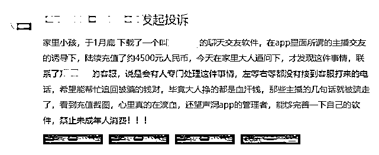

# 女主播背后的秘密

> 原文：[`mp.weixin.qq.com/s?__biz=MzIyMDYwMTk0Mw==&mid=2247532467&idx=3&sn=35a35a4b931eefdd4ff52fe93590aa1d&chksm=97cbb48ba0bc3d9db55c09a132225482f0b01c74d9710a74a6223a4de1eda8591660e3fdd8f5&scene=27#wechat_redirect`](http://mp.weixin.qq.com/s?__biz=MzIyMDYwMTk0Mw==&mid=2247532467&idx=3&sn=35a35a4b931eefdd4ff52fe93590aa1d&chksm=97cbb48ba0bc3d9db55c09a132225482f0b01c74d9710a74a6223a4de1eda8591660e3fdd8f5&scene=27#wechat_redirect)

‍

近年来，随着移动互联网技术的快速发展和智能终端的广泛普及，网络社交的重心逐渐从以往的 PC 端向移动端迁移，移动社交凭借更加便捷有效的互动沟通优势，吸引了众多用户的使用，不断增长的移动社交市场规模催生出直播交友、婚恋交友、语音交友、1v1 陌生人交友等多种类型的应用和平台，但与此同时，移动社交应用和平台的问题也随之凸显。

在今年的“315”晚会上，央视曝光了聚享互娱、沈阳亿泰等直播团队由男子冒充女主播，诱骗用户刷礼物、打赏，专骗粉丝的行为，直播平台打赏经过一系列套路包装之后，已经成为欺诈和敛财的工具。安天移动安全在检测中发现，**欺诈用户的行为不仅仅存在于直播平台，也广泛存在于婚恋交友、语音交友、1v1 陌生人交友等各类具有社交属性的平台中。**

在长期持续关注移动智能终端安全态势过程中，安天移动安全风险检测预警平台检测发现，除了 315 曝光的欺诈用户的问题外，**社交属性平台中还存在诱导消费、擦边博彩、内容低俗色情、青少年模式不合规等诸多问题**，以直播交友为代表的社交应用中的安全隐患不仅严重侵害了广大用户权益，也极大破坏了移动生态的良性、健康发展。

**0****1**

****应用欺诈用户行为****

**安天移动安全在持续关注社交属性平台的过程中发现，社交属性平台通常都以男性用户找女性用户聊天需要充值、付费，女性用户通过与男性用户聊天获取收益为主要商业模式。在这种平台模式下，衍生出平台或不良公会雇佣女聊天员、使用聊天辅助工具（外挂工具）等欺诈用户的行为。**

****直播平台不良公会欺诈****

**今年央视 315 曝光的聚享互娱等直播公会中，男运营冒充女主播，诱骗用户刷礼物、打赏，专骗粉丝的行为普遍存在。类似直播公会通常背后都是一些名为“文化传媒”“互动娱乐”的经济公司，经济公司由数量不等的经纪人（公会长）组成，公会长为女主播配备运营人员，女主播负责出镜，运营人员则负责场控、冒充普通用户刷礼物，甚至假冒女主播的身份与用户聊天，诱导用户不断消费、刷礼物。**

****

****女聊天员、聊天辅助工具欺诈****

**在本应为用户解决真实需求的社交属性类平台上，公会及女聊天员的存在本身就对用户构成欺诈，平台或公会一方面大量招募女聊天员冒充有真实交友需求的用户，通过话术脚本，以交换联系方式、线下见面为由不断向用户索要礼物诱导男性用户不断充值消费、赠送礼物；另一方面，通过聊天辅助工具（俗称“外挂工具”），冒充真实用户与男性用户打招呼、聊天，借助自定义的话术脚本，诱导用户购买会员、充值消费，对用户情感和财产构成了双重欺诈。**

****

**根据用户投诉，在一些婚恋交友平台的相亲房内，红娘及女嘉宾会以深入交流的名义要求男嘉宾充值消费、赠送礼物，而在相亲房外，女嘉宾更是以线下见面、结婚等为由要求男性用户打赏礼物，实际并不能兑现，对用户同样构成欺诈。**

****

********0****2****

******应用诱导付费******

****安天移动安全在持续检测和分析中发现，部分社交属性平台通过向用户频繁发送大量定制化、模板化消息的方式，促使用户发言或使用聊天功能，诱导用户进行付费，部分涉及游戏的应用通过公示不完整的游戏规则诱导用户充值抽奖。****

******未明示消费规则******

****在一些社交属性应用内，点击用户头像会收到“送礼物加好友”的提醒，却并未提前告知”送礼物加好友“所需费用。除此之外，用户收到视频通话邀请、打招呼消息时也没有告知接通电话、回复消息的收费标准，只能在接通电话或回复消息后才能在“消费记录”里得知扣费情况。****

****以下图应用为例，用户回复消息前并未提示消费标准，回复消息后才能在消费记录里面查看回复消息扣了多少代币。****

****‍

‍‍

‍

**利用提前录制的视频推送视频邀请**

在部分社交属性平台上，日常使用的视频通话功能却为付费功能，应用向用户主动推送一些提前录制好的视频通话邀请，邀请往往是用户从未交流过的对象，邀请页面利用女性用户的视频诱导用户付费进行接听。

以下图视频通话需要付费的交友应用为例，应用在用户使用过程中会主动弹出视频通话邀请，同时会展示录制好的女性视频，诱导用户付费接听，更有甚者，有些应用在后台时会频繁弹出视频通话邀请。

以下图应用为例，用户在应用内正常浏览时，会收到提前录制的视频发起的视频通话邀请。

**频繁发送定制化消息诱导付费**

部分交友类应用在用户注册、登录时推送大量的“交友信息”，这类信息发送频次高且有固定话术的痕迹，疑似平台为新注册用户“量身定制”且基于模板生成的自动化消息推送，以达到增加用户留存和诱导用户付费的目的。

以下图婚恋应用为例，用户进入应用后短时间内收到大量打招呼消息，应用以非正常方式向用户发送陌生人打招呼消息，且回复消息需要收费。

下图示例应用给用户发送的消息形式高度相似，有明显话术痕迹。

**应用内未明示游戏获奖概率**

概率性游戏一般出现在相亲房或者聊天室内，应用没有按照相关规定向用户公示所能抽取的奖品以及其抽取概率，可能导致用户在不知情的情况下频繁抽取，以期望获得高价值奖品，引发盲目消费。

根据《文化部关于规范网络游戏运营加强事中事后监管工作的通知》相关规定，网络游戏运营企业应当及时公示可能抽取或者合成的所有虚拟道具和增值服务的名称、性能、内容、数量及抽取或者合成概率。且公示的随机抽取相关信息应当真实有效。

以下图应用为例，应用会在语音房、聊天室等功能页面展示抽奖玩法，且并未对用户可以获取的具体礼物以及获奖概率公示。

**匿名推送诱导**

通知栏消息推送是一种很常见的消息推送方式，安天移动安全发现，有一种通知栏推送的“黑科技”在推送消息时既不使用应用图标，也不标明消息出处，甚至伪装成私信消息、服务通知或其他第三方应用弹窗等现象。

部分社交平台为了提高用户的活跃度，伪装成匿名私信消息的形式，诱导用户进入应用内。

**0****3**

****应用内游戏玩法擦边博彩****

**安天移动安全在检测中发现，有些社交属性应用内设置了概率性的游戏，比如抽奖、砸金蛋、盲盒机等，用户通过充值即可参与这类概率性游戏，抽中的礼物又可以通过赠送、打赏给自己的账号，打赏的礼物可以提现，游戏玩法上存在一些擦边博彩的现象。**

**在部分社交应用的相亲房或者聊天室内的抽奖游戏中，由于抽奖游戏具有概率性，有几率用较低成本抽取高价值礼物，且奖品最高代币价值往往大于参与游戏所需成本。**

****

****

********0****4****

******应用内存在低俗色情内容******

****安天移动安全在检测中发现，部分社交交友类应用中存在大量低俗、色情内容，比如应用内用户个人资料（照片墙、动态、主页）存在低俗、色情内容；用户私聊、评论区发布低俗色情信息。****

******低俗挑逗性聊天内容******

****下图示例应用中，用户会收到低俗挑逗性的聊天内容，包括充斥性暗示的文字、语音或是图片。****

********

******用户个人简介低俗色情内容******

****我们发现有部分社交交友类应用对用户提交的个人简介等资料审核不严，用户个人简介中存在低俗色情内容的现象，包括但不限于使用含性暗示的图片或文字等。****

****下图示例应用中，用户在个人头像和个人简介的资料中使用含性暗示的图片和视频。****

********

******提供色情功能或引流色情平台******

****在跟进社交交友类应用低俗色情内容的风险行为问题时，安天移动安全还发现，有些应用提供色情功能，甚至为色情平台引流。****

********

**************0****5******

********青少年模式不合规********

******部分社交属性应用提供直播类服务，按照相关的规定，应提供青少年模式并在青少年模式下禁止观看直播和充值打赏。然而安天移动安全发现，未提供青少年模式或青少年模式下内容无变化、仍支持充值打赏，也没有时间和时长的限制，青少年模式形同虚设。******

********应用未提供青少年模式********

******下图示例应用提供直播服务，有打赏功能，应用在注册的时候没有对未成年人进行筛选，并且应用内也没有未成年人模式的相关选项。******

************

********青少年模式内容、功能无变化********

******下图示例应用虽然有青少年模式的开关，但在青少年模式下应用内容和功能都没有明显变化，同样可以观看直播，充值付费打赏等。******

************

********青少年模式下仍可付费充值********

******下图示例应用在开启青少年模式后，虽然应用对内容、功能和用户使用时长等作了限制，但用户仍然可以充值付费。******

************

********************0****6********

********客服问题********

******根据某知名投诉平台信息，用户在社交属性平台权益得不到保障，无法联系客服、客服电话打不通、客服处理结果不满意等现象非常普遍。******

******以下图用户投诉为例，某社交平台实际扣款金额与标识价格不同，用户无法联系客服解决。******

************

******有些平台虽然能联系客服，但处理结果无法让用户满意。******

************

********社交属性平台不仅承担着人际间交往的纽带作用，同时也扮演着满足个人信息及情感表达诉求的重要角色，在快速发展迅速触达广大用户的同时，也占据了更多的生活场景。** 对于许多社交属性平台而言，它们自“诞生”就仿佛处于灰色地带的边缘，如何走出监管困境，成为其商业化的前提。**社交属性平台要想实现可持续发展，需要加强自我监督，主动净化平台环境，有效保护用户权益。**从长远看，这也更有利于自身的收益增长及商业化发展。

【聚焦 315】系列文章所揭示的社交属性平台相关问题，折射出当前行业相关规范和标准仍需进一步完善，同时也对平台方提出了更高要求，**只有建立健全相关行业标准规范，加强行业自律，不断强化监管能力和平台方运营能力，才能防止欺诈用户侵害用户权益的现象继续发生**，确保移动互联网生态良性有序发展，为用户构建一个更加安全、纯净、健康的网络环境。******

******来源：安天移动安全********** ************

******← 向右滑动与灰产圈互动交流 →******

************