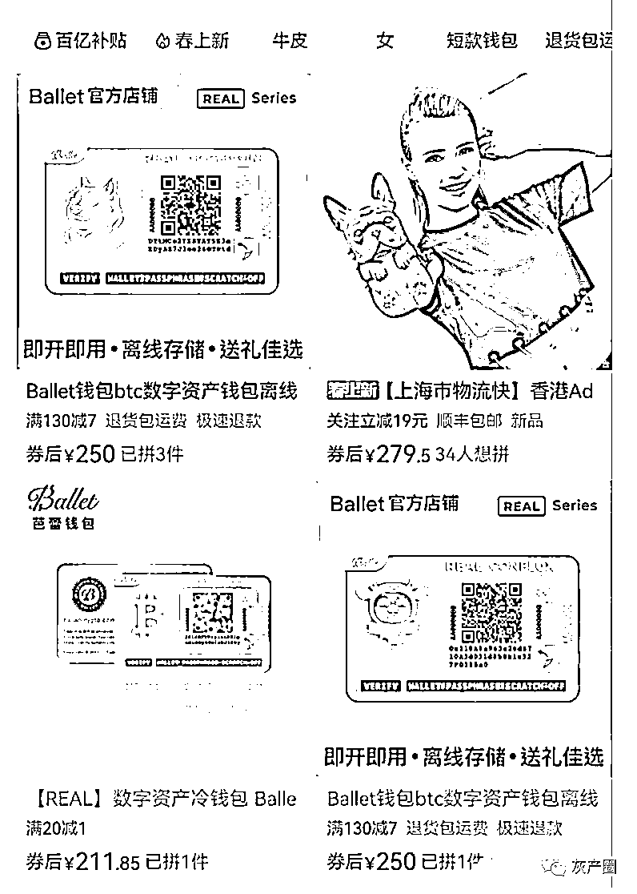

# 硬件钱包离奇被盗，这是什么神仙骗局？

> 原文：[`mp.weixin.qq.com/s?__biz=MzIyMDYwMTk0Mw==&mid=2247532467&idx=4&sn=ce73d575f1b6c5b9f1c58babc957b8ec&chksm=97cbb48ba0bc3d9da34b78d42f8cd45a8ddf2f1d0d4823458e02ce69302b47876eaa300f645a&scene=27#wechat_redirect`](http://mp.weixin.qq.com/s?__biz=MzIyMDYwMTk0Mw==&mid=2247532467&idx=4&sn=ce73d575f1b6c5b9f1c58babc957b8ec&chksm=97cbb48ba0bc3d9da34b78d42f8cd45a8ddf2f1d0d4823458e02ce69302b47876eaa300f645a&scene=27#wechat_redirect)

如果你觉得这个世界上没人会真心对你，我说，你错了。 

起码骗子对你是真心的。

现在大家好像都觉得，骗比较实在，反正币又不受保护，更不需要什么技术手段，只需要编织一个能让你接受的谎言就行了。 

项目方？那帮傻吊还得自己花钱我做市，才能割到韭菜一点点肉。 

这是身为一个骗子的骄傲，也是他们最后的倔强。 

比如这个幼稚的假币骗局。 

我点起了烟，想起从前。 

曾经有这么个骗局，说是我这边的假币可以以假乱真，100 块钱只需要 15 块钱。 

不少逗比觉得我要是能花出去，岂不是赚大发了？ 

于是真的有人去买。

但从来都没接到过发货。 

当你追问的时候，对方要么让你继续多买点一起发，而有良心一点的则直接不理你了。 

你很生气，意识到自己被骗了。

所以你打算报警。 

但你用自己转速为 1 转/小时的浆糊脑袋想了想，觉得不大对劲。

在你百度之后，你意识到如果自己报警，进去的可能是自己。

群众里边有坏人啊，你叹了口气，就此作罢。

我为什么会讲到这个故事，是因为所谓的卖假 u 骗局，跟这个假币逻辑是一样的。 

你以为你能买到假 u 去忽悠别人，结果人家只是为了卖给你空气币。

终究是错付了。 

欲忽悠人者，人恒忽悠之。 

所以我劝你做个好人。

近期还有一个骗局，也让良心哥忍不住直呼内行——原来人可以为了计谋得逞做到这种地步。

因为近期盗币案频发，不少韭菜选择将资产转入硬件钱包——我放到不触网的冷钱包里，有种你来盗我的币？

这个世界上从来没有完美的防守，因为方法总比问题多。

一周之前，芭蕾钱包的群里，有人声称自己的钱包密钥还没刮开，钱包里的币就被转走了。

这个很离谱的说法引起了群友的热烈讨论，纷纷化身柯南线上破案。

但用户说，自己查到链上交易了，确定被转走，大家仍然觉得离谱。 

用户本次损失了 8000 多块钱，钱虽然不多，但这个事情很离谱，直接关系到硬件钱包的安全和口碑。 

随后用户发出了自己买来硬件钱包的视频。 

但正是这个视频，暴露出了问题所在。 

看完视频后，客服说，你这个钱包不是在我们官方渠道购买的。

听起来像是有点踢皮球，但后来用户发出来的订单信息，却让所有人都沉默了——**他是在拼多多上买的。** 

随后群友分析，可能是遭遇骗子了。 

因为钱包有使用过的痕迹，但用户却说自己还没来得及拆开。

那么也就是骗子把钱包地址信息导入下来之后，又将硬件再卖出去，目的就是等着有人往里边转账之后，可以毫不费力的将地址里的余额转走。

后来群友又发现了新的线索，基本确定是被卖家给骗了。 

因为 passphrase（密码词组）都拼写错了。 

放两张图大家对比一下： 

而且眼尖的粉丝可以看到，没拆封的钱包，不会有蜂巢状的纹路出现，所以群友得出的结论是： 

后边那个二维码是骗子后贴上去的。

但钱包主体是真的。

也就是说**，骗子买了一个真的钱包，然后拆开，将私钥留下来，贴上一个自己的地址二维码然后再卖出去。** 

剩下的就是等姜太公钓鱼，愿者上钩了。 

你可能会问，为什么会有人买呢？

原因很简单，因为便宜。

在官方渠道这个钱包卖 288 元，而在拼多多上只需要 250 元甚至更便宜。

本来想省点钱，结果却赔了不少钱。 

有些便宜可以占，有的便宜摸都摸不得。

在这里良心哥也提醒一下大家，不要在二手平台去买硬件钱包，你可能也会遭遇类似的骗局。 

你可能又会问：

骗子以原价从官方买入钱包，但是低价卖出去不是傻逼行为吗？

当你这么想的时候，你才是那个傻逼。

原因很简单，我问你两个问题：

**你不考虑用硬件钱包的时候，你会去买硬件钱包吗？**

**你的资产在什么水平的时候，才会考虑用硬件钱包？**

人家这叫精准投放，单个获客成本才 30 多块钱，而盗取成功一个，就可以顶的上几百个的差价了。

**从南京到北京，韭菜没有骗子精。** 

日你妈，韭菜真难。 

来源：币圈的良心

← 向右滑动与灰产圈互动交流 →

