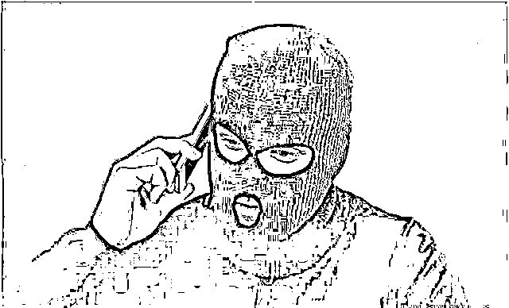
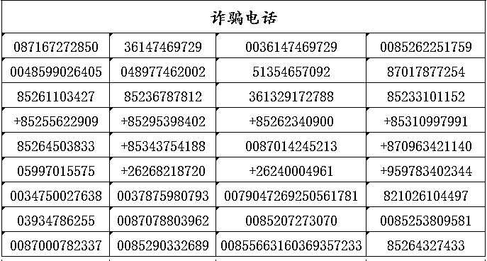
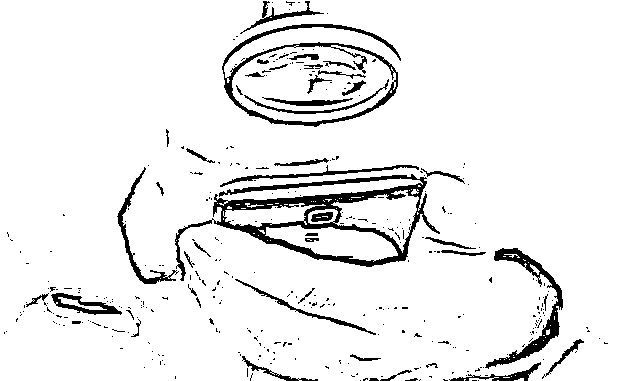
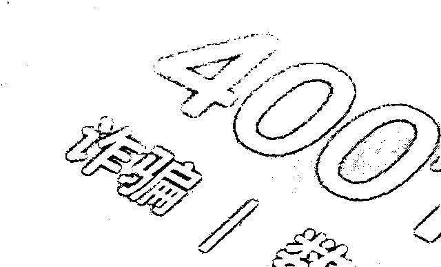
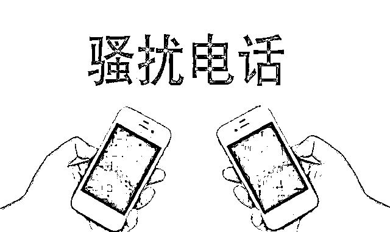
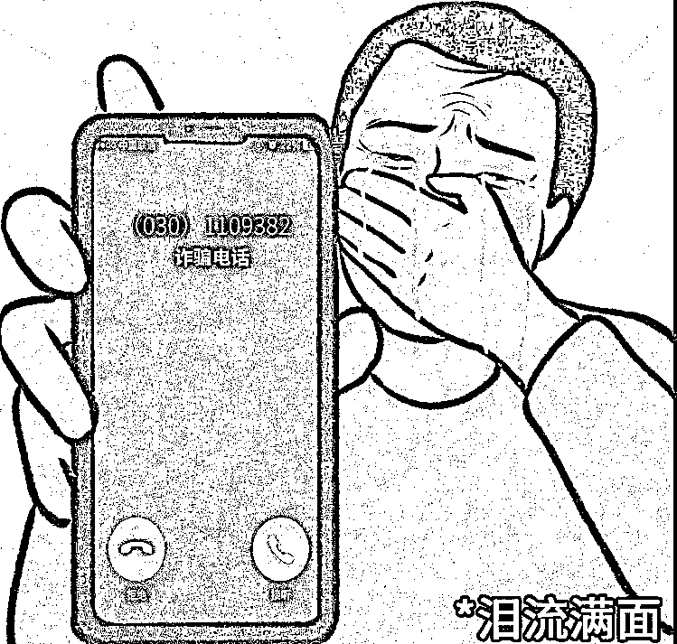

# 以下这些电话，请大家一定不要接！

> 原文：[`mp.weixin.qq.com/s?__biz=MzIyMDYwMTk0Mw==&mid=2247532467&idx=5&sn=e329da89f885bcf9738a1d71f902e602&chksm=97cbb48ba0bc3d9d1b8f4905036c70763cc34628837c111249fd1adbdbc6489d275d93e04e2b&scene=27#wechat_redirect`](http://mp.weixin.qq.com/s?__biz=MzIyMDYwMTk0Mw==&mid=2247532467&idx=5&sn=e329da89f885bcf9738a1d71f902e602&chksm=97cbb48ba0bc3d9d1b8f4905036c70763cc34628837c111249fd1adbdbc6489d275d93e04e2b&scene=27#wechat_redirect)

**36147469729、048977462002**

**+26268218720、+85295398402**

**0085253809581**

**0079047269250561781**

**00855663160369357233**

**……**

摩斯密码？？不！这些是电话号码！

电诈猛如虎，不少人都会疑惑

骗子是如何找到受害人的？

打电话、发短信、发网页广告…

其中打电话联系的比重较大

特别是冒充公检法、客服诈骗

往往一个电话就取得了信任

**经过梳理近期案件**

**我们整理了一批涉诈号码**

**并做了简单的归纳**

**请大家注意** 

**接到下面 4 类电话立即挂断！**

一、“00”或“+”开头的电话不接

“00”或“+”号开头的一般都是境外电话，很可能是国外诈骗份子篡改或者假冒的，如果你没有朋友在国外，或者没有外国朋友的情况下，不要接听这类电话。

****

二、“400”开头的电话不接

很多正规企业的电话都是以“400”开头的，但大家不知道的是，以“400”开头的电话只是用来接听的，正规企业是不会用这个号码打给别人的，如果你有接到这类型的电话，建议尽量不要接听，很有可能是推销或者诈骗电话。

三、“85”“95”开头的电话不接

以“85”“95”开头的电话很多一般都是恶劣的骚扰电话，广告的、诈骗的、推销的，也有一些正规企业，不过这些企业会有相关提示，如果打来的电话一点提示都没有，就尽量不要接。

四、未知电话需谨慎

无论是企业还是部门单位打过来的电话都会有提示的，如果你接到的电话号码是没有任何信息的，甚至连电话号码都看不见，请谨慎一些，接听后如果有异常就直接挂断。

**总之** 

**记住一句话**

**不像正常号码的电话**

**都别接**

**我们再来看看**

**近期发生的一些案例**

**↓↓↓**

01

恩施市的李小姐接到归属地为香港的电话（+85255622909）询问是否需要贷款，由于资金短缺，李小姐听从对方要求下载“好分期”APP 注册申请，最终被骗 4 万元。

02

咸丰县的刘女士接到号码为 0087051096989 的电话，对方称其在淘宝上购买的快递遗失，要进行补偿，刘女士按要求下载“软视通云会议”，与对方通过视频会议沟通。刘女士在对方指导下在支付宝备用金取出 500 元，对方却称操作有误将影响征信为由，要刘女士将资金转至安全账户关闭备用金。刘女士被骗 65028 元。

03

巴东县的陈女士接到号码为+67084224431 的电话，对方冒充警方称其涉嫌洗钱犯罪，需要将银行卡的钱指定账户进行核查 ，骗走陈女士 15000 元。

04

建始县的何先生接到+85350327254 的来电，在其引导下下载安装“Zulip”APP 进行抖音关注刷单，后被对方拉入优质单群内购买期货理财，最终何先生充值 36000 元无法提现。

05

恩施市的吴先生接到一归属地为西班牙（0034750027638）电话，对方声称自己是刷单客服，可以带其一起挣钱，吴先生下载了对方指定软件进行刷单，最终被骗 20 万元。

# **接到符合这些特征的电话**

# **大伙可以直接挂断**

# **任何陌生来电如果提出**

# **扫描二维码、提供验证码、汇款等要求**

# **基本都是诈骗电话**

**直接挂掉！**

**除了注意防范诈骗电话**

**对于不明短信链接、不明二维码**

**请直接忽略并删除**

来源：十堰人民路派出所

← 向右滑动与灰产圈互动交流 →

