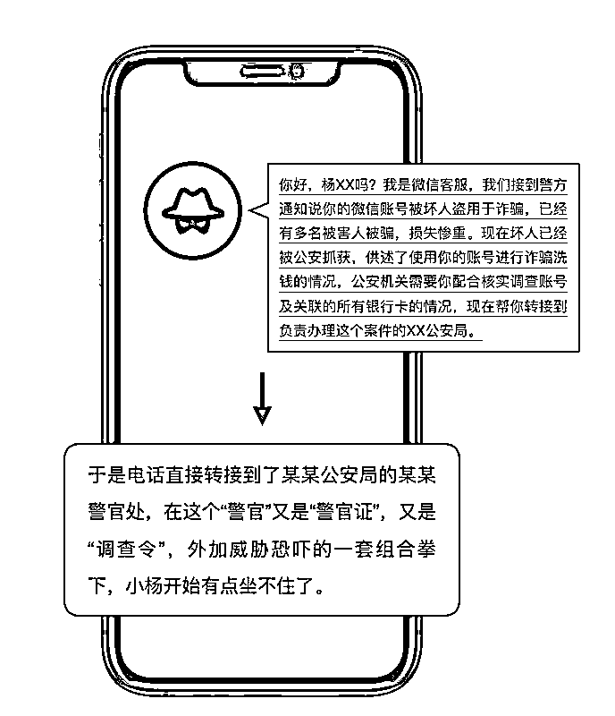
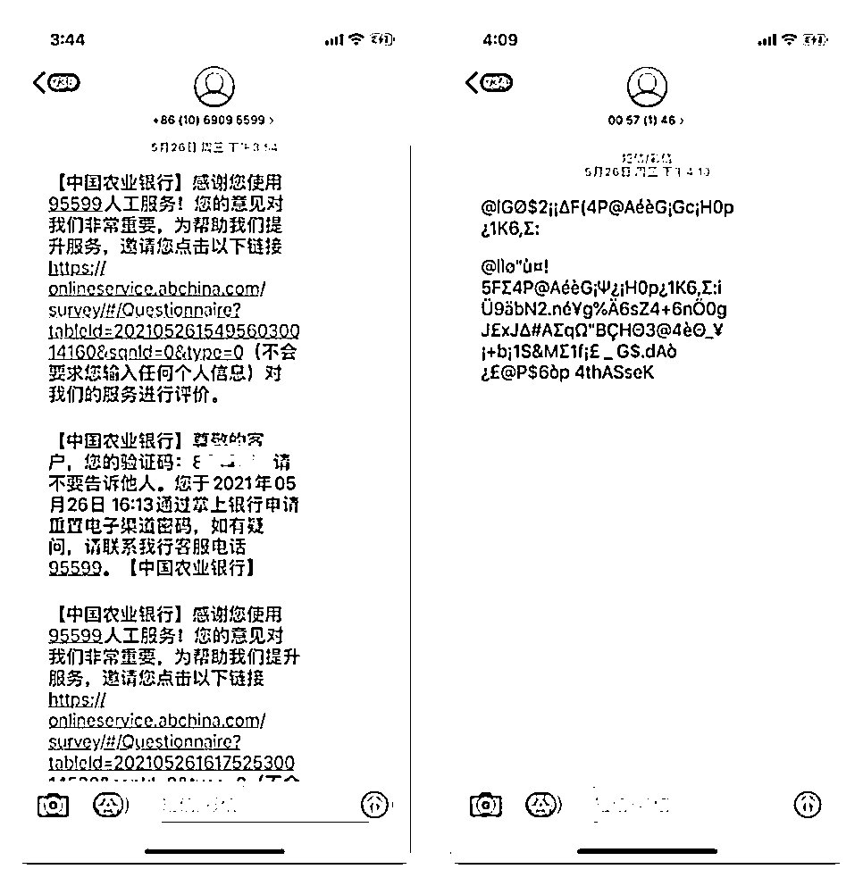
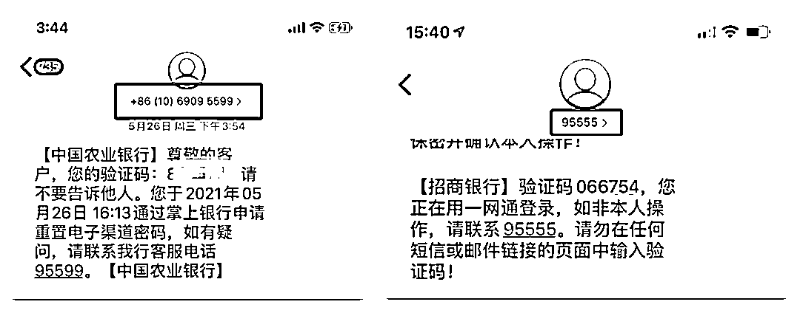
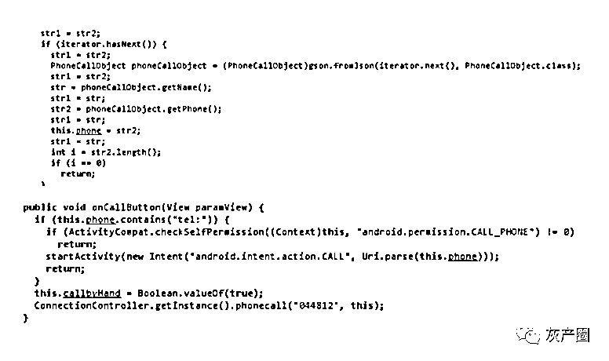
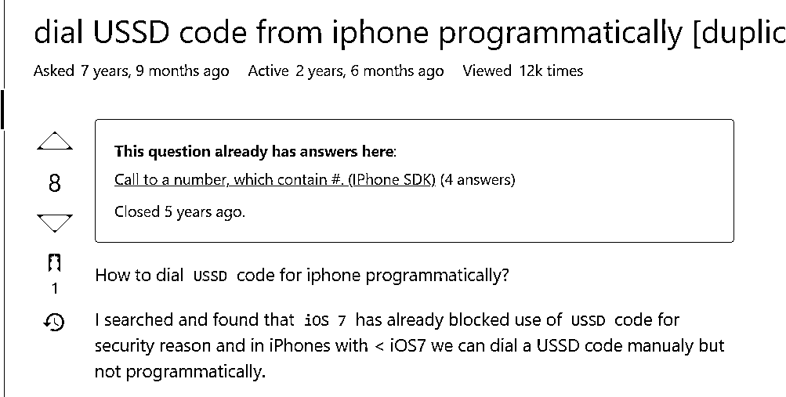
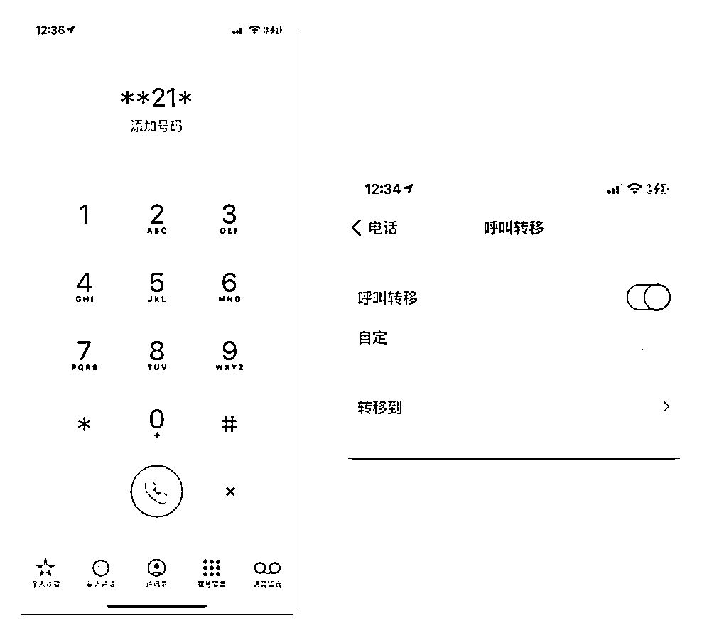

# 因为这 3 点，老司机就接个电话也被骗 20 万！

> 原文：[`mp.weixin.qq.com/s?__biz=MzIyMDYwMTk0Mw==&mid=2247532531&idx=1&sn=81a6ed220d4d0980bb50b68064ca0b1f&chksm=97cbb4cba0bc3ddd2188024a7504707dd37a152246387afcf2c2286eb6216b2a16359559f7de&scene=27#wechat_redirect`](http://mp.weixin.qq.com/s?__biz=MzIyMDYwMTk0Mw==&mid=2247532531&idx=1&sn=81a6ed220d4d0980bb50b68064ca0b1f&chksm=97cbb4cba0bc3ddd2188024a7504707dd37a152246387afcf2c2286eb6216b2a16359559f7de&scene=27#wechat_redirect)

**“任何索要验证码的都是骗子！”**

**“不存在所谓的‘安全账户’！凡是要求转账的都是骗子！”**

鹅师傅在黑产江湖行走多年，自恃只要守住这两条底线，就相当于扼住诈骗分子命运的喉咙，能反过来将骗子玩弄于股掌之上。

但后来鹅师傅发现自己还是太年轻，最近鹅师傅的同事小杨就遭遇了这种“没有底线”的新型网络诈骗，辛苦攒下的 20 万元就这样落入无良的诈骗分子手中。真的不是我们警惕性不高，实在是敌人太狡猾。

**一切都源于小杨接到的一个来自远方的陌生来电……**

**典型的“冒充公检法”开场**

**熟悉的开头，不一样的过程，请继续往下**

TIPS：公检法机关不能内部转接电话！企业与公检法机关更不能内部转接电话！线上侦办案件违法，公检法机关绝不会干！

“警官”接着给出一个公安调查网站，要求小杨在上面如实填写自己在所有银行开设的账号及相应的密码，系统会接入银行核查每个账号涉案的风险。

小杨打开公安调查网站，上面硕大的警徽闪耀着正义的光辉，小杨没法拒绝，反而越发觉得自己好像真的做错事一样。

要访问网站需要先安装安全助手，提示：公安调查网站属于公安办案专用保密网站，为防止案件信息泄漏，网站必须安装安全助手后方可访问。

听着相当合理，保密网站装安全助手，银行网站不都这么操作的吗？公安网站要求当然应该更高。小杨没有怀疑，直接就给装上了。

**但，这个安全助手绝对不安全。经过代码分析，它安装上后干了三件事：**

 **1、拦截短信：**将手机接收到的短信内容发往境外服务器，然后把本地的短信删除，让被害人接收不到任何短信。

**2、关闭短信提醒：**关闭新短信的声音和通知提醒，让被害人手机即使收到短信，也完全无法察觉。

**3、设置呼叫转移功能：**将被害人的所有来电都转移至其它号码，切断被害人与外界的联系。 

进入网站后，小杨按指引填写了自己的银行账号，但系统还进一步要求填写密码，小杨产生了怀疑。另一头的“警官”开始给小杨施压，小杨转念一想，光有账号和密码也不能将卡里的钱转走，只要不把验证码给出去就行了，于是咬咬牙说服了自己往上填写密码。

小杨一共填了两个银行账号，一个农业银行，一个招商银行。招商银行卡是小杨的工资卡，存着小杨工作以来的积蓄 20 万元；而农业银行卡平时则用来缴纳水电费、网购等，卡里余额不多，就几百块钱，每次用完了再从工资卡往里转几百块。小杨平时安全意识不错，懂得把两张卡隔离开来使用。

填写完后，“警官”很满意，说配合得不错，他们马上进行核查以证明小杨清白。按照办案程序，最后需要对小杨做一个人脸录屏，证明以上材料都是小杨本人配合提供的。

**人脸录屏，没错，就是你想的那样，让你对着摄像头，左转头、右转头、眨眨眼……**

很快，“警官”说账户核查结果出来了：农业银行的卡是安全的，但招商银行的卡确实被用于诈骗洗钱了，公安机关需要马上冻结该账户。如果不想资金损失的话，需要立即将招商银行卡上的资金转到农业银行的卡上。不然的话一旦账号被冻结，里面的资金会被当作涉案赃款予以没收。

没有所谓的“安全账户”，小杨舒了一口气，钱还是转到自己的卡上，只不过是从招商银行卡转到农业银行卡。小杨庆幸自己没有怀疑和抗拒警察的调查，不然一旦拖延了办案进度，卡里的 20 万随时都有可能被冻结没收。

转账操作完，“警官”叮嘱近期不要操作这几个银行账户，会尽快通知处理结果，然后就结束了通话。

这一番折腾下来，小杨感觉有些疲惫，自己的账号怎么会无缘无故地被诈骗分子给利用了呢？实在想不明白。

小杨强行提起精神，打开招商银行手机银行，逐字确认过刚才转账的账户是自己农业银行的卡号没错，稍微松了口气，但想想还是不放心，又打开农业银行手机银行想确认一下 20W 的转款是否到账。

**密码错误！**

重新逐个字符输入，还是密码错误！

不可能！第三次尝试输入，小杨手抖得厉害，豆大的汗水都滴落到了手机屏幕上，输了又删、删了又输，生怕输错任何一个字符，就这样花了将近一分钟才把密码填写完，结果还是提示密码错误！

“还可以找回密码！”小杨告诉自己。但是“获取验证码”按钮的 60 秒倒计时过了一遍又一遍，手机始终接收不到农业银行下发验证码短信。更让小杨心惊的是，农业银行的短信小杨没等到，在短信的列表里却发现了连续好几个招商银行下发的登录验证码短信，时间显示都是在小杨刚才配合调查的期间收到的。

这几个短信完全没有声音提醒！没有弹窗通知！甚至还没打开过就已经是已读状态！要不是小杨等不到农业银行的短信，心急如焚一再查看短信列表，完全不可能注意到有这么几个短信的存在。

小杨慌了！

这时候，刚好小杨家人的微信语音电话进来，说有警察打电话过来说小杨可能遭遇诈骗，但小杨电话一直打不通。

自己真的被骗了，小杨欲哭无泪，他强撑起自己早已瘫软无力的身躯第一时间报了警。然后在等待警察的过程中，赶紧拨通了农业银行客服电话 95599 挂失了银行卡。

警察来到后，第一时间让小杨登录手机银行查流水。小杨说没法登录，提示密码错误，还收不到验证码短信、重置不了密码。

反诈经验丰富的警察叔叔一下子就发现问题所在，二话不说拿过小杨的手机，将手机卡拆下来装到自己的手机上，让小杨通过“忘记密码”的操作再次尝试登录。

手机卡一插上警察叔叔的手机，验证码短信很快就收到了。此外，还收到几个奇怪的乱码短信，很有可能是骗子的后台程序给安装在手机上的恶意程序下发的加密指令。小杨发现这个乱码短信的号码，跟一开始那个该死的来自远方的陌生来电，是一样的。小杨的心彻底凉了。

收到验证码，很快就顺利通过验证码环节的验证。但到了密码重置环节却提示由于银行卡已经挂失，无法进行重置密码……

这时候的小杨已经支撑不住，双脚发软瘫坐在了地上。

警察带着小杨马上赶往最近的银行营业厅，终于在银行柜台查到了意料之中却难以接受的结果，余额 0！

流水显示，招商银行转过来的 20 万元确实很快就到账，但这刚到账的 20 万元，连同原来卡里的几百块钱，很快地被分批转走到几个不同的账户里。

警察登记了坏人接收款项的几个账户申请止付，一声无奈叹息：骗子太专业，止付拖的时间太长，钱大概率被洗走了，怕是很难再追回来了……

与骗子的终极技术对抗：悲剧面前，不应只有同情，更该有反思

骗子为什么要让你把钱从招商银行转到农业银行？

骗子没法直接从招商银行将钱转走！！ 

回想一下案件经过，小杨的手机从装上所谓的“安全助手”后，农业银行的验证码短信就再也接收不到，招商银行的验证码短信却还是可以接收到，只不过因为提醒功能被关闭而无法察觉。

**对比两者的区别：**

农业银行是通过“1069095599”端口下发验证码短信，而招商银行则是直接通过“95555”来下发。

鹅师傅推测：应是小杨的手机系统对“95555”等特殊号码下发的短信做了保护，禁止骗子的恶意程序对其进行拦截，骗子无法成功捕获到招商银行的验证码短信，只能诱使被害人将钱转账至农业银行。

如果情况真是如此，那让我们不得不反思：

一方面，关键业务（包括银行业务在内）的短信验证环节，能否不使用 106 短信端口，而直接通过“95555”等标识性更强的号码来下发，从而提高安全性呢？

另一方面，手机系统对于发自不同号码的短信作安全策略上的区分，究竟是何考虑？如果对于农行“1069095599” 端口下发的验证码短信，也给予像“95555”同等的安全策略待遇，小杨的悲剧会否多一丝可以幸免的可能性？

这里不得不对比 IOS 更为严格的安全策略：

**一是 IOS 不允许拦截短信的操作，甚至不允许 APP 直接对外发送短信。**APP 发短信必须通过拉起系统的短信应用来发送的，APP 只能填写短信内容和接收号码，发送操作必须由用户本人操作，不能后台发送。

**二是 IOS 理论上也不可能通过 APP 程序化设置关闭短信提醒的操作**，骗子向小杨任一银行伸手的那一刻，那一声清脆的短信提示音，本应是能守护小杨的警鸣声。

道高一尺，魔高一丈！你有预警劝阻，我有呼叫转移！

在小杨与这个来自远方的陌生来电通话三十多分钟的过程中，当地反诈中心其实已识别到诈骗风险，并尝试通过电话等方式积极进行劝阻。

但小杨的手机在安装所谓“安全助手”的过程中，已被设置了呼叫转移功能，无法及时接收到公安机关的诈骗预警。

虽然公安机关最后通过其亲友跟其取得了联系，但已为时晚矣。

**骗子是如何在小杨的手机中设置呼叫转移功能的？**

骗子在所谓的“安全助手”里，通过代码实现拨打“**21*电话号码#”，向运营商发送 USSD code，就这么一行简单的代码，就能成功阻断被害人手机的所有来电，也使得小杨只能被困在骗子苦心设计的场景下与对方演对手戏，最后一步步落入泥淖之中。

同样的，对比 IOS，情况仍旧存在着很大差异。从 IOS 7 开始，系统因为安全原因已经禁止了程序自动发送 USSD code 的功能。也就是说，如果小杨使用的是 IOS，这种设置呼叫转移的方式将不会奏效。

但这并不意味着骗子对 IOS 就束手无策。近期很多电信网络诈骗的案例中，设置呼叫转移已经成为骗子的标配，在对抗公安机关预警劝阻、提高诈骗成功率方面发挥了重要作用。

**除上述通过恶意程序来自动设置外，常见的还有以下几种方式：**

1、诱导用户自行在手机拨号界面输入“**21*电话号码#”或在功能设置中手动设置呼叫转移。

2、诱导用户屏幕共享后，要求用户按引导通过上述两种方式设置呼叫转移。

3、控制用户屏幕后，骗子自行操作用户手机进行设置。此种情况下，被害人往往由于还处于通话过程中，未能察觉骗子在其手机上的相关操作。

但相比之下，在小杨手机上使用的这种通过恶意程序自动设置的方式，无疑更为简单而且隐蔽，不易引起被害人的怀疑和警惕，从而也使得坏人的诈骗更容易得手。

**鹅师傅想提醒一下，在通过手机无法联系被害人的情况下，尝试通过微信语音电话、APP 通知提醒等方式来联系或者提醒被害人，是个不错的选择。**

骗子为了精准传达诈骗信息和把控诈骗过程，大多都会将被害人由电话场景引流至网络社交工具、视频会议等网络应用场景，所以保持被害人手机数据网络的畅通是必要条件，这也给我们通过网络应用的手段在过程中及时地对被害人进行预警和劝阻创造了条件。

**但不得不承认的是，与骗子的激烈对抗总是此消彼长、交替上升的，而且经常是骗子走在我们的前面。**

目前已经出现骗子以“账号存在风险”等各种名义要求被害人退出微信、QQ 等通用社交工具的登录，引导被害人安装、使用其它小众通联工具、会议软件，利用这些软件对被害人进行诈骗的同时，也阻断他人通过网络触达和救济被害人的路径。甚至部分骗子会在诈骗行为结束之后，要求被害人进一步开启手机飞行模式，使被害人完全陷入失联状态，为其转移诈骗款项争取更多时间。

人脸识别，突破它有时只需要一张大头照

人脸识别，是依托于 AI 技术高速发展产生的安全验证方式，被视作比账号密码、短信验证码等方式更为安全有效，在众多关键敏感的场景下被广泛使用。但安全往往只是相对而言，传统的人脸识别算法在当前的技术条件下显然已经不够安全。不法分子借助于特殊的图像处理软件，就可以将一段视频、甚至一张大头照，活化转换为能够突破人脸识别的视频，继而通过劫持手机摄像头的方式，以处理过的视频代替摄像头来完成人脸识别的校验。

人脸识别要继续发挥其安全可靠的最后一道关卡的作用，无疑需要进一步优化算法，增强验证过程的随机因子和复杂度，让不法分子难以事前模拟。

**最后，如果发现被骗，不要挂失银行卡，如果钱还没被转走，第一时间让银行冻结账户；如果钱已经被转走，查出对方账号，报警申请止付。记住，关键要快！**

**愿天下无诈，世界和平！**

来源：腾讯安全战略研究

← 向右滑动与灰产圈互动交流 →

