# 结识“创业大神”后，我成为了传销组织的韭菜...

> 原文：[`mp.weixin.qq.com/s?__biz=MzIyMDYwMTk0Mw==&mid=2247532531&idx=2&sn=4ff7420a4b3dcf2e1c2c89cd4ec9e1e1&chksm=97cbb4cba0bc3dddc68baaaf3ea80de2751076aa8bc7b5b0fa6556131ad61639efb3838fd7fd&scene=27#wechat_redirect`](http://mp.weixin.qq.com/s?__biz=MzIyMDYwMTk0Mw==&mid=2247532531&idx=2&sn=4ff7420a4b3dcf2e1c2c89cd4ec9e1e1&chksm=97cbb4cba0bc3dddc68baaaf3ea80de2751076aa8bc7b5b0fa6556131ad61639efb3838fd7fd&scene=27#wechat_redirect)

**01**

**虚拟货币加入“传销套餐”**

不久前，上海警方敲掉了一个打着“投资虚拟货币”的幌子实施传销的犯罪团伙，抓获犯罪嫌疑人 10 余名，涉案金额超过 1 亿元。

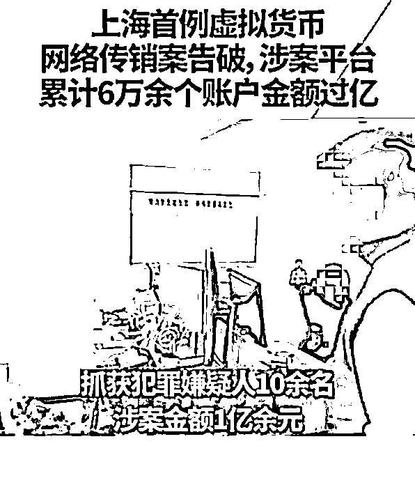

随着互联网走进千家万户，虚拟货币成为了投资行业的新星。

从比特币、以太坊到狗狗币再到 SHIB，市场风云变幻、大起大落之间，既创造出无数财富神话，又让数不清的韭菜血本无归。

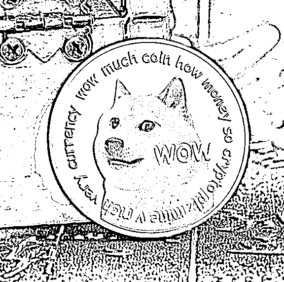

**高风险、高回报，是币圈最为显著的特征。**

它是赌徒的乐园，也是投机主义者大展身手的战场。

而伴随着巨大利益诱惑的，是数不清的骗局与陷阱。

翻阅近两年的新闻，发行“山寨币”炒作舆论拉高价格，然后再卷钱跑路的例子屡见不见。

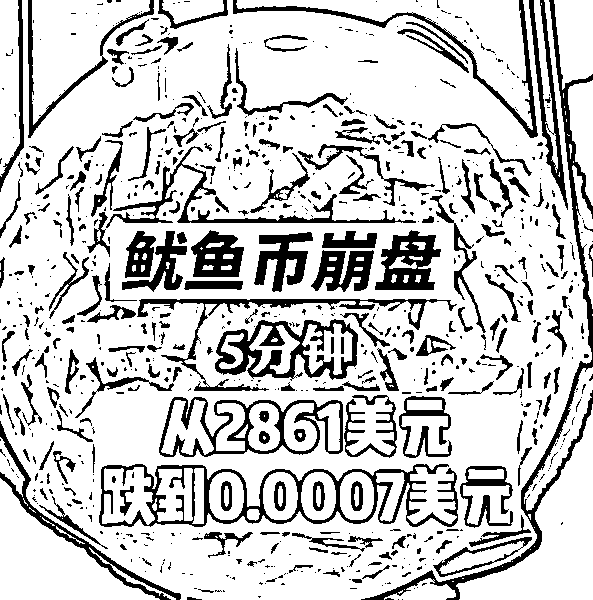

以“数字货币”、“区块链”等概念为幌子实施诈骗的事件时有发生。

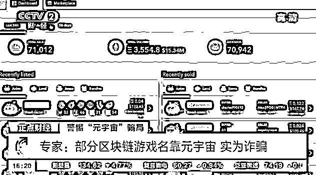

而现在，又出现了披着投资虚拟货币外皮的传销组织。

在上海的案件中，不法分子首先建立“区块链技术公司”，推出与虚拟货币相关的投资理财产品。

为了让投资者上钩，不法分子往往会许诺极为高额的投资回报。

**当投资者购买虚拟货币之后，传销组织就会立即把虚拟货币兑换成平台自己的“代币”，将投资者纳入自己的“会员体系”之中。**

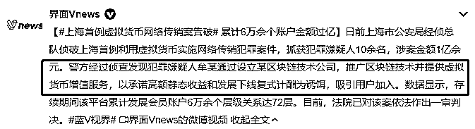

名为参与投资，实则稀里糊涂地交了“入门费”，成为了组织成员的“下线”。

接下来，平台就会给出大家非常熟悉的“额外奖励规则”：

**只要投资者吸引吸引其他人加入平台，就可以得到奖励，还能根据下线的“投资收益（人头费）”获得额外分红。**

截至案发，该犯罪团伙用这样的方式已经发展了 6 万余“会员”，其中包含高达 72 层的上下线关系。

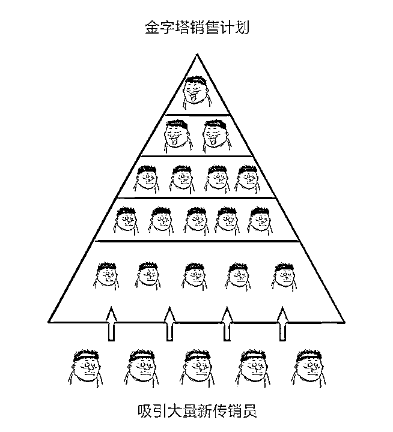

分析这个组织的运作模式，我们不难发现：

**被害者向平台转入的资金，跟虚拟货币投资压根没有太多关系（第一时间就被兑换交易），组织成员获得收益的来源，基本都是“下线”的入门费。**

这样“击鼓传花”式的资金流动模式，带有典型的传销性质。

只不过，传销组织利用了被害人对虚拟货币知识的欠缺，用大量诸如“区块链技术”、“去中心化”、“加密货币”等概念来包装产品，将其吹嘘得神乎其神。

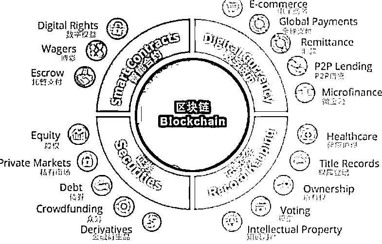

不明所以的被害人，往往就会相信自己“抓住了时代的风口”，找到了财富自由的密码。

在犯罪分子处心积虑地诱导与欺骗下，很多人就会陷入其中无法自拔。

在今年公安部更新的传销组织名单中，出现了大量涉嫌传销的“虚拟货币”：

**五行币、皇尊币、万福币、克拉币……**

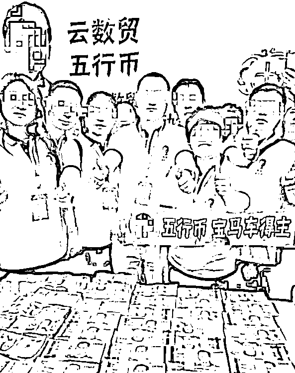

伪装成虚拟货币投资公司，已经是传销组织发展的一大趋势。

**而最容易上当受骗的群体，是对币圈知之甚少的中老年人。**

那么，有专门针对年轻人的传销组织吗？

答案当然是肯定的。

不少人大学还没毕业，就先被传销组织狠狠上了一课。

**02**

**伸向大学生的魔爪**

大一学生小齐（化名），刷短视频的时候发现了一位“校园达人”。

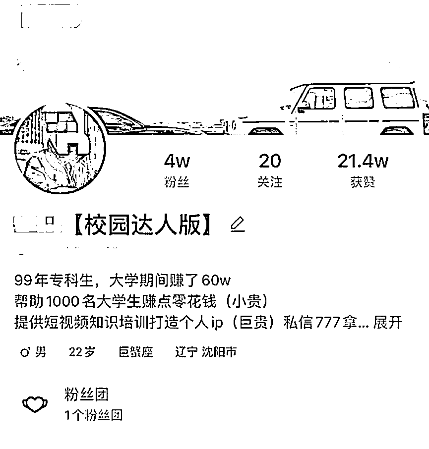

这位达人在简介中称自己是 99 年的专科生，在大学期间就“小赚”了 60 万。

此后更是帮助上千大学生创业致富。

而账号下的视频内容大都是一位年轻小伙分享“创业心得”，提供“创业思路”。

一番浏览下来，初生牛犊不怕虎的小齐也萌生了自己创业的想法。

他找到这位达人，求对方指点迷津。

“达人”也是毫不含糊，大手一挥便是一张“流量王”创业项目。

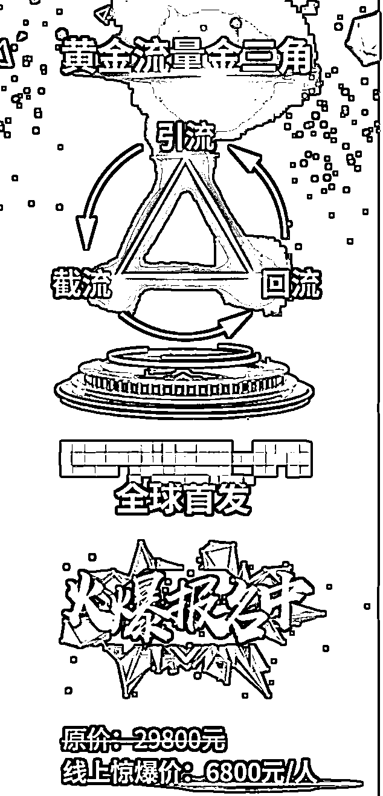

**只需缴纳一定数量的“加盟费”，便可加入创业团队，用“全新的模式、理念”，轻松获取高额收益，“0 风险 0 门槛”，高富帅白富美信手拈来。**

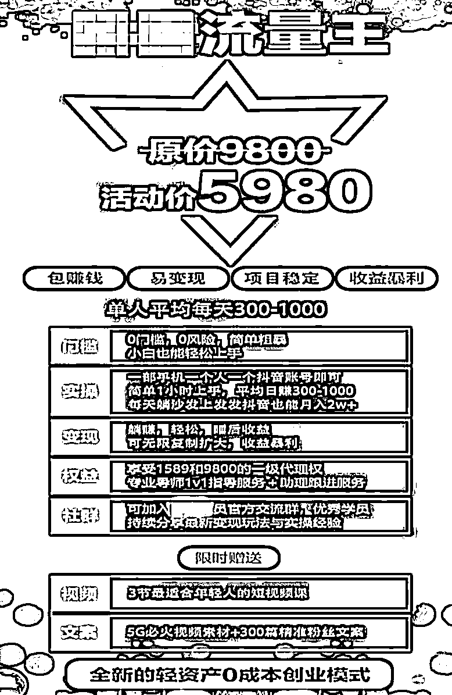

一通天花乱坠的吹嘘，小齐无比心动，当下就向“达人”转了钱。

在他看来，自己这是遇上了贵人，未来的道路一片光明。

然而，接下来发生的事情却让他感到了不安。

加入“创业团队”后，自己并没有学到什么“金点子”。

**所谓赚钱的方法，不过是在短视频平台上炫富，打造“成功人设”，吸引其他人加入，以获取“提成”。**

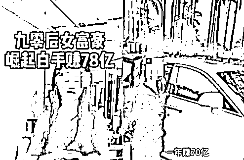

这手段，这方法，怎么看都像传销呀！

发觉自己被骗，小齐退出了“创业群”，并转而走上维权之路。

经记者调查发现，与小齐经历类似的大学生还有不少。

他们都是通过短视频平台结识“校园创业达人”，并听信了对方的说辞加入项目。

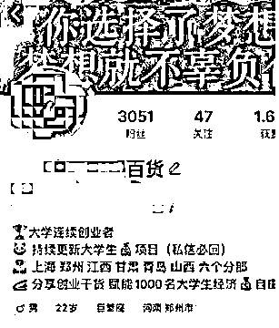

待他们意识到自己已经落入传销陷阱时，平日里省吃俭用出来的“加盟费”早已进了不法分子的腰包。

目前，警方已经就此事展开了调查，相关快手账号已经被封禁。

刚刚进入大学校园的的学生，**对未来往往都有很高的期待，但对社会之中的种种险恶却普遍认识不足。**

面对“年轻有为”的诱惑，部分人头脑一发热，就丧失了警惕之心。

**03**

**不断“进化”的传销**

从用暴力手段限制人身自由的“北派传销”到如今披上“前沿概念”的外衣，传销的面孔换了又换。

如今，传销组织的载体可以是理财产品，可以是创业投资团队，可以是人力资源公司，甚至可以是减肥代餐粉的经销商。

**时代在不断向前发展，传销的手段也在不断进化。**

华丽的概念包装、高明的洗脑手段，让人防不胜防。

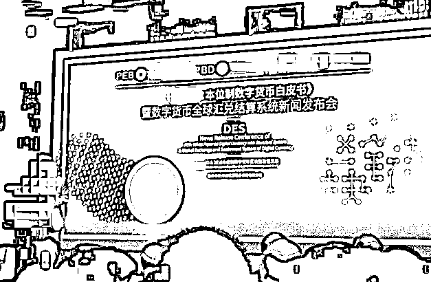

但是，这并不意味着我们没有反制手段。

传销最显著的特征，就是“拉人头获利”。

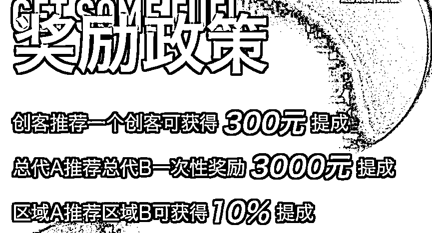

无论“宣讲导师”吹得多么天花乱坠，唯有这一点不可避免。

一旦发现类似的特征，就应立即退出止损。

最后我想说，很多人之所以深陷传销的泥潭，还是因为在利益诱惑面前动了贪念。

**这世上大部分一夜暴富的神话，都活在骗子的嘴巴里。**

来源：黑白呸

← 向右滑动与灰产圈互动交流 →

