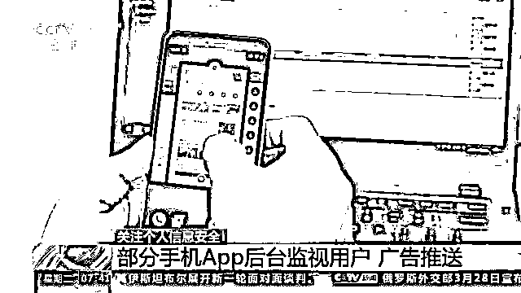

# 触目惊心！超 2 亿人的个人信息遭泄露！1 个账号卖 3 元？！你可能正在被监听...

> 原文：[`mp.weixin.qq.com/s?__biz=MzIyMDYwMTk0Mw==&mid=2247532531&idx=3&sn=5e1b9a2e75c22392bae94b0111ae31a6&chksm=97cbb4cba0bc3ddd3dbf0cef7a910d0a6e19911194968ead632d1d4a484b9e5b17ba6fd155f6&scene=27#wechat_redirect`](http://mp.weixin.qq.com/s?__biz=MzIyMDYwMTk0Mw==&mid=2247532531&idx=3&sn=5e1b9a2e75c22392bae94b0111ae31a6&chksm=97cbb4cba0bc3ddd3dbf0cef7a910d0a6e19911194968ead632d1d4a484b9e5b17ba6fd155f6&scene=27#wechat_redirect)

中国信息通信研究院日前发布的《中国信息消费发展态势报告》显示，在消费群体方面，**我国网民规模持续扩大突破十亿**。《报告》同时也提示警惕数据安全、个人信息泄露等风险。个人信息保护法实施以来，甘肃、江苏等地公安机关就已破获多起侵犯公民个人信息犯罪的案件。

[`mp.weixin.qq.com/mp/readtemplate?t=pages/video_player_tmpl&action=mpvideo&auto=0&vid=wxv_2331031598739193857`](https://mp.weixin.qq.com/mp/readtemplate?t=pages/video_player_tmpl&action=mpvideo&auto=0&vid=wxv_2331031598739193857)

甘肃省灵台县公安局不久前刚刚打掉一个全链条网上购销公民个人信息的犯罪团伙。犯罪嫌疑人闫某某和胡某某利用经营店铺，骗取用户身份信息和手机号，非法注册各类网络账号，这些网络账号最终都落入“网上号商”的犯罪团伙手中。

警方发现这两名嫌疑人背后还隐藏着一个犯罪团伙。今年 2 月到 3 月，专案组转战重庆、四川、云南，抓获 7 名侵犯公民个人信息犯罪团伙成员。该团伙从 2019 年起组建微信群非法买卖公民个人信息，他们利用通信业务代理商身份，以赠送礼品、话费等方式为诱饵，**骗取用户个人信息后注册各类网络账号，以每个账号 3 元至 20 元价格出售，非法获利近十万元**。

江苏警方近日也破获一个贩卖公民个人信息的犯罪团伙。该团伙主要贩卖股民和学生的信息，他们把个人信息称作“料子”。“股民料子”包括炒股者姓名、手机号、交易所等信息；“学生料子”则包含家长姓名、电话、孩子就读学校等。“料子”还分手拨料子和 AI 料子。手拨料子通过人工拨打，确认过真实性和可靠性。AI 料子则是嫌疑人通过软件随机生成的电话号码，没有其他身份信息。

经审查，从 2018 年至今，该团伙贩卖公民个人信息 20 余万条，获利 20 余万元。

中国互联网络信息中心《第 49 次中国互联网络发展状况统计报告》显示，**截至 2021 年 12 月，有 22.1%的网民遭遇个人信息泄露**。公安机关提醒广大群众不要点击、使用来源不明的链接、网站、手机 App，更不能将短信验证码提供给他人，严防信息泄露。

**部分手机 App 后台监视用户**

[`mp.weixin.qq.com/mp/readtemplate?t=pages/video_player_tmpl&action=mpvideo&auto=0&vid=wxv_2331032197350260738`](https://mp.weixin.qq.com/mp/readtemplate?t=pages/video_player_tmpl&action=mpvideo&auto=0&vid=wxv_2331032197350260738)

随着个人信息保护法的实施，加强个人信息保护，拒绝个人隐私在互联网上“裸奔”已经有法可依。但仍有不少用户觉得自己处在手机 App 的监视下。很多网友都有过这种经历，**在网上看了某个物品或输入一个关键词，很快就会收到手机 App 推送的相关广告或信息**。这是怎么回事呢？

在一家网络安全机构，技术人员用检测工具对两款手机浏览器收集用户信息行为进行了测试。技术人员复制了一个模拟的银行账号密码，尽管此时并没有使用浏览器，**但检测工具却在浏览器调用的一段程序中发现了那个银行账号密码**。

**网络安全工程师 吕石奎：**这款 App 读取了我们复制的银行卡号和密码。它拿走的这个过程，实际是明文拿走，并没有做相关的加密处理。

技术人员接着又在手机上选择了测试用的电话号码和短信，并把浏览器转入后台运行，这两次操作的内容同样被浏览器读取，包括在电商平台上浏览的商品信息也被两款被测试浏览器完整记录。**其中一款浏览器在进程被关闭的状态下，仍然能够记录用户行为**。

**建立“双清单” 保护公民个人信息**

[`mp.weixin.qq.com/mp/readtemplate?t=pages/video_player_tmpl&action=mpvideo&auto=0&vid=wxv_2331032998596542464`](https://mp.weixin.qq.com/mp/readtemplate?t=pages/video_player_tmpl&action=mpvideo&auto=0&vid=wxv_2331032998596542464)

为了让用户清晰掌握手机 App 调用和索取个人信息的活动，工信部此前就提出要建立个人信息保护的“双清单” 。

专家指出，手机 App 在正常使用过程中会出现调用个人信息和索取权限的活动，不同手机 App 之间有时也需要共享位置、通讯录等敏感信息，这增加了个人信息保护的监管难度。为了让用户清晰掌握个人信息在手机 App 及第三方间共享的情况，**工信部提出建立个人信息保护“双清单”，要求相关企业建立已收集个人信息清单和与第三方共享个人信息清单**。

**中国信息通信研究院泰尔终端实验室信息安全部主任 宁华：**要求企业在“二级菜单”中简洁、清晰列出“第三方共享个人信息清单”，包括与第三方共享的个人信息种类、使用目的、使用场景和共享方式等。

**多措施整治违规收集使用个人信息等行为**

[`mp.weixin.qq.com/mp/readtemplate?t=pages/video_player_tmpl&action=mpvideo&auto=0&vid=wxv_2331034269554540544`](https://mp.weixin.qq.com/mp/readtemplate?t=pages/video_player_tmpl&action=mpvideo&auto=0&vid=wxv_2331034269554540544)

为了治理 App 违规收集使用个人信息和欺骗诱导用户提供个人信息等问题， 工信部委托中国信息通信研究院联合互联网、手机终端、电信运营商等产业链各环节成立 App 用户权益保护标准工作组，按照“知情同意”和“最小必要”原则组织制定了《App 收集使用个人信息最小必要评估规范》《App 用户权益保护测评规范》等标准，明确了检测要求和方法，为监管提供了更加明确的监管依据。

记者从工信部了解到，首批主要互联网企业已经在去年年底基本完成个人信息保护“双清单”的设置。**在某款手机 App 上，用户点开菜单就可以查看这个 App 已经收集的用户个人信息种类、使用目的、使用场景以及与第三方共享的个人信息和共享方式等**。手机终端企业也按照工信部要求开发了 App 权限最小化推荐等功能，主动对手机上的 App 过度索取权限行为做出规范和限制。

电信运营商则通过区块链技术的防窜改特性来追踪防范个人信息泄露风险。

**电信运营商信息安全中心负责人 温暖**：我们会将操作日志的数据特征上区块链，确保它不能被窜改，同时再定期进行校验。如果日志一旦被窜改就说明存在问题。我们就会以风险的方式核查具体的事件。

据了解，工信部通过制定标准、技术检验、专项整治、行业自律等措施，大力整治违规收集使用个人信息等侵害用户权益行为。去年累计检测 208 万款 App，通报 1549 款违规 App，对 514 款拒不整改的 App 进行下架处理。

来源：央视新闻客户端

← 向右滑动与灰产圈互动交流 →

