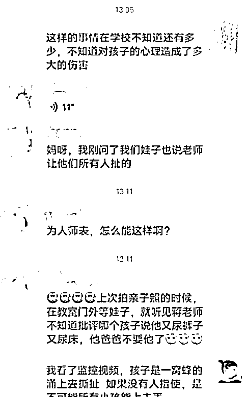
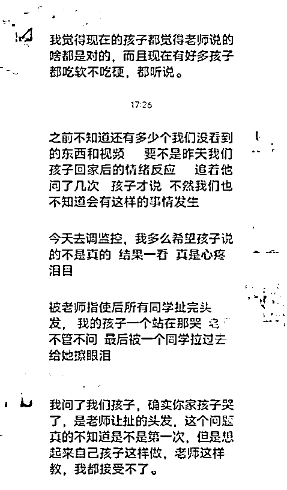
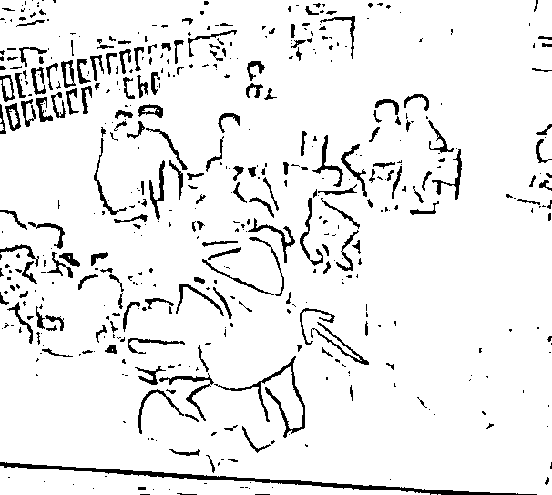

# 警方介入！幼师被指教唆全班围攻女孩

> 原文：[`mp.weixin.qq.com/s?__biz=MzIyMDYwMTk0Mw==&mid=2247532531&idx=5&sn=cadd06ddb4fbea7105b9ce8809a3a085&chksm=97cbb4cba0bc3ddd8feb904e3fff0baf1f0f18abd2d106982ccce185f2847a33c7b102696c9c&scene=27#wechat_redirect`](http://mp.weixin.qq.com/s?__biz=MzIyMDYwMTk0Mw==&mid=2247532531&idx=5&sn=cadd06ddb4fbea7105b9ce8809a3a085&chksm=97cbb4cba0bc3ddd8feb904e3fff0baf1f0f18abd2d106982ccce185f2847a33c7b102696c9c&scene=27#wechat_redirect)

3 月 26 日晚，

张女士发布女儿妮妮（化名）

在湖北十堰市茅箭区

某幼儿园教室的一段监控视频，

**指控该幼儿园教师教唆全班同学围攻妮妮，**

**拉扯她的头发，**

**并称事后有两名家长问了小朋友，**

**证实是受老师教唆去拉扯妮妮的。**

[`mp.weixin.qq.com/mp/readtemplate?t=pages/video_player_tmpl&action=mpvideo&auto=0&vid=wxv_2331134096707551235`](https://mp.weixin.qq.com/mp/readtemplate?t=pages/video_player_tmpl&action=mpvideo&auto=0&vid=wxv_2331134096707551235)

**监控显示老师用手指向孩子**

3 月 28 日，张女士告诉记者，3 天前，妮妮放学被爷爷接回家后一直哭闹，家人无法安抚，询问在幼儿园发生了什么时，妮妮告诉奶奶**“老师让班上所有同学揪我头发”。**

张女士觉得不可思议，于是联系班上其他同学家长了解情况。

**“当时就有两三个家长问自己小孩有没有撕扯我孩子的头发，小朋友就说有，并且都说是老师指使的。”**

张女士提供的聊天记录截图显示，班级群中一位家长称：

“我问了我们孩子，确实你家孩子哭了，**是老师让扯的头发，**这个问题真的不知道是不是第一次，但是想起来自己孩子这样做，老师这样教，我都接受不了。”

**幼儿园家长称孩子受指使**

3 月 26 日上午，张女士前往幼儿园调取监控，因受到园方阻拦后报警处理，在警方陪同下查看了当天的监控。

张女士提供的视频显示，**妮妮独自坐在教室后方玩耍，涉事教师抬手指向她。**

随后教室里的十余个孩子聚集围在妮妮身边，画面没有声音，也无法看清孩子们的具体动作。

张女士表示， **园方称教室的监控本来就是没有声音的。**

**监控画面显示教师指向妮妮**

张女士称，从视频里看到妮妮在上课时有些好动，总是在凳子上扭来扭去，老师便强行把她抱起来，让她背着手站到教室后方。

“她站了有十几分钟吧，老师就开始发活动卡片，别的小朋友都去排队，妮妮还是一个人站在后面没有去，之后就发生了视频里那一幕，她手指了妮妮，然后其他小朋友就围上去揪妮妮的头发。”

张女士担心这种行为会给妮妮造成心理伤害 。

**警方将进一步调查**

3 月 28 日，记者致电**涉事幼儿园园长，**问及老师是否有唆使学生拉扯妮妮的行为时，**对方挂断电话。**

记者拨打该幼儿园公示的招生电话，截至发稿，未能接通。

张女士告诉记者，此前**十堰市茅箭区教育局学前办工作人员**告诉她们，称会给出心理辅导方案，并协调讨论孩子后续入学的问题。

不过，上述区教育局工作人员向记者表示，**目前一切工作尚未落实，不便回应。**

张女士从警方处了解到，由于监控视频没有声音，且画面中无法看清小朋友的具体动作，警方询问数十个幼儿园小朋友，其中一部分称是老师指使，还有部分表示不知道。

因此他们认为，**仅有幼儿的证词，不足以判定涉事教师是否存在违法行为，将进一步深入调查。**

3 月 28 日，十堰市人民路派出所民警表示，“我们领导一直在关注这件事，已经在处理了。”

来源：央视网、封面新闻、极光新闻 东北网

← 向右滑动与灰产圈互动交流 →

