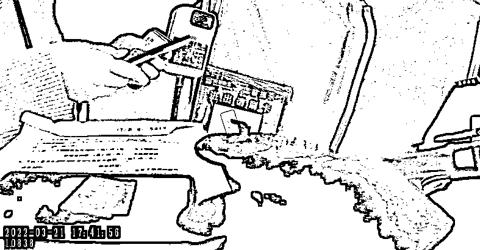
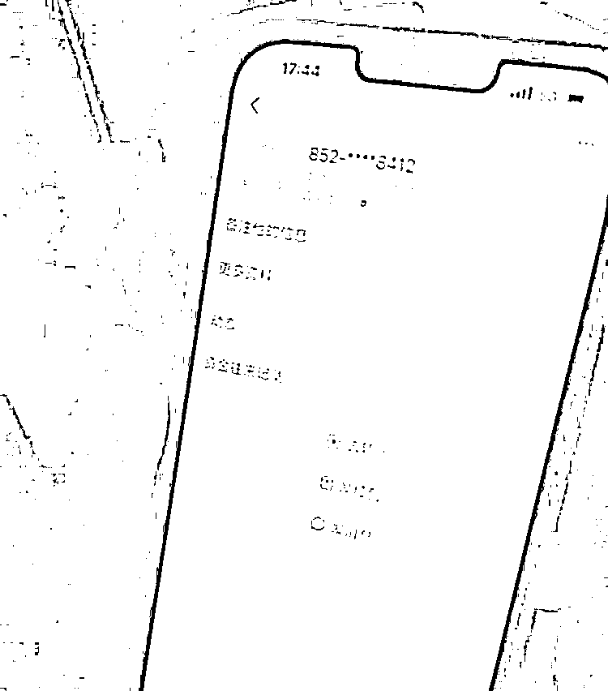
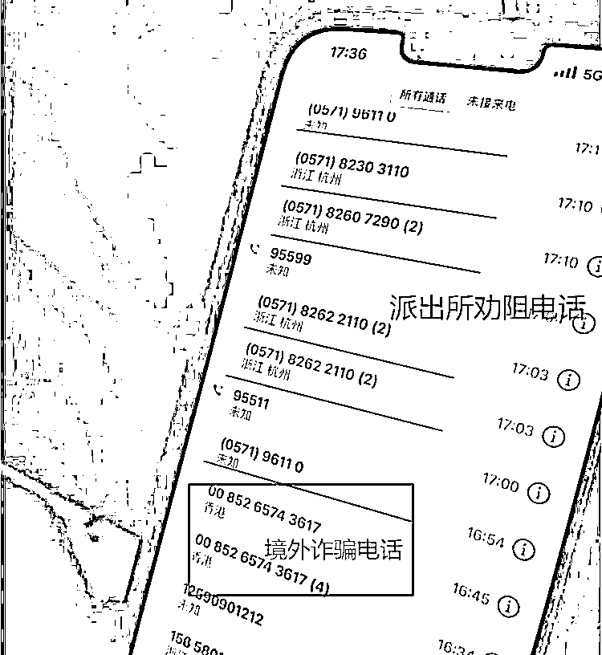
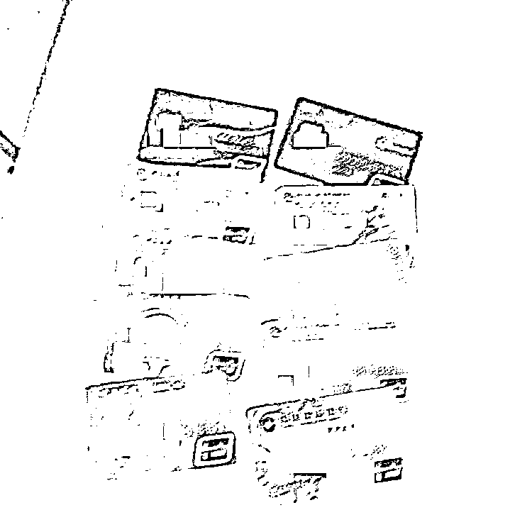
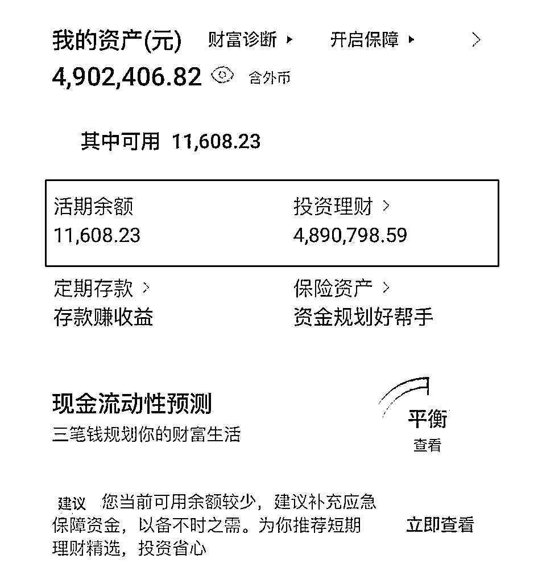

# 就差一步！杭州女子差点被骗 490 万

> 原文：[`mp.weixin.qq.com/s?__biz=MzIyMDYwMTk0Mw==&mid=2247532531&idx=6&sn=aad5f75dc3efa70fc97545342319fb38&chksm=97cbb4cba0bc3ddd18404084042448cf372f5a8d749bfd455d2d84c029f567dd4e7978b63fb4&scene=27#wechat_redirect`](http://mp.weixin.qq.com/s?__biz=MzIyMDYwMTk0Mw==&mid=2247532531&idx=6&sn=aad5f75dc3efa70fc97545342319fb38&chksm=97cbb4cba0bc3ddd18404084042448cf372f5a8d749bfd455d2d84c029f567dd4e7978b63fb4&scene=27#wechat_redirect)

3 月 21 日 17 时许，**萧山北干派出所**接到反诈平台紧急预警：辖区陈女士（43 岁，萧山人）很可能正遭遇大额电信网络诈骗。

派出所立即启动**紧急劝阻工作机制**，由副所长朱建兴牵头统筹，落实线下就近巡逻警力朱国灿等人**第一时间上门**，线上反诈小组成员方盈锋等人**及时联络当事人**，多线联动**以最快速度开展精准拦截劝阻。**

[`mp.weixin.qq.com/mp/readtemplate?t=pages/video_player_tmpl&action=mpvideo&auto=0&vid=wxv_2329395077703434241`](https://mp.weixin.qq.com/mp/readtemplate?t=pages/video_player_tmpl&action=mpvideo&auto=0&vid=wxv_2329395077703434241)

**就差一步**

**“陈女士，我们是北干派出所民警，刚才跟你联系的是骗子，请立即停止手头一切操作，等待我们民辅警上门协助。”**几次占线后，反诈队员终于打通陈女士电话，严重的说辞终于令对方有所醒悟，答应在民警到来前不再进一步操作。

**接到预警不到 8 分钟**，民辅警便快马加鞭赶到陈女士小区楼下约定地点。

****▍民辅警找到陈女士****

**“我本来不会相信的，但问卖家说快递确实丢了。”**

陈女士不久前接到**自称物流客服的境外来电**，称其快递丢失可退款理赔。由于陈女士此前有退赔电商产品的经历，**且近期确实有快递长时间未收到。**

****▍陈女士已经添加对方为支付宝好友****

**询问卖家，对方也称是快递物流环节的问题。**于是便相信了对方说辞，并按对方要求添加支付宝好友、扫描二维码、输入银行卡号……

**就差最后一步向对方发送银行卡验证码时，被北干派出所反诈警力及时劝阻。**

****▍陈女士手机内的通话记录 有境外诈骗电话和派出所劝阻电话****

经了解，陈女士名下与支付宝绑定的银行卡有**23 张**，账户资金总额高达**490 余万元。**

****▍陈女士的部分银行卡及账户内 490 多万的资产****

**其本人虽然之前接受过社区的反诈宣传，却并没有上心，也没有下载反诈 APP。**如今的遭遇令其后怕不已，在核实其资金暂未遭受损失后，安全起见，民辅警建议陈女士抓紧更改名下银行卡密码，引导其下载国家反诈中心 APP、注册金钟罩小程序，并对其进行了案例剖析式的反诈宣传教育。

**诈骗手段分析**

**近期因疫情原因**，多地快递停发、滞留。不法分子借此机会，**利用涉疫快递理赔实施诈骗案例频发**，请市民朋友一定要提高警惕！

**“快递检验为阳性，将被销毁！**

**“快递丢件”**

**“快递拒发、滞留”**

**……**

**将作出赔偿**

**很可能都是诈骗！！！** 

诈骗分子通过不法渠道获取受害人订单信息，**具有较强迷惑性，但诈骗套路手法万变不离其宗，**基本分以下几步：

1、冒充客服来电，核对订单信息获取信任。

2、谎称商品有质量问题，或是物流无法到达，主动进行退款或赔偿。

3、诱导受害人扫描二维码或点击网址填写身份证、银行卡等个人隐私信息。

4、要求受害人提供银行验证码。

5、转走受害人卡内余额，或是要求其转账才能获得理赔。

**警方提醒：**

**1、如果遇到自称网店客服的退款电话，要第一时间通过官网客服核实确认，****若对方要求进行转账汇款等操作，多为诈骗。**

**2、若需办理各种售后业务，要通过正规的电商平台，按规范操作，不要轻易相信不明来电的说辞，不要随意点击“客服”发来的链接，扫描不知名二维码、更不要泄露短信验证码。**

**3、如不幸被骗，应立即收集证据，并拨打全国统一反诈热线 96110 止损。**

来源：萧山公安 ，利箭在出击

← 向右滑动与灰产圈互动交流 →

