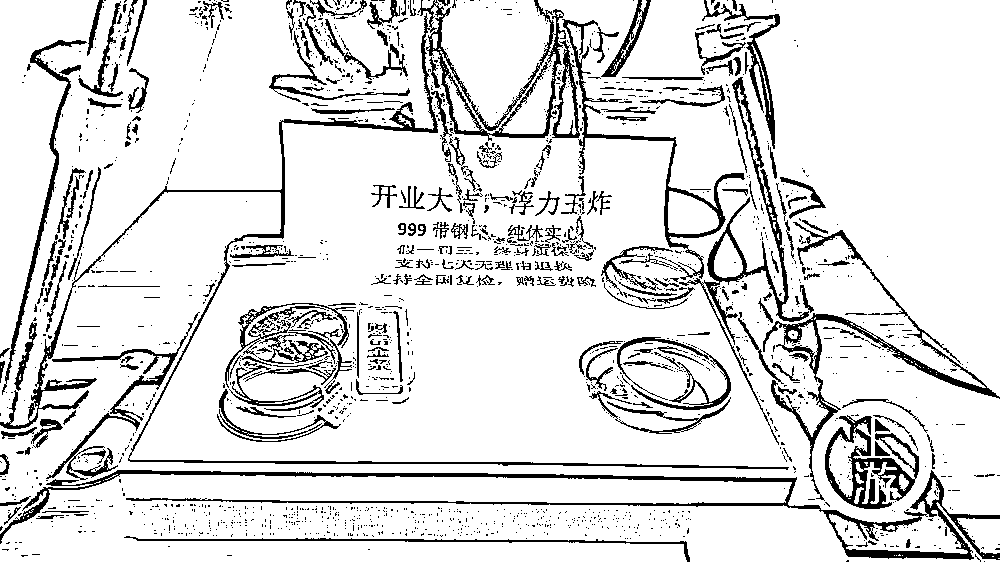
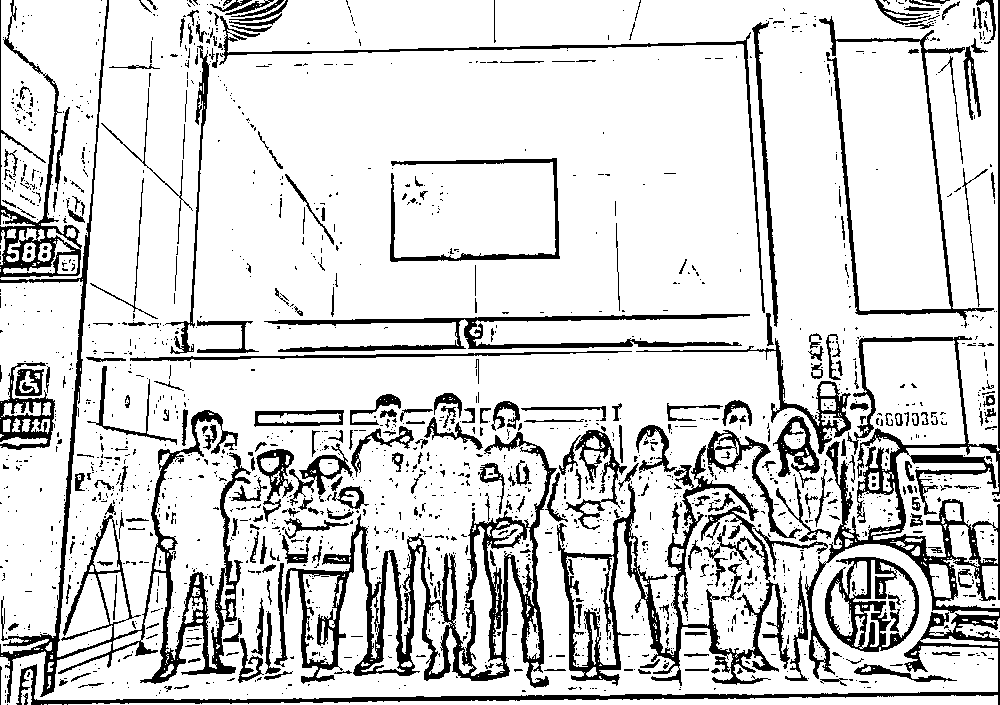

# 199 元买千足金首饰直播骗局，抖音报案后警方抓了 19 个嫌犯

> 原文：[`mp.weixin.qq.com/s?__biz=MzIyMDYwMTk0Mw==&mid=2247532531&idx=7&sn=d160c46c682570ca6e84cf15062e9465&chksm=97cbb4cba0bc3dddca47d459fa96668d09ffcea0414aed4b3b2dbe9626ddd2cf336758b66c8e&scene=27#wechat_redirect`](http://mp.weixin.qq.com/s?__biz=MzIyMDYwMTk0Mw==&mid=2247532531&idx=7&sn=d160c46c682570ca6e84cf15062e9465&chksm=97cbb4cba0bc3dddca47d459fa96668d09ffcea0414aed4b3b2dbe9626ddd2cf336758b66c8e&scene=27#wechat_redirect)

“48 克的线下金店要多少钱，今天在我直播间，只有 3 位数的价格，不过千。999 足金，实心的真金，在直播间都有机会。”在抖音平台,千足金黄金只要 199 元，还支持 7 天无理由退货的直播，吸引着大量网友下单。

[`mp.weixin.qq.com/mp/readtemplate?t=pages/video_player_tmpl&action=mpvideo&auto=0&vid=wxv_2329761976224366593`](https://mp.weixin.qq.com/mp/readtemplate?t=pages/video_player_tmpl&action=mpvideo&auto=0&vid=wxv_2329761976224366593)

低价买的黄金手镯真能禁得住“火炼”吗？

3 月 28 日，上游新闻（报料邮箱：cnshangyou@163.com）记者从江苏无锡市公安局了解到，近日，该局连续破获两起抖音直播间贩卖假黄金的诈骗案件，涉案价值共计 1000 多万元。这些所谓黄金手镯的进价，最低仅 8.5 元一个，材质多以铜为主。

诈骗团伙多采用话术和低价销售诱导消费者。/无锡警方

2021 年 11 月、12 月，抖音电商品质保护中心分别向无锡警方提供线索：有人在抖音平台注册多个店铺，利用抖音直播带货的方式，以假乱真，将材质为其他金属的戒指、项链、手链等饰品，在直播中谎称为 999 千足金，诱骗观众以低价捡漏的心态进行购买。

“我们观看了多场直播发现，实施诈骗的是两个犯罪团伙，犯罪分子警惕性很高，不定期更换网络直播间和抖音平台店铺。”办案民警介绍，2021 年 12 月至 2022 年 1 月，警方在吉林长春、广东汕头、肇庆等地将两个诈骗团伙的 19 名涉案人员抓获。

经审查，其中 2020 年 4 月以来，犯罪嫌疑人张某会同伍某等人在广东汕头、广州开设工作室，为了规避被封禁的风险，先后注册 31 家抖音平台店铺，并联系程某召集主播，以带货直播的方式以“199 元”、“299 元”等低价抢购为幌子，销售假黄金饰品。

上游新闻记者获取的抓捕视频显示，在张某、苏某两个诈骗团伙的直播工作室，储存着手镯、项链、戒指等假黄金饰品。警方现场查验发现，假黄金饰品质地坚硬，敲击声清脆，与黄金有很大区别。

多名诈骗团伙嫌疑人被捉拿归案。/无锡警方

直播间负责人供述，他们在直播中会使用开业首播、公司福利等话术诱导消费者，并以支持线下门店验货、7 天无理由退货包运费险等“福利”让消费者放心下单。而实际上，配发的鉴定证据均为造假证书。诈骗团伙与上下游供货商的聊天记录显示，鉴定证书有不同的模板，可以根据商户提供的图片出鉴定，每张证书 0.7 元。而“千足金”手镯多为黄铜制品，可以在饰品上刻出足金、999 等字样，进价从 8.5 元到二三十元不等。

嫌疑人苏某称，2020 年底，他和朋友共同出资在抖音直播间经营珠宝生意，因生意不佳，2021 年 3 月左右，更改直播内容由销售珠宝变为销售假黄金饰品，招聘专门主播人员，购买相关直播设备，在直播间将其他金属饰品冒充千足金向客户出售。该犯罪团伙在广东省四会市租赁办公地点作为直播间，内部分工明确，苏某负责运营以及假黄金的进货和发货，马某负责招聘员工、客服和管理主播人员，何某联系制作假鉴定证书。为了躲避警方和平台追查，苏某用亲戚、员工的身份注册营业执照，从而注册相关抖音店铺，被封店后就利用新执照再次开店，以此逃避打击。

“我们不说每克黄金的价格，只是说直播间的价格。配证书成本高，后来就不配证书了。我们还咨询过，说只要不是以真黄金的价格卖就不犯法。”苏某说。

“每个主播直播时面前都有一整套完整的‘话术’提示，再加上组织大量‘水军’营造火爆氛围，很多消费者就掉入了‘陷阱’。”办案民警介绍，目前已抓获违法犯罪嫌疑人 19 名，涉案价值共计 1000 余万元，成交订单超 6 万单。

警方提醒消费者，在直播间购物时要详细了解商品的质地、功能、质量标准等相关信息，如不慎被骗，请保存好购物信息等证据，及时向警方求助。

来源：上游新闻，利箭在出击

← 向右滑动与灰产圈互动交流 →

