# 男网红变性成功上热搜，怒怼恶评晒术后下身照自证女儿身

> 原文：[`mp.weixin.qq.com/s?__biz=MzIyMDYwMTk0Mw==&mid=2247532587&idx=1&sn=46861129d749cd9c70c2c8dfb5b616bd&chksm=97cb8b13a0bc020581c1c8b8bf86654acda9642fe72932d724e337789b096fbdce82e793a6e2&scene=27#wechat_redirect`](http://mp.weixin.qq.com/s?__biz=MzIyMDYwMTk0Mw==&mid=2247532587&idx=1&sn=46861129d749cd9c70c2c8dfb5b616bd&chksm=97cb8b13a0bc020581c1c8b8bf86654acda9642fe72932d724e337789b096fbdce82e793a6e2&scene=27#wechat_redirect)

3 月 23 日凌晨，抖音网红李由在微博公开承认他变性，并详细地讲述了当时内心的感受。

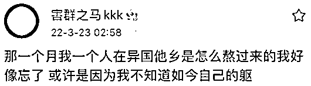

作为抖音百万粉丝博主，李由是以男生的身份为大家所认识。

所以此事一发出，迅速引爆网络，一度登上微博热搜。

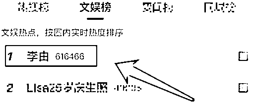

李由透露当时自己是去国外动的手术，那段日子也成为了他人生中最难熬的时间，以至于他想选择性地忘掉躺在手术台上的生活。

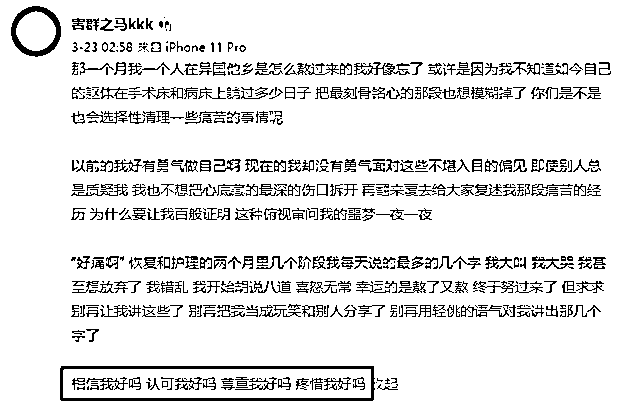

李由说，以前的他充满了勇气，可是在别人不断地质疑和指责下，

自己开始变得懦弱，

不敢再去面对不堪入目的偏见，也不想再把隐藏在心底的伤口揭开。

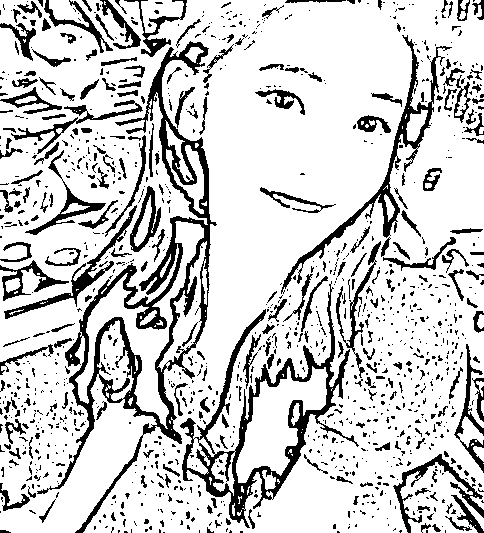

在最后李由希望大家能够认可他，并且疼惜他，不要再用恶语去伤害他。

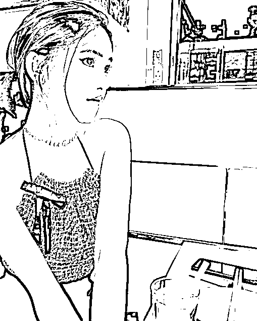

此前，李由变性一事一直不被网友们所相信，大家都认为他是为了蹭热度、赚流量，才会给自己贴上“变性人”的标签。

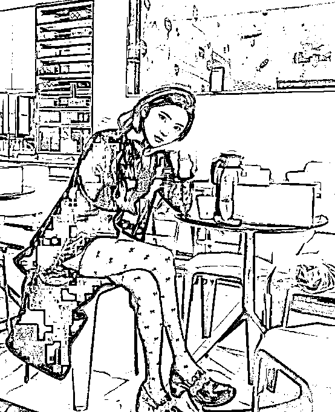

但是微博发出后，仍有不少网友认为李由是在撒谎，并让他在下次撒谎前要先做做功课。

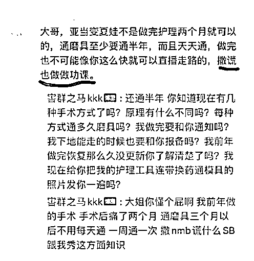

甚至还有不少谩骂调侃的评论。

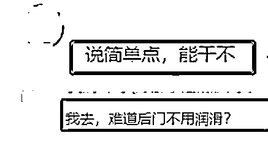

面对再次恶评质疑，李由迫不得已晒出了自己的术后私密照，以及换药时用到的一些工具和医院发的屁垫。

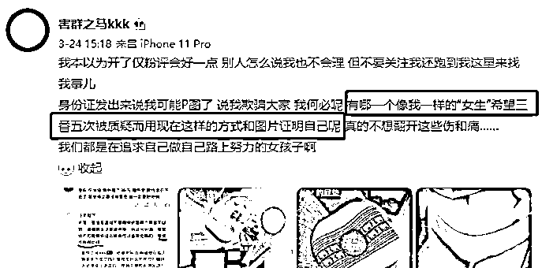

“每个人都是努力的女孩子，不希望他人经常没事找事，让自己生活在质疑之中。”

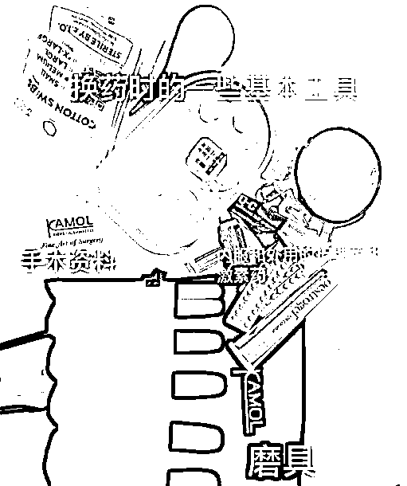

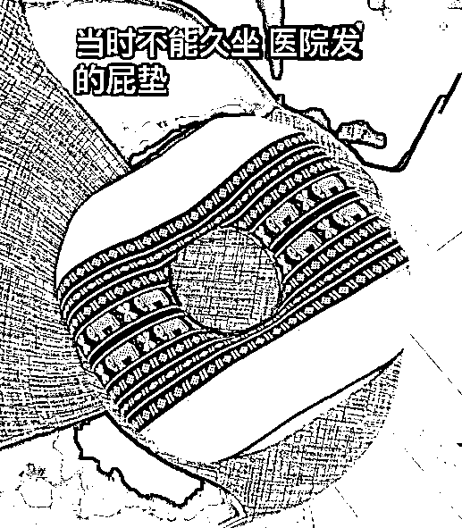

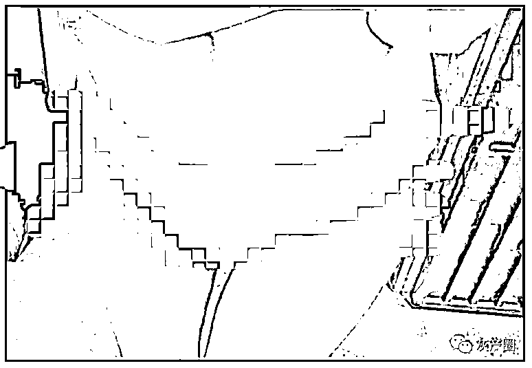

看到这里，我想你跟我一样，都觉得太离谱了。

如今这社会，已经堕落到人需要靠脱裤子来证明自己的性别了？ 

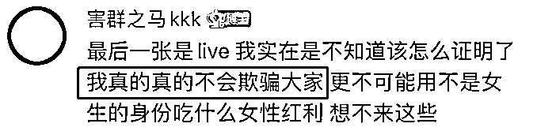

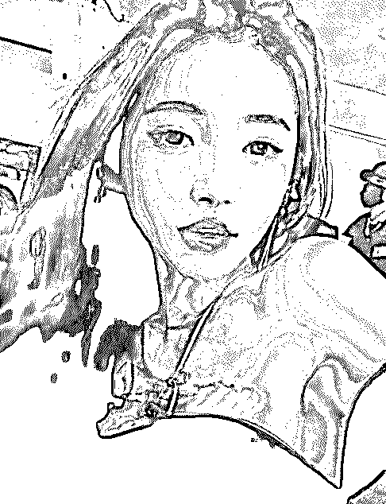

李由的这一番行为算得上是十分勇敢了，毕竟没有人愿意把伤疤一次次地当众揭开。

其实，选择变性的人并不在少数，如：网红圈中的艾比、娱乐圈中的金星。

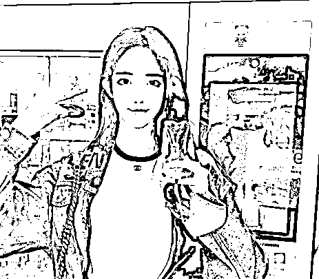

**△艾比** 

虽然外界对他们的行为都不能够理解，但每个人都有选择自己生活方式和性别的权利，大家都是在人生的道路中做了最真实的自己。

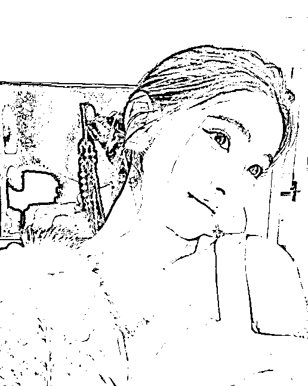

变性这件事并没有对错，错误的或许是大家用了世俗的眼光去看待他人。

爱美之心人皆有之，一起在网上好好欣赏美女不好么，干嘛要恶意谩骂呢？

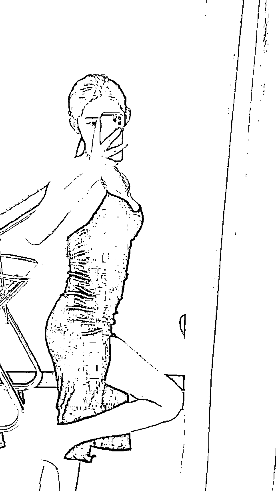

最后，对于超出自己认知的事物，

希望大家都能够有一颗包容的心，

不求做到理解，但也希望不要在别人的伤口上再撒盐吧....

来源： 我不是一条鱼

← 向右滑动与灰产圈互动交流 →

