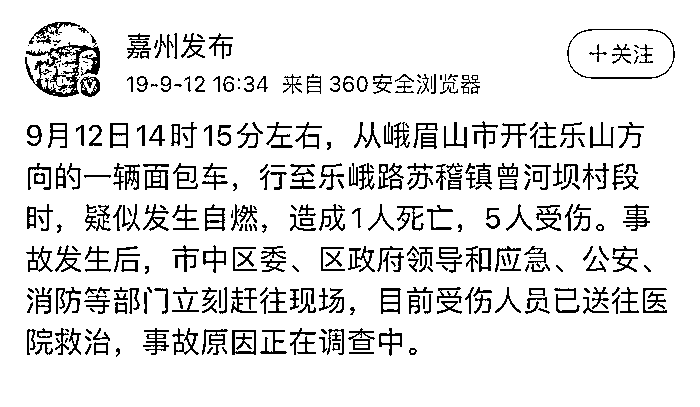
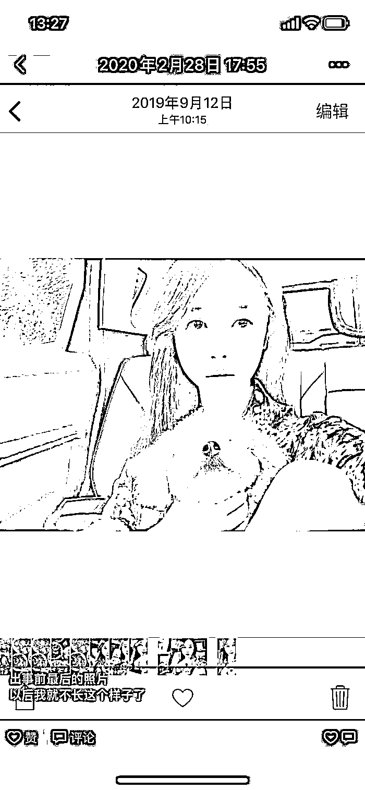
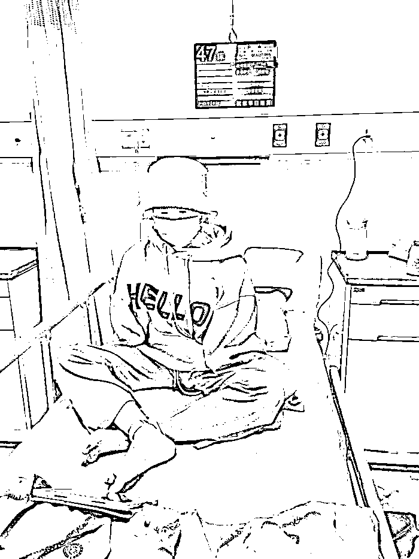

# 21 岁漂亮妹子遭遇车祸，毁容截肢保命，928 天地狱疗程获重生

> 原文：[`mp.weixin.qq.com/s?__biz=MzIyMDYwMTk0Mw==&mid=2247532587&idx=2&sn=8faa8c700042228848771ed39a31254a&chksm=97cb8b13a0bc020525d270b167ce81da55c3c616f77e77ef9ffdaeb02601a739c01fb39e6852&scene=27#wechat_redirect`](http://mp.weixin.qq.com/s?__biz=MzIyMDYwMTk0Mw==&mid=2247532587&idx=2&sn=8faa8c700042228848771ed39a31254a&chksm=97cb8b13a0bc020525d270b167ce81da55c3c616f77e77ef9ffdaeb02601a739c01fb39e6852&scene=27#wechat_redirect)

四川峨眉山市 2019 年 9 月 12 日发生一起车辆自燃事故，时年 21 岁的女孩乔燕在鬼门关口死命挣扎。

在经历 12 次手术后，虽然大部分身体机能已经恢复，全身却如“溶化般”面目全非，甚至也永远地失去了双手。

3 月的最后一个周末，乔燕语气平淡地讲述了 3 年前的噩梦，却又能在历经劫难后，仍然满怀感恩地憧憬着未来，“我走出来了。”

[`mp.weixin.qq.com/mp/readtemplate?t=pages/video_player_tmpl&action=mpvideo&auto=0&vid=wxv_2331496221271801857`](https://mp.weixin.qq.com/mp/readtemplate?t=pages/video_player_tmpl&action=mpvideo&auto=0&vid=wxv_2331496221271801857)

据《新黄河》报导，乔燕是个美丽可爱的四川女孩，成长于峨眉山市的她，有着南方姑娘天然优雅的气质。她爱唱歌、爱舞蹈，幼儿园教师证、舞蹈教师证、书法六级、计算机五级……

那时的她只有 21 岁，家里就已经堆满了大大小小的证书。在旁人眼中，她不仅大方漂亮，还优秀上进。直到那次意外，简单幸福的生活被一拳击碎。

2019 年 9 月 12 日，四川省乐山市市中区政府新闻办官方微博“嘉州发布”曾发布一条消息，当天 14 时 15 分左右，从峨眉山市开往乐山方向的一辆车，行至乐峨路苏稽镇曾河坝村段时，疑似发生自燃，造成 1 人死亡，5 人受伤。

据当地媒体报导，事故惨烈，场面惊悚。“我爸爸开车，我坐在副驾，” 乔燕回忆，他们是在去送外公到殡仪馆的路上发生的意外，没来得及有任何反应，一瞬间浓烟就弥漫了整个车子。有目击者曾这样形容，“不到几十秒的时间，大火就将面包车吞没。” 周围的人还没反应过来，火光就冲上了天。

在车里的乔燕，下意识用双手抱住了头，第一反应是努力拉开车门。可是车门似乎被“焊住了”，怎么打也打不开，伴随着浓烟和烈火，乔燕昏了过去。

乔燕第一次苏醒时，还伴随着烈火和浓烟，她正被人从燃烧的车中救出，“我爸爸被烧得很严重，但他跳出车后第一时间过来救我，但是门也打不开。

这个时候有一位当地的哥哥，不顾一切拿着灭火器冲我们过来，然后和我哥一块把我拉了出来。”  “死神” 与乔燕似乎只隔着几分钟的距离。据一段监控画面显示，就在乔燕被拉出副驾驶室的几分钟后，正在燃烧的车突然失控自动前进。

最后经诊断，乔燕全身 48%面积被烧伤，烧伤程度是伤及皮肤全层的“三度烧伤”。在 ICU 的 27 天里，她记不清自己被下达了多少次病危通知书，“治好也可能是植物人，眼睛可能看不见、耳朵可能听不见，可能只能靠流食活着。” 面对所有坏的“可能”，家人决定，无论变成什么样，都要救她。

结果是好的，2019 年 10 月 8 日，病情好转的乔燕被转入普通病房。然而，反覆地换药、植皮、化脓、感染，常人无法想象，一个 20 多岁的女孩如何扛得住这般“折磨”，撕心裂肺的疼痛感如匕首刺入肌肤、侵入骨髓，乔燕趴在床上时，甚至能够清晰地看见脸上和眼睛的脓水不停地往下滴。

直到有一天，乔燕意外得知，自己的双手保不住了，现在谈起那个瞬间，乔燕仍会哽咽。“没什么大不了的，我们养你一辈子，” 哥哥、嫂子得知噩耗后这么说，乔燕看到他们哭了。算上截肢手术，自被烧伤后到现在，乔燕一共经历了 12 次手术。

2020 年 1 月 17 日，乔燕出院回家。她的闺蜜表示，乔燕远比任何人想像的都要强大，她像往常一样，和朋友一起看电影，一起聚餐，在被路人叫“婆婆”时，她还会假装生气，说自己只有 20 多岁，也会跟别人谈起自己曾被烧伤的事。

然而，烧伤是一个漫长到最后还满身疤痕的病。乔燕爸爸为了把钱节约下来给女儿治病，选择了提前出院。为了尽可能地节约开支，夫妻俩学着做基础护理，在家中帮助女儿恢复。虽然有伤在身，乔燕爸爸仍然隔几天就会把女儿抬下楼，推着她逛超市、呼吸新鲜空气，乔燕妈妈则负责照顾女儿的起居和卫生。

意外发生后，许多好心人或是捐款，或是救助，给这个家庭以力所能及的安慰，这些都被乔燕一家记在了心里。

乔燕爸爸曾说，只要女儿有这条命在就够了。乔燕妈妈则说，希望女儿好好活下去，在未来能回报帮助过她的人。

[`mp.weixin.qq.com/mp/readtemplate?t=pages/video_player_tmpl&action=mpvideo&auto=0&vid=wxv_2331501874757386241`](https://mp.weixin.qq.com/mp/readtemplate?t=pages/video_player_tmpl&action=mpvideo&auto=0&vid=wxv_2331501874757386241)

来源：围脖那些事儿

← 向右滑动与灰产圈互动交流 →

