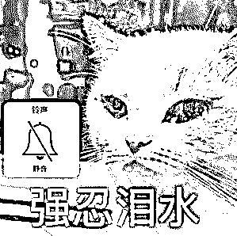
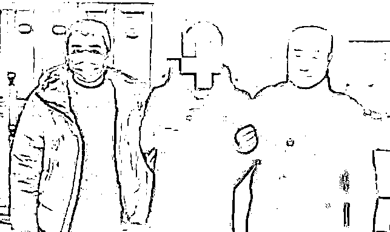
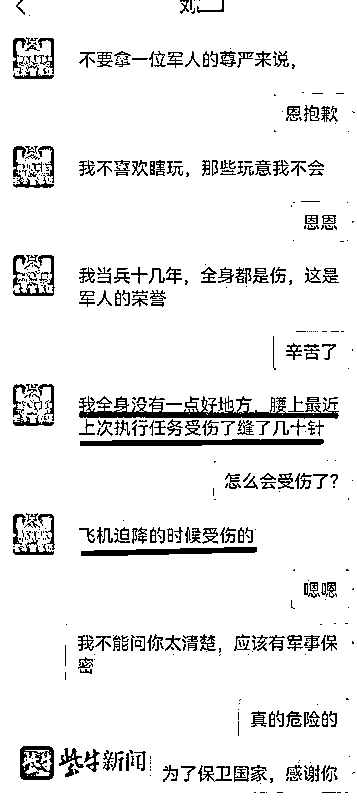

# 一年多时间和 8 个女子“谈恋爱”，32 岁男子冒充军人骗财又骗色

> 原文：[`mp.weixin.qq.com/s?__biz=MzIyMDYwMTk0Mw==&mid=2247532587&idx=3&sn=a1ed9f52896984c708c0cd067d598efd&chksm=97cb8b13a0bc0205fd99e9a8efb870a1047b709d7602dd235b69768c97fa1227d06d79fc9a08&scene=27#wechat_redirect`](http://mp.weixin.qq.com/s?__biz=MzIyMDYwMTk0Mw==&mid=2247532587&idx=3&sn=a1ed9f52896984c708c0cd067d598efd&chksm=97cb8b13a0bc0205fd99e9a8efb870a1047b709d7602dd235b69768c97fa1227d06d79fc9a08&scene=27#wechat_redirect)

“单身军官”倾慕你

“你侬我侬”时

你心甘情愿为他转账？

 一张张身穿军装的照片背后

隐藏着一句句拙劣的谎言

近日

江苏省扬州景区公安分局

破获一起冒充军人招摇撞骗案

犯罪嫌疑人刘某

**以“军人”身份流窜多地**

**先后与 8 名女子“谈恋爱”**

**骗了钱财又骗色**

**案件回顾**

**民警蹲守 10 余小时** 

**浴城包厢内“等来”犯罪嫌疑人**

今年年初，张女士向扬州景区分局城北派出所报警，称在网上认识的男友将其汽车开走后失联。民警了解情况后，男子刘某进入警方视线。

据了解，张女士与刘某在婚恋平台上相识，刘某自称毕业于中国人民解放军国防科技大学，正在部队服役，离异，在扬州有房产，转业后将安置在某机场工作。取得张女士信任后，刘某和她确定恋爱关系，对其骗财骗色。

根据张女士提供的信息，民警对刘某身份进行研判。**经初查，刘某今年 32 岁，无业，无服役经历**。令人意想不到的是，该男子在多地涉及多个类似警情，且有诈骗前科。侦查过程中，民警赶赴多地联系其他受害人核实情况，固定刘某的犯罪证据。同时，对刘某的行动轨迹进行研判，发现其行踪飘忽不定，频繁往来于南通、常州、宝应之间，但最近的一条浴室留宿记录，让其难逃法网。经过 10 余小时埋伏蹲守，警方在浴城包厢内将犯罪嫌疑人刘某抓获。

**冒充军人骗了 8 个受害女子**

**2020 年 10 月**

刘某通过相亲平台结识王女士，谎称其系南京空军部队转业军人，离异，现为民航飞行员。在与王女士同居期间，刘某以帮助王某的哥哥找工作、帮助王某的小孩在南京军区上学为由，骗取人民币 12545 元。

**2021 年 6 月**

刘某通过相亲平台结识张女士，谎称其在扬州有房产，现在部队服役，愿与其结婚。在骗取被害人张女士的信任后与其发生关系，乘隙盗走被害人存于手机微信的人民币 1200 元，并将其汽车偷开出去玩乐。

**2021 年 7 月**

刘某通过相亲平台结识姜女士，谎称其为南京军区退役军官，在得到姜女士信任后，刘某以“部队规定个人银行账号禁止绑定支付宝和微信”为由，骗取姜女士人民币 1491 元。

**2021 年 9 月**

刘某通过相亲平台结识夏女士，谎称其在南京军区担任空军飞行员中校，并以带夏女士去见亲友为由将其带至宝应县开房。后夏女士发觉刘某并无带其去见亲友的迹象，怀疑被骗后与其分手。

**2021 年 11 月**

刘某通过相亲平台结识叶女士，谎称其为南京军区东部战区驾驶“歼 20”的空军上校。两人确定恋爱关系后，叶女士在相亲平台上看到了姜女士的留言“刘某是骗子，欠我钱”后，不再与刘某联系。

**2021 年 11 月**

刘某通过相亲平台结识黄女士，谎称其在东部战区担任空军飞行员。以恋爱结婚为名骗取被害人黄女士信任后，刘某将黄女士带至宝应县开房。黄女士在与其同居三日后向其提出查看相关证件，但刘某无法提供，后双方分手。

**2021 年 12 月**

刘某通过相亲平台结识杨女士，谎称其是南京空军部队飞行员，并表示要与杨女士结婚。后以带杨女士去 4S 店看车购车作为订婚礼物为名，骗取杨女士的信任并与其发生性关系。

**2022 年 1 月**

刘某通过相亲平台结识何女士，谎称其为东部战区空十师军官，以恋爱结婚为名骗取被害人何女士信任后，告知在部队处对象需“恋爱报告”，要审查女方犯罪记录信息、有无信用卡还款问题，提出找人帮助何女士解决信用卡逾期问题，并以找战友为由，骗取被害人人民币 5200 元。

审讯过程中，刘某对犯罪事实供认不讳。2020 年 10 月至 2022 年 1 月期间，刘某在多个相亲平台虚假填报身份信息，**利用未婚女士对军人职业的信任与崇拜心理，以恋爱为名与多名受害人发生性关系，编造事由骗取财物合计 20436 元。**目前，犯罪嫌疑人刘某已被扬州市邗江区检察院批捕。

**警方提醒**

网络交友需谨慎，切莫轻信网友的花言巧语，尤其在谈及钱财、个人信息等敏感事项时要提高警惕，谨慎作出决定，请警觉“甜蜜陷阱”，莫将不法分子当成“白马王子”！

来源：江苏网警，拒绝跨境赌博

← 向右滑动与灰产圈互动交流 →

