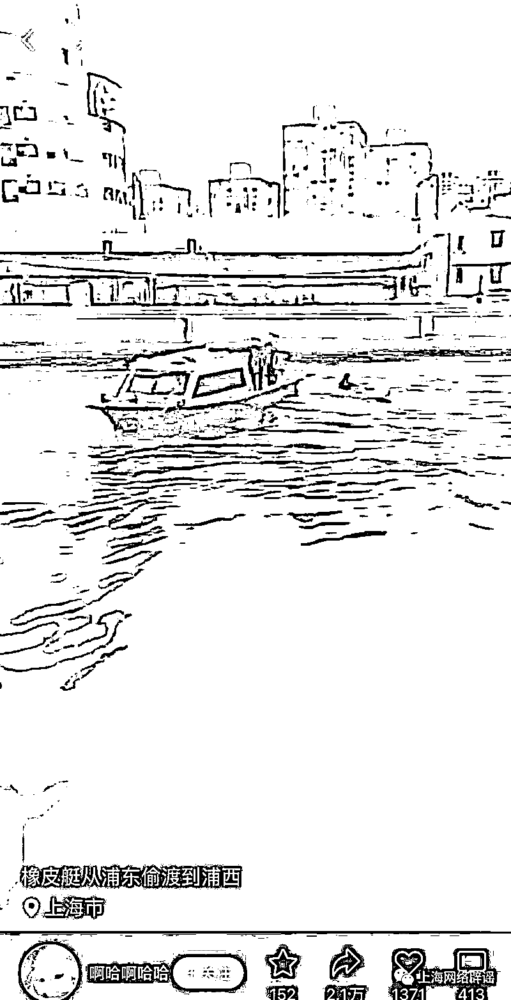
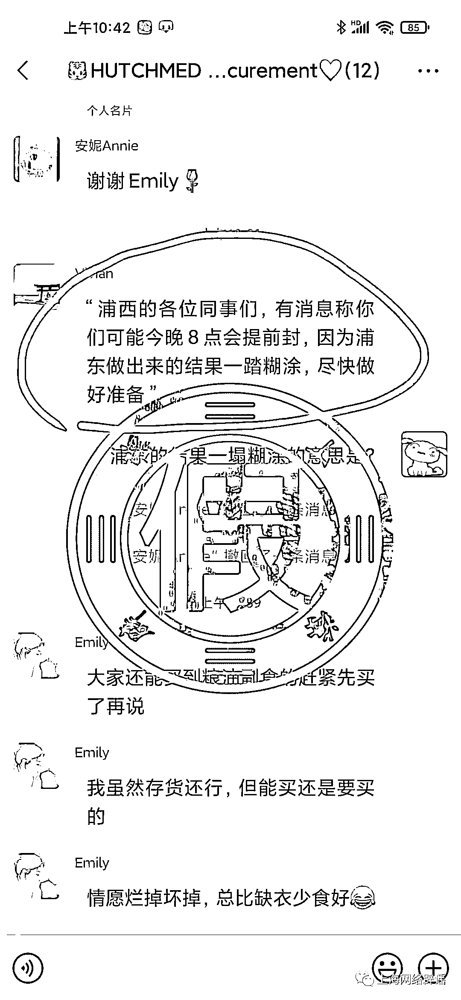
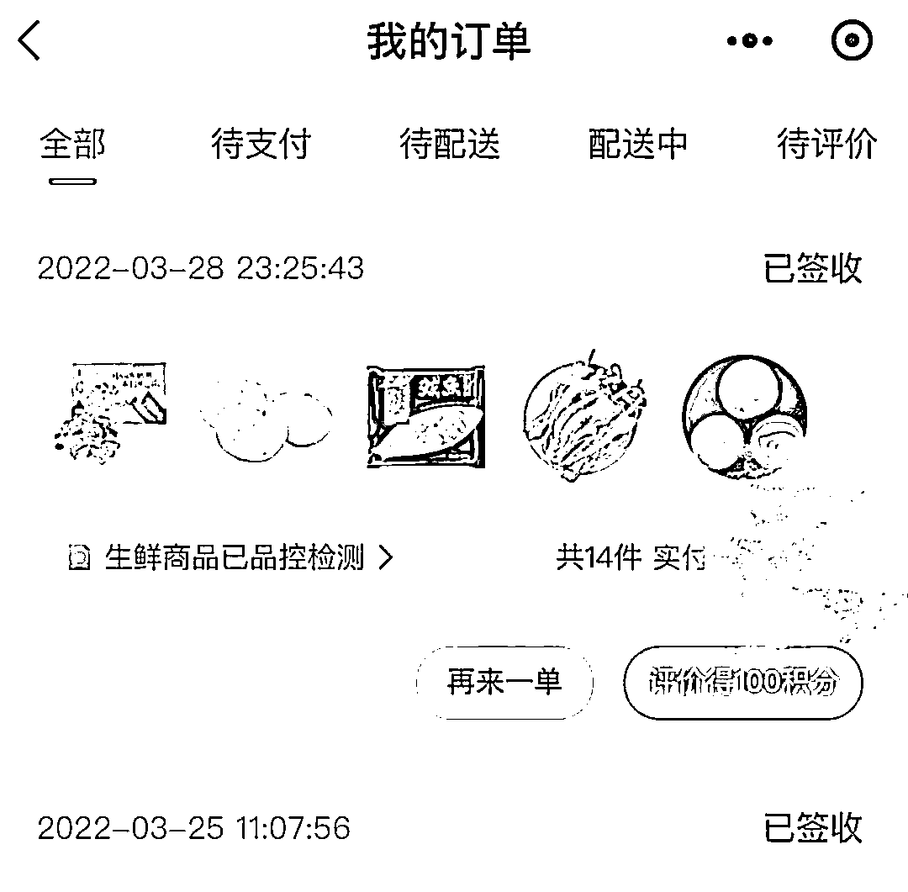

# 上海连续辟谣！

> 原文：[`mp.weixin.qq.com/s?__biz=MzIyMDYwMTk0Mw==&mid=2247532587&idx=6&sn=10ee2564edfa13c8ddafd59801a3c5f8&chksm=97cb8b13a0bc0205e0889f741a1171185cf844b90828b3b13a03c7e0fe176cef0a1eadb5c31f&scene=27#wechat_redirect`](http://mp.weixin.qq.com/s?__biz=MzIyMDYwMTk0Mw==&mid=2247532587&idx=6&sn=10ee2564edfa13c8ddafd59801a3c5f8&chksm=97cb8b13a0bc0205e0889f741a1171185cf844b90828b3b13a03c7e0fe176cef0a1eadb5c31f&scene=27#wechat_redirect)

近日，多条网络谣言在网络传播，上海连发辟谣。 

# **男子坐皮划艇从浦东偷渡到浦西被抓？**

# **真相来了**

3 月 28 日是上海开启新一轮核酸筛查的首日，当晚开始，一男子划皮划艇被公安民警拦截的视频在社交平台广泛流传。

根据这段视频的画面内容，网友传出多种说法，有的称“男子从苏州偷渡到上海”，有的称“男子乘坐橡皮艇，从浦东偷渡到浦西”……

据上海边防和港航公安，3 月 28 日，上海一名 37 岁男子（核酸检测为阴性）因疫情在家无聊，携带便携式充气皮划艇从新湖明珠城附近苏州河水域下水划行，在半岛花园附近水域被边防港航分局巡逻民警拦截。民警对男子进行批评教育后已将其安全送回家中。

# **上海浦东有人跪地聚集？**

# **蓄意造谣!**

3 月 29 日，网上传出一段视频。拍摄者用沪语加普通话表示，自己的手机被屏蔽了，只能用丈夫的手机进行录屏，录屏的内容是“很多人跪着，在崂山四村、五村”。很多网友对这段视频表示关注，向上海辟谣平台留言询问，究竟发生了什么。

上海辟谣平台向权威部门求证获悉，经市公安局网安部门初步核查，确定该视频为通过人为凭空杜撰、移花接木和拼凑手法而成的虚假信息，并已锁定发布人及其居所，将由公安机关对发布人制作、传播该虚假视频信息的行为依法予以处理。初步调查还显示，该视频发生在外省市。

# **上海电视台将播放重要通告？**

# **官方：没有**

从 3 月 29 日下午起，一条“今晚上海发布有重要通告发布，请各媒体（含新媒体）及时转刊播。电视台做好通告板准备。”的消息在圈群传播，不少市民纷纷猜测，究竟有什么重要通告。

上海辟谣平台核查时发现，这是谣言。消息中所称的“新闻综合频道”也公开辟谣表示，没有重要公告要发布。

# **上海有人撒钱后跳楼？**

# **跳楼视频是“张冠李戴”**

3 月 27 日，多段上海浦东某小区业主从楼顶抛撒现金的视频在网上广泛传播，引发网友关注和讨论。视频画面里，不少现金从空中纷扬落下，镜头外有人直呼“小区开始飞钞票了”“怎么有那么多钱”，等等。

这段视频在社交平台扩散后，又有人发布了一段标题为“浦东又有人跳楼了，先撒钱然后跳下来”的“后续视频”，称这名撒钱的当事人后来跳楼了。

记者多方求证获悉：撒钱是真，跳楼是假。

据了解，网传撒钱视频发生于浦东新区当代清水园小区。3 月 27 日，该小区发生了一名业主从楼顶往下撒钱的事情，但撒钱金额远没有网上传言得那么多。事发后，小区居委和物业工作人员及时将撒落的钱全部收回，现已交还家属。记者进一步了解得知，当事人有精神疾病就医史，并非如网传所称为疫情带来的压力所致。

至于网传当事人跳楼的视频，记者从浦东公安部门了解到，网传“后续视频”与 3 月 27 日发生在浦东的撒钱事件无关，并不属实。实际仔细观看几段视频也能明显分辨出：跳楼视频中的居民楼外立面和当代清水园小区明显不一样。上海辟谣平台进一步查证得知，这段视频实际事发地为河北沧州，系有人蓄意“张冠李戴”，嫁接在了一起。

# **上海浦西地区临时提前封控？**

# **不实！**

3 月 29 日下午，网络传出聊天记录称，浦西地区将提前至 3 月 29 日晚八点进行封控。

上海辟谣平台从上海市新冠肺炎疫情防控工作领导小组办公室获悉，此消息为谣言。

此外，还有传言说，上海明天将开始最新的封控措施。包括，要求垃圾暂不分类，居民统一放在楼道大门边的绿化带中，由物业统一清理收走；所有车辆除有通行证的除外，一律不得驶上马路，违者将被公安扣车；所有药店、商店全部关门（大型超市全部关闭，由政府征用，统一调配等。上海辟谣平台从权威部门获悉，此消息也不实。

**浦东地区外卖配送全停？**

**网友发来订单：我们买到了**

近日，一则落款为 3 月 28 日的“置休通知”引起广泛关注。通知称，“明日浦东全区外卖全部停业封控，骑手也会进行管控”，并提醒商户老板暂时不需要营业和备货，等 4 月 1 日解封后再准备营业。

经上海辟谣平台求证后发现，这则通知并不属实。3 月 28 日，多位居住在浦东的市民向上海辟谣平台晒出订单，表示仍旧能够通过外卖、生鲜电商等采购商品。同时，叮咚买菜、盒马、每日优鲜、美团、饿了么等线上平台均表示，并不了解以上通知，也没有向相关商户发出过类似通知，相关配送服务均在政府部门的指导下，有序进行。

网友也发来买菜成功的截图：

**造谣传谣需承担哪些法律责任？**

29 日晚，上海发布刊文介绍疫情防控期间常见法律问题指引，其中提到造谣传谣的法律责任。

1、造谣传谣扰乱公共秩序的，应承担行政责任。根据《治安管理处罚法》的规定，散布谣言，谎报疫情的，处五日以上十日以下拘留，可以并处五百元以下罚款；情节较轻的，处五日以下拘留或者五百元以下罚款。

2、造谣传谣情节严重，构成犯罪的，依法追究刑事责任。根据最高人民法院、最高人民检察院、公安部、司法部印发的《关于依法惩治妨害新型冠状病毒感染肺炎疫情防控违法犯罪的意见》（法发〔2020〕7 号），造谣传谣情节严重的，可能构成以下犯罪：（1）编造、故意传播虚假信息罪。编造虚假的疫情信息，在信息网络或者其他媒体上传播，或者明知是虚假疫情信息，故意在信息网络或者其他媒体上传播，严重扰乱社会秩序的，以编造、故意传播虚假信息罪定罪处罚，处三年以下有期徒刑、拘役或者管制；造成严重后果的，处三年以上七年以下有期徒刑。（2）寻衅滋事罪。编造虚假信息，或者明知是编造的虚假信息，在信息网络上散布，或者组织、指使人员在信息网络上散布，起哄闹事，造成公共秩序严重混乱的，以寻衅滋事罪定罪处罚，处五年以下有期徒刑、拘役或者管制；纠集他人多次实施该类行为，严重破坏社会秩序的，处五年以上十年以下有期徒刑，可以并处罚金。

3、造谣传谣侵犯他人合法权益的，应承担相应的民事责任。《民法典》明确民事主体的人格权受法律保护。编造、散播谣言或者对他人进行侮辱、诽谤，侵害他人名誉权、荣誉权、隐私权等人格权的行为，均需依法承担相应的民事责任。

来源：中国青年报综合上海发布、上海网络辟谣、上观新闻、新闻晨报等

← 向右滑动与灰产圈互动交流 →

