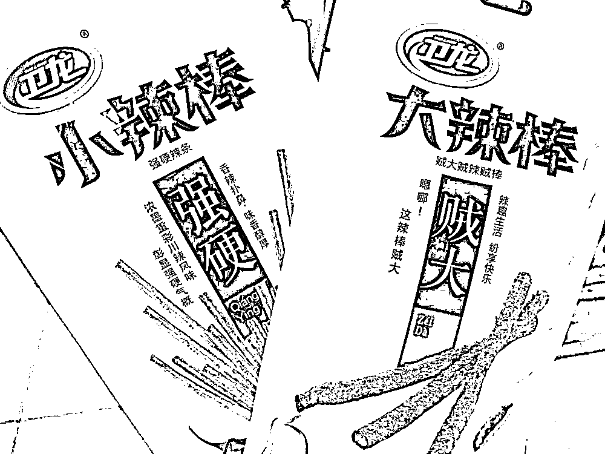
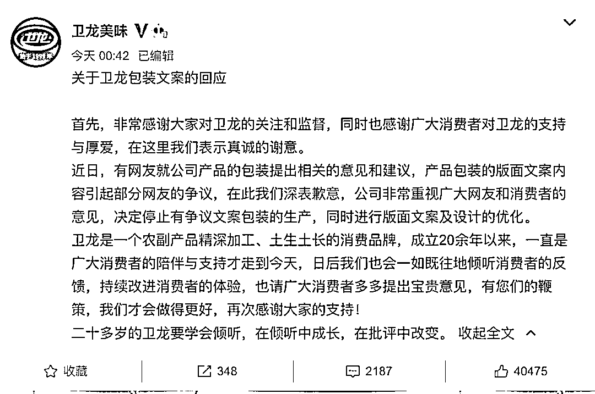
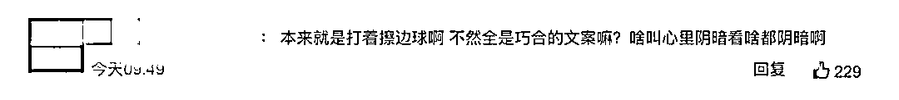
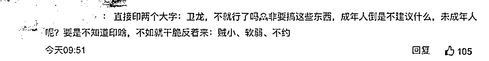
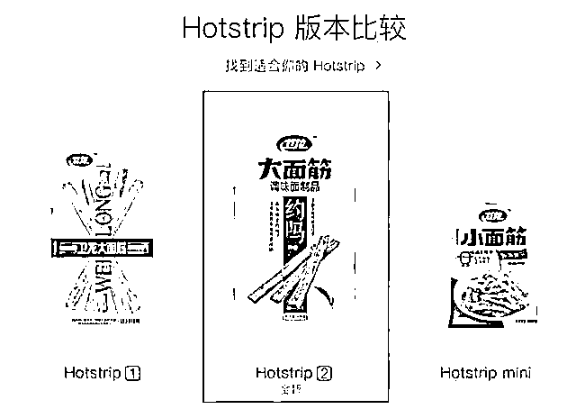
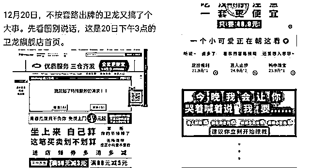
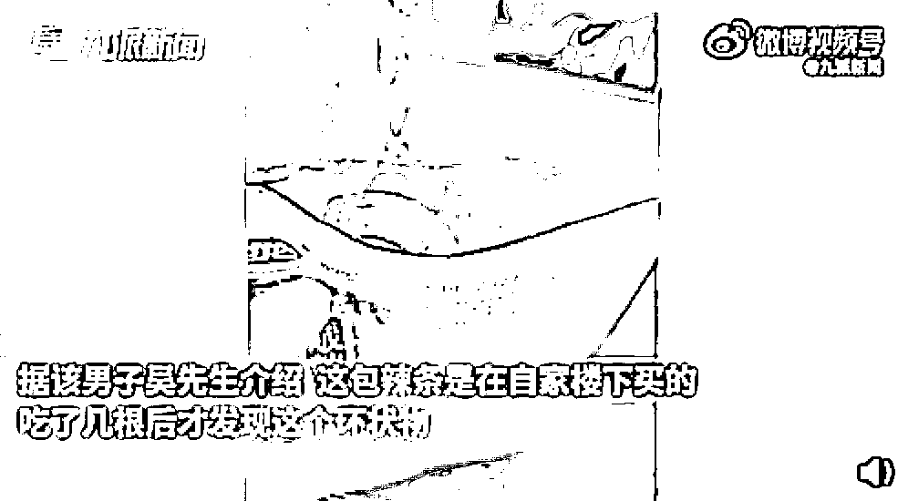
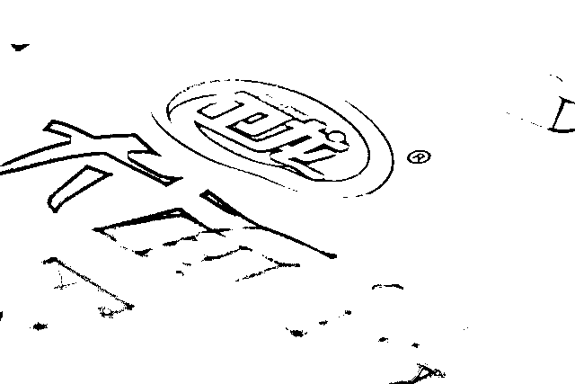
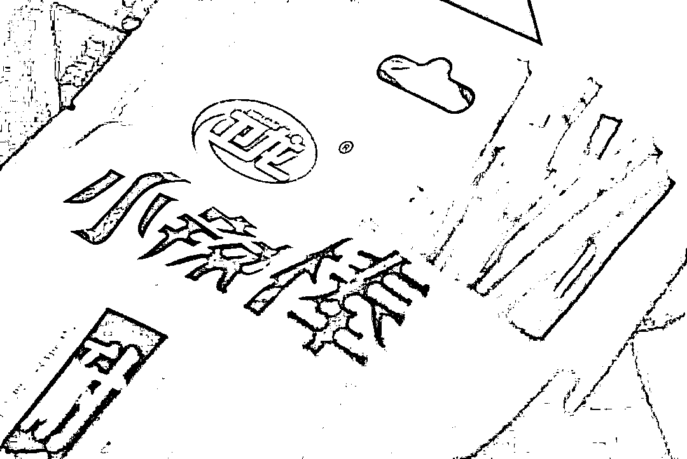

# 热搜第一，卫龙致歉！

> 原文：[`mp.weixin.qq.com/s?__biz=MzIyMDYwMTk0Mw==&mid=2247532587&idx=7&sn=1dcf8794d07e157a3d7d13efbdba5750&chksm=97cb8b13a0bc02050e48accc2888487624f328a91491fb7df0a5218bd811af2c3b1dec39a23d&scene=27#wechat_redirect`](http://mp.weixin.qq.com/s?__biz=MzIyMDYwMTk0Mw==&mid=2247532587&idx=7&sn=1dcf8794d07e157a3d7d13efbdba5750&chksm=97cb8b13a0bc02050e48accc2888487624f328a91491fb7df0a5218bd811af2c3b1dec39a23d&scene=27#wechat_redirect)

**辣条，辣眼睛（****[卫龙回应“包装打色情擦边球”！](http://mp.weixin.qq.com/s?__biz=MzIyMDYwMTk0Mw==&mid=2247532356&idx=4&sn=b21cc42837b3097ab5c857f8f3f0f4bc&chksm=97cbb47ca0bc3d6ac5e2a23d203d6a9b78144014fefb6b7969cf4f224cba47d482568424bdba&scene=21#wechat_redirect)）。**

**卫龙又上热搜了！**

**3 月 25 日，有网友反映，卫龙辣条外包装印着“约吗”“贼大”“强硬”等字眼为低俗营销，打色情擦边球。**

****

**被网友热评打“擦边球”的卫龙辣条。中国新闻周刊，余源摄**

**当时卫龙旗舰店的客服曾给出过他们如此设计的原因，是想要凸显产品的特点，并不认为这样的包装有什么问题。但这位网友将截图发到网上后，引发了不小的争议。**

**3 月 29 日，卫龙公司所在地的河南漯河市监局广告监管科也对这件事做出回应，表示已经介入调查。**

**而随着 30 日卫龙官方发表致歉声明，“卫龙道歉”随之登上热搜第一。**

**** 

****

****停止有争议文案包装生产****

**3 月 30 日，卫龙官方微博@卫龙美味 发表声明称，近日，有网友就公司产品的包装提出相关的意见和建议，产品包装的版面文案内容引起部分网友的争议，在此我们深表歉意，公司非常重视广大网友和消费者的意见，决定停止有争议文案包装的生产，同时进行版面文案及设计的优化。**

**** 

**而不少网友均表示：不理解，不接受。**

****

**** 

**目前卫龙美味官微下放两个最热的评论，一个是在说“有点诚意都不会深夜发公告吧”，另外一个是说自己的确喜欢吃卫龙的食品，但包装确实用词不雅，应该需要改正，卫龙不冤。**

****

****低俗营销为何屡禁不止****

**有网友指出，其实卫龙早在 2016 年就开始使用“约吗”的封面包装了，当时他们的官网曾模仿苹果风格来介绍辣条，甚至被列为经典的营销案例。**

****

**2016 年 12 月，卫龙还曾将其网店的页面设计成“我要”“撩我”：**

****

**这种营销方式随着国内互联网语境的变化，已经越来越不适应当下了。未来严肃的、有底线的营销或许更值得各大品牌学习和模仿。**

**在今年 1 月 6 日，卫龙再次翻车，#卫龙辣条被曝吃出疑似情趣用品#冲上热搜并引发关注。据网友吴先生称，发现后自己用手机记录且第一时间反馈给楼下超市和卫龙官方。对此，卫龙一客服称，会有专人核实具体情况，先确认异物是什么东西。吴先生说，自己不需要赔偿，只需要官方的回应。**

**截图自九派新闻** 

**视频在网络上引发热议。有网友认为，异物未必就是消费者反映的所谓情趣用品，有可能是机械化生产线上机器的橡胶圈。**

**1 月 7 日，卫龙方面相关负责人回复称，公司已经和消费者联系，并向消费者介绍了卫龙的生产工艺流程及质量控制，该消费者认可卫龙的工厂管理，目前消费者和公司均无法确认该事件是工厂原因造成。** 

**多次的营销翻车事件中，卫龙的广告语、包装文案是否属于违法行为，有待于进一步依法认定。可即使是这样，卫龙为何还一犯再犯？**

**** 

****700 亿估值与“垃圾食品”****

**公开资料显示，卫龙是中国最大的辣味休闲食品企业。主营产品包括调味面制品、蔬菜制品豆制品等，其中名为“卫龙面筋”的产品最受市场欢迎。**

**根据弗若斯特沙利文的数据，按 2020 年零售额计，卫龙在中国辣味休闲食品市场排名第一，市场份额达到 5.7%，且在调味面制品及辣味休闲蔬菜制品细分品类的市场份额均排名第一。**

****

**公开资料显示，卫龙由刘卫平兄弟 1999 年在河南省漯河市创立。招股书上，卫龙的最大股东为刘卫平、刘福平兄弟，持股达到 92.17％，其余由机构以及员工激励平台卫龙未来持有。2021 胡润百富榜显示，刘卫平、刘福平兄弟以 280 亿元身家首次上榜，位列 223 位，并成为河南第二富豪。**

**卫龙在上市申请书中披露，2018 年至 2020 年，公司实现的营业收入分别为 27.52 亿元、33.85 亿元以及 41.20 亿元；净利润分别为 4.76 亿元、6.58 亿元以及 8.19 亿元；2020 年净利润率达到 19.9％，高于行业平均水平。**

**而在卫龙递交上市招股书之前，根据天眼查数据，卫龙在 2021 年 5 月 8 进行了一轮融资，CPE（中信产业基金）、高瓴、腾讯、Yunfeng Captial、红杉中国等基金入股，这也是卫龙首次引进外部资本。 卫龙招股书显示，中信产业基金（CPE 源峰）、高瓴、腾讯、云锋基金、红杉资本中国基金、Duckling Fund L.P．、厚生投资、海松资本等投资者共认购卫龙 1.22 亿股，已经支付对价金额 5.49 亿美元。**

** 有报道称，此轮融资投后卫龙估值高达人民币 700 亿元。需要留意的是，该估值超过了洽洽食品、三只松鼠、良品铺子市值总和。**

****

**2020 年，卫龙的营收目标设定为 72 亿元，根据其 2018 年的计划，2021 年卫龙的销售目标是 100 亿。2022 年 2 月 22 日，据大河报报道，卫龙食品公司在 2021 年的营收突破了 100 亿元大关。**

**招股书披露，陷入争议的广告背后，是卫龙数千万级别的广告费投入。业内人士指出，若此类风波频频发生，或将影响到卫龙的上市路；此外，食品安全问题也是卫龙的隐忧。**

**业内有观点认为，尽管卫龙有其品牌和规模效应，也有“辣条第一股”的光环，但整体来看，估值偏高，虽然又很善于营销，但是这些因素加在一起尚不足以支撑起高达 700 亿元的估值，当前的高估值很可能是资本市场炒出来的。**

**还有业内人士指出，卫龙难以摆脱“垃圾食品”标签，多次陷入食品安全风波的问题，其未来前景难言乐观，或难以行稳致远。未来，卫龙应在产品多元化上下功夫，谋求多品类协同发展，努力打破产品结构单一局面。**

**来源：中国新闻周刊 财经网科技 中访网财经 子弹财观** 

**说说你对卫龙的印象？**

**来源：南都周刊**

****

**← 向右滑动与灰产圈互动交流 →**

****