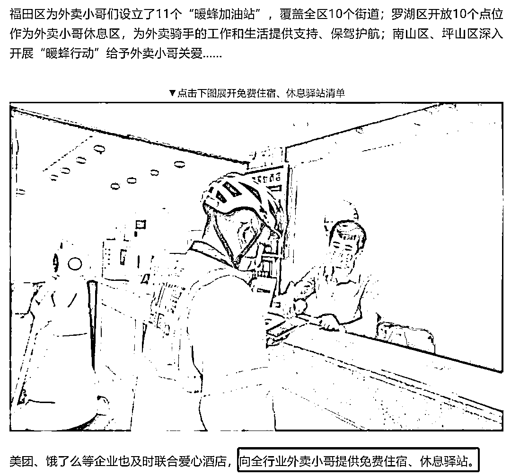

# 咖啡在驱赶大蒜？有些人的上海，容不下打工人的一张床

> 原文：[`mp.weixin.qq.com/s?__biz=MzIyMDYwMTk0Mw==&mid=2247532639&idx=1&sn=418f8bf5a6ecc5a5c21a4f94e97444f4&chksm=97cb8b67a0bc0271fb036ca801c375260a30876f206f244bf6f0f13624146a1794a4c8bc2675&scene=27#wechat_redirect`](http://mp.weixin.qq.com/s?__biz=MzIyMDYwMTk0Mw==&mid=2247532639&idx=1&sn=418f8bf5a6ecc5a5c21a4f94e97444f4&chksm=97cb8b67a0bc0271fb036ca801c375260a30876f206f244bf6f0f13624146a1794a4c8bc2675&scene=27#wechat_redirect)

“海派清口”创始人周立波曾调侃，吃大蒜的怎么可以和一个喝咖啡的坐在一起，因为喝咖啡高雅，吃大蒜低俗。

有一次周立波被记者问，“愿意和郭德纲一起表演吗？”

周立波回答：“我是喝咖啡的，和吃大蒜的搞不到一起。”

昨夜微博热搜第二条：上海房东排队 4 小时买菜送 3 租客。 

能排队四小时买菜免费送租客，至少也说明这房东是个有人情味儿的房东，上海人挺好。

一时不知道是夸还是贬，夸的是房东，贬的是上海。

要排四个小时才能买到菜。

可另一条上不了热搜的新闻，更让我倍感无奈：**有些人的上海，容不下打工人的一张床。**

3 月 30 日凌晨 2 点整，微博网友@王铁梅女士 发帖叙述**一群下班回到出租房的阿姨们，被业主以潜在威胁为由举报报警，然后被居委会“驱赶”出了小区。**

全文如下：

**看完这些文字，再一次感受到大城市中某些人的冷漠和自私。**

**-1-** 

**咖啡先驱赶大蒜**

**再驱赶“有二心”的咖啡** 

这些阿姨租住在小区，平时在边上的商场务工，从事配菜和快递相关的职业。

由于她们没有 48 小时核酸，业主不让进入，甚至报了警。

**报警的业主要求对自家门口进行消毒，对这些阿姨们走过的路进行消毒，对小区门口消毒。**

**最终，这群阿姨被成功“驱赶”，她们拎着包走进了夜色。**

博主很同情那些阿姨，但却帮不上什么，只能目送她们的背影。

**博主认为，咖啡和大蒜兼有，这个城市才立体，咖啡和大蒜是平等的，咖啡没有权力驱赶大蒜。**

我认同他的观点，虽然将驱赶者和被驱赶者比作咖啡和大蒜并不恰当，但租户和业主在小区里的居住权是相同的，不应该被歧视。

即便是咖啡和大蒜，二者在身份上在法律上也是平等的，没有贵贱之分，在这个城市都是“命运共同体”。

**令人气愤的是，咖啡们不认为自己与大蒜是等价的，一些人在践踏他人权利的时候理直气壮。**

在@王铁梅女士发帖后，事情在网络上发酵结果爆料人反而成了小区业主眼中的“叛徒”。 

甚至表示要通过技术手段揪出爆料人。

有的表示直接投诉然后把好评点赞顶起来，不愧上海大城市的人，对控舆这一套流程很熟悉啊。

**你瞧，先是咖啡驱赶“大蒜”，然后是咖啡要驱赶“有二心”的咖啡了。**

**-2-** 

**社工口中的“驱赶”**

**比病毒还“毒”**

**“驱赶”这个词，我看着真难受。** 

这些“居委会”或者“报警的业主”，知道他们的做法是违法的吗？

群租的人多了，难道每个群租的人就不能享有基本的人权？

**最可怕的是，“驱赶”竟然是社工讲出的话。**

她们是牛吗？马吗？阿猫阿狗吗？被驱赶，被所谓无处不在的权力阶层排挤、嘲讽、看低，这是命运吗？

但她们是人。

她们掏了钱，签了合同，合法的拥有在合同期限内的空间使用权，任何人无权“驱赶”。

**灾难当前，本该互相团结、互相帮助，但我却看到有些人发自心底的“恶”以“防疫”之名大行其道。**

****

**抱怨没人送快递没人送菜的时候倒不觉得人危险了？不需要人家的时候就是危险乡下人？**

希望王铁梅女士的那些邻居们看到，虽然没有人应该被网暴，但是你们值得挨骂。

**当垃圾有了优越感组织抱团，觉得自己是可回收垃圾的时候，你其实就是个有毒有害垃圾。**

**-3-** 

**驱赶病毒**

**还是驱赶底层**

在一个致死率那么低的病毒面前，有些人的底色全暴露了。

**人人不拿别人当人，人人就都不是人。**

这群阿姨是按照防疫规定做完了当天核酸才返回住处的，检测结果没有上传，以此为理由驱逐，也并不能说完全没有道理。

理解在里面的人的怕，但是我在想：

**如果这群阿姨不是租客，而是这个小区的业主，****她们回到自己家之后，会不会遭遇邻居驱赶？**

我想，大概率不会。 

在上海，去驱赶小区里的流浪猫，可能都会被某些爱猫业主谴责，驱赶一大群穷人，却会得到业主们的支持。

小区业主为什么要让居委会去“驱赶”群租房里的阿姨？

**表面的原因是：感觉不安全，可能有安全隐患。**

部分人或许认为，这是群租房的社会底层，她们生活的环境更脏乱差，她们接触的人更不卫生，她们更有可能携带病菌。

**我们虽然不知道新冠病毒是否更容易感染穷人，但在一些人眼里，穷人就是更容易被新冠感染。**

虽然没有人会这么承认，但有些人心中就是这么想的。

大蒜没了，被驱赶的就是咖啡了，毕竟咖啡也分速溶和手冲的，甚至还有更高级的。

有人觉得自己喝咖啡就跟群租房里的人不一样了，事实上，有房贷和没房贷的，住普通小区和住高级小区的，住高级小区和住别墅区的。

都不一样，上级的上面还有上级。

今天被“驱赶”的是阿姨，明天呢？

**轮到自己不被当人的时候会不会为了“顾全大局”也能心甘情愿做牲口？**

**今天他们被这些住户驱赶，明天这些业主也可能被其他更高一级的人驱赶。**

**-4-**

**城市对底层的下限**

**是城市发展的上限**

有网友说：越是大城市越冷漠自私。

这点我不苟同，深圳就还真的还挺好的。

**因为从另一个角度而言，深圳没有本地人。**

深圳蔬菜不用抢，政府发消费券，在封城的那几天，政府还给外卖小哥安置居住地方。

说一下我个人的看法，**上海人极其有优越感，过多的优越感就容易傲慢。**

再次在此声明绝对不是地域黑，仅代表个人不成熟观点。

**一个城市能发展成什么样，靠的是这个城市的人。**

**城市对社会底层的下限，就是城市发展的上限。**

大城市如果容不下所谓的务工边缘人，居民生活成本会急剧上升。

一些说着群租不该有的人，也是抱怨这次疫情让自己生活不便的人，如果不是这些租不起更贵的房子的底层打工人，你们生活便利从何谈起？

**工资更高的人会给你们服务？**

如果连在这个城市辛苦工作，为城市提供了基础保障的底层都不愿意包容的话，这个城市发展的上限也就那样了吧。

平心而论，一个国际化大都市，生活在那里的人，就应该更加的包容，更有爱，而不是戴着有色眼镜。

**既然能容下咖啡红酒，为啥不能容下大蒜白菜呢。** 

**-5-** 

**终章：删帖**

说下事件的结局：那群阿姨当晚离开后，回商场去住了；核酸结果出来后，她们又返回了小区。

但在业主、物业、警察三方合力下，为了维护城市形象，博主删帖了。

对于我个人来说，对上海本地人印象变差，绝对不是因为这件事起源的个别业主，**而是事情发酵后博主被半强迫删帖这个结局。**

这更像是，一些各种不同身份和职业的上海人联合起来，对另一群人的霸凌。

驱赶两个字，太高贵了。

来源：昌南大队长，图源网络，如有侵权请联系删除。

← 向右滑动与灰产圈互动交流 →

