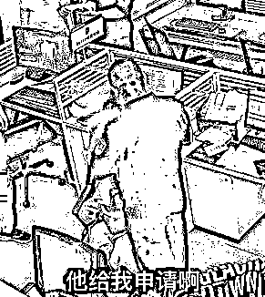
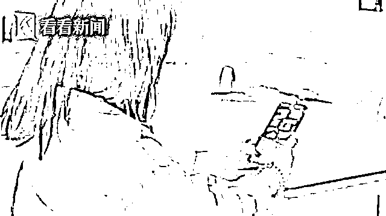
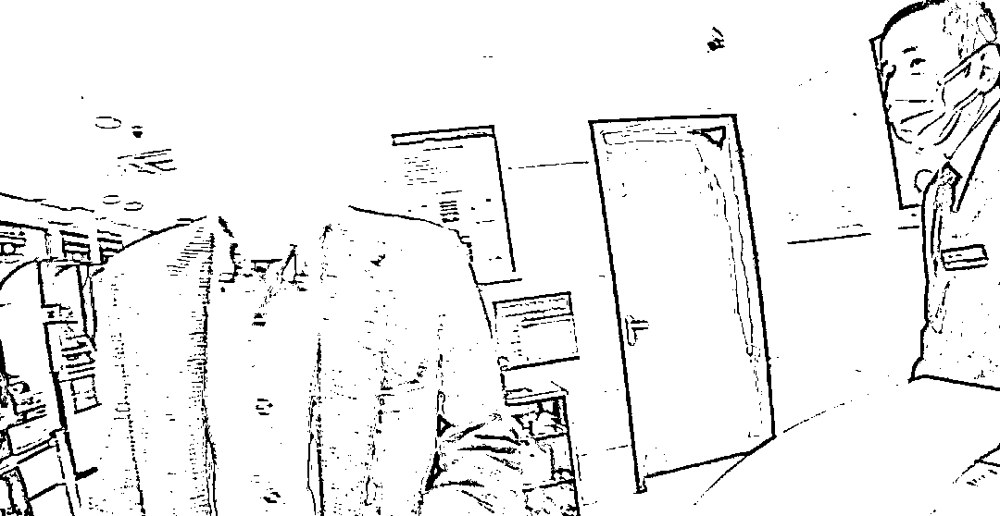
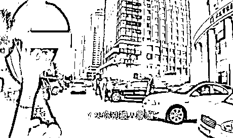
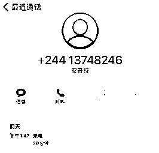
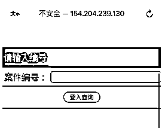
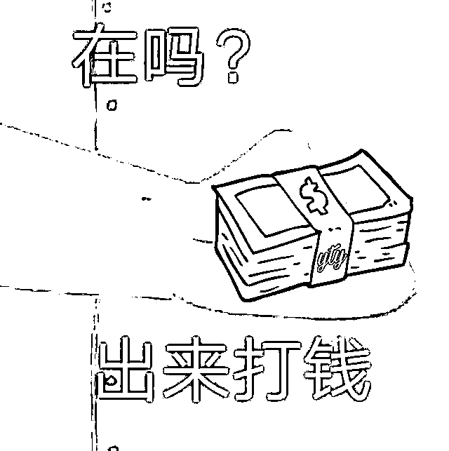

# 被骗子洗脑有多可怕？

> 原文：[`mp.weixin.qq.com/s?__biz=MzIyMDYwMTk0Mw==&mid=2247532639&idx=3&sn=b9e5e447cd9125b6fd45af804dabde2a&chksm=97cb8b67a0bc0271f1d22e0481f82cb6207ea863d368ed925338ef670106590767a450373630&scene=27#wechat_redirect`](http://mp.weixin.qq.com/s?__biz=MzIyMDYwMTk0Mw==&mid=2247532639&idx=3&sn=b9e5e447cd9125b6fd45af804dabde2a&chksm=97cb8b67a0bc0271f1d22e0481f82cb6207ea863d368ed925338ef670106590767a450373630&scene=27#wechat_redirect)

[`mp.weixin.qq.com/mp/readtemplate?t=pages/video_player_tmpl&action=mpvideo&auto=0&vid=wxv_2323560777318023171`](https://mp.weixin.qq.com/mp/readtemplate?t=pages/video_player_tmpl&action=mpvideo&auto=0&vid=wxv_2323560777318023171)

近日

河南舞钢一女子遭遇电信诈骗

民警将她带到派出所耐心劝阻

结果女子执迷不悟

坚称“他（骗子）担保给我提现”

民警急得大声“咆哮”

**我是公安机关的**

**代表的是国家你都不信**

**这边（骗子）说的话你啥都信**

民警强行“拿走”手机后

女子还恳求“别查他（骗子）”

最终

在民警和家属的共同劝说下

女子幡然醒悟

小编曾听到

有人这样形容被诈骗的经历

**明明看了那么多反诈宣传**

**可身在其中时**

**却感觉被“洗脑”了**

**无法理性思考**

今天小编想跟大家聊聊 

被骗子洗脑有多可怕 

**女子跟民警打赌 1000 块，结果……**

 **[`mp.weixin.qq.com/mp/readtemplate?t=pages/video_player_tmpl&action=mpvideo&auto=0&vid=wxv_2165787257964756992`](https://mp.weixin.qq.com/mp/readtemplate?t=pages/video_player_tmpl&action=mpvideo&auto=0&vid=wxv_2165787257964756992)** 

**“他不是骗子，我知道你们是好心，**我不会被骗，不信我们可以来打个赌，如果我提出来了，你给我拿 1000 块！**”**

**38 岁的王女士，在某社交软件上认识了一位男士，在逐渐熟悉后，对方让她下载了名叫“飞书”的 APP。王女士照办后，两人便在该软件开始聊天，后来越聊越投机，在网络上以姐弟相称。**

****

**不久后，对方告诉王女士，可以在网上做一些小投资，并能保证稳赚不赔。王女士在对方的引导下，下载了“伊淘淘”软件，先期她投入了 300 元后，很快便成功提现，有了 700 元的收益。**

**接着，王女士多次在“伊淘淘”软件上购买了若干商品，随着投入的金额越来越多，**她已无力支付，开始四处借钱，**这些异常行为，引起了丈夫的警觉，他告诉妻子这是遭遇了骗局，让她向公安机关报警。**

****

**为了证明自己投资理财没有错，王女士来到了当地公安局，**想让警察为她作证，好打消家人的疑虑。****

****民警一眼便看穿了这是典型的“杀猪盘”诈骗，对王女士苦口婆心劝导，而她毫不领情，激烈反驳。后来经民警查询，结果确认是诈骗软件，王女士顿时傻眼，心情久久不能平复……****

******报警三天后她被二次诈骗******

 ******[`mp.weixin.qq.com/mp/readtemplate?t=pages/video_player_tmpl&action=mpvideo&auto=0&vid=wxv_2048743000133959689`](https://mp.weixin.qq.com/mp/readtemplate?t=pages/video_player_tmpl&action=mpvideo&auto=0&vid=wxv_2048743000133959689)****** 

********被骗报警 3 天后，民警在一所大学附近的小树林里，找到了被二次诈骗的李女士。**没想到，她却一脸警惕地说：“我正在跟领导通话呢，不要来打扰我。”此刻，李女士的手机正被骗子操纵，20 万元即将被转走！******

******这次事件发生前不久，受害人李女士报警称自己通过某软件网上投资理财，被骗了钱。没过几天，反诈中心接到大数据平台后台推送的预警信息：李女士可能在被二次诈骗。民警多次拨打当事人电话，始终无法接通。******

******民警与李女士家属及同事取得联系一同寻找，最终在某大学附近的小树林中找到了李女士。******

******此时，**她正在和诈骗团伙通电话，并已按对方要求屏蔽了所有来电。对于民警的到来她还感到颇为不解：“我正在跟领导通话，不要来打扰我。”********

********民警发现**李女士的手机已经开通屏幕共享功能**，被嫌疑人所控制，资金即将被转出！为防止李女士转账，民警当机立断关闭了其手机屏幕共享，及时拦住了嫌疑人的“黑手”。********

******随后，李女士表示一大早就接到境外电话，对方自称是“中央调查组工作人员”，现查到她涉及诈骗案，要求她购买一部新手机接受调查并转账 20 万元，同时不允许与任何人联系，**李女士迷迷糊糊地按照诈骗团伙的指示一一照做。**当她见到同事并确认到场民警身份后，才恍然大悟自己差点再次被骗。******

********“钱到不了，你把我抓去坐牢！”********

 ********[`mp.weixin.qq.com/mp/readtemplate?t=pages/video_player_tmpl&action=mpvideo&auto=0&vid=wxv_2320855524688658435`](https://mp.weixin.qq.com/mp/readtemplate?t=pages/video_player_tmpl&action=mpvideo&auto=0&vid=wxv_2320855524688658435)******** 

********湖北武汉一母亲不听女儿劝说，执意要完成“刷单任务”。为了避免母亲被骗，女儿选择报警，可民警赶到现场后，**女子仍不听劝阻，****固执地认为这就是一个赚钱的方式：“钱到不了，你把我抓去坐牢！”**女儿在一旁气得直哭。看到对方还要继续转账，民警迅速夺下手机，经过苦口婆心地劝说，女子终于意识到自己是被骗了。******** 

**********“谢谢好意，但我钱还是要转的。”**********

 ********[`mp.weixin.qq.com/mp/readtemplate?t=pages/video_player_tmpl&action=mpvideo&auto=0&vid=wxv_2320746699847499780`](https://mp.weixin.qq.com/mp/readtemplate?t=pages/video_player_tmpl&action=mpvideo&auto=0&vid=wxv_2320746699847499780)******** 

********警方接市民陈女士的异地报警称：其父亲陈先生自称**一位国外友人从英国邮寄了一份包裹给他，但需要他给第三人转所谓的“报关费**”**，**怀疑是电信诈骗。********

******民警接报后迅速赶赴现场。陈先生自述在网上认识了一名“英国女兵”，对方委托了另一个朋友张某邮寄了三件衣物、一块劳力士“绿水鬼”手表等物品送给他。陈先生添加了张某的微信后，对方称包裹已从英国寄到北京，但需要支付 8500 元的“报关费”到一个指定账户。陈先生因为银卡行卡内余额不足，遂向女儿求助时被发现异常。******

************

******陈先生一开始还表示，自己曾与所谓的“英国女兵”见过面，民警询问后，察觉这是一起典型的电信诈骗，但是 66 岁的陈先生非常固执**，他坚信自己的交友是正当的，并不存在上当受骗。********

********为避免陈先生财产受到损失，民警将他带回派出所开展耐心劝说，讲解了侦办过的类似案件，并拨打电话询问了报关流程，告知其“报关费”是不需要转账给私人账户的。**但不管民警怎么劝说，陈先生依旧相信对方是真实存在的，还明确表示：“谢谢你们的好意，但我钱还是要转的**。**”**********

****************

********民警们面对“顽固”的陈先生并不放弃，轮番“上阵”耐心劝导，还将他带到附近的银行进行咨询。最后，民警请陈先生告知张某已在派出所接受调查，对方便再无音讯。**7 位民警经过 3 小时“接力劝阻”终于取得陈先生信任，完成这次劝阻工作。**********

********民警在事后还对陈先生进行了回访，得知所谓“英国女兵”再无回复，陈先生也已经删除了两人的联系方式。********

**********民警猛追被骗女子：我是真警察**********

 **********[`mp.weixin.qq.com/mp/readtemplate?t=pages/video_player_tmpl&action=mpvideo&auto=0&vid=wxv_2087658812278112259`](https://mp.weixin.qq.com/mp/readtemplate?t=pages/video_player_tmpl&action=mpvideo&auto=0&vid=wxv_2087658812278112259)********** 

**********民警接到辖区某宾馆经理电话称，**一名邓姓女子在办理入住时，神色慌张，一直在用手机通话，可能遭遇电信诈骗。************

**********民警通过电话，简单询问后判断邓女士极有可能已经落入了骗子的圈套，并在对方的操纵下准备转账汇款。于是，他告诉宾馆经理协助全力劝阻邓女士，自己马上赶到现场。**********

********************

**********民警火速赶到后，看到宾馆经理正在劝说邓女士，赶紧上前亮明身份，并询问具体情况，但对方情绪激动，什么话也不说就要向外跑。**********

**********情急之下，民警抓住邓女士的手臂，郑重地告诉她：“姑娘，请你一定要相信我，你可能正在被电信诈骗，请把电话给我，让我和对方通话核实。”可邓女士仍然非常固执：**“你们都是警察，我该相信谁？”************

**********民警进一步与邓女士沟通，并发动周围群众一起劝说，在大家的共同努力下，邓女士终于交出电话，民警马上表明警察身份，要求核实信息，对方却支支吾吾，民警当即确定电话那头就是冒充“公检法”的诈骗嫌疑人，见身份被拆穿，对方立刻终止了通话。**********

********************

**********在民警耐心劝导下，邓女士的情绪逐渐稳定。原来，她来大连出差当日，到宾馆准备办理入住时，突然接到一个“00376”号码开头的电话，**对方自称是“深圳市公安局”的工作人员，告知其名下使用的电话号码涉嫌诈骗，已经有 11 人因此号码被骗报警，现需添加邓女士微信，核实身份侦办案件。************

********添加微信后，**对方要求她按提示操作，不要让别人知道双方的通话内容。**几番套路下来，深信不疑的邓女士已将身份证号码、银行卡账号等重要信息都已全盘托出。就在骗子即将得手之际，民警及时赶到进行了劝阻。********

******“幸亏警察及时赶来，要不我的钱恐怕全被骗了！”冷静回顾被骗经过后，如梦初醒的邓女士仍感到心有余悸，对民警和宾馆工作人员及时果断，锲而不舍的劝阻表示了由衷的感谢。******

********网贷没收到钱反而给钱？********

******“说你银行卡被冻结要求转款，这种网贷诈骗套路我们都接到过几十个了，是假的啊！”**“你钱都没有贷到，反而还给钱出去，咋可能是真的嘛！”********

********“肯定是我卡号写错了，这个就是正规的。”无论民警如何解释，**男子仍不肯相信，始终认为自己的银行账号已被冻结，打算给“客服”转账。**********

********当天，一银行的工作人员报警称，有人疑似遭遇电信诈骗，正在试图转款。接到报警后，民警立马赶往现场。银行大厅内，工作人员正劝说阻止余先生转款，见民警到来，余先生有些惊讶。民警向其询问情况，**余先生只支支吾吾地表示自己在给一个熟悉的外地朋友转钱，**这名朋友曾经帮助过自己，现在朋友急需用钱，自己准备再转账一万元时，没想到警察来了。********

******看到余先生躲闪的态度，民警觉得事实并不简单，于是将他带回了派出所。在民警的反复追问下，余先生这才说，**自己是在网上进行贷款，但系统显示银行卡输入错误，“客服”表示需要转账即可解冻。********

********起初，无论民警如何解释，余先生坚信就是自己把卡号输错了，只要给钱就能把账号解冻。民警通过查看余先生手机，发现“客服”还一直通过微信诱导其转款。********

********无奈之下，民警只得把以往的诈骗案例一一翻出来，一个一个对照讲解诈骗手法。在将近一个小时的劝导中，余先生终于清醒过来，意识到自己遭遇了诈骗，避免了损失。********

****************

**********编发无数电信诈骗新闻后，小编竟被骗 5 万**********

**********我是个 90 后媒体人，自 2015 年起从事新闻工作，过去 6 年时间里，每天看过的、经手的新闻，说成千上万也不算夸张。各种涉及诈骗，特别是电信诈骗的新闻，早已司空见惯，不以为意：“这都有人信？”而这次，我信了。**********

**********一个媒体人，是如何被骗 5 万的？整件事要从那天下午快 2 点我接到一通电话说起。**********

**********当我晚上 8 点多做笔录时，才发现这个电话的号码是+244（安哥拉？！）开头，这种诡异的电话号以往是绝不可能被我接起的，即使接了，也会被我迅速识破骗局。毕竟我也曾是，可以和骗子周旋调侃的人啊……**********

************此处，是我犯的第一个错误：随意接起陌生号码来电。************ 

****************

********整个骗局，就是一出老套的、“冒充公检法”的“剧本杀”。我接到了来自“北京市公安局户籍科某民警”电话，称我名下护照在南京出现非法入境记录，急需处理。本来想要自己打“110”核实的我，因为偷懒图方便，同意了对方帮我直接转接到“南京警方”的建议。********

**********这里，是我犯的第二个错误：没有自己打 110 对事件进行核实，偷懒一时爽……**********

********电话接通到所谓“南京警方”之后，对方与我核对了部分个人信息，也正是因为对方掌握信息过于精准，让我放松了警惕。很快，我的“非法入境”就被处理好了。万万没想到，前面都只是迷雾弹。********

********对方发给我一个“案件编号”，称可以为我开放一个临时登录入口查看我的案件信息，结果一打开，跳出一个贴有我身份证照片及详细个人信息的“通缉令”，称我涉嫌洗钱。********

****************

********若我要自证清白，必须对我名下财产进行登记和清查。让我把可查财产转到所谓的“安全账户”中。在骗子的话术控制之下，我的行动明显快于思考，一步一步按照他们的要求，转走了近 3 万元。********

**********这里，是我犯的第三个错误：涉及金钱和所谓“安全账户”的都是骗子，但我当时并没反应过来。**********

********骗子冒充的“检察官”以部分借贷平台涉嫌与此案件有关为由，要求查看我在各个线上借贷平台的额度，并再次诱骗我进行贷款和转账，我被“负债”2 万余元。********

********而在整个被骗的过程中，我被对方以“案件涉密”为由，多次要求转移场地，最终转移到了某商场的电梯间，并在整个过程中，应对方要求开启了“屏幕共享”，导致了个人信息的进一步外泄。********

**********这里，是我犯的第四个错误：当对方要求转移至安静无人地点时，一定是有问题的。**********

********当意识到自己被骗，挂断和骗子的通话，我看到了约 20 个未接来电、数十条微信消息、十几条其他未读信息……全世界都在找我，只是为时已晚。******** 

********坐在电梯间，我看着这些消息，有些恍惚，但我也确认了一个事实：从事新闻工作的第 6 年，我把自己活成“新闻当事人”了……********

****************

********我第一时间回到 5 分钟路程的单位，见到了因为监测到我登录了诈骗网站，四处寻找我、试图阻止我的反诈骗中心的工作人员，在他们的指导下，迅速到我被骗地方的辖区派出所报案。********

**********在这里，我还犯了一个错误：当意识到自己被骗后，要立刻到最近的派出所报案，追回钱款的概率会提高很多。**********

********整个报案过程中，几位民警和辅警在了解情况的同时，一直在安慰开导我。不过其实，受害人——我，心态平稳，甚至有点想赶紧回家写稿，用我的经历告诫更多的人不要上当！********

****************

********看完以上案例********

********小编总结了下骗子的********

********“洗脑”套路********

********************

**********让你有“利”可图**********

********恋爱送礼、理财赚钱********

********刷单返利、证明清白******** 

********……******** 

********总之********

********一切都是为了你“好”********

****************

**********“对症下药”，不怕你不信**********

********通过聊天或者木马程序等手段******** 

********掌握个人信息********

********再营造出他所描述的情景氛围********

********这时你已经开始怀疑自己********

****************

**********最终目的：钱********** 

********无论是通过什么方式******** 

********花了多长时间********

********最后都要诱导你转账********

********少到几百块多到上千万******** 

********是的，不用惊讶********

********他们转钱转得心甘情愿******** 

****************

********所以********

********遇到“天上掉馅饼”的事********

********多问自己一句********

********为什么网聊对象********

********要送素未谋面的你贵重礼物呢********

********为什么赚钱这种好事********

********要告诉一个陌生人呢********

********为什么“公检法”让你协助调查********

********却要交钱呢********

****************

********有反诈民警********

********接受采访时说道********

********现在想让被洗脑的受骗者相信警察********

********真的不容易********

********很多蜀黍在进行劝说时********

********都要千方百计地证明********

********他是骗子，我是好人********

********但还是有人沉迷********

********那些美妙的谎言********

********执迷不悟********

****************

********小编想说********

********骗子的“甜言蜜语”的背后********

********都藏着不可告人的目的********

********而蜀黍才是那个********

********会不计一切为你好的“陌生人”********

****************

********以后遇到类似情况******** 

**********首先是自己要有防范意识********** 

**********不要轻易相信任何陌生人**********

**********其次凡是涉及钱财的事儿**********

**********都多想想再行动**********

**********再有如果收到“96110”来电********** 

**********一定要接听**********

********如果有拿不准的情况********

********也可以来问蜀黍********

********派出所可是永远不打烊的哦********

**********最后**********

**********请一定一定要相信**********

**********咱们的人民警察**********

********你们绝对是他们********

********心尖尖上的人********

********而他们也应该是你们********

********最信任的人********

****************

********在此********

********也向一直奋战在********

********反诈一线的战友们致敬********

****************

********来源：反诈之旅，邯郸市反诈中心********

****************

********← 向右滑动与灰产圈互动交流 →********

****************