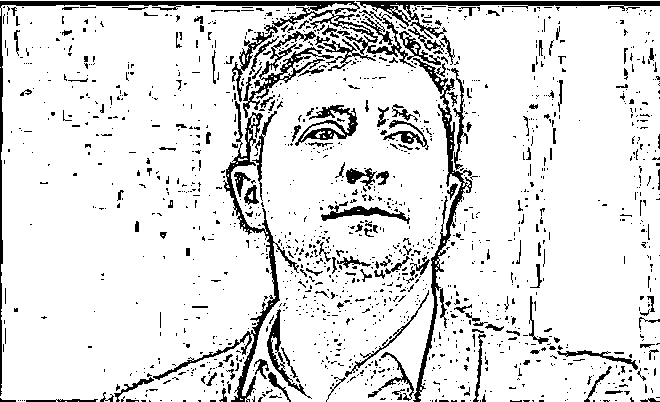
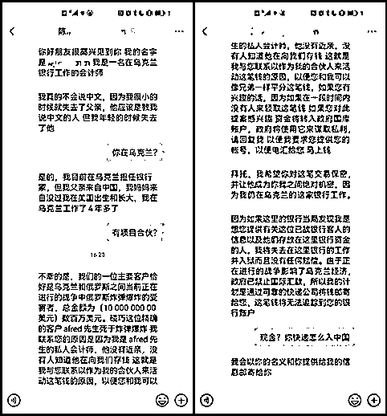
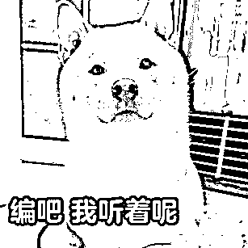
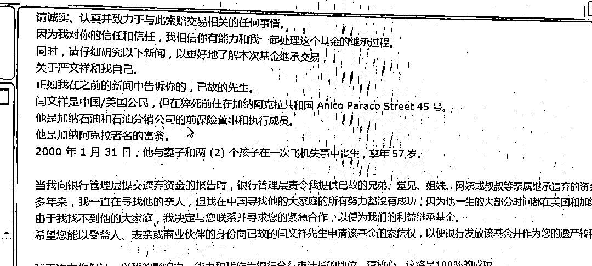
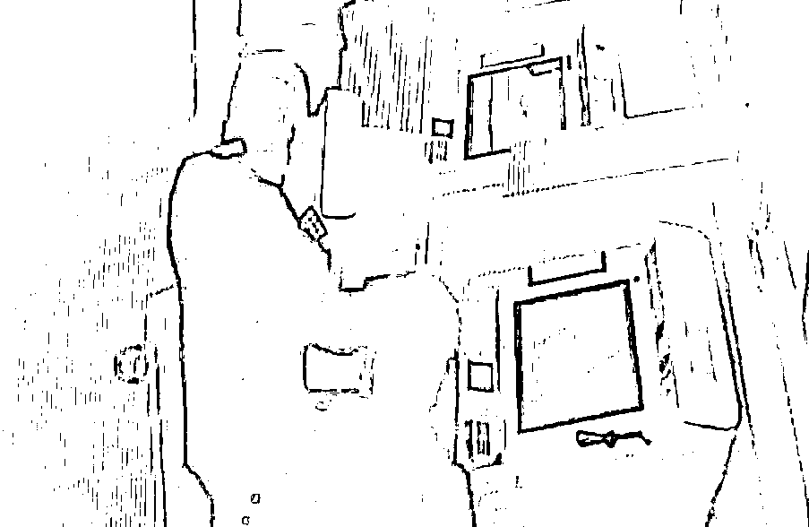

# 俄乌即将握手言和？乌克兰海外资产怎么办？

> 原文：[`mp.weixin.qq.com/s?__biz=MzIyMDYwMTk0Mw==&mid=2247532639&idx=4&sn=60bf2e8161cf5b4c64c73463f2d34504&chksm=97cb8b67a0bc02719588367f2f28b79a420ffd90fc1e3face454aff32ba025e64f3de071da8e&scene=27#wechat_redirect`](http://mp.weixin.qq.com/s?__biz=MzIyMDYwMTk0Mw==&mid=2247532639&idx=4&sn=60bf2e8161cf5b4c64c73463f2d34504&chksm=97cb8b67a0bc02719588367f2f28b79a420ffd90fc1e3face454aff32ba025e64f3de071da8e&scene=27#wechat_redirect)

俄乌双方打了一个月 

终于迎来停战曙光

俄乌双方 29 日进行了第五轮会谈 

会谈只进行了 3 小时

并无激烈争论

就取得重大实质性进展

俄乌双方不会想到 

诈骗分子也会借此“趁火打劫” 

有人伪装成乌克兰银行会计师

声称客户在战争中遇难

留下数百万美元无人认领

邀请受害人与其合作瓜分钱财

诈骗分子通过短信或社交平台 

广撒网式发送信息

吸引受害人进一步沟通

只要有人回复

骗子就会用话术诱骗受害人合作

并提出邮寄现金

后续通过运费、海关费等借口

要求受害人向其支付费用

最近南通海安也发生了

类似的玛丽苏剧情

、

[`mp.weixin.qq.com/mp/readtemplate?t=pages/video_player_tmpl&action=mpvideo&auto=0&vid=wxv_2328219018652205057`](https://mp.weixin.qq.com/mp/readtemplate?t=pages/video_player_tmpl&action=mpvideo&auto=0&vid=wxv_2328219018652205057)

（视频来自：《法治纵横》）二十年前
非洲石油大亨与妻儿 在飞机事故中不幸丧生留下 5300 万遗产无人继承阿克拉非洲开发银行审计长穆罕默德向远在中国的陌生人发出邀请请求您作为受益人继承遗产

这可是在现实生活中

今年 1 月份开始

海安陈大爷收到了这样的邮件

而且是锲而不舍的 50 多封

陈老的顾虑被对方的“诚意”所打消

表示“就当为国家招商引资了”

“穆罕默德”称继承遗产需要一些费用

需要陈老与他“共同努力”  

陈老筹来筹去 

还差几万块

便问儿子要钱

面对儿子的质疑

执拗的陈老就是不听劝

拗不过父亲的儿子怕老父亲气坏

还是把钱给了陈老

转头就去寻找警方的帮助

陈老前脚刚到银行 

海安大公派出所民警后脚就到了

[`mp.weixin.qq.com/mp/readtemplate?t=pages/video_player_tmpl&action=mpvideo&auto=0&vid=wxv_2332953078423273473`](https://mp.weixin.qq.com/mp/readtemplate?t=pages/video_player_tmpl&action=mpvideo&auto=0&vid=wxv_2332953078423273473)

（视频来自：《法治纵横》）

经过民警 1 个多小时的开导

老人终于醒悟了

“海外遗产”类诈骗是老套路了

骗子通过发送邮件

以“巨额遗产”诱骗受害者上钩

一旦受害者同意合作

就会以各种理由要求转账

被骗的多为中老年人

**反诈君提醒**

很多人说这么老套的骗局 

怎么还会有人被骗

其实比起年轻人早早接触网络 

不少中老年人是在智能手机普及后

才学会如何上网的

一些听着就离谱的事情

他们只当是自己落伍了才相信

海外的“馅饼”同样都是“毒”

拟稿：小薛、黄萧潇 策划：葛波 审核：周洲 来源：南通反诈

← 向右滑动与灰产圈互动交流 →

