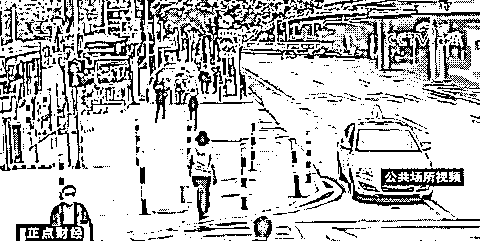
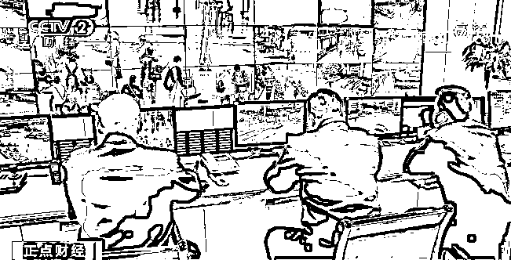
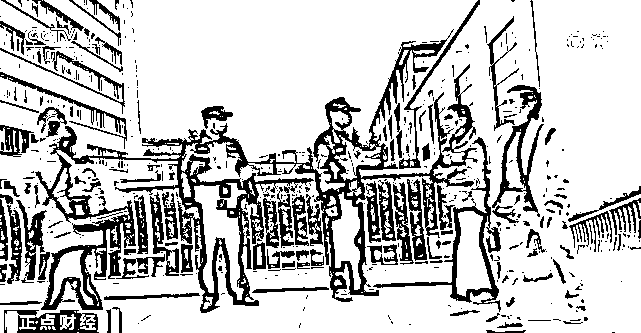

# 火车站“封站”，“工作人员”引导坐大巴？小心新骗局→

> 原文：[`mp.weixin.qq.com/s?__biz=MzIyMDYwMTk0Mw==&mid=2247532639&idx=5&sn=da7f1ea51f23feccb75631f425ec29c0&chksm=97cb8b67a0bc027130dc11770db8d559ded6c9690a49485594e6222a21486560215cd7386d62&scene=27#wechat_redirect`](http://mp.weixin.qq.com/s?__biz=MzIyMDYwMTk0Mw==&mid=2247532639&idx=5&sn=da7f1ea51f23feccb75631f425ec29c0&chksm=97cb8b67a0bc027130dc11770db8d559ded6c9690a49485594e6222a21486560215cd7386d62&scene=27#wechat_redirect)

近日，

在广东广州，

有人以疫情严重火车站封站为由，

骗旅客转乘大巴。

[`mp.weixin.qq.com/mp/readtemplate?t=pages/video_player_tmpl&action=mpvideo&auto=0&vid=wxv_2334245955769958400`](https://mp.weixin.qq.com/mp/readtemplate?t=pages/video_player_tmpl&action=mpvideo&auto=0&vid=wxv_2334245955769958400)

△央视财经《正点财经》栏目视频

霓先生准备去广州火车站买票回山东，却在路上遇到自称“工作人员”的指引，**说因为疫情严重，火车站要“封站”**，叫他去别的车站乘车。这时候，另一个男人出现，自称是山东“老乡”。

****办案民警：**这个同伙跑上来，扮“工作人员”的人说，你们两个老乡一起走吧。**

******办案民警** 马海荣：**其中一个人说，要验核酸才能拿到票之类，另外一个“托”就说，“是啊，我刚刚进去了，是这样的情况，我现在就要去坐大巴”。**

********

****霓先生和这位“老乡”根据指引，**到其它客运站周边的私人售票点，花了一千元买车票，坐大巴回山东**。在路上，霓先生才发现不对劲。****

**********办案民警**** 马海荣：**很多和他一样遭遇的旅客，大家说起，由不同地方，因为不同原因，说不能购票。**查了客运站的软件工具，知道这个价钱远远超出应有的价格**，所以旅客发现自己受骗上当，于是报警。****

********

****越秀警方分别在广州火车站东广场、白云区抓获嫌疑人陈某、邝某。经调查，**在这宗案件中，有 15 名旅客被骗上“黑车”**。这个诈骗团伙通常盘踞在火车站周边的公交车站、地铁站出入口，**他们假扮成“工作人员”和“老乡”，专门物色一些拿着行李、赶着去火车站乘车的单身旅客，对他们实施诈骗。******

****来源：央视新闻****

********

****← 向右滑动与灰产圈互动交流 →****

********