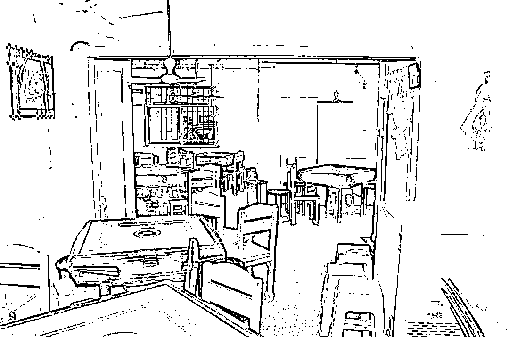

# 伊老太、毛老太再到夏大爷：一人，坑一城

> 原文：[`mp.weixin.qq.com/s?__biz=MzIyMDYwMTk0Mw==&mid=2247532689&idx=1&sn=d2b98cdc756390adc177cdf295d4e713&chksm=97cb8ba9a0bc02bf5a6872d0d11dbe83ea6563c551b093addd189b15eadd0632da8f82683500&scene=27#wechat_redirect`](http://mp.weixin.qq.com/s?__biz=MzIyMDYwMTk0Mw==&mid=2247532689&idx=1&sn=d2b98cdc756390adc177cdf295d4e713&chksm=97cb8ba9a0bc02bf5a6872d0d11dbe83ea6563c551b093addd189b15eadd0632da8f82683500&scene=27#wechat_redirect)

起初没有人在意这场灾难，直到这灾难和每个人息息相关。 

——《流浪地球》刘慈欣 

借绿码逃离疫区，跑到别的城市；

明知自己有被感染的可能性，不居家隔离，到人员聚集的地方打麻将；

身体出现了症状，不去做检测，继续到处打麻将；

多次接到警方、疾控部门电话联系，均不回答问题或挂断电话；

在接受医院问询时，故意隐瞒了中风险地区旅居史，并否认有发热、咳嗽等症状......

**这就是 64 岁毛老太的故事，有疫情躲疫情，没疫情制造疫情。**

3 月 31 日，最高检披露，去年从南京“闯关”，致 70 人确诊，并引发疫情在扬州扩散的“毛老太”毛某宁，已于 2 月 27 日被批准逮捕。

**-1-**

** 毛老太: **

** 从南京去祸害扬州一座城 **

“一人毁掉一座城”，南京毛老太凭一己之力，让整个扬州市成为新的疫情暴风眼。

2021 年 7 月 27 日，扬州一位市民在医院就诊时，被确诊为新冠阳性。 

平静了许久的扬州城，一下子被引爆了，扬州 456 万人的防疫努力归零。

政府连夜设置 340 个核酸检测点，立马开启全员检测。

7 月 28 日当天，扬州市民顶着台风和暴雨，开展了第一轮核酸检测。

社区的志愿者们，通宵做排查。 

一夜间扬州确诊人数直逼三位数，这让它一下成为江苏省除南京外，疫情最严重的城市。

**而这全部因为一个人，来自南京市江宁区的毛老太。**

2021 年 7 月 16 日至 20 日，毛老太多次在南京市江宁区禄口街道某棋牌室打牌，一同打牌的有多名南京禄口国际机场的清洁工作人员。

7 月 21 日，毛老太借亲戚的绿码截图，擅自逃离了南京封控区，连夜跑到扬州市的姐姐毛某亚家中“避难”。

按照现行的防控要求，从中高风险区来扬州的人员要主动向社区报告，**但毛老太因为担心隔离，就偷偷隐瞒了这件事。**

邻居、同学都打电话告知她，南京新冠疫情严重，提醒她尽快进行核酸检测。

**可毛某某还是不以为然。**

本以为到扬州是真的思亲心切，看望老姐，然则直奔棋牌室，大战三百回合后依然意犹未尽。

**期间全程未佩戴口罩。**

之后的几天，毛老太到处溜达，频繁出入在人员高度密集的场合，去得最多的就是棋牌室。

毛老太和姐姐几乎每天都到棋牌室打牌，去的还不是同一个棋牌室。

毛某某在扬州市与人打牌的棋牌室

牌友们多是些防疫意识淡薄、不戴口罩的中老年人，这就直接导致了扬州的棋牌室一时间成为疫情的**“风暴中心”。**

7 月 22 日，毛老太也出现过发烧、咳嗽等症状，但她只是简单地去药店开药。

后来她实在病重扛不住了，跑去社区卫生站看病，但卫生站根据防疫要求，不肯接诊。

无奈之下，毛老太去了自认为管理不严的扬州友好医院，医院看她发烧了想给她做核酸检测，**但是毛某拒不配合，还和医生吵了起来****。**

**此刻，医院的医护人员和其他患者完全暴露在风险中！**

途中多次接到警方、疾控部门电话联系，**均不回答问题或挂断电话。**

警方获知毛老太在友好医院后，立即前往该处将其控制，并询问其 14 天活动轨迹和接触史，**毛某某未如实告知。**

于是毛老太当晚被转移至扬州市第三人民医院隔离就诊，7 月 28 日毛老太被确诊感染新冠肺炎。

毛老太确诊感染，这导致扬州友好医院被封闭，大量医护人员被隔离。

毛老太在得知自己患病后，在面对警方的询问时，**还刻意隐瞒行程，甚至撒谎、拒不交代，直至 9 月 13 日第 4 次接受讯问时才全部交代自己的活动轨迹和接触史。**

经查，毛某某密切接触者 169 人、次密接 570 人被采取隔离措施，其中 70 人确诊，当地政府为疫情防控耗费了大量的人力、物力、财力。

**从 7 月 21 日-到 9 月 13 日，中间隔了多少天，不用我多说了吧，其主观意识上的恶意已昭然若揭。**

2022 年 2 月 15 日，公安机关对毛某某变更强制措施为刑事拘留。2 月 21 日，公安机关以毛某某涉嫌妨害传染病防治罪提请批准逮捕，2 月 27 日，检察机关对其批准逮捕。

 **-2-** 

**夏大爷：** 

** 从南昌去祸害长沙、新宁两座城 **

3 月 16 日下午 4 时左右，长沙的蒋女士在长沙五一大道行走，与来自南昌的夏大爷擦肩而过。

**只有 0.5 米的距离，蒋女士未戴口罩，确诊。**

夏大爷，南昌人，54 岁。

在江西期间，夏大爷明知与广州一确诊病例的亲戚聚会，但大爷没当回事，在 3 月 13 日乘高铁到达长沙。

夏大爷在长沙停留后拼车来到邵阳新宁县，乘坐摩的到他在当地开的金店。

2 天后的 16 日，夏大爷又从新宁拼车到达长沙，在人流量较高的多个大型商圈活动并用餐。

17 日凌晨，夏大爷初筛阳性，被转送至定点医院隔离治疗。

但夏大爷的病毒传播恶果已经形成。

**夏大爷在得知自己是确诊病例的密接人员后，不主动隔离、报备、及时核检，反而四处活动，出入人员密集的场所，给新宁和长沙两座城市造成了巨大的损失。**

新宁县检出 6 例确诊病例，与夏大爷有关。

2 例是夏大爷在金店的员工，1 例是来金店购物的消费者，1 例是夏大爷乘坐的摩的司机，1 例与夏大爷在汽车站有交集，还有 1 例是金店消费确诊者的女儿。

**新宁封城，夏大爷“功不可没”。**

长沙此前 12 例确诊，除 5 例由外地输入外（含 1 例夫妻传染），其余 7 例（含夏大爷自己）均与其有关。 

其中 2 位是与夏大爷拼车回长沙的那对夫妻。

有 3 位出自夏大爷曾在此商圈逛的金店、饭店；还有 1 位就是与夏大爷在街头擦肩而过的蒋女士。

**夏大爷一人祸害两座城，真不是夸张。**

3 月 17 日，长沙市公安局芙蓉分局发布公告，以涉嫌妨害传染病防治罪依法对夏某某立案侦查。

公告指出，（夏某）其在明知与广州一确诊病例有密切接触的情况下，未按照疫情防控要求第一时间向社区报备，并多次出入公共场所，造成新冠肺炎病毒传播风险。

**-3-**

**疫情下的利己主义者：** 

** 生而为人，我劝你善良 **

一个人坑一座城，已经不是什么新闻了。

印象中最早的案例应该是 2020 年沈阳的 67 岁伊老太。

跑到韩国去溜达一圈回来，还若无其事地四处游荡。

沈阳市政府规定归国人员集中隔离 14 天后，必须再自行居家隔离 7 天。

可是这位老太一天都没有居家隔离，回家第二天，就开始到处活动。

7 天时间内，她打出租、坐地铁，跑遍了全沈阳。 

伊老太至少导致 27 人感染：丈夫，孙女，邻居，朋友，诊所的医生护士，一起就诊的患者，其中一位老人已经 95 岁… 

2020 年 12 月 21 号，沈阳市宣布：全城人员进行核酸检测，非必要行为禁止出城，同时封闭各大高速入口......

尹老太，她一个人把 830 万沈阳人坑惨。

最后这个伊老太，也为自己的行为付出了沉重的代价——病逝。

**我们日防夜防地封锁境外疫情，但还是没管住国内这些人的自爆。**

不是说不准你们流动，就不能按要求走正常程序报备一下，自动配合自行隔离一下，我就不信会少一块肉？

**我不想说老人变坏了，也不想说坏人变老了，只能返老还童成自私自利的“巨婴”。**

我相信，毛老太、夏大爷、伊老太并不见得主观上有特别大的恶毒底色，一开始还想可能是愚昧无知，后来发现是利己主义者。

疫情就是一块照妖镜，各种妖魔鬼怪都原形毕露，一场疫情挤出来的一群利己主义者：

**过好我自己小日子，管他外面发生了什么；外面的事，我管不着。**

他们最大特点是趋利避害，有利于自己的就去干，不会考虑是否伤害到别人。

**不为自己而活叫自毁，只为自己而活叫自私。**

自私自利的事件不胜枚举，上海小区业主驱赶群租的阿姨，疫情期间超市哄抬物价者……

他们是培根口中为了要替自己煮鸡蛋，以致烧掉一幢房子而毫不后悔的人。

丝毫不用怀疑，过度自私就是一种恶。

在疫情下，没有人是一座孤岛，正如在雪崩时，没有一片雪花是无辜的。

**因为极少数人的自私和傲慢，因为极少数人的不守规则，千里之堤就会溃于蚁穴，几百万人的努力和心血就会白费。**

****这个世界很公平，它会让所有漠视规则的人付出血泪的代价，不守规则，就必将败于规则。****

****你对社会不负责任，法律就要叫你负责任。****

**来源：昌南大队长，图源网络，如有侵权请联系删除。**

****

**← 向右滑动与灰产圈互动交流 →**

****