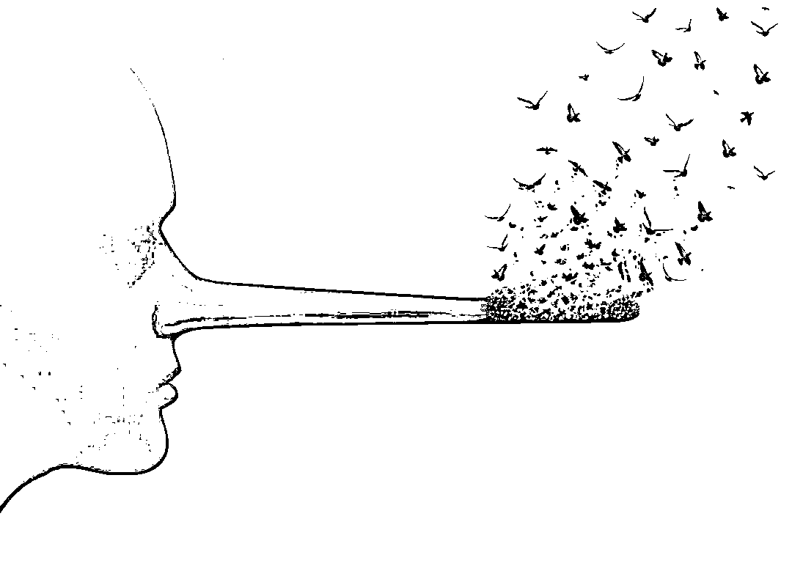
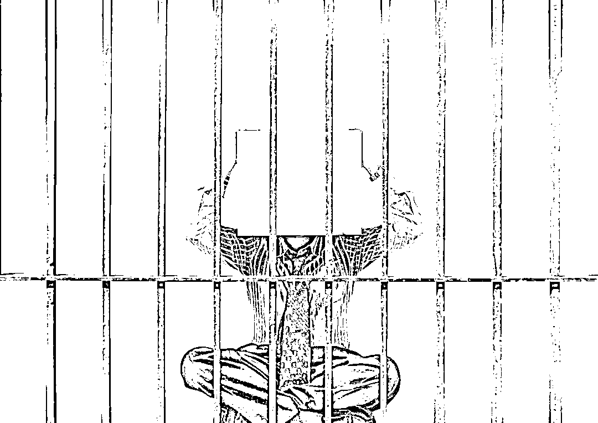

# 横店演员冒充“大领导”行骗，还建了个词条

> 原文：[`mp.weixin.qq.com/s?__biz=MzIyMDYwMTk0Mw==&mid=2247532689&idx=2&sn=5e46f2c878c62b58a631e762c049d972&chksm=97cb8ba9a0bc02bf2fc6f95f9f9b090a490353f8e79846d065f8c49ebeef70fcab7d5b7d72fa&scene=27#wechat_redirect`](http://mp.weixin.qq.com/s?__biz=MzIyMDYwMTk0Mw==&mid=2247532689&idx=2&sn=5e46f2c878c62b58a631e762c049d972&chksm=97cb8ba9a0bc02bf2fc6f95f9f9b090a490353f8e79846d065f8c49ebeef70fcab7d5b7d72fa&scene=27#wechat_redirect)

**导语**

“我会带着 6000 万元的政府支持，还有大明星来投资你的电影，放心吧。”说这话的时候，胡某已经入戏太深了，真把自己当成了领导。

胡某本是剧团演员，常常听到别人的夸奖，久而久之就有些飘飘然，打算发挥一下外貌优势搞点歪门邪道。于是，他在网上建立了自己的词条，摇身变成了“某省政府行政处处长，某省文化广电传媒集团党委书记、董事长”，甚至还在网上订购了印有“某文化集团”字样的记事本，随身携带。

日前，胡某因招摇撞骗罪被法院判处有期徒刑三年。

**自我包装成“大领导”**

图片来源于网络，与正文无关

胡某以前是一名剧团演员，年轻时曾在浙江横店打拼过，他梦想有朝一日能站上更大的舞台。那些年里，胡某经常听到有人说：“你长得可真像个领导，气质也像，往那儿一站，不就是个大领导嘛！”类似的话听多了，胡某开始认真端详自己，并打算把这个外貌优势发挥一下。

通过在网上浏览信息，胡某了解到可以找人帮忙建立属于自己的词条。胡某暗想：“别人随便上网一搜，职务照片摆在上面呢，我说自己是什么领导，就是什么领导，应该没人会怀疑的。”

就这样，2020 年 10 月，胡某在网上找了可以代建词条的小超。通过微信沟通，胡某转给对方 4800 元，并将自己提前准备好的照片以及个人资料给了对方。很快，小超就建好了胡某的词条，在这里，**原本无业的胡某摇身变成了“某省政府行政处处长，某省文化广电传媒集团党委书记、董事长”。**

胡某很满意，但他想了又想，觉得光有假词条还不够。于是，他找人把这些职务介绍信息发到了另一个网络平台，又先后发布了“某省政府关于任命胡某为该政府行政处处长的公告”以及该文化集团召开会议，胡某作讲话的稿件，他甚至还在网上订购了印有“某文化集团”字样的记事本，随身携带……

就这样，胡某将自己包装成了一位“大领导”。

**瞒天过海四处招摇撞骗**

图片来源于网络，与正文无关

经过一番操作，胡某便开始以领导自居，结识了不少圈内人士。他以帮忙投资电影等理由，向他人索要钱财。在此期间，胡某甚至受邀参加了某电视剧的开机仪式，还跟着剧组一起去外地游玩，他的演技愈发娴熟。

在胡某以领导身份自居的日子里，他认识了新疆某影视传媒公司的总经理杜先生。当时，杜先生的公司正在筹备拍摄一部电影，胡某得知后表示很感兴趣，表示愿意投资。杜先生很高兴，他听说胡某是个级别挺高的领导，不敢怠慢，不仅邮寄了很多新疆特产给胡某，还送给他 5 件玉器作为礼品。

之后，在胡某的安排下，杜先生和相关导演、编剧见了面，这让杜先生对他更加信任。胡某还向杜先生夸下海口：**“我会带着 6000 万元的政府支持，还有大明星来投资你的电影，放心吧。”**

此时在杜先生眼中，胡某已经成了他的定海神针，只要胡某提要求，他都一一答应。为了投资拍电影的事能成，杜先生先后在胡某身上花费数万元。当然，杜先生也曾怀疑过胡某的身份，但是在网上搜索一圈后，看到了胡某之前造假的网页信息和照片，便深信不疑了。

其实，胡某确实有意促成该电影项目，因为一旦成功，他就可以从中拿到一大笔佣金。在胡某的计划里，就是要利用自己假身份，集合圈内各方资源，让电影成功拍摄。

**在这场冒充领导的戏里，胡某入戏太深，真把自己当成了神通广大的“大领导”。**

**黄粱梦醒受审获刑**

图片来源于网络，与正文无关

2021 年 6 月，正做着“领导梦”的胡某在浙江横店被扬州市公安局广陵分局的民警抓获。到案后，胡某对自己的犯罪事实供认不讳。

同年 9 月，案件被移送至广陵区检察院审查起诉。针对涉案玉器难以确认价值的问题，该院引导公安机关及时扣押玉器，并委托有关检验中心对 5 件玉器进行鉴定，确定 4 件为和田玉、1 件为石英岩玉，总价值 1.56 万元。

检察官认为，胡某在网上发布虚假信息，冒充某省政府、某省文化广电传媒集团领导，结识杜先生等人并牟取非法利益近 6 万元，不仅给几名被害人造成精神和财产上的损失，而且给当地政府造成了不良影响，其行为涉嫌招摇撞骗罪。

结合胡某的作案次数，涉案金额，该院认为胡某的行为情节严重，应在三年以上量刑，最终事实、罪名及量刑建议均被法院采纳。

此外，针对胡某在网络平台轻松把自己包装成领导的问题，广陵区检察院还向当地网信办移送线索，督促网络平台和信息发布者删除虚假信息。

来源：检察日报

← 向右滑动与灰产圈互动交流 →

