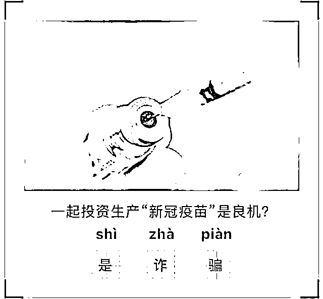
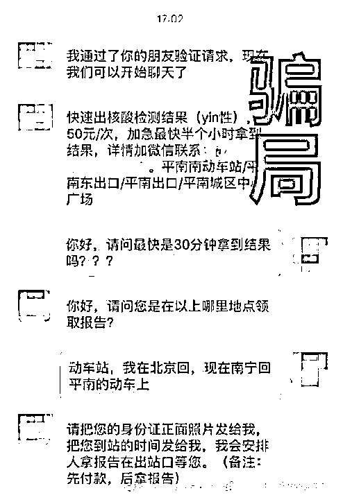
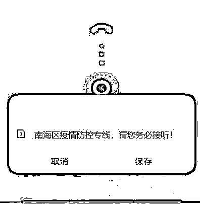
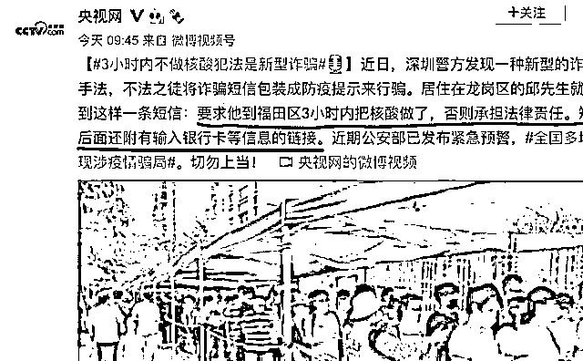
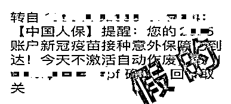
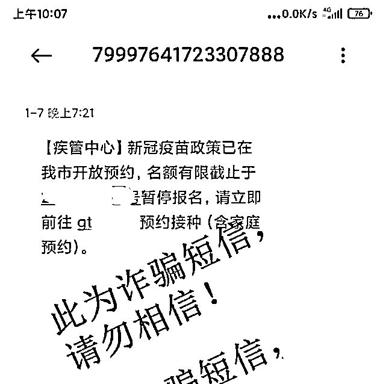
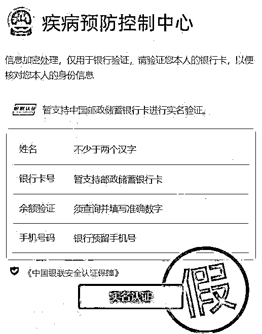
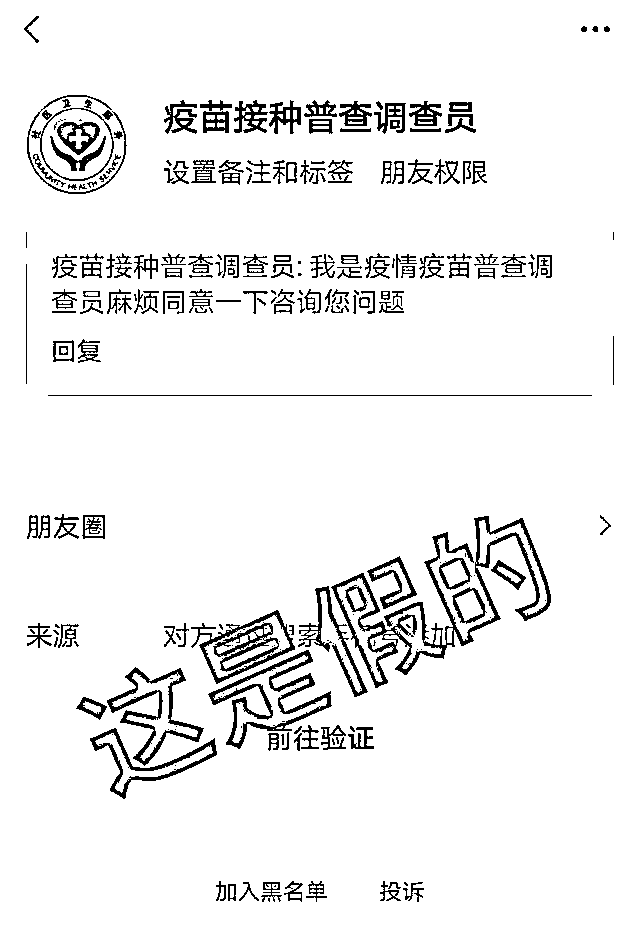
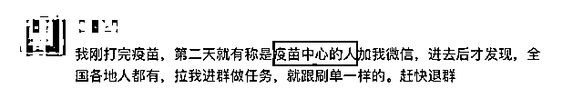
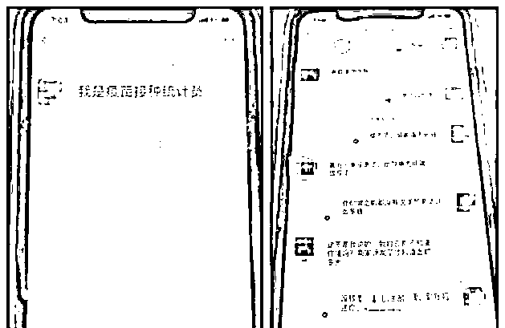

# 紧急预警！小心有人冒充“防疫人员”进行诈骗

> 原文：[`mp.weixin.qq.com/s?__biz=MzIyMDYwMTk0Mw==&mid=2247532689&idx=4&sn=d6313cdccfb06219444686d9db0aad1d&chksm=97cb8ba9a0bc02bf23c44f21e7f14fb84a5d75b8996a73ea30b022d40ce84b1869c76f08ae27&scene=27#wechat_redirect`](http://mp.weixin.qq.com/s?__biz=MzIyMDYwMTk0Mw==&mid=2247532689&idx=4&sn=d6313cdccfb06219444686d9db0aad1d&chksm=97cb8ba9a0bc02bf23c44f21e7f14fb84a5d75b8996a73ea30b022d40ce84b1869c76f08ae27&scene=27#wechat_redirect)

疫情当前，当大家齐心抗疫时 

**却有不法分子冒充防疫工作人员**

**实施电信网络诈骗**

今天，雨花警方发布了紧急预警

雨花区发生了几起类似的警情

好在民警及时介入劝阻

诈骗分子才没有得逞

3 月 26 日上午，金女士接到一陌生电话

对方自称是防疫工作人员

**该“工作人员”在电话中说**

**金女士去过“上海市第一人民医院”**

**属于密接人员，需要进行集中隔离**

听对方这么一说，金女士心中一慌

极力辩解自己并没有去过上海

对方又在电话中说，“如果弄错了，那你向警方申诉”，就这样，又把电话转接给一位自称是“上海警察”的人。

在和“上海警察”的通话中，金女士为了自证清白，被一步步“引导”加了对方 QQ，通过 QQ 视频看到对方穿着警服后，她的防线逐渐放松，然后她在对方要求下，**下载了一个软件，并且在该软件上填写了姓名、身份证、银行卡等相关信息。**

就在她准备将验证码告诉对方的关键时候，长沙警方 96110 的电话打了过来。

原来，雨花警方接到市公安局反电诈中心发来的反诈预警，**家住雨花区的一居民与陌生人长时间通话，疑似被骗。**雨花警方调查发现，市民金女士与一境外号码通电话已达 39 分钟，反诈民警一方面立即阻断金女士与对方的通话，另一方面安排洞井派出所民警上门进行劝阻。

 **警方提醒** 

市民如遇到有陌生电话以防疫工作需要为借口，索要银行卡号，要求扫二维码、发送验证码等行为，请不要相信。如果接到这样的电话请立即挂断，并主动联系街道（社区）工作人员或拨打 110 进行核实。如健康码异常，健康码页面上会有提示，并会告知正确处理方式。

小编总结了几种常见的诈骗套路

以及防疫注意事项

如有遇到，可千万别上当！

01

**身份：**掌握特殊渠道的“神秘人”

**方法：**声称投资生产“新冠疫苗”可赚大钱

**目的：**诱你在虚假平台、APP 上投钱

骗子潜伏在社交软件、网络直播平台等，广撒网私信他人，**冒充部队军官等称有内部渠道可购买“新冠疫苗”**，并不断给受害者洗脑，灌输投资生产“新冠疫苗”可赚大钱，诱导受害人在其提供的平台、APP 上进行投资转账。

**假的！假的！假的！**

说到底还是投资理财诈骗

一旦受害者信了骗子的话

只能是无法提现或者全部亏损

02

**身份：**冒充防疫工作机构人员

**方法：**群发信息，快速检测

**目的：**骗你付钱

聊天群里出现**“快速出核酸检测结果”“加急最快半个小时”等信息**，声称只要额外付费便能办到，都是骗钱的套路。

**假的！假的！假的！**

不要转账！

不要轻信网络不实信息和所谓的“私人渠道”。这不仅可能影响自身正常出行，更有可能落入不法分子非法敛财的骗局。

03

**身份：**冒充“新冠肺炎疫情”流调员

**方法：**打你电话，恐吓得病

**目的：**骗你买药

对方自称**“防控中心某主任”**，告知你健康码和检测报告上有异常，可能感染了新冠肺炎，不过还在潜伏期，情况不算太严重。对方会在电话里透露，现在有一款特效药，只需 5800 块三个疗程，每天坚持服用就会恢复健康。

**假的！假的！假的！**

目前新冠肺炎没有特效药

只要听到对方说类似的话

请马上挂掉！

近期，为准确排查密切接触者、次要密切接触者、重点人群及一般人群，有效控制疫情，确实有“新冠肺炎疫情”流调员正在对确诊病例的接触人员开展流调工作。流调人员表明身份后，**不会询问财产、说有特效药等与疾病传播不相关的问题**，需要核实内容只有以下这几种：

**01**

****个人基本信息：**包括姓名、身份证号码、联系方式（常用的手机号）、家庭住址、家庭成员等；**

****02****

******健康状况：**包括近期是否有不适症状、核酸检测情况；****

******03******

********近期行程：**包括 14 天内具体行程、交通工具、接触过谁（与谁共同生活、学习、工作、娱乐或其他近距离接触、是否采取了有效防护措施）；******

******04******

********其他**对疾病防控有用的信息。******

****04****

******身份：**冒充相关权威部门、机构****

******方法：**以各种理由发短信****

******目的：**骗你点开病毒链接****

********

********

******** ********

******假的！假的！假的！******

****不要点击陌生链接****

****不要填写个人信息****

****看到此类信息，不管什么理由****

****请马上删除****

****这是一种将诈骗短信包装成防疫提示的骗局，以往有预约疫苗接种的内容，现在又出现了“3 小时做核酸”“意外保障到达”等借口，不管如何包装，根本就是发送含有“钓鱼网站”链接的短信，诱导点击链接。此类群发短信诈骗，除了获取公民个人信息，也是针对受害人的“海选”。****

****05****

******身份：**冒充疫苗接种普查调查员****

******方法：**申请微信好友，拉入各种群聊****

******目的：**骗你刷单****

************************

******假的！假的！假的！******

****疫苗接种和做任务有什么关系****

****这只是骗子认识你的一种方式****

****只要对方拉你入群****

****请马上退出！****

****随着防范宣传的深入，众人安全意识越来越高，骗子想要添加些“好友”真心不容易。只能绞尽脑汁寻一切能让大众放松戒备的理由，拿大众的“配合”来行骗人之举。****

****骗子布下与疫情相关的骗局****

****看似言之凿凿****

****实则来路不明、套路满满****

****骗局的最后****

****必然是诱导你掏钱****

******但凡做任务要你垫资******

******有内部渠道要你投资******

******有优惠好处要你付款******

******要你填写银行卡密码验证码的******

******一定是诈骗！******

****来源：长沙晚报、雨花公安、网信广东、读特 APP、平安北京****

********

****← 向右滑动与灰产圈互动交流 →****

********