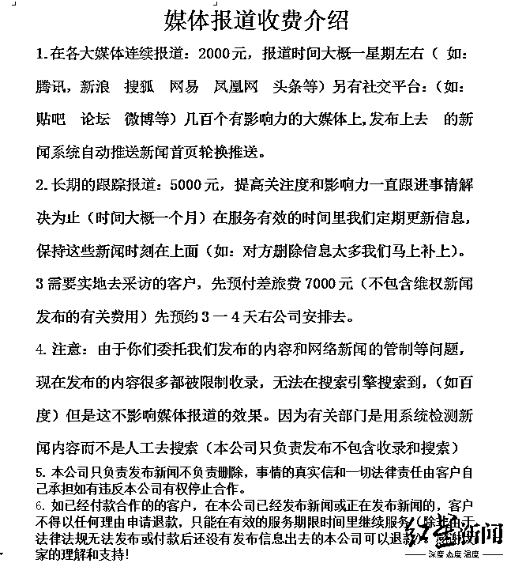

# “付费报道”服务公司调查：以“新闻维权”为噱头，2000 元可报道一周，已有人上当

> 原文：[`mp.weixin.qq.com/s?__biz=MzIyMDYwMTk0Mw==&mid=2247532689&idx=5&sn=20603d57ae71f2834c6f3bd7ff314022&chksm=97cb8ba9a0bc02bf99f6eee502e4ddfa0760faa1c24692085cadb892569eedca61614c253e91&scene=27#wechat_redirect`](http://mp.weixin.qq.com/s?__biz=MzIyMDYwMTk0Mw==&mid=2247532689&idx=5&sn=20603d57ae71f2834c6f3bd7ff314022&chksm=97cb8ba9a0bc02bf99f6eee502e4ddfa0760faa1c24692085cadb892569eedca61614c253e91&scene=27#wechat_redirect)

近日，有爆料人称，她在寻求维权时发现广州一公司声称能提供付费“媒体发布”等服务，只要支付 2000 到 7000 元不等，便能通过持续“报道”的方式帮助客户成功维权、实现诉求。

▲以“新闻报道”为噱头，提供“媒体发布”类付费服务的云传播文化传媒公司官网

红星新闻记者调查发现，广州这家公司并不具备新闻采编和互联网信息发布相关资质，也不会核查客户提供信息的真实性。其“媒体发布”的服务，实为将客户提供的“维权”材料修改后发布到贴吧、天涯社区等论坛网站上，随后将“帖子”链接反馈给客户。而网上类似公司还不少，它们都是以“新闻报道”为噱头，提供类似“媒体发布”的付费服务。

多名法学界人士分析称，这类公司或涉嫌违反《互联网信息服务管理办法》，若不具备经营性互联网信息服务许可，**或涉嫌非法经营罪等多种法律风险。**

**“给钱就报道”的公司**

**付 2000 元持续一周报道
付 5000 元可跟踪报道半年**

近日，山西省的王女士向红星新闻爆料称，她为一起电商课程纠纷寻求维权时，发现广州有家“云传播文化传媒有限公司”（以下简称“云传播”）声称能提供新闻发布等服务，从而帮助客户维权。

在与该公司取得联系后，她收到了对方提供的“媒体报道收费介绍”、官网地址与过往案例等材料。但王女士表示，正是这些材料让人“感觉他们是骗子。”

▲云传播文化传媒公司官网上的 4 份公告声明

“云传播”官方网站显示，其成立于广州，地址位于机场路金茂大厦。“云传播”从 2012 年起开展新闻报道、维权事件报道、营销策划、事件营销、娱乐明星包装等业务。首页上，该公司发布了 4 份公告声明。其中提到，“云传播”的宗旨是帮助客户发布维权新闻报道，达到维权目的，而不是以恶意诽谤和敲诈为目的，报道发出后，除有关部门或相关方联系处理事情，客户无需理会其余任何人。公告还提醒客户，称网上有人克隆该公司网站，并以相似名义和收费标准行骗。

红星新闻记者通过其官网电话号码与“云传播”公司取得了联系，并以客户身份表示愿意付费进行报道，希望其提供公司资质及相关报道案例。

一位微信名为“网络媒体”的工作人员告知记者，可以添加其同事 QQ，由他来详细介绍。随后，记者与这位 QQ 名为“新闻发布”的同事取得了联系。对方自称刘强，是广州云传播文化传媒有限公司的业务经理。

▲云传播公司的媒体报道收费明细

他向记者发来媒体报道收费明细。其显示，支付 2000 元，云传播公司便会在各大媒体与社交平台进行持续一星期左右的连续报道；支付 5000 元，公司将进行长达 6 个月的跟踪报道，稿件一旦被删除就会继续补充发布。此外，该公司还提供实地采访服务，除新闻发布费用外，客户还需缴纳 7000 元的差旅费。

记者注意到，该公司对“各大媒体”的解释是腾讯、新浪、搜狐、网易、凤凰网等门户网站，而非拥有采编资质的新闻媒体。

据刘经理介绍，除需实地采访的报道外，其他报道类型均需一次性结清款项。他表示，客户需提供报道所需资料，包括但不限于对维权事件本身的概述、关键物证、有关照片等。资料发全后，他才会提供财务账号或收款码结算。一旦客户付款，工作人员便开展整理材料、改写文案和确定“新闻”发布平台等工作。

▲“云传播”公司在网上的宣传

在“新闻”稿件发布平台的选择上，刘经理提供的一份“价值 5000 元稿件发布链接汇总”显示，他们曾于 3 月 29 日将一维权“新闻”稿件发布在百度贴吧、麻辣社区、搜狐焦点论坛、天涯论坛、妈咪宝贝论坛、二次元迷店等超过 100 多家网站上。记者注意到，不少链接内容已被删除。

对于购买服务后，双方是否签署法律合同一事。刘经理表示，签署合同并非必要，只有客户需要，他们才会签合同。

刘经理向记者发来一份合同模版。该合同规定，作为乙方，“广州云传播文化传媒有限公司”利用其互联网科技专业优势，提供新闻发布、网络推广等服务，具体内容根据客户提供的资料来确定。

▲合同模版

在“双方权利与义务”部分，协议规定，客户需提供真实的新闻发布信息内容，由于事情的真实性云传播公司无法去证实，信息内容的法律责任由客户承担。

然而，记者在国家企业信用信息公示平台上查询时，并未查到“广州云传播文化传媒有限公司”信息，3 月 31 日中午，广州市场监督管理局的工作人员向记者证实，“广州云传播文化传媒有限公司”并不在市场监督管理局的档案系统中。

对此，刘经理提供了“营业执照”和多张公司现场照片，并称他们将公司的信息屏蔽，以此来发布一些“针对性”新闻稿。为佐证公司业务真实性，刘经理还提供了部分公司经手的“报道案例链接”，他告诉记者，公司所有案例均能在网上查证，正在报道的案例也还有很多，无需担心，“目前除了我们能报道这种有针对性、目的性的稿件，别的公司都是报道普通的新闻稿，没有影响力。”

▲在百度上以“媒体维权”为关键词，可以搜到不少“媒体发布”类付费服务广告

**网上随处可搜类似广告**

**不少人寄希望舆论曝光来维权**

**但付完款后却发现上当受骗**

不过，云传播公司提供的宣传案例中，不乏有当事人否认其购买了所谓“媒体发布”付费服务。此外，记者调查发现，在百度搜索引擎上以“媒体维权”为关键词检索，可以搜到不少提供“媒体发布”类付费服务的广告。

刘经理称，该公司曾“报道”过多起客户维权事件，其中不少被作为“宣传案例”发布在他的 QQ 空间。红星新闻记者与其中 4 起宣传“案例”的当事人取得了联系。

其中，河南省的翟女士和孙先生分别是一起房屋租赁合同纠纷与土地纠纷的当事人，他们告诉记者，他们均是通过社交平台自行发帖，并未联系过中间机构。与此同时，刘经理告诉记者，2022 年 3 月 29 日，他们刚为一名陷入医疗纠纷的李先生提供了媒体报道服务。不过，当记者致电李先生时，对方回应称，虽然联系过自媒体寻求帮助，但并未支付任何费用。

另一名经济纠纷案例当事人杨女士表示，她虽然没有和云传播公司达成服务意向，但被别家公司以类似形式“骗过”5000 元。杨女士介绍，去年 9 月，她在某搜索引擎上寻找维权服务时，注意到武汉优愿说文化传媒有限公司发布的付费报道广告。

杨女士提供的聊天记录显示，她曾向该公司转款 5000 元，对方保证负责长期“报道”直到杨女士的案件解决为止。不过，在付费后对方虽按照杨女士意愿修改过“新闻”稿件，但未向她反馈稿件发表链接。杨女士随后多次联系该公司工作人员，对方未有任何回复。

对于这类“媒体发布”付费服务机构规模如何？红星新闻记者在网络上以“媒体维权”为关键词检索，排名靠前的均为提供付费“报道”服务的公司。记者发现，这类公司的网页风格高度相似，付费“报道”均涵盖医疗事故、土地纠纷、经济纠纷和交通事故等事件类型，收费价格在 1000 元到 5000 元不等。

多名案例当事人告诉红星新闻记者，因维权无门难以实现诉求，所以寄希望于舆论曝光来促成事件解决。

▲“云传播”公司的营业执照

**律师说法：**

**涉事公司不具备发布新闻资质**

**或涉嫌非法经营罪等多种法律风险**

然而，这类提供付费报道服务的公司是否违法？其与客户签署的合同是否具有法律效力呢？

首先，对于何类机构有资质在互联网发布信息或新闻报道，国内早有政策法规界定。

2000 年起施行的《互联网信息服务管理办法》（下称“《办法》”）将互联网信息服务分为经营性和非经营性两类，其中经营性互联网信息服务，是指通过互联网向上网用户有偿提供信息或者网页制作等服务活动。而国家对经营性互联网信息服务实行许可制度，未取得许可或者未履行备案手续的，不得从事互联网信息服务。

而“新闻信息”的界定和发布主体则由更为严苛的规定。根据国家互联网信息办公室于 2017 年通过的《互联网新闻信息服务管理规定》（下称“《规定》”），新闻信息是包括有关政治、经济、军事、外交等社会公共事务的报道、评论，以及有关社会突发事件的报道、评论。

《管理规定》中提到，通过互联网站、应用程序、论坛、博客、微博客、公众账号、即时通信工具、网络直播等形式向社会公众提供互联网新闻信息服务，应当取得互联网新闻信息服务许可，禁止未经许可或超越许可范围开展互联网新闻信息服务活动。

对于何种主体能申请互联网新闻信息服务许可，《规定》中设立了种种申请门槛，其中之一是：申请互联网新闻信息采编发布服务许可的，应当是新闻单位（含其控股的单位）或新闻宣传部门主管的单位。而“云传播”公司明显不符合条件。

在不具备新闻采编发布资质的前提下，“云传播”公司与客户签署的合同或不具法律效力。

江苏法德东恒律师事务所合伙人蓝天彬律师表示，“云传播”公司没有发布新闻的资质，发布的信息与客户的要求有所偏差，涉嫌以欺诈的手段，使客户在违背真实意思的情况下订立合同，属于可变更、可撤销合同，虽有法律效力，但客户有权请求人民法院或者仲裁机构变更或者撤销合同。

就“云传播”公司是否具备互联网信息服务资质，北京师范大学刑事法律科学研究院副教授、新闻监督行为专业委员会副会长印波分析称，“云传播”公司因在国家企业信用信息公示系统上查不到工商信息，属于未经许可从事经营性互联网信息服务，违反了《办法》对经营性互联网信息服务的规定，“虽然《办法》没有明确规定违反该规定将导致合同无效或不成立，但违反该规定若使合同继续有效，将损害新闻管理方面的国家利益和社会公共利益，应属效力性规定，违反该规定应导致合同无效。”

除此之外，“云传播”公司提供的合同中，其公司无义务核实发布信息真实性，信息内容的法律责任全由客户承担。对于这一点，印波表示，《规定》第十三条规定“互联网信息服务提供者应当向上网用户提供良好的服务，并保证所提供的信息内容合法”，而“云传播”公司“排除了法律法规规定的自身应承担的义务，是不合法的。”

即便“云传播”公司在合同中试图规避“信息造假”的风险，但在实践中仍可能承担法律责任。

四川一上律师事务所合伙人林小明律师表示，根据《规定》中有关发布虚假信息的相关条款，“该组织若因有偿发布虚假信息，还可能构成侮辱或者诽谤他人，侵害他人名誉、隐私等合法利益，这需要根据具体情况进行分析，若构成犯罪则可能被追究刑事责任。”

此外，林小明分析称，根据《民法典》的规定，如果该机构在发布相关信息时存在捏造、歪曲事实，对他人提供的严重失实内容未尽到合理核实义务，使用侮辱性言辞等贬损他人名誉的，应当承担相应侵权责任。

蓝天彬律师告诉红星新闻，根据司法解释，违反国家规定，以营利为目的，通过信息网络有偿提供删除信息服务，或者明知是虚假信息，通过信息网络有偿提供发布信息等服务，扰乱市场秩序，个人非法经营数额在 5 万元以上，或者违法所得数额在 2 万元以上的；单位非法经营数额在 15 万元以上，或者违法所得数额在 5 万元以上的，属于非法经营行为“情节严重”，以非法经营罪定罪处罚。

“也就是说，如果该公司明知是虚假信息，通过信息网络有偿提供发布信息，情节严重的，涉嫌非法经营罪。如果发布的信息真实，那么要慎重评价，不能轻易评价为犯罪。”蓝天彬表示。

来源：红星新闻，利箭在行动

← 向右滑动与灰产圈互动交流 →

