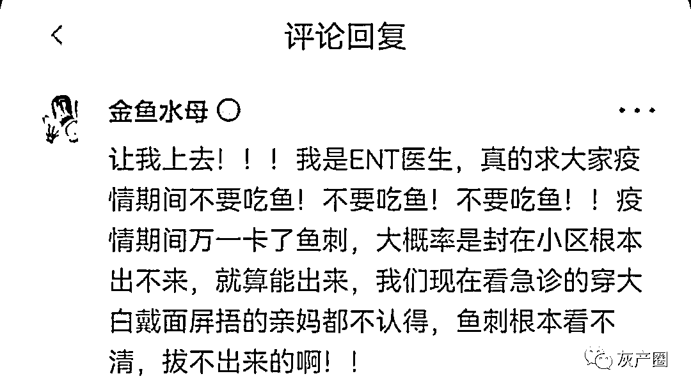
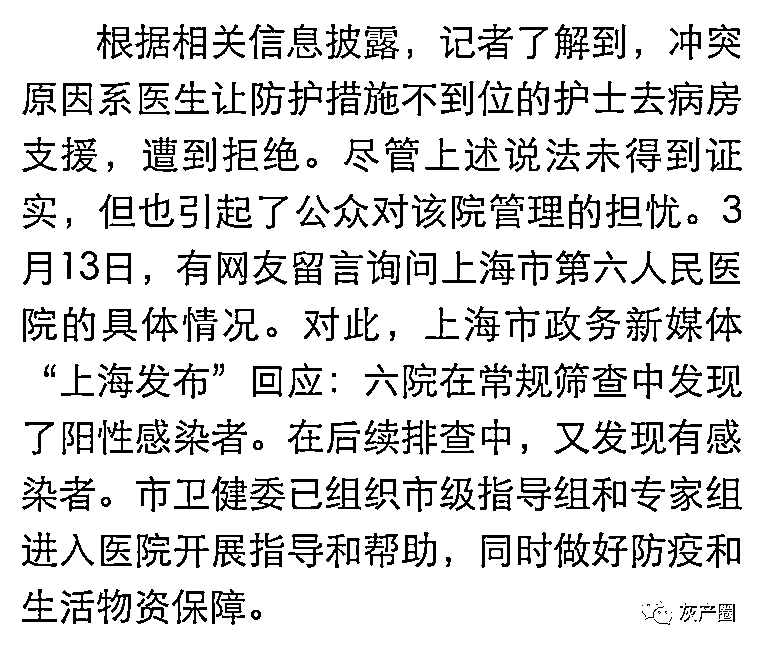
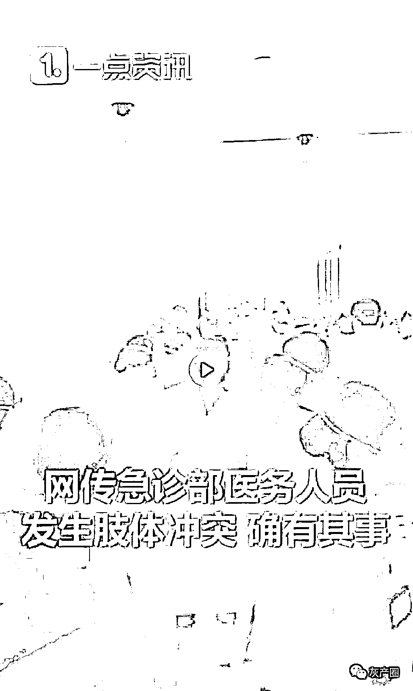
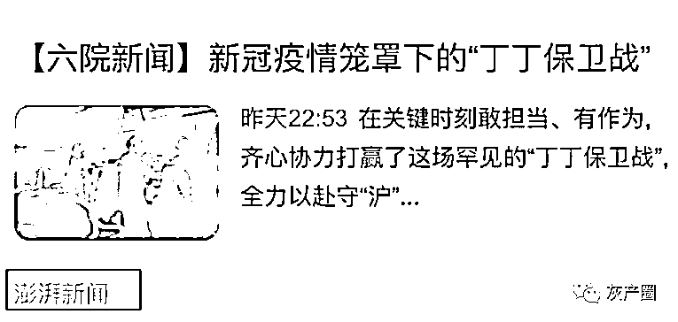
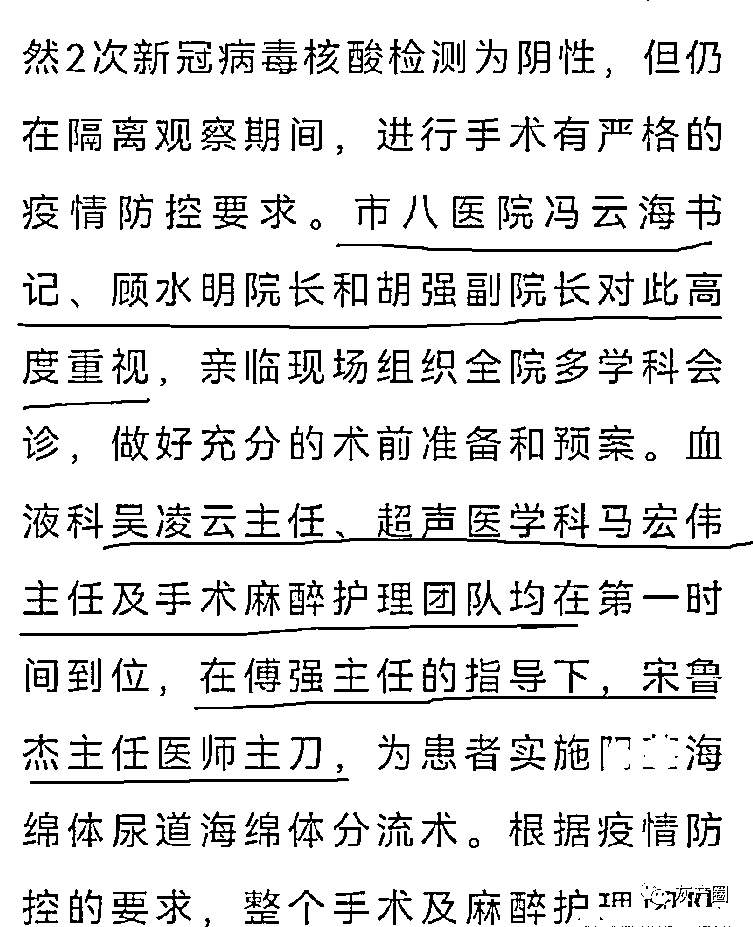
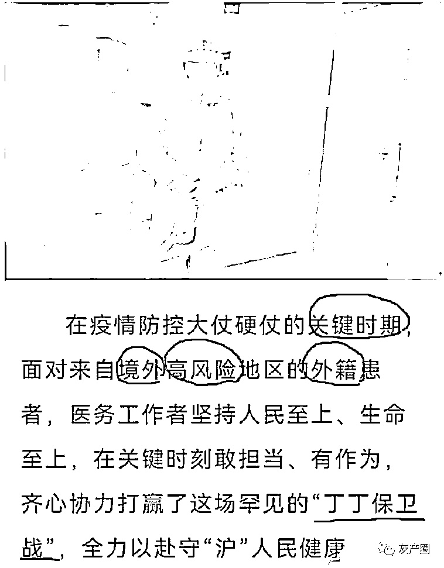
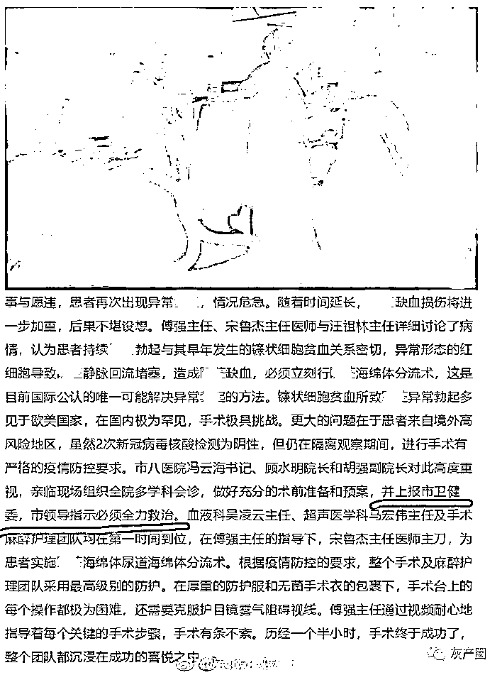
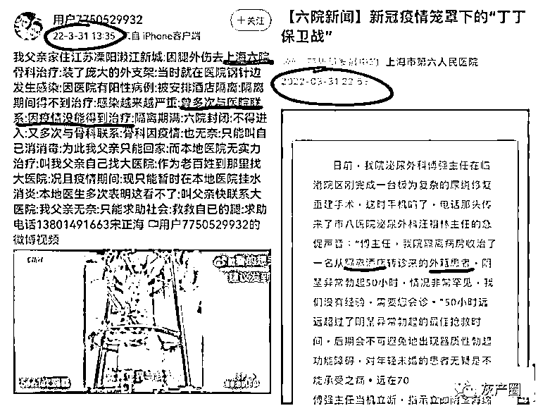
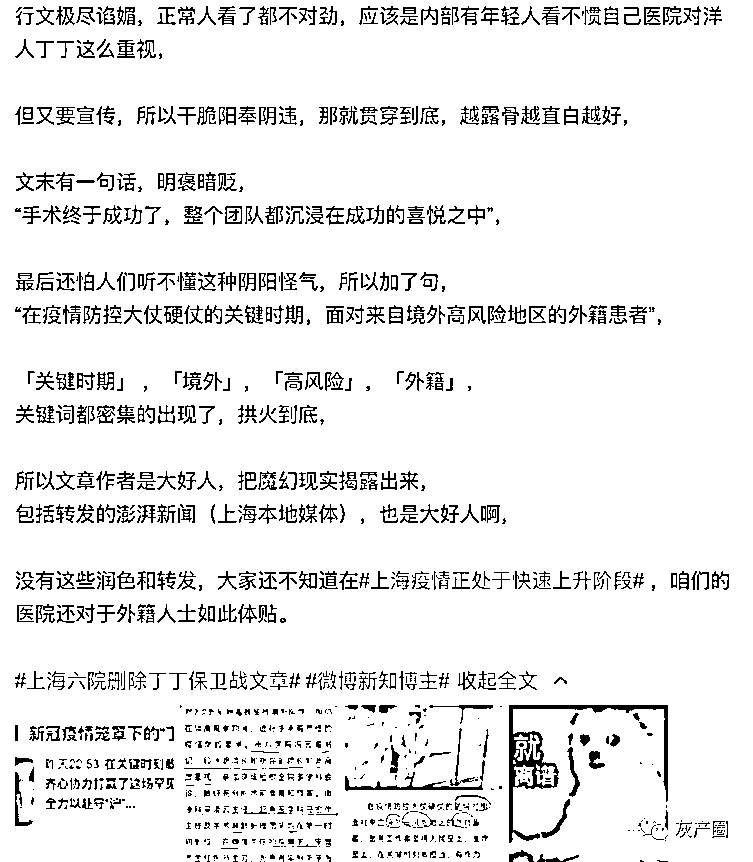

# 上海六院高调宣布保住了一名老外的 XX，宣称“丁-丁保卫战”，离谱到家了

> 原文：[`mp.weixin.qq.com/s?__biz=MzIyMDYwMTk0Mw==&mid=2247532772&idx=1&sn=5a9127640ed5f944f25d87843d44258d&chksm=97cb8bdca0bc02ca373bd4738d4131524a2ac05ffeaa3ed8170b814a0d1dcf898af42bf8df30&scene=27#wechat_redirect`](http://mp.weixin.qq.com/s?__biz=MzIyMDYwMTk0Mw==&mid=2247532772&idx=1&sn=5a9127640ed5f944f25d87843d44258d&chksm=97cb8bdca0bc02ca373bd4738d4131524a2ac05ffeaa3ed8170b814a0d1dcf898af42bf8df30&scene=27#wechat_redirect)

现在上海疫情处于快速上升期，全中国都知道上海医疗资源紧张，已经出现很多悲剧了 

尤其是最近的上海六院疫情和“医护肢体冲突”事件受到广泛关注。

3 月 11 日，上海六院曾出现医护肢体冲突事件，让护士无防护进隔离区导致医护大面积感染新冠，引起关注。

时隔半月，3 月 31 日晚上 10 点，上海市第六人民医院社交平台以“新冠疫情笼罩下的‘丁丁保卫战’”为标题，发布了一则紧急救治来自境外高风险地区的外籍患者的消息，一夜之间阅读量超过 7 万。消息发布后引起了网友不满，有网友称，该院的“差别待遇”让人无法接受。 

4 月 1 日上午，新黄河记者联系上海市第六人民医院，经核实该院泌尿外科确实进行了这样一次手术，但具体细节院方并未详细透漏，院方宣传部门表示目前不接收媒体采访。目前，该文章已经被删除。 

与之形成鲜明对比的是东方医院的护士、浦东的老人因为“遵循规则”没被救治身亡， 还有隔离酒店/封闭在家中苦苦请求救治的重症患者…很难不让人对一个城市一个系统感到心寒！

就在网友痛骂上海六院的时候，有微博博主觉得，这位上海六院的文章作者可能是故意的

* * *

iBingo:离谱它妈给离谱开门，离谱到家了

icerzhou:作为六院人，表示很无奈……临床一线干死干活，宣传科就偏挑这种内容报道……

陈昊然:“你失去的只是一条生命，他却失去了整个丁*丁啊”

来源：微博那些事儿

← 向右滑动与灰产圈互动交流 →

