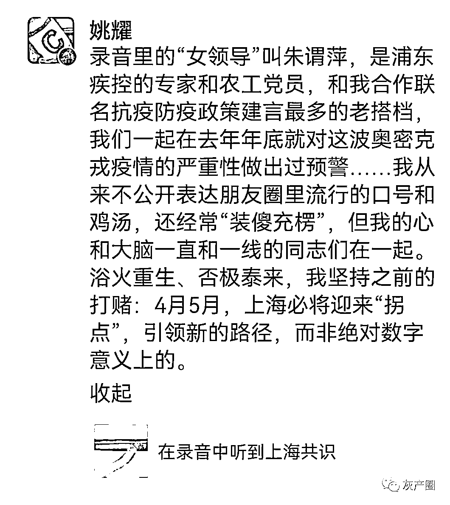
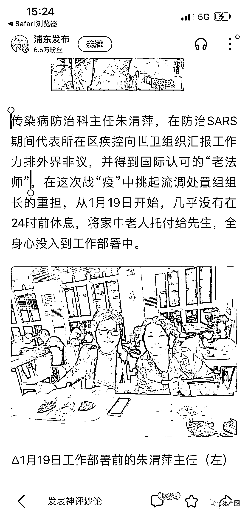

# 敢说真话的“女领导”

> 原文：[`mp.weixin.qq.com/s?__biz=MzIyMDYwMTk0Mw==&mid=2247532772&idx=2&sn=f175fd87bb33cacc78abb9f209955e39&chksm=97cb8bdca0bc02ca1178ba0b8052cf2a18a1b9e8cd76d383d63fe204b87befadf20bcde9e10c&scene=27#wechat_redirect`](http://mp.weixin.qq.com/s?__biz=MzIyMDYwMTk0Mw==&mid=2247532772&idx=2&sn=f175fd87bb33cacc78abb9f209955e39&chksm=97cb8bdca0bc02ca1178ba0b8052cf2a18a1b9e8cd76d383d63fe204b87befadf20bcde9e10c&scene=27#wechat_redirect)

今天流传一段 20 多分钟的录音，是一位上海男性市民和疾控中心女“领导”的对话。

这位男士的父母，正在酒店隔离。“前天”做了核酸，健康云上的结果是阴性，但是“今天”接到疾控中心电话，说是阳性。他不知道接下来要怎么做。

[`mp.weixin.qq.com/mp/readtemplate?t=pages/video_player_tmpl&action=mpvideo&auto=0&vid=wxv_2336680024852283394`](https://mp.weixin.qq.com/mp/readtemplate?t=pages/video_player_tmpl&action=mpvideo&auto=0&vid=wxv_2336680024852283394)

作为专家，这位女领导打了会太极之后说出了心声： 

1、疾控、健康云、医疗机构，现在都是各自为政，非常混乱；

2、家里老人尽量不要去方舱医院，居家隔离观察就好，无症状休息三五天就好了；

3、如果 120 来拉老人强制隔离，让他们出示“阳性”的证明，他们大概率拿不出来……

4、关于“有用的知识”，其实就是“无症状和轻症”，居家隔离是更优的选择，因为这个病也不需要特别的治疗，像对付感冒那样就可以扛过去。

5、如果都弄到方舱医院，条件很差，也不会有什么治疗，反而不利于病人康复。

6、 作为专业人员，我没发现这个问题吗？轻症无症的不要转走了，就在家里隔离，我都提了 n 次了，有人听过啦？没人听的啊！

7、要被逼疯了知道吧？我们专业机构也要被逼疯了，知道吧？专业人员说的话根本就没人听。现在把这个病变成了政治性的一个疾病。

在知道被录音有传播的可能，用如此直白的话语，说出了上海共识，难怪有人在评论里说，“这个领导有危险了”。

说真话，做人事，希望这样的女领导越来越多！

来源：喻言亭阁

← 向右滑动与灰产圈互动交流 →

