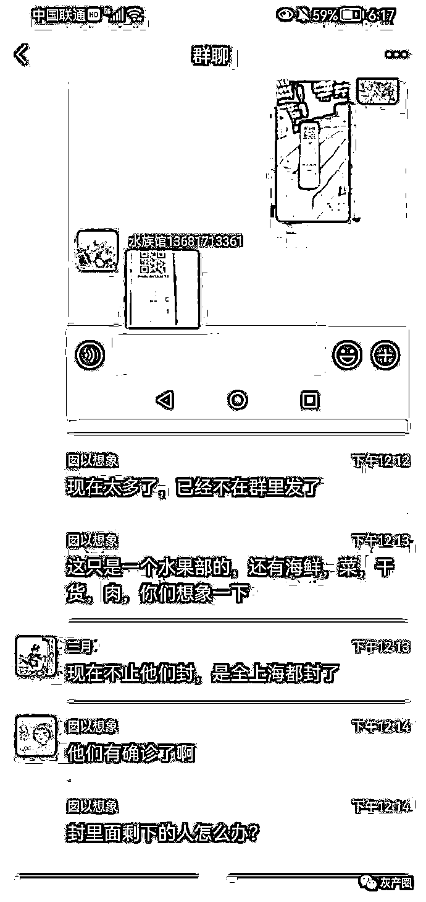

# 上海九亭八号桥市场 1000 多人封里面，发生交叉感染，微博求助后获救

> 原文：[`mp.weixin.qq.com/s?__biz=MzIyMDYwMTk0Mw==&mid=2247532772&idx=3&sn=bb1e23dfed8eb5a9ef58e7bf56525cc7&chksm=97cb8bdca0bc02caab6a8c3d4a40bfa6db4e4b44189b2f940e487f2f3e6da33a0089163ea097&scene=27#wechat_redirect`](http://mp.weixin.qq.com/s?__biz=MzIyMDYwMTk0Mw==&mid=2247532772&idx=3&sn=bb1e23dfed8eb5a9ef58e7bf56525cc7&chksm=97cb8bdca0bc02caab6a8c3d4a40bfa6db4e4b44189b2f940e487f2f3e6da33a0089163ea097&scene=27#wechat_redirect)

昨日，很多微博网友发微博求助，闵行区七宝八号桥批发市场的群众是不是也遇到了很大困难？ 

[`mp.weixin.qq.com/mp/readtemplate?t=pages/video_player_tmpl&action=mpvideo&auto=0&vid=wxv_2336379505185079296`](https://mp.weixin.qq.com/mp/readtemplate?t=pages/video_player_tmpl&action=mpvideo&auto=0&vid=wxv_2336379505185079296)

此求助在微博引发网友转发关注，昨晚已经得到妥善解决

包 hapi:2022 年，抗疫三年，难以想象，它发生在了国际化大都市:上海

Leon_Caesar:没有大家帮忙，他们还不知道要封多久

JIA 清风明月:上海出现这种情况让我万万没想到

来源：微博那些事儿

← 向右滑动与灰产圈互动交流 →

