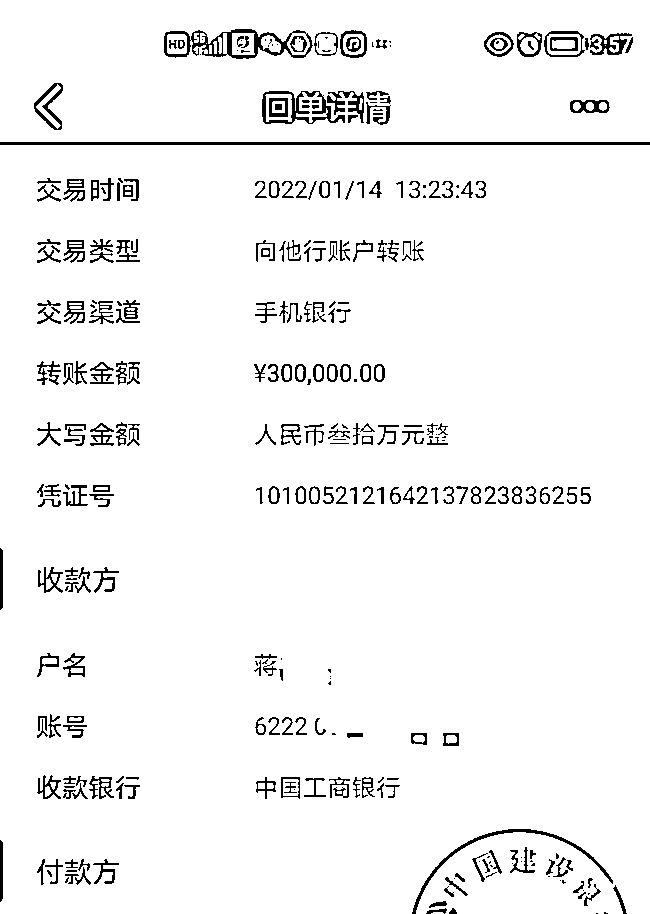
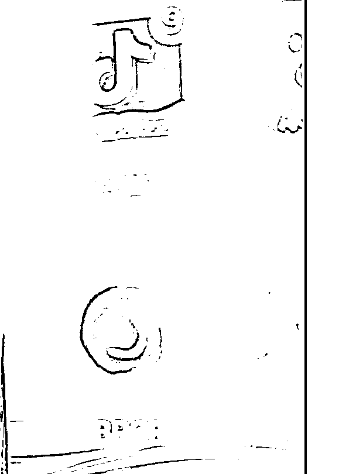
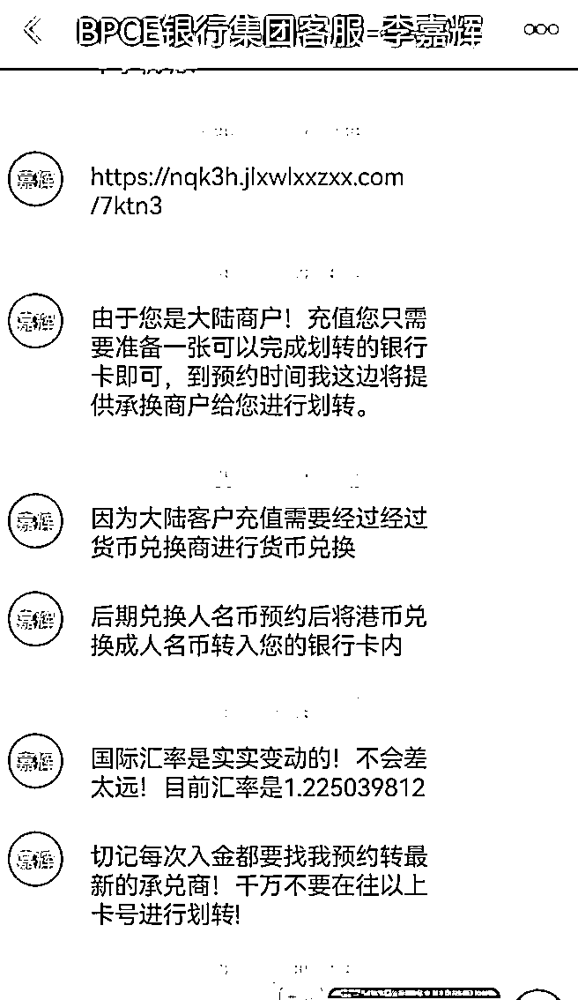
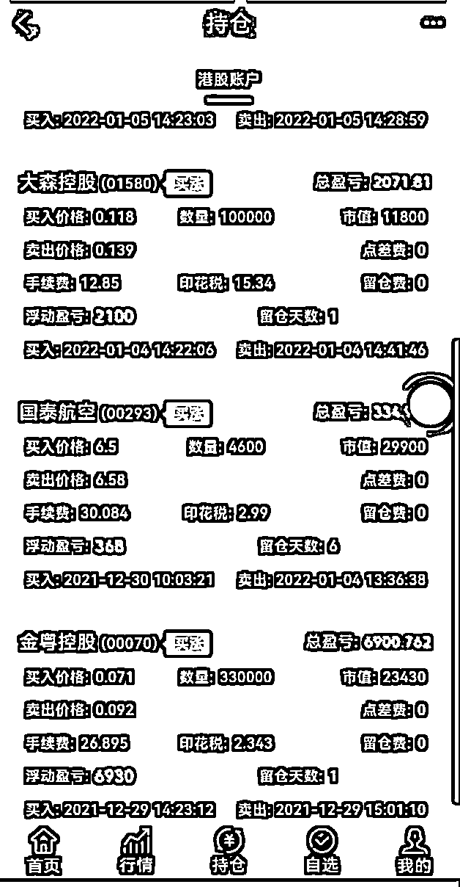
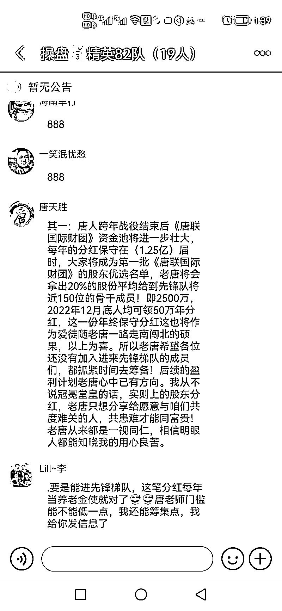
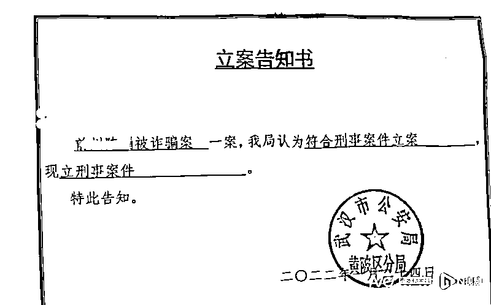
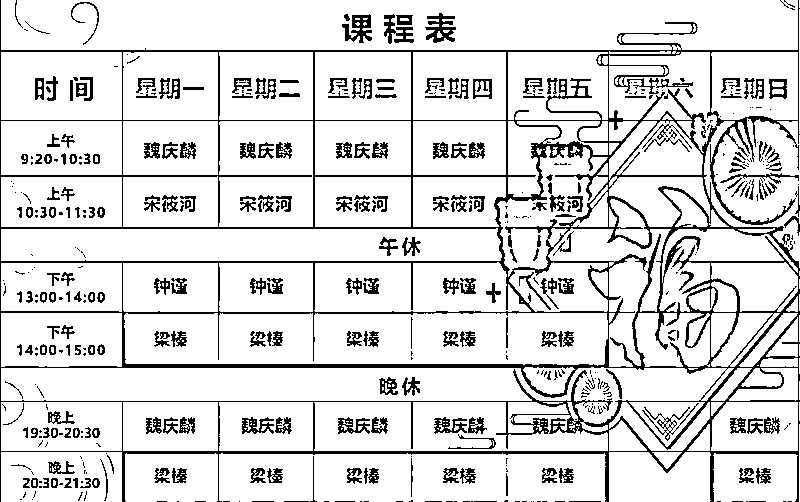
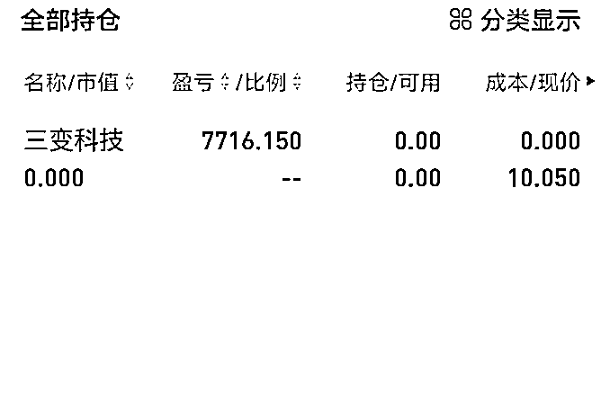

# 炒股 app 充值打新股却被骗百万，新型“杀猪盘”是怎么让人一步步入坑的？

> 原文：[`mp.weixin.qq.com/s?__biz=MzIyMDYwMTk0Mw==&mid=2247532772&idx=7&sn=b4b8419b5825acf757411877861153ad&chksm=97cb8bdca0bc02ca1daa7098f7524841d84db20dd015a878794620609ab9afe82815a92ae0f4&scene=27#wechat_redirect`](http://mp.weixin.qq.com/s?__biz=MzIyMDYwMTk0Mw==&mid=2247532772&idx=7&sn=b4b8419b5825acf757411877861153ad&chksm=97cb8bdca0bc02ca1daa7098f7524841d84db20dd015a878794620609ab9afe82815a92ae0f4&scene=27#wechat_redirect)

自去年年底南都报道虚拟货币杀猪盘后，有投资者日前反映，彼时正“撒网”的唐人联盟已得手，通过拟造的港股投资平台，卷走投资者大量资产。湖北武汉的一位投资者表示，其在“唐人联盟”事件中，损失资产近 450 万元。其目前已知有 35 位投资者自称被骗，金额累计近 2 千万元。

前述投资者表示，从接触该群体到损失资产，仅 1 个多月的时间。对比两次骗局可以看到，引诱前后投资者入局的是换汤不换药的“股市传奇”，在“投资大佬”指挥下，另类投资中存在的“货币承兑”商，正是背后操盘方收取投资者资金的账户。

仅 1 个月便成功实施，操盘者缘何次次得手？南都湾财社记者梳理看到，此次港股投资骗局中，背后操盘方同样搭建了一个交易平台，运用港市仙股低价位、易拉升特点，配合投资者上演了一场场真实投资场景。当建立足够的信任后，操盘方的“收割”镰刀即刻挥出。

千万元资金又流转到了何处？一位曾代理过类似案件的律师向南都湾财社记者表示，人们已习惯于从网络世界获取信息，又对投资理财等行为谨慎意识不足，投资者的资金一旦转出，多数流向海外，有一些转到东南亚的国家去了，尤其是没有管制的国家就被洗掉了。

陈泉提供其中一笔转账记录：1 月 14 日其向承兑商转账 30 万元

**祸起一篇推文 **

**股市传奇人物免费荐股**

去年 12 月，湖北武汉的陈泉在百度、新浪财经等平台浏览股票资讯时，注意到一篇唐天胜的宣传文章：“股市传奇唐天胜资产增值上千倍的创富神话！！！”。

该文章即为此前南都报道底部附有微信号的营销文。抱着好奇的心态，陈泉添加了唐天胜微信，也进入了一个建立在企业微信上的股票交流群。

陈泉偶尔关注群内消息。随着元旦假期来临，陈泉有了更多的自由时间，也注意到群内成员晒出的投资收益图。这时，一位群友李辉主动与其交流，表示自己是第五届参加唐人联盟的学员，当期跟随唐天胜已盈利 30%，并询问其是否购买唐天胜推荐的股票。

陈泉向南都表示，该次交流后，其“补”上了之前遗漏的有关唐人联盟的信息，了解到，群内成员正在唐人联盟推荐下，投资港股。“唐人联盟每天开直播课，在直播间中推荐股票。”根据陈泉提供信息显示，直播间的画面为股票 K 线图，或者 PPT，轮流直播的唐人联盟各成员均未露脸。

“唐天胜说起（自己）在汶川捐款，（是）慈善家，”陈泉回忆，唐还向群成员提议，成立一支唐人联盟先锋队，若每年盈利 100 万元，则捐出 20 万元给受灾群众。

**货币承兑商疑云**

慈善旗帜引导下，陈泉安装了法国 BPCE 银行软件。陈泉向南都湾财社表示，该软件为唐人联盟推荐。而在安装该软件前，陈泉咨询过金融从业人员，了解到法国 BPCE 银行确是一家正规金融机构。

陈泉所下载 BPCE 软件 商标与法国 BPCE 银行集团相似

当前，国内投资者投资港股有且仅有港股通一个正规渠道。唐人联盟提供的 BPCE 交易平台为陈泉等投资者开辟了另一条渠道，只是按照该平台规则，投资者需要事先将资金转入港元承兑商账户，完成充值，才能在该平台进行交易。

根据陈泉提供信息显示，一位名为 BPCE 银行集团客服-李嘉辉人士向陈泉表示，由于其为内地客户，充值需要货币兑换商进行货币兑换，并提醒其：“切记每次入金都要找我预约转最新的承兑商！千万不要在往以上卡号进行划转！”

名为 BPCE 银行集团客服-李嘉辉人士提醒其：“切记每次入金都要找我预约转最新的承兑商！千万不要在往以上卡号进行划转！”

陈泉对南都湾财社说，BPCE 软件是唐人联盟所推荐，与其接洽的平台客服也是唐人联盟引荐。当学员将资金转入承兑商账户后，其 BPCE 软件个人账户上，便出现了相应的港元资产，投资者所接触承兑商即有公司账户，也有个人银行账户。

记者就港元承兑商问题向业内人士咨询，多数表示并不了解这一概念。一位国际银行资深人士认为，港元承兑商这个词并未听说。不过，根据描述，这一手法是过去听说过的，主要用于跨境资金的转移。该人士表示，可能就是换了个名字，附加了一个买股票的功能，看上去正规，实则上不了台面。

德和衡简家骢永本金月（前海）联营律师事务所合伙人、律师杨琪解释表示，实际上，港元承兑商在内地，目前只有外汇、银行，以及特殊的汇兑公司等市场主体拥有类似的职能，但它有专门牌照，在国内也不普及。

**港市“仙股”上涨陷阱**

在 1 个多月的周期里，有一个至关重要的节点。陈泉表示，起初在 BPCE 账号里充值了 10 万元，买过几只股票，也赚了。“第一次提现 20 万元还能提出。”

“一次直播课的时候，大概 2 点半，让大家买股票，15 分钟后股票就涨了 30%。”陈泉表示，彼时，其将此情况与正规的炒股软件进行比对，发现 BPCE 软件与其日常使用的炒股终端所显示的实时数据一模一样。

根据一位河北投资者提供资料，12 月 29 日，其通过 BPCE 软件，以 0.071 港元/股的价格买入 33 万股金粤控股（00070.HK），半小时后以 0.092 港元的价格卖出，该笔交易盈利 6930 港元。

12 月 30 日，其又以 6.5 港元的价格买入 4600 股国泰航空（00293.HK）股票，1 月 4 日以 6.58 港元的价格卖出，盈利 368 港元。

1 月 4 日，其买入 10 万股大森控股（01580.HK），价格为 0.118 港元，20 分钟后卖出，盈利 2100 港元。

一位深圳投资者也向南都湾财社表示，经过这几笔交易，看到 BPCE 软件的表现与正规平台同步，BPCE 软件俨然成为“正规军”。

从正常交易，到半个月后平台突然关闭，陈泉与其他投资者复盘时注意到，唐人联盟在直播间让学员集中买入的股票均为港市“仙股”，前述几笔成功的交易，是针对投资者设下的“迷魂阵”。

“这些股票的价格都非常低，且几乎没有流动性。”陈泉与其他投资者推测认为，在投资者接到唐天胜指令，将资金转入相应账户后，操盘方在背后于指定时间从港股证券买入同一股票，实现拉升，才让投资者产生真实交易之感。

这也解释了为何唐人联盟选中的是仙股，投资者认为，仙股价格低，无须多少资金就可实现拉升。

以金粤控股为例，历史数据显示，12 月 29 日，该股的确在下午突然拉升，当日成交量为 163 万股，而成交额仅 14.26 万元，涨幅高达 29.5%。

河北投资者展示其在 BPCE 软件上的交易记录

**“跨年战役”吸引入局 **

**话术引诱加大筹码**

2021 年 12 月 31 日，北京派尔特医疗科技股份有限公司（下称“北京派尔特医疗”）向港交所递交招股书，拟在香港主板挂牌上市。这是该公司继 2021 年 6 月 29 日递表失效后的再一次申请。

陈泉表示，同一日，唐天胜在直播间中向学员介绍正式启动的“唐人联盟跨年战役”。此后也经常在直播间及交流群中宣扬这一活动，并开始“募集”资金，并根据资金的规模，划分等级。

一位投资者提供截图显示，唐天胜与其私聊时表示，若该投资者能加大资金至百万，则唐将携带其与部队短线获利 150%，再参与“跨年战役”，以获得雪球效应。

同时，唐天胜向群成员表示，此次“跨年战役”结束后，资金池将进一步壮大，每年分红保守在 1.25 亿，“选中”的学员将成为《唐联国际财团》股东，而“先锋队”成员每年年底均获得 50 万元分红。

在经历过几次仙股投资教育后，陈泉表示，投资者已对唐人联盟深信不疑。北京派尔特医疗是唐天胜所谓“跨年战役”推出的第一只股票。

陈泉回忆称，当时唐人联盟的另一个成员让学员全仓打新北京派尔特医疗。“全仓买入后，唐天胜又跳出来说，下一轮的跨年战役，怎么去买，唐又让学员再加资金，称还有十几只标的股。”

根据陈泉提供信息，1 月 10 号，其向个人账户尤某转账 30 万元；1 月 14 日，向个人账户蒋某转账 30 万元；1 月 17 号向个人账户毛某转账 20 万元。陈泉表示，唐人联盟“跨年战役”中，其先后累计转入 450 万元。

“因为港股是要冻结 15 天的，（这 15 天内）我们就取不出了。”陈泉表示，而首只新股推出后，唐人联盟没再推荐股票。“一个星期后，没动静了，后来提现，平台就没有了。”

陈泉表示，目前，群内投资者统计得出，已知有武汉、重庆、河北、浙江、广东、西安等全国多地 35 位投资者自称被骗，累计资金超 1800 万元。

陈泉提供群内截图

**承兑商与企业微信运营主体指向何处？**

陈泉表示，在平台无法打开后，其向当地警方报案，现已收到立案告知书，而其他投资者也已向当地警方报案。据陈泉提供资料显示，武汉市公安局黄陂区分局在 2022 年 1 月 24 日向陈泉发送立案告知书，该局已立刑事案件。

陈泉提供立案告知书

陈泉向南都表示，前述尤某、蒋某、毛某的银行账户均是 BPCE 客服提供的“港元承兑商”账户。此外，也有对公转账的情况。根据陈泉提供信息，一位投资者在 2021 年 12 月 27 日向沈阳优卓普科技有限公司转账 20 万元。天眼查信息显示，沈阳优卓普科技有限公司玉 2021 年 9 月 2 日成立，法定代表人：董闯。

除了港元承兑商的账户以外，投资者还表示，与唐人联盟对接中，还使用过企业微信交流群及微信公众号。

根据投资者提供信息，唐人联盟对外宣传的微信公众号有两个，背后运营主体分别为广州泽曜坤投资咨询有限公司及广州泽治汇投资咨询有限公司。

值得注意的是，两家企业的注册地址十分相近。广州泽曜公司注册地址在广州市天河区员村一横路 7 号，而广州泽治公司，注册地址在广州市天河区员村一横路 11 号之二。

此外，前述两家企业均成立于 2021 年 7 月 18 日，法人代表均为杨天华，且股东中也包括莫胜满。

而去年年底南都曾报道，唐人联盟推出的微信交流群建立在一个公众号中，该公众号账号主体为广州泽运莱投资发展有限公司。天眼查信息显示，泽运莱成立于 2021 年 7 月 19 日，法人代表为莫胜满，注册地址为广州市天河区员村一横路 1 号。

**从虚拟货币到港股投资骗局 **

**关联企业注册地址接近**

广州市天河区员村一横路上注册的企业在去年年底及今年年初的 2 次“杀猪盘”中频繁出现。

去年 10 月，有投资者曾被名为“财昇社”群体以投资虚拟货币的名义卷走投资款。彼时，投资者对接的企业微信号，正是一家在广州市天河区员村一横路 11 号之二上注册的企业。

深圳市民张女士向南都湾财社表示，其一直以来持续关注“财昇社”群体，去年 10 月“财昇社”消失之后，已有牛途研究院、小红牛、龙虎榜 3 个“马甲”相继出现。这三个群体与“财昇社”在对接方式、直播页面上均保持一致。

财昇社被骗投资者深圳张女士表示：小红牛群体直播方式与财昇社相似

**同一链接下**

**多个“股市传奇”相继上演**

3 月 2 日，南都湾财社记者收到陈泉转来的一条今日头条链接，标题显示：“股市传奇唐天胜资产增值上千倍的创富深化！！！”。打开链接后，却是名为岳万军人士的介绍：“年赚 8000 万，平民股神岳万军独创 “天道战法” 震惊整个股坛！引 2 万股友加入！！”

文章展示了岳万军其中一个账户的交易情况，南都湾财社记者比对发现，与此前报道财昇社黎郝峰、牛途研究院王鸿山、唐人联盟唐天胜宣传文章中的一致。

当前，岳万军群体让投资者下载了一款名为“专聊”的 APP，群内人数现有 129 人。3 月 21 日，该群体推荐了一只股票三变科技(002112.SZ)，已有群内成员晒出持仓截图，表示盈利 7716 元。

岳万军建立的交流群中已有成员晒出盈利图

一位深圳投资者向南都湾财社记者表示，辨认岳万军直播课的声音，其认为岳与唐天胜为同一人，两人声音一模一样。

4 月 1 日，南都湾财社记者再次打开该链接，已更新为另一人的介绍：年赚 8000 万，股神“刘志强”专访 分享出十余载投资秘法！【佛学交易心法】震惊整个股坛！引数万股友加入！！

**曾代理类似案件律师指出 **

**相关账户多为空壳公司 **

**建议投资者提高警惕**

从始至终，投资者未与唐人联盟有过直接接触，也无从了解背后操盘方究竟何人。一位曾代理过类似案件律师告诉南都湾财社记者，其曾追踪过投资者的资金，也封了相应的银行账号，但发现，最后都流到海外去了，多是位于东南亚的一些国家，尤其在没有管制的国家就被洗掉了。

德和衡简家骢永本金月（前海）联营律师事务所合伙人、律师杨琪表示，在这类案件中，投资者都是看到了一个宣传的文章，介绍投资大佬投资能力很强，就被拉进了微信群。实际上，微信群内很可能大部分都是“托”，托之间互相吹捧，日常就在群内营造高收益的氛围。

杨琪介绍，投资者都会用到一个理财或者类似理财的 APP，注册账号后，看起来可以在里面炒股，股票的走势、投资金额，包括买的什么股票 APP 上都有。但实际上，它可能就是一个类似模拟盘。因为对于内地投资者，除了港股通渠道，没有其他渠道投资美、港等境外市场。因此这个 APP 就好像是蓄意诈骗的，而且是部署在境外。

“我们追踪过投资者的资金，也去封了账号，最后都流到海外去了。”杨琪表示，投资者首先转出的那个账号既有公司也有个人，但许多都是空壳公司，都是拿来收钱的，比如公司的股东、董事，都反映说自己丢了身份证，或者不知情。转账到个人账户的话，资金流到海外，就很难追查。

“一般投资者的钱都通过地下钱庄转到柬埔寨等东南亚国家了，就洗钱洗走了，资金跨境后追回来的都很少，基本上到境外，特别是一些没有管制的国家就被洗掉了。”

杨琪表示，其接触过的投资者中，也有 IT 界的高管，因为投资者首先身处 IT 行业，习惯于从网络世界里获取信息，防范意识不强，感觉 APP 好用，就用了。杨琪表示，对于理财投资等事件，建议投资者提高警惕。

中国政法大学刑事司法学院副院长、教授王志远表示，对于防范此类事件再次发生，其建议从社会管理的角度强化对相关类型 APP 的审查与认证。就投资者本人而言，除提高警惕外，建议通过官方认证的正规渠道开立账户；其次是实现对转账等资金处分行为的个人全程管控。

来源：南方都市报 APP • 湾财社，记者叶霖芳

← 向右滑动与灰产圈互动交流 →

