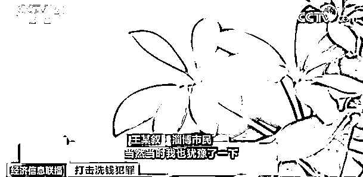
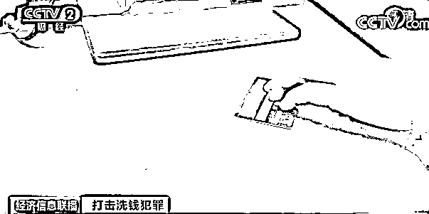
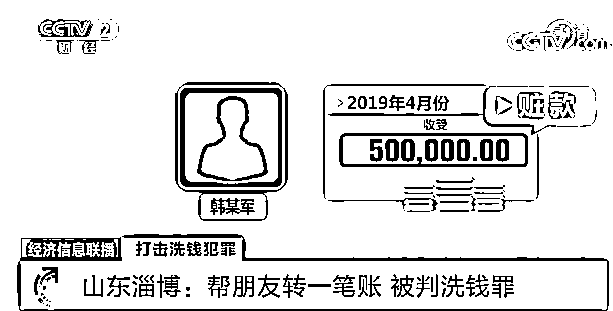

# 帮朋友转一笔账，被判洗钱罪？小心这个操作！

> 原文：[`mp.weixin.qq.com/s?__biz=MzIyMDYwMTk0Mw==&mid=2247532772&idx=8&sn=4af7e9284afa2800a4464d768477a3a5&chksm=97cb8bdca0bc02ca9f249bb98f20719c7dc0d14748317ef56c71f2ca68d60e9773b013649df5&scene=27#wechat_redirect`](http://mp.weixin.qq.com/s?__biz=MzIyMDYwMTk0Mw==&mid=2247532772&idx=8&sn=4af7e9284afa2800a4464d768477a3a5&chksm=97cb8bdca0bc02ca9f249bb98f20719c7dc0d14748317ef56c71f2ca68d60e9773b013649df5&scene=27#wechat_redirect)

从今年 3 月开始，央行等 11 部门联合发布的《打击治理洗钱违法犯罪三年行动计划》全面实施。行动计划要求，各部门联合加大力度惩治犯罪，同时强调全社会要提高民众的反洗钱意识。那么，反洗钱跟我们的生活有什么关系呢？ 

[`mp.weixin.qq.com/mp/readtemplate?t=pages/video_player_tmpl&action=mpvideo&auto=0&vid=wxv_2333022249911549955`](https://mp.weixin.qq.com/mp/readtemplate?t=pages/video_player_tmpl&action=mpvideo&auto=0&vid=wxv_2333022249911549955)

央视财经《经济信息联播》栏目视频

**山东淄博市民王某叙，经营着一个小的日用品商贸公司，因为帮朋友转了一笔账，他却被判了洗钱罪。**

这还要从两年前说起。当时，找王某叙转账的是他的朋友韩某军，这位韩某军是当地妇幼保健院的一名干部。王某叙表示，有一天韩某军找到自己，称要用自己的银行卡，当时心里犹豫了一下，但是关系都挺好，没多想就把银行卡给了韩某军。 

当天下午，**王某叙的这个银行账户上转来了 50 万元人民币，随后，王某叙按照韩某军要求，把这 50 万元又转给了韩某军指定的另一个账户。**之后他很快就忘掉了这件事。

2021 年，韩某军贪污受贿事发。办案组追踪的资金流向显示，韩某军为掩人耳目，让行贿人把 50 万元行贿款打到朋友王某叙账户上，随后让王某叙再转到他妻子汪某的账户上。在韩某军被留置之后的第二天，他的妻子就将这 50 万元资金换作美元汇往了境外。

**确认这笔贿款后，检方对韩某军妻子及王某叙一并提起洗钱罪起诉。**

淄博市临淄区人民法院认为，**被告人王某叙明知是他人受贿犯罪所得，为掩饰隐瞒其来源和性质，通过转账协助转移资金，其行为已构成洗钱罪。**因其有自首情节从轻处罚，**依法判处有期徒刑六个月，缓刑一年，并处罚金五万元。**

来源：新华网，央视财经（ID：cctvyscj）

← 向右滑动与灰产圈互动交流 →

