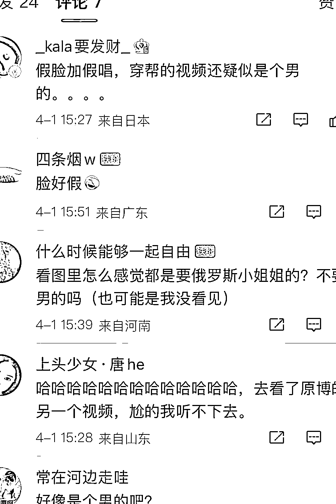

# 什么？吸粉 200W 的“俄罗斯美女”竟然是中国人！

> 原文：[`mp.weixin.qq.com/s?__biz=MzIyMDYwMTk0Mw==&mid=2247532852&idx=1&sn=5b441f4471c650274df68bb530c72110&chksm=97cb8a0ca0bc031a2e14bc139669979afa68c7b8925d3c6f6d4e2e41ac9b416827e722a2cb81&scene=27#wechat_redirect`](http://mp.weixin.qq.com/s?__biz=MzIyMDYwMTk0Mw==&mid=2247532852&idx=1&sn=5b441f4471c650274df68bb530c72110&chksm=97cb8a0ca0bc031a2e14bc139669979afa68c7b8925d3c6f6d4e2e41ac9b416827e722a2cb81&scene=27#wechat_redirect)

某音上一个 200W 的网红翻车了，这个世界又多了一个彻头彻尾的网络骗子！

[`v.qq.com/iframe/preview.html?width=500&height=375&auto=0&vid=d3329misgnf`](https://v.qq.com/iframe/preview.html?width=500&height=375&auto=0&vid=d3329misgnf)

这个骗子的账号叫做“俄罗斯娜娜”，不知道大家平常有没有刷到过她。

如果只是看头像和名字的话，乍一看可能会觉得她是个在中国生活的俄罗斯人。

在我国的外国人玩某音一般有两个极端，一种是正常人，日常分享下在中国的生活、展示展示才艺啥的，另一种就是无脑夸中国多好多牛掰，这个俄罗斯娜娜就是后者。

点进她的账号主页，会发现她每个视频的套路都是如出一辙，先是说几句亲近中国的俄味普通话，最后再唱上一支中国歌曲，还必须是歌颂中国的那种！

一路唱下来，粉丝直逼 200 万了。

随手翻了下她的评论区，评论内容基本上都是友好和赞美。

有夸她唱得好的：

有祝中俄友谊长存的：

还有说她太美好了的：

在这么正能量的舆论环境下，这位“国际友人”也与时俱进，开始带货了。

带货品类和她的人设十分吻合，什么“中俄合资牛筋肠”、俄罗斯进口巧克力威化饼干、糖果啥的，大部分买的人都非常的信任她，觉得“俄罗斯人”推荐的东西，应该不会太差。

所以娜娜的带货之路，可谓是顺利的不可思议，随随便便一款产品拿出来都是成千上万的销量，她还时不时的接个广告，不用猜都知道她赚的盆满钵满。

不过好景不长，慢慢的开始有粉丝察觉出她的不对劲了。

首先是她唱的歌，多看几遍就能看出来，她有存在对口型的情况；

其次，有在俄罗斯生活过的网友指出，她“俄里俄气”的发音和语法，根本就不是俄罗斯人说话的方式；

最有槽点还是她的长相，有人发现她面部线条非常不自然，有些时候动作很生硬，感觉更像是 AI 换脸……

随便放一个视频给大家感受下：

[`v.qq.com/iframe/preview.html?width=500&height=375&auto=0&vid=l3330hbknur`](https://v.qq.com/iframe/preview.html?width=500&height=375&auto=0&vid=l3330hbknur)

当有人开始质疑她，让她用俄语“自证清白”，她从来都只会说一句“我爱你”，就不说别的了…… 

漏洞如此之多，结局就是被机智网友揭穿。

原来她的脸是化妆加上十级美颜特效搞出来的，根本就不是俄罗斯人，而是纯纯的中国人！

甚至还有人推测，俄罗斯娜娜不仅不是俄罗斯人，很有可能都不是个女人！

[`v.qq.com/iframe/preview.html?width=500&height=375&auto=0&vid=z3330mo9cyc`](https://v.qq.com/iframe/preview.html?width=500&height=375&auto=0&vid=z3330mo9cyc)

[`v.qq.com/iframe/preview.html?width=500&height=375&auto=0&vid=b3330fb757a`](https://v.qq.com/iframe/preview.html?width=500&height=375&auto=0&vid=b3330fb757a)

网友被她骗的苦啊，又是点赞又是花钱的。

说到底也不是她骗术有多高超，毕竟漏洞百出，但是为什么还是有那么多人上当？

归根结底，流量密码罢了。

最近的俄乌战争，让大家都关注起俄罗斯人的生活状态，前段时间网购抢爆俄罗斯国家馆零食的热搜让这位俄罗斯娜娜嗅到了一丝“商机”，于是就开始利用假人设博眼球，最终目的自然是变现。

说的难听点，就是恰烂钱。

想起来前段时间那个李赛高，靠着 jun 人标签+唱中国歌曲迅速走红，靠着一句“这里是缅甸北部，我生长的地方，欢迎来到我的世界，我尊贵的小公主”吸粉无数。

但后来却被扒出来是诈骗团伙营销的产物，做的是坑蒙拐骗的“生意”。

即使是这样，还有一些“狂热粉”不相信，觉得人家不仅长得帅还赞美中国，怎么可能是噶腰子的？

最后也只能啪啪打脸了。

总之，网络世界五花八门无奇不有，我们作为看客，也不能失去基本的辨别能力。

来源：吃瓜不吐葡萄皮

← 向右滑动与灰产圈互动交流 →

