# 3100 字剖析！上海“共存”的妖风，还要刮到何时？

> 原文：[`mp.weixin.qq.com/s?__biz=MzIyMDYwMTk0Mw==&mid=2247532852&idx=2&sn=23e04b54056f7b8e5d54996a0b739cf7&chksm=97cb8a0ca0bc031a47a3ae67a2ae1e4a09f753a627ff2bc08ed22b90d4ac1f3efe21dff2ee24&scene=27#wechat_redirect`](http://mp.weixin.qq.com/s?__biz=MzIyMDYwMTk0Mw==&mid=2247532852&idx=2&sn=23e04b54056f7b8e5d54996a0b739cf7&chksm=97cb8a0ca0bc031a47a3ae67a2ae1e4a09f753a627ff2bc08ed22b90d4ac1f3efe21dff2ee24&scene=27#wechat_redirect)

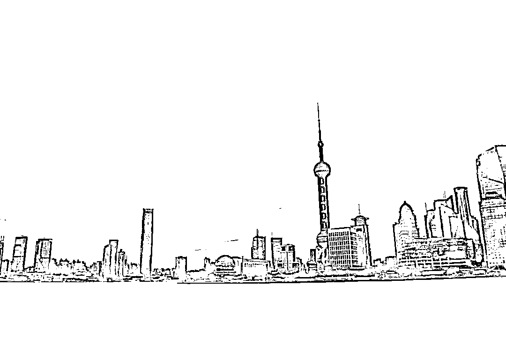

有没有一种可能，借着“上海市疾控中心人员”之口，宣传“与病毒共存”论，从而更舒服地躺平。 

这两天，估计很多人都听过这段录音了。 

这是一上海市民给疾控中心打了投诉电话，说健康云是绿的，但是疾控给打电话说阳了。

简单归纳如下：

**①健康云不准，阳性也显示阴性，是否阳性以疾控中心为准；**

**②如果阳性最好居家，没必要送方舱医院；**

**③迄今没有危重症、死亡病例，打了三针疫苗的情况下，新冠就是大号流感；**

**④上海医疗资源出现严重挤兑，但这是人为造成的，大量的医生被抽调去做其他事；**

**⑤专家已反复提意见，但没人听。**

后来这件事情甚至引出了浦东新区的卫健委的调查和回应。

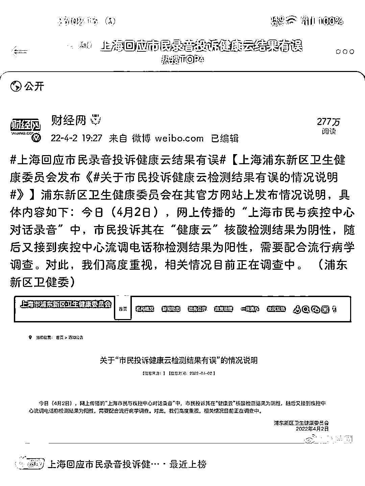

图源：财经网 

这位在电话里这么勇的人是谁？

正是汪老师采访中的这位上海浦东疾控中心传染病防治科主任朱渭萍。 

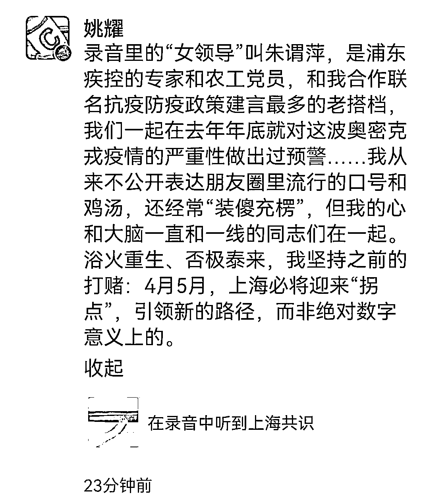

职业科普人汪诘也在一篇《[面对疫情，上海人真正怕的是什么？](https://mp.weixin.qq.com/s?__biz=Mzk0MzMyMzg2OA==&mid=2247511286&idx=1&sn=5ed9001f7b9c5ec1184fd180486701c2&scene=21#wechat_redirect)》中披露了对这位专家的访谈，结论类似：

**①上海本轮疫情无危重症，几乎 100%的感染者，不打针不吃药，10 天至半个月就会自愈，核酸转阴；**

**②从超过 4 万感染者的临床来看，绝大多数人后遗症轻微，且慢慢都会消退；**

**④上海公布的无症状感染者不是指“没有发烧、咳嗽等症状”，而是指“虽然核酸检测阳性，但没有 CT 影像学资料确定的肺炎症状”。**

看看这位朱专家的履历，我相信她在传染病方面的权威值得信赖。

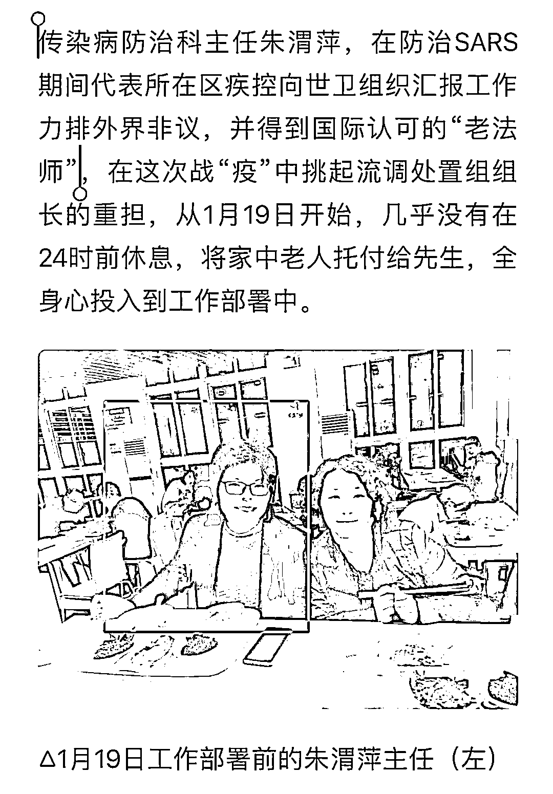

但我越看采访，反而越迷糊了。 

**感谢两位专家老师的采访，欣赏她们肯说真话，勇于揭盖子的勇气，但我并不完全同意他们的观点。** 

**-1-** 

**数据真的可信吗？** 

先说上海的病例数据，从 3 月 1 日到 4 月 1 日，一个月的时间 42952 名确诊患者。

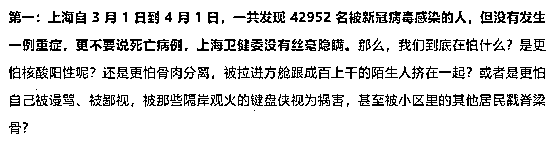

我想知道，这个数据对吗？ 

电话录音中的上海市民说健康云是绿的，但是疾控给打电话说阳了，这位朱专家也说健康云不准。

**每天报送国家卫健委的数据是按哪个算呢？** 

**上海的每日新增数和新冠无死亡还可信吗？**

既然健康云的核酸结果已经不可信，打破信任之后，什么都变得不可信了。

香港的新冠死亡率是 0.1%以上，医疗系统被击穿后是 0.7%，上海四万人一个重症都没有。

要解释这种现象，有两种可能性：

**①有另一种因素导致了这种情况，这种因素在上海和其他地方有很大不同。**

**②有一方数据有误。**

剩下的，我不多说了。 

**-2-** 

**几乎 100%自愈？**

作为一个死抠文字的人，几乎 100%，99.9%是不是几乎百分百？

请问“几乎”约等于百分之几？

**这是语病句，谢谢。** 

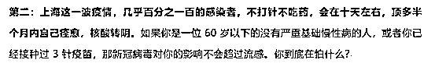

**几乎百分百这个词出自一个疾控专家嘴里，但凡接受过九年义务教育且有一点点常识的人都不会面对疫情说出几乎百分百痊愈出来。**

百分百自愈，可能是说，治疗不治疗没什么区别。

好了的都是自愈的，没好的也不是治死的？

**我可不可以理解：为躺平做舆论铺垫。**

上海的专家说这次的疫情规模比当年武汉大，但疾病严重性比武汉低。

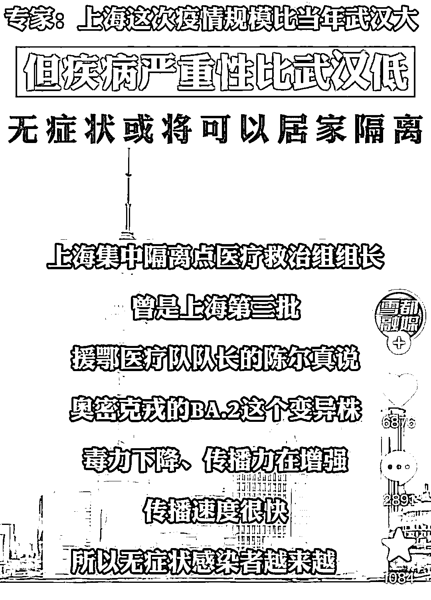

就是传播力极强，但症状轻微，有人揶揄：**“感染阳性之后要赶紧治，不然过几天就自愈了。”**

香港这波疫情 3 个月死了 7800 人。

**那么上海的专家为什么会给出 100%自愈的说法呢？**

比起让疫情失控的上海疾控专家，和微博上来路不明的录音，我更相信两年累白了头的吴尊友。

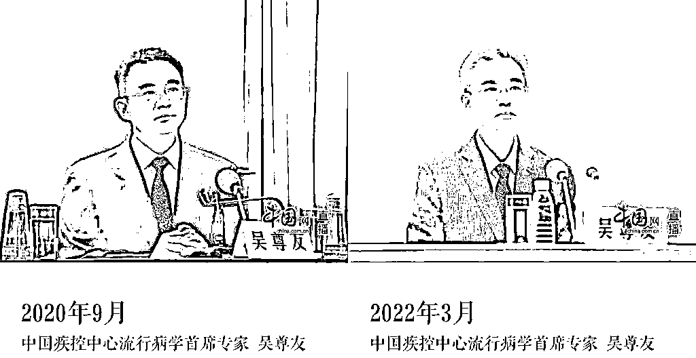

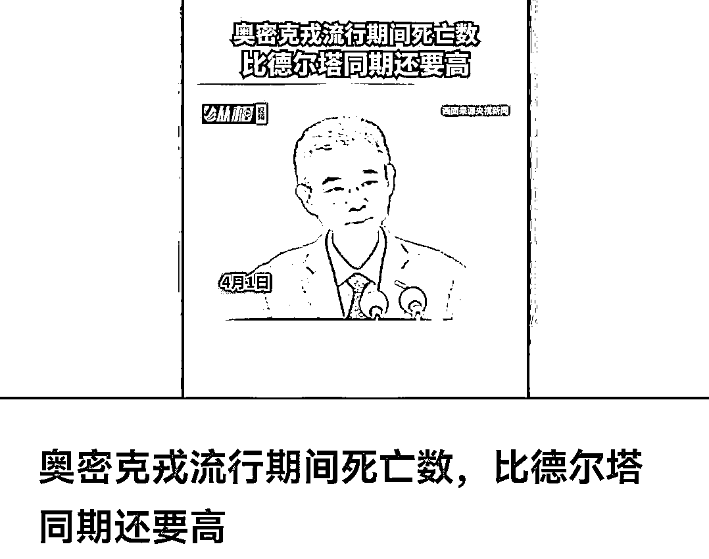

**吴尊友说：奥密克戎流行期间死亡数，比德尔塔同期还要高。**

就这一点，我就越加怀疑：真能百分百自愈吗？真没有重症吗？真没有死亡病例吗？ 

**-3-** 

**最佳的应对措施是居家隔离？** 

两位医生本意是，由于现在上海医疗挤兑的情况，呼吁症状轻微的患者不要因为恐慌，占用现在本身就稀缺的医疗资源，而是暂时居家隔离等待官方进一步处理。

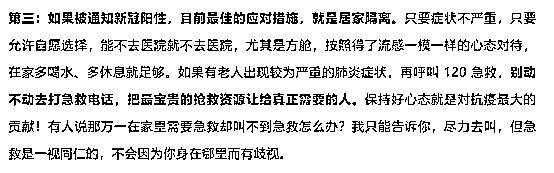

这点我同意，但这路子是不是有点熟悉——香港式抗疫？ 

**问题是你不先清零，这法子有用？**

**居家隔离，就要做好全单元、全里弄 60%的人感染的思想准备。**

按照上海 2500 万的人口，参照大规模疫情扩散后西方城市 10-20%的检测阳性率（按传染性更低的早期毒株），上海如果走西方的轻症居家路线，等于家庭内全部感染、社区内传播。

**最终如果预估感染 250-500 万，那么预估新冠死亡 17000-34000 例，估计大部分都是老人。**

还要加上住院率重症率，给医疗系统带来的负担，还有其他因为医疗、食品、经济、社会各种问题的附带伤亡另算。

谁能接受？

我这还只是在计算冷冰冰的数字，但每一个去世的人，都可能是谁的父亲、母亲、爷爷、奶奶...... 

**还是那句话，谁家没有自己的长辈，谁家没有自己的孩子。**

**-4-** 

**为什么必须要先清零？**

**一个区域要不彻底清零，要不就新增病例源源不断。**

请参考 2020 年武汉疫情期间对王辰院士的采访:

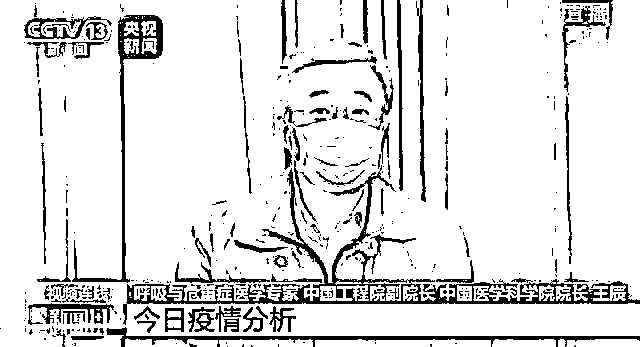

白岩松：武汉的防疫形势如何？

王辰：可以说是形势严峻，大批的患者未能及时收治到医院中。**而这批患者在社会上的流动、在家里居住，会造成社会和家庭进一步的感染，这是加剧疫情的最重要的因素。**

当年武汉初期居家隔离的效果不好，新增病例还是不断出现，常常出现**“一人传一户，一户传一楼”**的情况。

**正是王辰院士提出“方舱医院，应收尽收”，有了雷神山、火神山医院，才彻底切断了新冠的传播。**

上海的老里弄至今都是多户共用一个卫生间，共用做饭区域，没有互相隔离的条件。

高层住宅的下水道存在气溶胶传播。

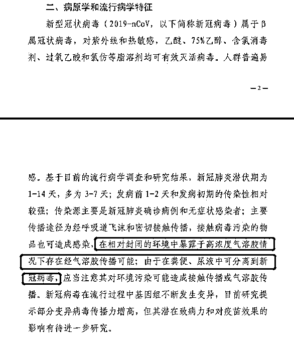

**可以这么说，有阳性的情况下“居家隔离”就等于“社区传播”。**

为什么阳性感染者都要拉走隔离？ 

隔离不是为了保护能自愈的大多数患者，而是保护阴性的更大多数群众。

**-5-** 

**速打疫苗！**

**重点给老人打疫苗！** 

如果感染-居家-自愈的方式可以接受，我觉得对年轻人没啥问题，最多憋得慌，但对老人的伤害才最大。

上海有 500 多万老人。

**老人本身的新冠死亡率在 5%左右，不同毒株的致死率有差别，比如原始株是 4%，而 Delta 会更高，Omicron 会低些。**

老人重症和致死率是所有人群里最高的，你可以想象大量老人重症后，公有医疗体系的压力有多大。

**但两针疫苗能把老人重症和死亡率往下降 10 倍，两针国药灭活疫苗的保护率能到 85%，打了加强针后保护率更高。**

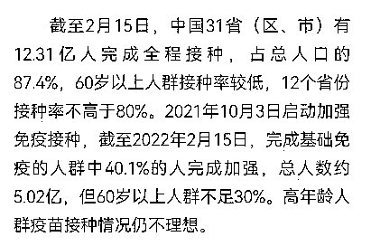

据报道数据，截至 2022 年 2 月 15 日，上海 2490 万人，2242 万接种了两针疫苗，但只有 1063 万人接种了加强针；截至 2021 年 11 月底，60 岁以上老人总共 518 万，有 353 万人完成全程接种，但仅有 40 万人完成第三针接种。

上海疾控专家应该扪心自问：

**为什么上海老人疫苗接种率这么低？**

**上海接种这么久，接种做好了吗？**

**为什么现在还不敢共存，专家心里没点数吗？**

我知道，现在很多老人不主动打疫苗。

老人的锅？

不好意思，我觉得是政府工作人员的锅：**宣传不到位，科普不到位，疫苗接种点对老人慢性病控制情况的复查不到位。**

别的很多地方老人几乎都是强制打的，老人出行不便医护人员主动翻山越岭跑去村里打，但这在上海可能就推行不通了。

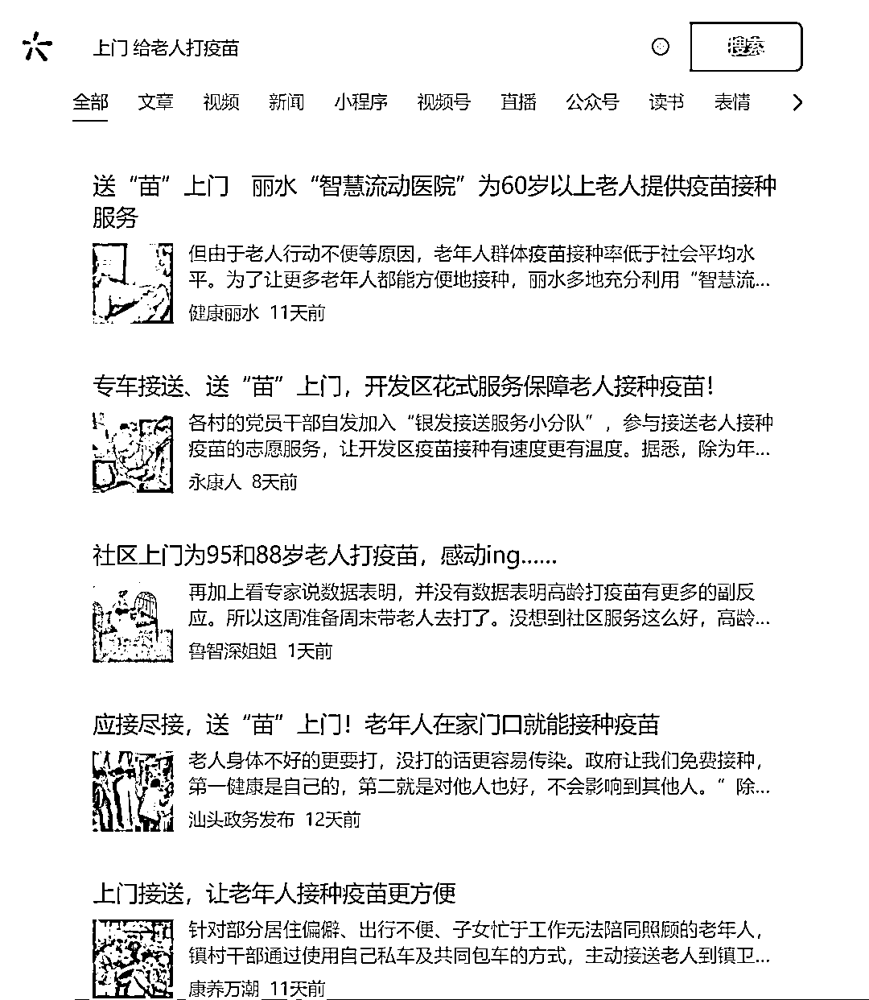

**共存躺平的前提，是超高的三针接种率。**

那么问题来了，为什么不拿出做核酸的决心来动员打疫苗呢？

**-6-**

**关于辉瑞特效药** 

上海，我是实在不想写了。

骂的越多，我自己反而越情绪低落。

其实，只要上海不外溢，你自己怎么摆烂范围都可控，但是外溢就不行了。

**上海如果不清零，那就是全国都不清零，到时候所有城市都跟上海一样。**

有人在评论区开骂，其实你们怼的对象找错了。

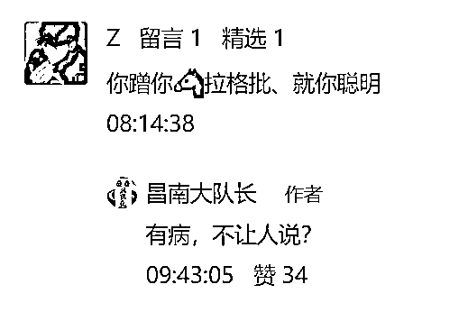

上海的问题是某些人只顾自己的利益不顾上海人民的利益。

我只是恨铁不成钢，恨你们被卖了，还帮人数钱。

真要摆烂搞与病毒共存，行啊，看看美国——

**新冠肺炎疫情弄死了 100 万美国人。**

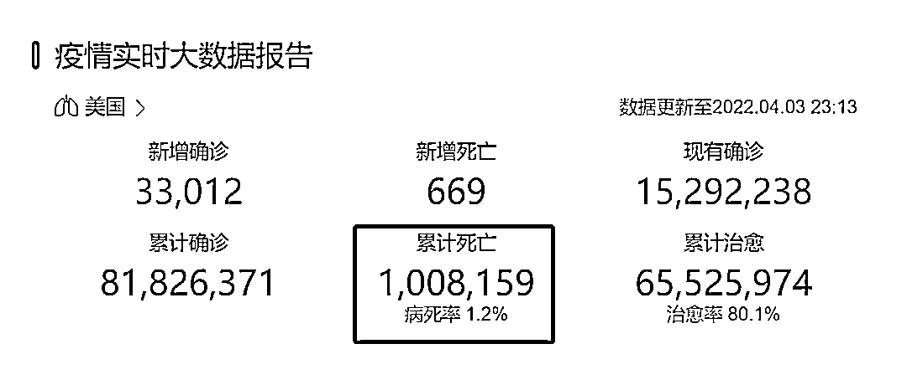

美国刷出 150 万日确诊，3000 日死亡的数据，死亡病例中很大一部分是压根没享受到有效医疗救助的穷人。

**现在你连菜都抢不到，你相信共存后你能抢到病床？**

**你现在连专家号都挂不上，你相信重症后能抢到呼吸机？**

**2300 一盒的辉瑞特效药，我只能说：不坑穷人。**

“共存”是指西医对治疗这个病，已经没有任何特效药了，包括 2300 块一盒的那玩意儿。

那中国进口美国高价药的理由是什么？

**你买不起，有钱人买得起，或者直接进医保，真以为美国的特效药是给我们做慈善的？** 

对付新冠还不如试试中药连花清瘟，钟南山院士亲证其有效率超过 90%。

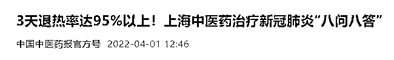

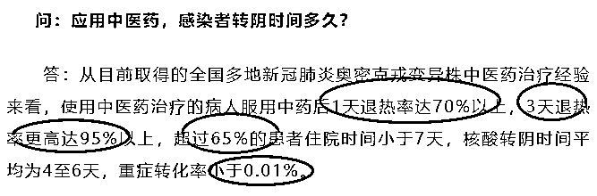

而外省人，真的就不是你们的敌人，恰好是给你们送支援送、补给的人。

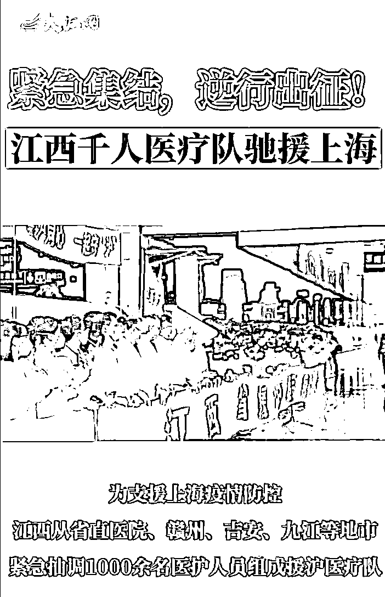

图源：大江网 

4 月 3 日下午，江西省千人援沪医疗队出征上海，我们这边还闹着疫情，但我们还是拿出最精锐的骨干医护力量驰援。

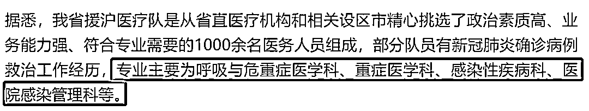

相信全国各省市的医疗队已经到达或者在路上，希望他们安全归来。

现在上海就好好清零+接种，其他废话就不要再说了。

来源：昌南大队长

← 向右滑动与灰产圈互动交流 →

