# 上海要发起总攻，全国已有上万名医护人员上海集结，规模或将超武汉！

> 原文：[`mp.weixin.qq.com/s?__biz=MzIyMDYwMTk0Mw==&mid=2247532852&idx=3&sn=825c8a59841fc2bbb6dfaf01a39f64d7&chksm=97cb8a0ca0bc031a715cbd7a854ec41415941e641db0a6cc13f0fa47119aa49d869b3eed5528&scene=27#wechat_redirect`](http://mp.weixin.qq.com/s?__biz=MzIyMDYwMTk0Mw==&mid=2247532852&idx=3&sn=825c8a59841fc2bbb6dfaf01a39f64d7&chksm=97cb8a0ca0bc031a715cbd7a854ec41415941e641db0a6cc13f0fa47119aa49d869b3eed5528&scene=27#wechat_redirect)

据人民日报健康客户端，3 月 23 日，上海单日新增本土无症状感染者突破首次 1000，此后无症状感染者数量持续上升。健康时报根据上海市卫健委公布的数据统计发现，近 10 日，上海已累计报告新增无症状感染者 43000 余例。 

疫情发展迅猛，上海要坚持清零政策必须要有大动作，昨日上海总攻正式打响！ 

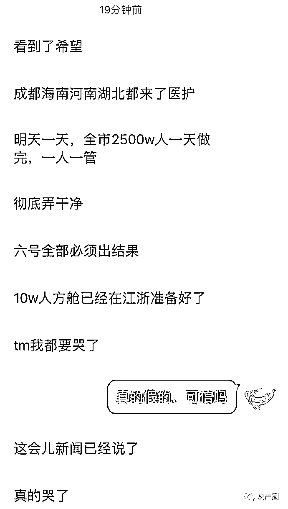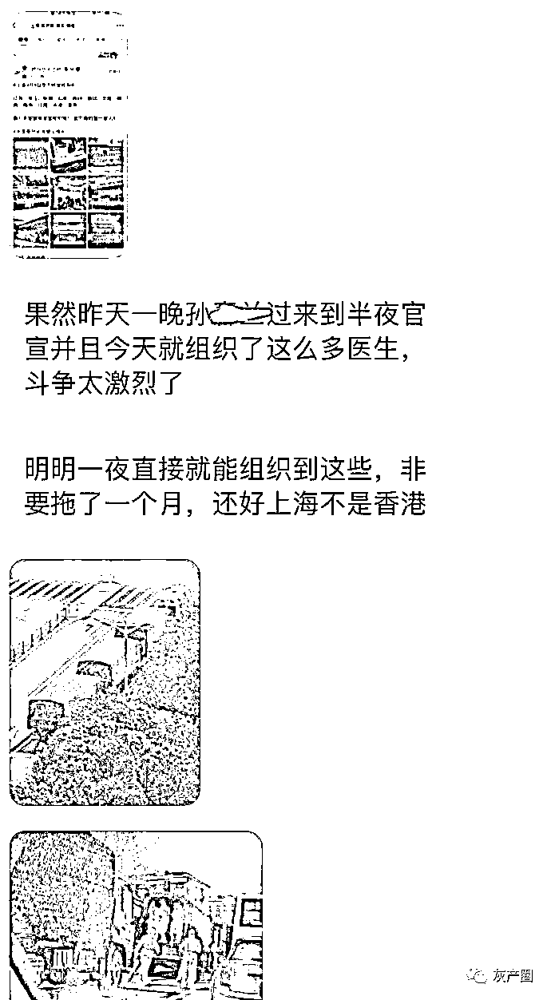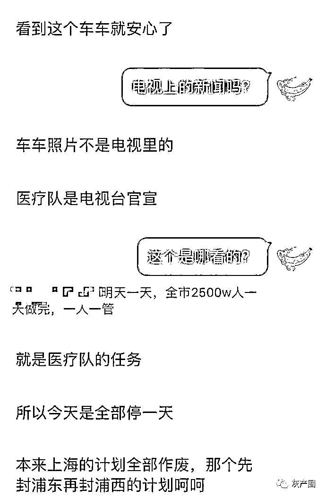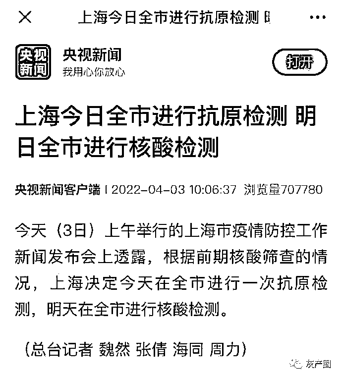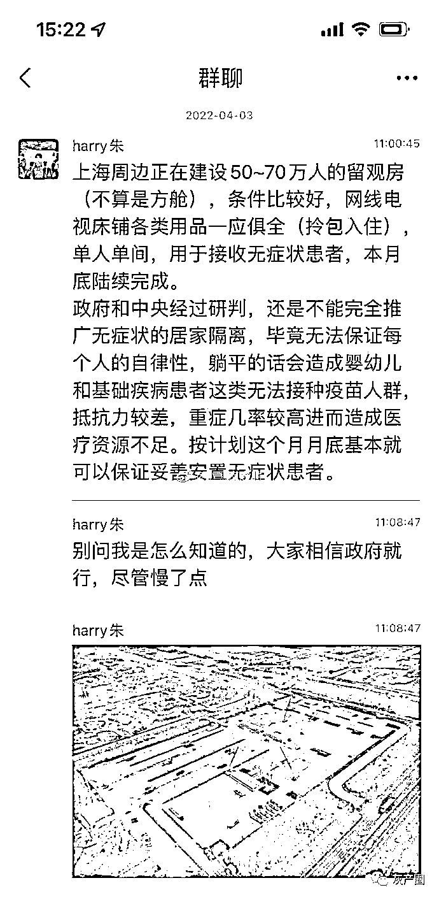

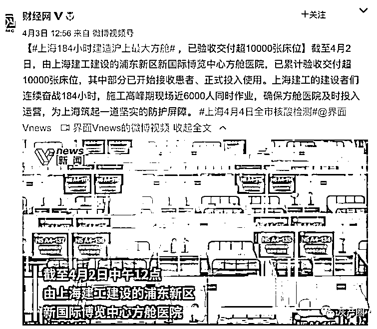

截止目前，全国已有上万名医护人员驰援上海 。

以官方媒体数据显示，仅昨天一天，共有包括但不限于：

天津市 1500 名。
海南省 900 名。
湖北省武汉市 1000 名。
河南省 1500 名。
山东省 1100 名。
江西省 1100 名。
陕西省 180 名。
湖南省 104 名。
安徽省 650 名。
广东省 300 名。
江苏省数字暂未知。
四川省数字暂未知。
解放军医疗卫勤人员 2000 名。 

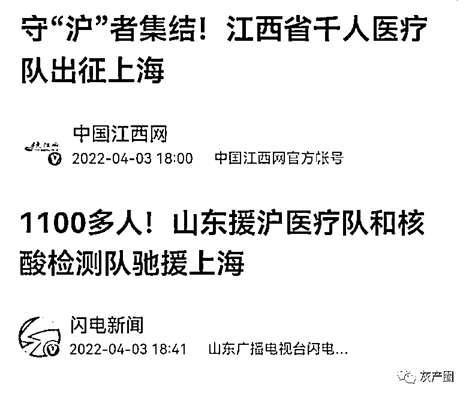

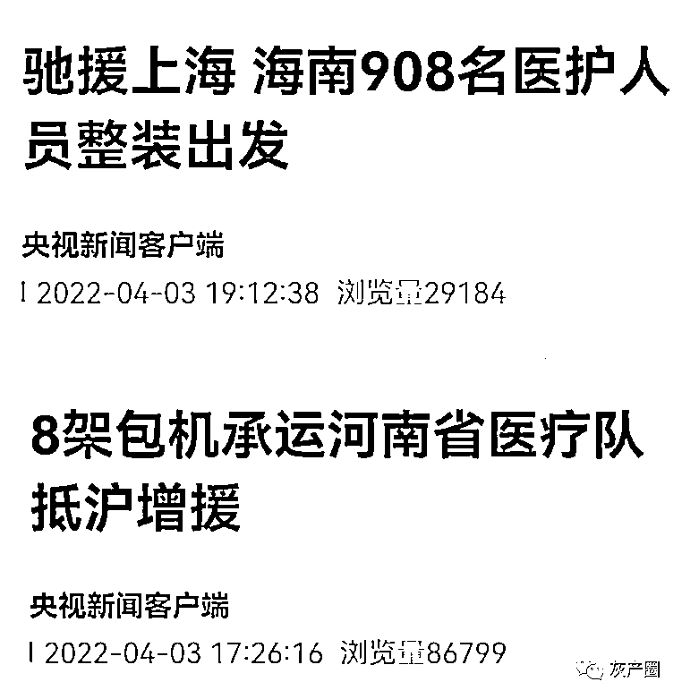

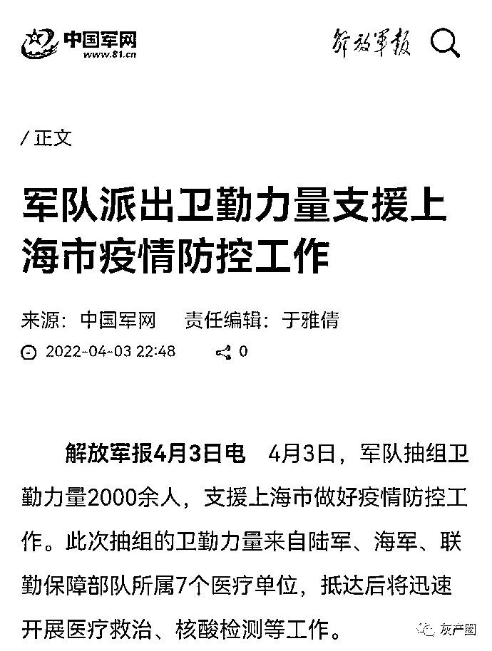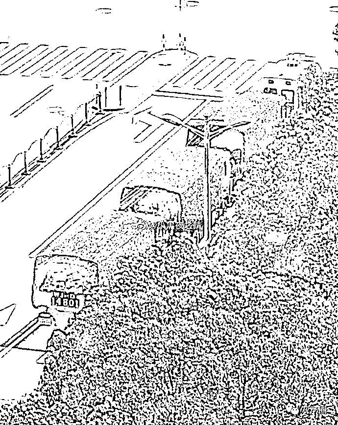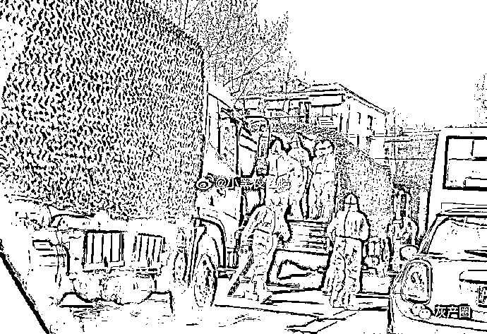

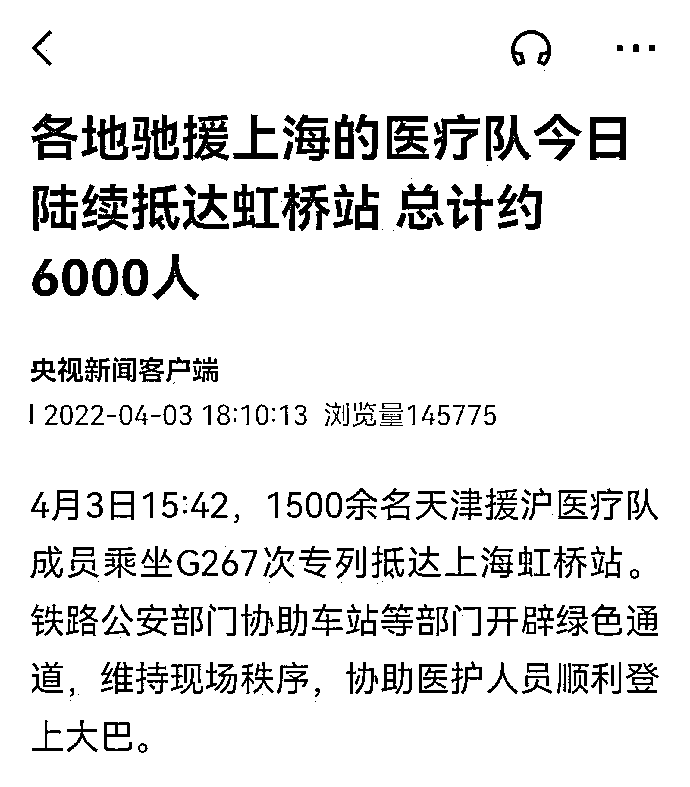

昨天天之前已经抵达上海开展工作的，包括但不限于：

 江苏省 5000 名。
浙江省 1500 名。
安徽省 1000 名。
北京市数字暂未知。  

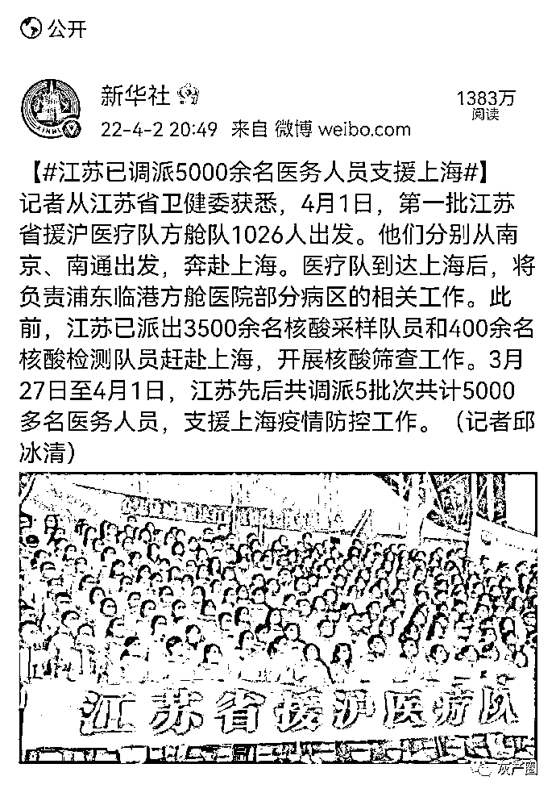

上海网友拍摄的，浩浩荡荡的支援车队

[`mp.weixin.qq.com/mp/readtemplate?t=pages/video_player_tmpl&action=mpvideo&auto=0&vid=wxv_2339303121115627523`](https://mp.weixin.qq.com/mp/readtemplate?t=pages/video_player_tmpl&action=mpvideo&auto=0&vid=wxv_2339303121115627523)

沉寂了好几天的虹桥机场，晚上降落了好多架飞机，看到运 20 也来支援上海了

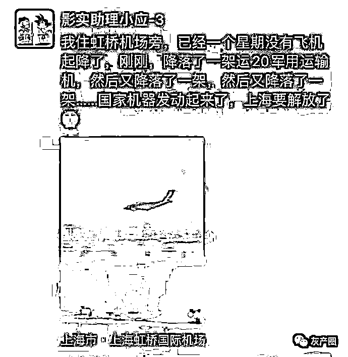

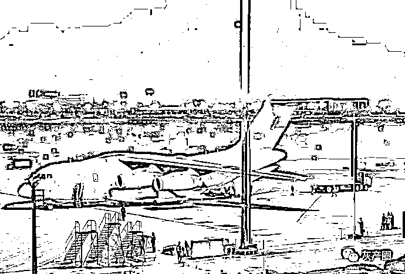

如果不出意外，本次上海疫情的全国援沪规模（医护人员+生活物资）将超过两年前武汉疫情时的援鄂规模（医疗人员 35591 人+6900 万吨物资）

来源：微博那些事儿

← 向右滑动与灰产圈互动交流 →

