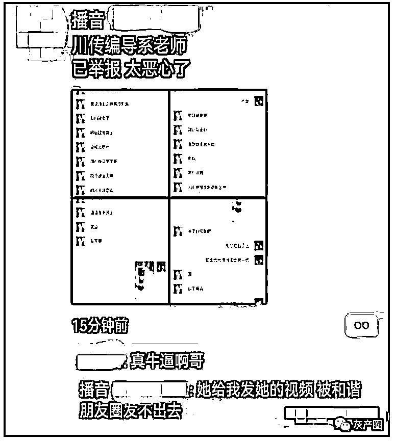
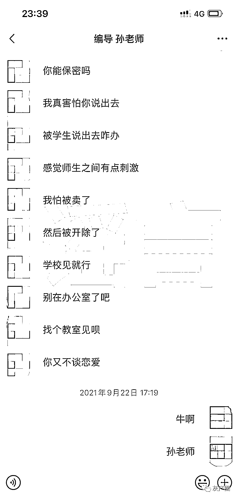
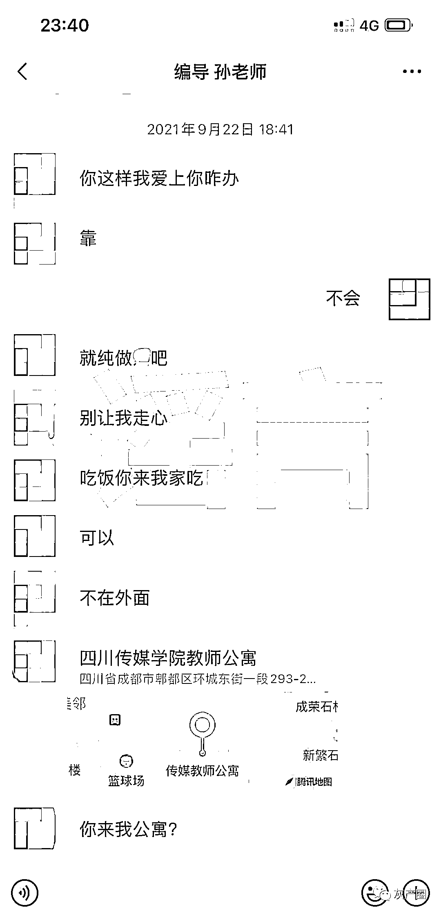
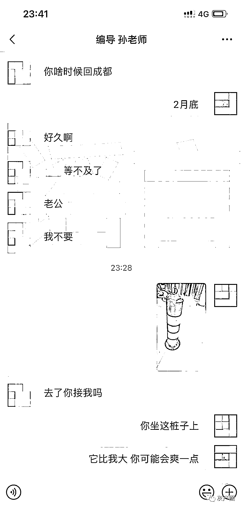
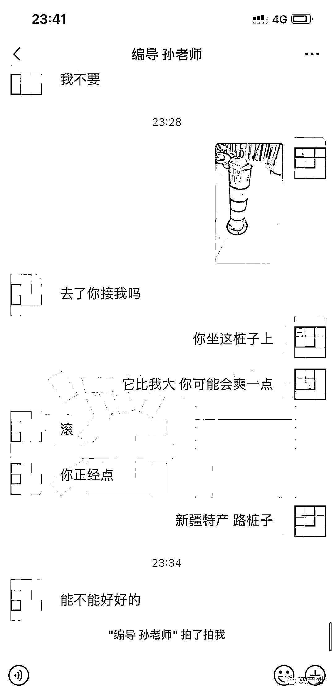
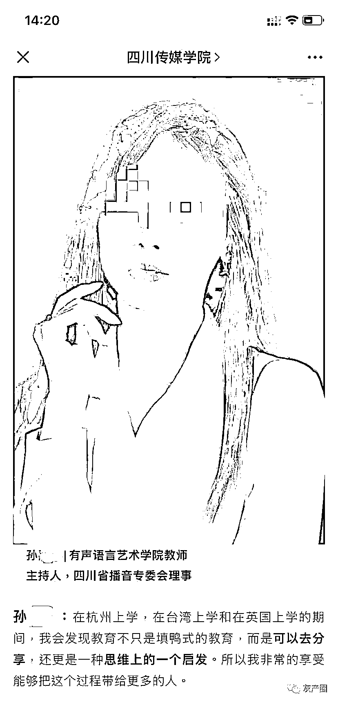
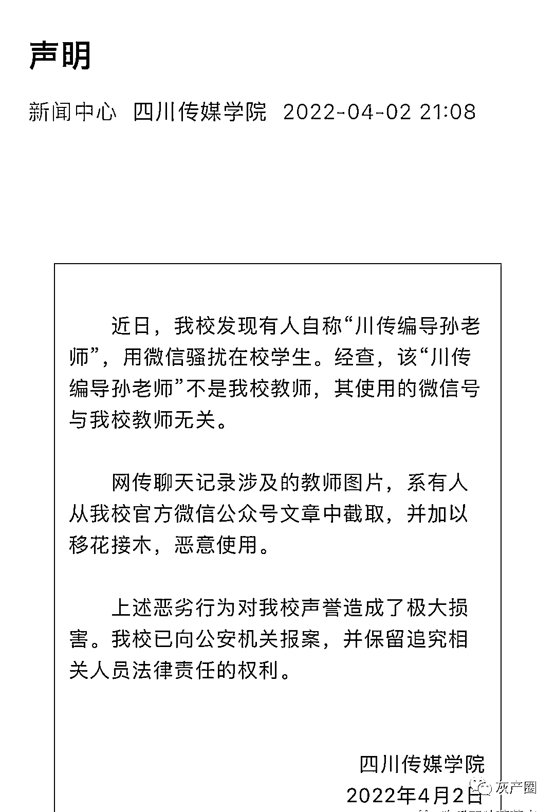

# 四川传媒学院回应女教师骚扰男学生：系拼接造假，已报案

> 原文：[`mp.weixin.qq.com/s?__biz=MzIyMDYwMTk0Mw==&mid=2247532852&idx=5&sn=8788c1f11c4a8eb83b479c152f2dc934&chksm=97cb8a0ca0bc031a21b00345db6b734f6da6d1f7fb8f6e6c9924e308e0a95aa12f3d942c6140&scene=27#wechat_redirect`](http://mp.weixin.qq.com/s?__biz=MzIyMDYwMTk0Mw==&mid=2247532852&idx=5&sn=8788c1f11c4a8eb83b479c152f2dc934&chksm=97cb8a0ca0bc031a21b00345db6b734f6da6d1f7fb8f6e6c9924e308e0a95aa12f3d942c6140&scene=27#wechat_redirect)

近日，四川成都，网传四川传媒学院女教师用微信骚扰男学生。网传聊天记录显示，该孙姓老师不断给学生发送“爱上你”“师生之间刺激”等暗示性话语，并邀约学生到教师公寓，引发网友关注。

4 月 2 日，四川传媒学院发布声明称，我校发现有人自称“川传编导孙老师”，用微信骚扰在校学生。经查，该“川传编导孙老师”不是我校教师，其使用的微信号与我校教师无关。

网传聊天记录涉及的教师图片，系有人从我校官方微信公众号文章中截取，并加以移花接木，恶意使用。

上述恶劣行为对我校声誉造成了极大损害。我校已向公安机关报案。

来源：九派新闻

← 向右滑动与灰产圈互动交流 →

