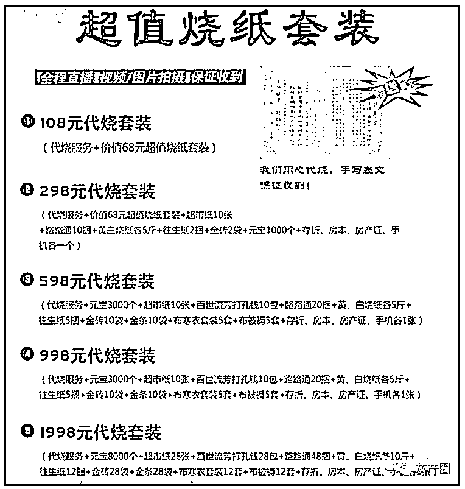

# 代哭代跪代扫墓，警惕“时令”骗局！

> 原文：[`mp.weixin.qq.com/s?__biz=MzIyMDYwMTk0Mw==&mid=2247532852&idx=6&sn=cc827044694addb148d936d8be0c7a52&chksm=97cb8a0ca0bc031afff6516987d8d499d7df8e083df94bf566a5b32c4ff1ac23aa00ab296f49&scene=27#wechat_redirect`](http://mp.weixin.qq.com/s?__biz=MzIyMDYwMTk0Mw==&mid=2247532852&idx=6&sn=cc827044694addb148d936d8be0c7a52&chksm=97cb8a0ca0bc031afff6516987d8d499d7df8e083df94bf566a5b32c4ff1ac23aa00ab296f49&scene=27#wechat_redirect)

春雨杏花满清明，追思犹怨水烟轻。我们迎来疫情影响下的清明节。

近年来，由于时间、空间或疫情等原因，部分逝者亲属不能亲自到场祭扫，催生出形形色色的代祭祀“业务”。**传统风俗逐渐“新潮化”的同时，应警惕那些随意要价、诚信欠奉等行为，也要提防节日前后易流行的各类诈骗。**

**<mpvideosnap class="js_uneditable custom_select_card channels_iframe" data-pluginname="videosnap" data-id="export/UzFfAgtgekIEAQAAAAAAYFQWKPktYgAAAAstQy6ubaLX4KHWvLEZgBPE5qNMZRw8Kp78zNPgMIvUrju9rS5OYu7XHuJ5b5hI" data-url="https://findermp.video.qq.com/251/20304/stodownload?encfilekey=oibeqyX228riaCwo9STVsGLPj9UYCicgttv6sfec1veHNibicqXskU6oGcTfR3nuKrlddYEalT3XCDsBGiaeqiaj7d0bx0bpCLntowV3ibzcsg8AiaeVse4vkfh8rJj2Yv16ESOA4icHCCz4Y19qc&amp;adaptivelytrans=0&amp;bizid=1023&amp;dotrans=0&amp;hy=SH&amp;idx=1&amp;m=10dd5ee9b40e05038186a83c6e2eed30&amp;token=x5Y29zUxcibCHnYyoVAxqjrIHN8icUJPFe6qibrmez2Pu5jn21qDvJUNiburRT8Dy4hZiaKXgIB0qykk" data-headimgurl="http://wx.qlogo.cn/finderhead/uQib6JbrLjZuMMhGhzlHP2WiaO99n3AecTykNLiaukYPQU/0" data-username="v2_060000231003b20faec8c7e5801ac2d2ce0deb3cb077b0bb234437c1a1c42d8b6634d4c6f1cf@finder" data-nickname="盛京无诈" data-desc="清明时节雨纷纷    电信诈骗请小心
祭祀在心不在形    别样清明一样情" data-nonceid="9019531053555768406" data-type="video"></mpvideosnap>**

**先来听听警花文文怎么说**

****私人代祭祀****

****门槛低差价大利润高****

**“清明节所有日期，北京地区墓地代扫”、“扬州清明代扫，可以代买祭品鲜花水果”……伴随清明节临近，各网购、社交平台上提供有偿代扫墓服务的卖家多了起来。**

**他们普遍以自己所在城市及周边作为服务范围，且不少是三月中旬后才发布信息，显然是瞄准了“商机”。**

**记者看到，**各地私人代扫服务的价格相差悬殊，内容也五花八门。****

****例如，某承接苏州地区代扫服务的卖家介绍，自己的服务一次收费 500 元。需要鲜花另加 100 元，需要水果或糕点再加 100 元。磕头另外加钱，如需现场打开视频直播请扫墓者面对亲人倾诉，则要加收 200 元。另一称可“代倒酒、代聊天、代嚎啕大哭”的卖家，开价高达 1000 元。****

********

****一位承接天津地区代扫服务的卖家开价 200 元，已经算是相对较低的收费。他称自己清明期间做代扫墓服务好几年了，200 元是直接收取的人工费。如果墓园路途较远，还需酌情添加路费。献花祭品方面，想要购买什么东西，客户均可提要求，实报实销。 ****

****“到了你指定的位置，先拍摄墓碑原始状况。然后进行擦洗、鲜花祭品摆放。如果有什么想说的话，可以提前把词儿发过来，代替你来念诵，最后鞠躬行礼。”卖家向记者介绍着具体流程，表示“咱不弄哭的那一套，就是庄严肃穆，了却你一桩心愿。以前还能偷着烧点儿纸，现在墓园管得越来越严，争取给你点个香吧。”****

******除了渐渐遍及全国的代扫墓服务，近年来更有商家开动脑筋，甚至将“代烧纸”等祭祀业务也搬到网上招揽客户。**“各大陵园多处于群山之中，禁忌烟火。敬一束鲜花取代烧一沓纸钱，文明祭扫的同时却留下一丝丝遗憾与不甘。”一家主营殡葬服务的公司打出这样的宣传语，称“自家有专业烧纸房，解除火灾隐患；有丰富的物资，各种形式纸币，丧葬用品一应俱全。”****

****据了解，这家公司推出的“超值烧纸套装”，从 108 元至 1998 元共五个档位。以第四档 998 元的“代烧套装”为例，内含元宝、布寒衣套装、打孔钱等 11 种常见纸、布祭品。记者在网购平台搜索发现，这些祭品价格通常在十几二十元左右，如果走批发价则更便宜。****

********

******观点存争议******

******“时令性”骗局需警惕******

****事实上，对于各类代祭祀服务，民间始终存在着争议。有人认为，清明节祭扫注重的就是这份仪式感，如果连扫墓、烧纸都要请外人来做，也就失去了“敬”的意味。****

****也有不少人尤其是年轻人觉得，在人口流动大背景下，近年又受疫情影响，对于扫墓确实存在心有余而力不足的现实约束。“能惦记这个事儿，愿意花这个钱，总比什么都不做，任凭墓穴荒草丛生要强吧？”****

****观点众说纷纭，并没有一定的标准。**但面对种种清明衍生“业务”，避免上当是最真切的。******

******据媒体报道，有消费者通过网络购买价值 200 元的“代烧”服务后，接收到几段商家发来的现场视频。但当转存到手机中后发现破绽，“除了第一个视频是当天拍的，其他视频都是一个月前拍摄的。同一个视频，不知道多少人上当受骗。”******

******对类似欺诈现象，四川省消委会发布消费提示，称近年来出现代客扫墓、代烧纸钱甚至代哭等祭扫服务，**但存在“代扫”者随意报价，收费不少却不去扫墓，只是通过微信直播转切其他镜头来欺骗消费者的情形。**建议消费者选择正规机构，发生争议及时维护自身合法权益。******

********编造丧葬骗局，太可恶！********

******此外，**一些清明期间流传的“时令性”骗局，也值得人们加以警惕。**近期多地警方陆续发布清明防骗提醒，揭示了几项常用诈骗手段。例如骗子编造某重名率较高的名字，谎称其去世群发信息。有些人会误以为是认识的人去世，又不方便求证，便会直接转钱“随份子”。******

******还有一些骗局在“丧葬费”上做文章，骗子谎称自己是民政部门工作人员，能在电话中报出已去世老人的姓名，让家属提供银行账号来接收“丧葬费”。一旦家属信以为真，去查询补贴款是否到账，骗子便会利用种种说辞，让家属点击链接或扫描二维码等，诱导将钱款转出。类似案件在北京、杭州、广东等地均有发生。******

********警方建议********

********祭扫在心不在形********

********别样清明一样情********

******2022 年 4 月 3 日，在“沈阳市新型冠状病毒肺炎疫情防控工作”第六十六场新闻发布会上，沈阳市民政局副局长尹玉砖作新闻发布表示：******

******将严格落实市疫情防控指挥部《关于全市清明节期间暂停祭扫公祭活动的通告》要求，**暂停**全市各殡仪馆、各类公墓场所、骨灰堂等殡葬服务机构的**群众祭扫、集体公祭、公益性骨灰集中安放、购墓、落葬及骨灰撒海活动，**待疫情得到有效控制后，再按要求有序开展上述活动。******

******同时，请广大市民告知在外亲属暂时不要返乡祭扫，避免无谓流动带来的防控风险。******

******民政部门将努力满足群众祭祀需求，**提供内容丰富的代祭扫服务，**已在**沈阳民政微信公众号**发布我市清明节期间各殡仪馆和墓园**代祭扫服务预约电话**，按照逝者家属要求，提供代擦墓碑、鞠躬敬礼、敬献鲜花、摆放祭祀物品等祭扫服务，并通过微信实时传送视频、图片及文字等代祭扫场景。******

******市民可通过登录以下**网站、微信公众号或小程序参加“让春风捎去思念”沈阳文明祭祀公益活动**：******

********一是市民政局或沈阳殡葬服务网网站；********

********二是沈阳民政或沈阳殡仪微信公众号；********

********三是沈阳新闻综合频道官方微信；********

********四是沈阳广播电视台云盛京 App。********

********通过上述方式登陆成功后，扫描活动二维码进入祭祀小程序，观看视频并按照提示编辑思念寄语，点亮放飞一盏承载思念的孔明灯，让春风捎去思念，以更加低碳文明、绿色温暖的方式纪念逝去的亲人。******** 

****************

********来源：北京晚报，沈阳晚报, 沈阳公安反电信网络犯罪查控中心********

****************

********← 向右滑动与灰产圈互动交流 →********

****************