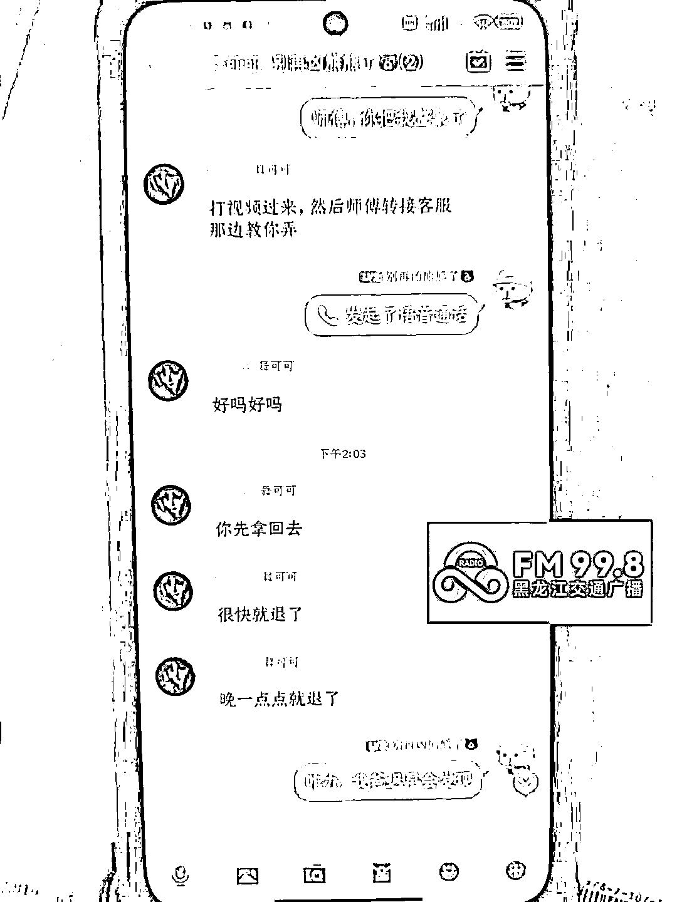
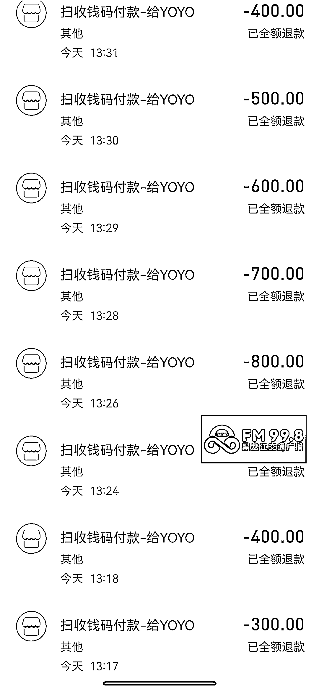
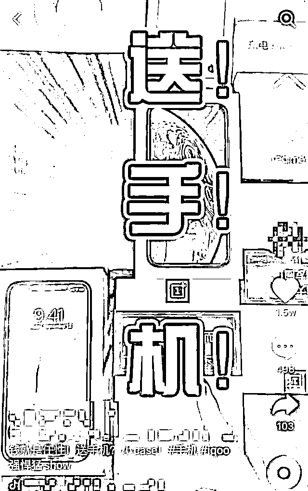
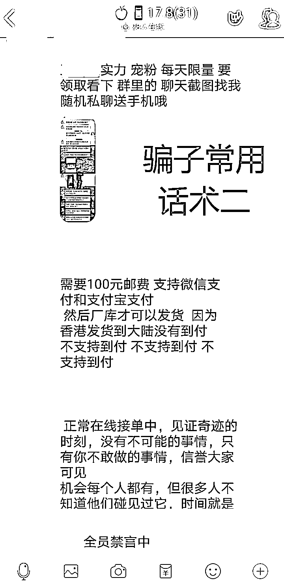
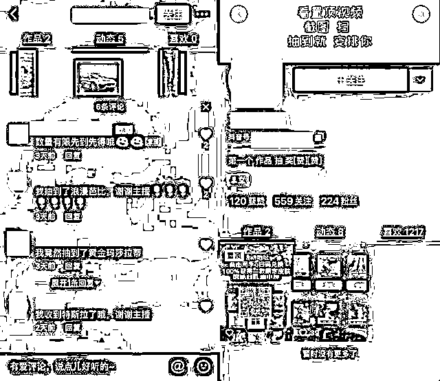
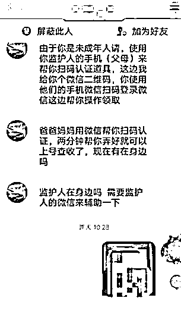
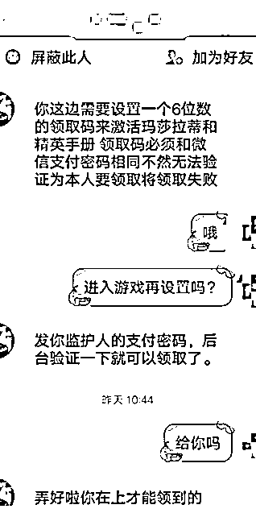

# 黑龙江一女孩玩父母手机，1 小时被骗 12000 元！

> 原文：[`mp.weixin.qq.com/s?__biz=MzIyMDYwMTk0Mw==&mid=2247532852&idx=7&sn=7a9c0eb825d2a5a7b3e522f8ef433ec8&chksm=97cb8a0ca0bc031a3dac9858da7af73606e22039fbc8ebefe58d2249a742d334133e364679be&scene=27#wechat_redirect`](http://mp.weixin.qq.com/s?__biz=MzIyMDYwMTk0Mw==&mid=2247532852&idx=7&sn=7a9c0eb825d2a5a7b3e522f8ef433ec8&chksm=97cb8a0ca0bc031a3dac9858da7af73606e22039fbc8ebefe58d2249a742d334133e364679be&scene=27#wechat_redirect)

4 月 1 日下午 

宝泉岭居民张先生带着女儿

来到垦区公安局宝泉岭分局

宝泉岭派出所求助

称其女儿在某网络平台

并下载了一款游戏

一名在游戏中结识的“好友”

打着教女孩领取免费皮肤的幌子

诱骗女儿拿着张先生的手机

通过支付宝扫码付款的形式

转账一万两千余元

民警孙庆超了解完具体情况后

接过张先生的手机

以张先生的身份

与对方展开周旋

民警先是向对方发送了派出所的照片

告知对方现已报警

并且会向支付宝官方投诉

冻结其支付宝账号

立案后

警方也将冻结其银行卡

并追究其刑事责任

经过近一个小时的交涉

民警利用嫌疑人

做贼心虚的惧怕心里

不断向对方施加压力

终于将被骗欠款全部追回

在派出所值班大厅

民警告别父女俩

并劝说张先生要吸取教训加强防范

耐心说服教育女儿

避免再次上当受骗

骗子们在短视频平台上广撒网，一旦有鱼儿上钩，就会“循循善诱”骗光他们的零花钱，甚至将父母的血汗钱也“一网打尽”！今天就让小编带大家细细了解。

**免费送手机**

**13 岁女孩被骗 5600 多元**

平时在刷短视频的过程中，你是否也刷到过截图送手机的视频，并不屑一顾地划走。

**大人都懂“天上不会掉馅饼”的道理，可小孩子却未必懂。**

**13 岁的小涵（化名）就中了这个套路。小涵通过视频下方的 QQ 群，进入群聊。**

**随后自称客服的人主动添加小涵，表示只需支付 38 元运费就可以拿到手机，小涵立刻扫了码。**

****

****

**但对方却并没有发货，反而继续索要 168 元的**手机激活费**，之后还有**包装费、运费险、收货退款审核金……**种类繁多，金额也是一笔比一笔大，从 38 元到 1800 余元，小涵累积转给对方 5600 余元，最后，手机没收到，对方也再没回复过小涵。**

****免费领取游戏礼包****

****10 岁男孩被骗 2 万元****

**除了利用手机做“诱饵”，骗子们还会利用未成年人对游戏的喜爱，以“游戏礼包”吸引他们掉入“魔爪”。  **

****

****

****诱人广告吸引受害者****

**10 岁的小豪(化名)平时刷抖音最喜欢看的就是游戏相关内容，有一天他刷到了**免费领某热门游戏福利**的视频，抱着试试看的心态，他添加了对方的 QQ。**

**这时对方以小豪是未成年人，**领取福利需要监护人的手机微信**为由，指挥小豪拿来了妈妈的手机，再以要**扫码验证**为由让小豪多次扫描他发过来的二维码。**

****

**最后一步，骗子跟小豪说，**领取码要与微信支付密码相同**，小豪信以为真，便将支付密码发了过去。至此，整套骗局已经完成。**

****

**事实上，在小豪第一次扫描骗子发送过来的二维码之后，骗子便在电脑端登录了该微信，随后修改了小豪妈妈的支付密码，微信账户中的 2 万多元也被一分不剩地转到了骗子的账户中。**

****温馨提示****

****致学生——****

******1.谨慎添加陌生人为好友，谨慎加入陌生群组。******

******2.不要随意扫描不明二维码，或是点击未知链接。******

******3.不要随意向他人透露自己与家人的信息，如家庭住址、手机号码、银行卡号、身份证号码、验证码，以及任何密码等。******

******4.不要轻信网上不正规的兼职，特别是酬劳比正常市场高出许多的兼职，所有要求交定金的工作要三思而后行。******

******5.不要轻信所谓的“官方”，所有公安机关、司法机关、执法部门绝不会通过电话办案，更不会要求转账。******

******6\. 接到可疑电话或信息可拨打 96110 咨询，如遇诈骗请立即拨打 110 报警。******

********致家长——********

******1.保管好自己的手机、银行卡等物品，不要让孩子知道支付密码，以免其受骗后进行大额转账汇款。******

******2.控制孩子的压岁钱或者零花钱的随意支出，建议帮孩子存定期或者限定流水金额。******

******3.经常对孩子上网课使用的电脑、iPad、手机等电子产品进行检查，查看社交及银行账户的支付款项。******

******4.给孩子的微信设置转账 24 小时到账，如若不幸被骗，有充足时间止付。******

******来源：垦区公安局宝泉岭分局******

************

******← 向右滑动与灰产圈互动交流 →******

************