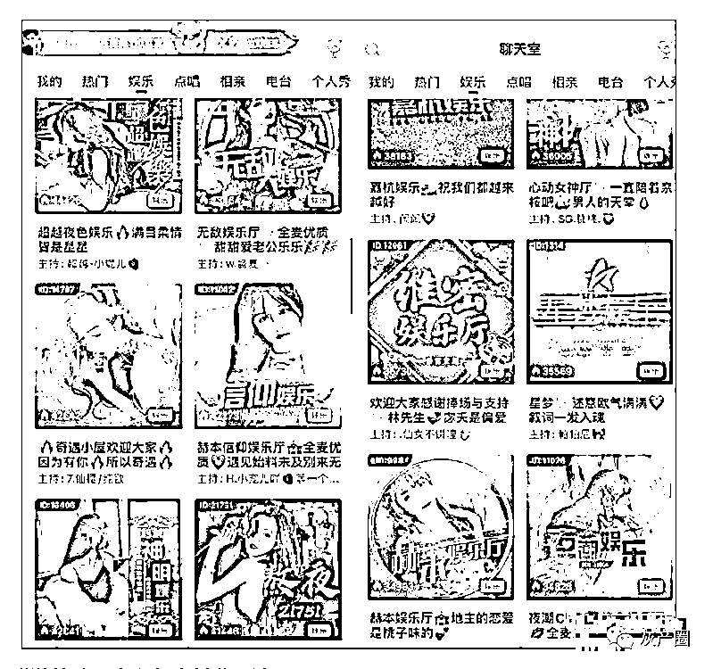
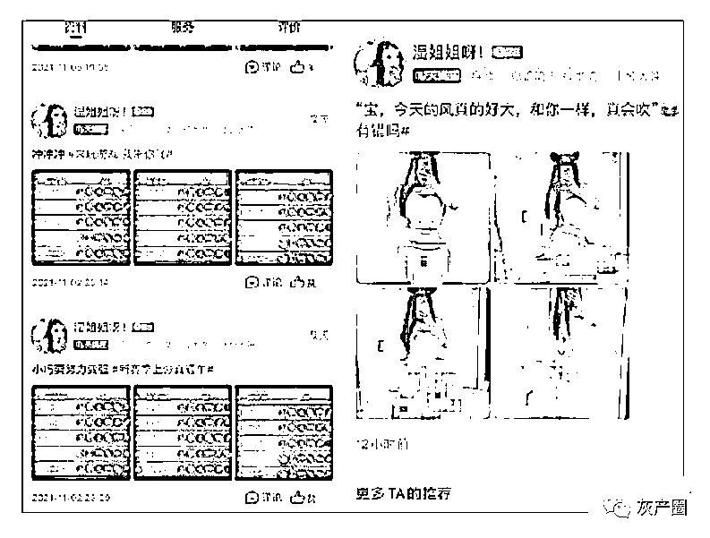
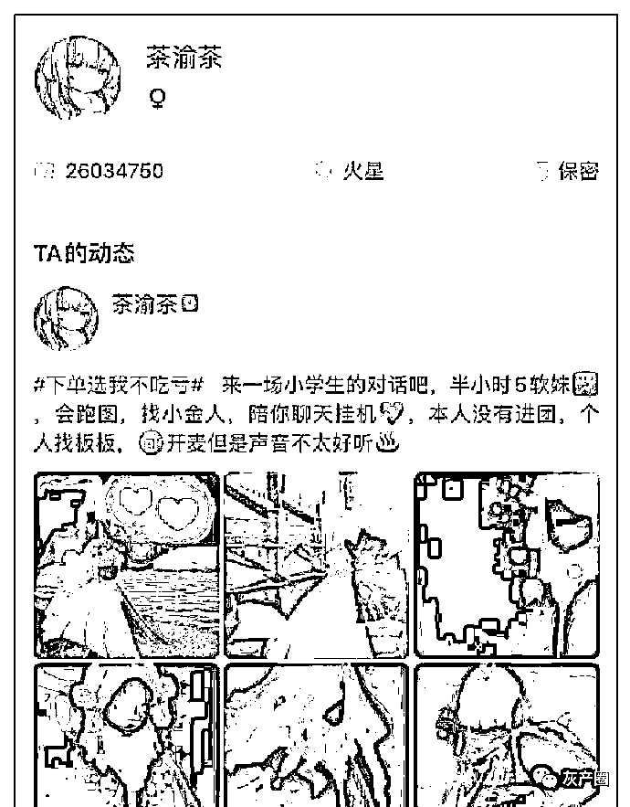

# 游戏陪玩变味！猎游等陪玩 App“涉黄服务”花样多

> 原文：[`mp.weixin.qq.com/s?__biz=MzIyMDYwMTk0Mw==&mid=2247532929&idx=4&sn=dc925eeb85d00eabe9b7c8cd19238c81&chksm=97cb8ab9a0bc03afb3c6f958f0b4696039024853e9e7ea55f707c3d69a0a078d9ae4e74ba2f0&scene=27#wechat_redirect`](http://mp.weixin.qq.com/s?__biz=MzIyMDYwMTk0Mw==&mid=2247532929&idx=4&sn=dc925eeb85d00eabe9b7c8cd19238c81&chksm=97cb8ab9a0bc03afb3c6f958f0b4696039024853e9e7ea55f707c3d69a0a078d9ae4e74ba2f0&scene=27#wechat_redirect)

猎游的聊天室和各类付费玩法。 

猎游上的游戏陪玩“猎人”，在主页贴出暴露的照片。

猎游平台上的陪玩“小学生”。

伴随游戏产业的蓬勃发展，游戏陪玩服务也“应运而生”。因其社交属性，陪玩一度被不法分子利用，涉黄引诱或桃色交易。2021 年 9 月，小鹿陪玩、比心、咪呀、可可西里等 7 款陪玩 App 在应用商店被无限期下架。行业整顿的呼声随即而来。

半年过后，游戏陪玩 App 怎么样了？固有问题是否依然存在？南都大数据研究院近期据此展开民调，超三成受访者表示相关 App 内的陪玩色情信息有所减少，但平台内仍存在“暗语”涉黄陪玩交易；另有 1/4 的受访者反映“明显的陪玩功能消失，但‘服务’以其他形式存在于平台内”。而南都记者深入调查发现，猎游 APP 等陪玩软件仍存在打色情擦边球的乱象。

陪玩“擦边球”内容并不少见

2022 年初，南都记者在华为应用商店下载了猎游、伴伴、带带陪玩、西西语音、伴玩等下载量以百万计数的涉陪玩服务软件，并以男性用户身份注册相关账号，发现上述软件依然提供陪玩服务。多数平台分为接单派单区、直播区、消息界面，其中猎游、伴玩等软件还有类似朋友圈的生活分享界面。

相比去年，虽然消息框仍旧弹出各类女陪玩的消息，但构成淫秽色情的信息内容并非不多，在搜索栏里输入“颜*”“*绿”等原色情陪玩的暗语并未出现相关内容。但南都记者进一步实测发现，一些描述裸体、性器官、身体敏感部位的“擦边球”内容并不少见。

例如，南都记者点开伴玩 App（原陌伴 App）的广场，看见名为“小爱”的用户发布的一组照片，穿着紧身上衣、黑色透明丝袜和超短包臀短裙，对着镜子摆出性感姿势，并配文“不要抗拒我”。

猎游 App 亦如此，该应用自称为专属游戏玩家的社交平台，用户可通过查找符合需求的陪玩“猎人”下单，进行游戏陪玩，也可进入聊天室进行下单、娱乐、交友等互动。南都记者注意到，在用户加入猎游时，平台会自动推荐陪玩，许多“女猎人”给自己打上“嫩白小腿温柔嘴”“身娇体软”“可通宵”等等具有性暗示意味的标签。“猎人”的个人主页也不乏如“黑丝大长腿姐姐在线陪伴”等挑逗性话语。猎游上支持的陪玩游戏类别被列在“女猎人”的个人主页服务范围内，除此之外还显示提供语音互动服务等。在服务评价里，可见许多低俗内容，如“骚***，***你”等。

南都记者在浏览猎游 App 游记的热门区域时，发现了一位名为“湿***”的“女猎人”，其自今年开始发布一系列性感照片和软色情文案，进一步点开该用户的评论区，有诸如“好*”“我是来看**”等低俗评论。有用户在评论区企图将该女陪玩约出来，有用户甚至评论“杭州 5000”。

南都大数据研究院民调结果显示，超六成受访者反映游戏陪玩平台中的评论区、直播间弹幕、用户动态贴内文、用户头像及简介，以及私信聊天框均为涉黄信息的重灾区。

此外，除了提供陪玩服务的软件，在淘宝、闲鱼等电商平台，以及贴吧、QQ 群、小红书等社交平台内也能发现陪玩服务的踪迹。在部分陪玩软件被监管整治之后，提供“特殊”陪玩服务的其他渠道平台也值得重视。

“陪玩”明码标价 服务“老板”

目前，市面上大多数陪玩软件的功能丰富。以带带陪玩 App 为例，其在华为应用商城展示了五个主要功能，除了陪玩相关功能，还提供语音互动交友处 CP、破冰小游戏甜蜜邂逅等交友扩列功能。南都记者在实测中发现，这类交友扩列功能为“特殊”陪玩们提供了宣传和交易的空间，以接触有需要的“老板”。

据悉，许多陪玩形成的组织名为陪玩团或公会，陪玩 App 最热门的语音直播间均由陪玩团和公会运营，直播间内设有主持人和 6 至 8 位陪玩，且每过一段时间会换一批陪玩上麦。直播间内标明了所支持的服务，且每一项服务后面都标明了所需要送出的礼物，“老板们”只有完成礼物的赠送，才能让陪玩们提供服务。

如在猎游 App 上，“猎人”为了吸引和招揽游戏陪玩消费者，会开设直播间进行自我展示。直播间被称为聊天室，有娱乐、派对等类别。南都记者进入一间名为“人间绝色****”的派对房，评论区标明的玩法显示，“想要深入了解，解锁个人小福利”需要刷一个价值 15 元的礼物，想要陪玩开麦进行一个小时的互动，需要刷价值 70 元名为“情书”的礼物。

在浏览热门聊天室时，南都记者随机进入名为“**娱乐”的娱乐房，8 位主播都在麦上，主持人说“欢迎哥哥回家”。记者注意到，娱乐房里支持许多付费玩法，如带走打游戏、撒娇、直接带走解锁真人认证等，价格在 10-200 元不等。在“曙光少女***”直播间，南都记者花费 10 元解锁“真爱表白”撒娇服务，一位名为“小*酒”的女陪玩开始用亲密的语气撒娇，其中夹杂着带有性暗示的呻吟声。退出直播间后，该陪玩还主动联系记者，希望能得到长期消费。

除了加入公会外，陪玩还通过在广场发布动态的方式吸引“老板”。在 PP 语音上，南都记者发现一位名为“**视频下单”的用户，记者询问该用户如何下单，该用户直接发来私人微信号，称可以提供一对一的 15 分钟视频直播服务。南都记者在对该视频的内容未知的情况下购买了 188 元的视频服务，随后该用户又要求使用 QQ 进行视频，视频过程中充斥着大尺度的淫秽色情内容，为名副其实的裸聊服务。且在结束服务后，该陪玩仍然会在微信上与记者维持联系，希望“老板”能二次消费。

据南都记者了解，部分陪玩的收入十分可观。最基本的排麦一小时 5 元，游戏陪玩 10 元至 60 元不等一把。愿意接软色情的陪玩能通过语音聊天一小时赚取 99 元，视频十余分钟赚取 188 元，提供哄睡服务赚取 99 元等。此外还有礼物收益，部分陪玩一天能收取三四千元的礼物。而“老板”还会打赏陪玩。在此情况下，“特殊”陪玩的收入比多数正常游戏陪玩的收益高得多。

娱乐陪比技术陪更吃香

早期的游戏陪玩只有“技术陪”，而后“娱乐陪”出现。南都记者调查发现，在陪玩 App 上，娱乐陪的接单量总是比技术陪要高，且能在平台主页上获得更多曝光推荐。陪玩的标准不断提高，但相比于游戏技术，更多在于声音、样貌、身材、年纪、能不能接受聊骚等，这些甚至决定了一位陪玩的“竞争力”。

声音是一位陪玩的“门面”。以猎游 App 为例，每个语音厅都有价目单，标明各种语音游戏及价格，为了向玩家兜售猎人，主持人及猎人们会开嗓自我介绍。玩家付费即可得到“高爆”服务（“高爆”是具有涉黄性质的语音）。记者进一步了解到，“带走”后猎人会与玩家交换联系方式，通过其他社交平台“嗑炮”，即通过语音来满足性需求，甚至可以提供裸聊等服务。

在招揽游戏陪玩消费者的过程中，陪玩平台的功能逐渐变味。例如，猎游 App 平台上的“派对房”和“相亲房”是娱乐陪们进行自我展示的场所，这些直播间的人数通常都在 2000 到 5000，且有固定的主持人。派对房一般都由陪玩团运营，用户可以根据介绍和声音挑选三轮的陪玩，主持人会说“小姐姐可以被带走”“老板现在为你试音”等开场语，“老板”可以提出对陪玩的要求，如“声音甜美”“话多会撩”等。观察发现，有的“老板”直接提出“我选三个不同声音的来陪我”等“需求”，流程如同情色夜总会场的线上版。相亲房同样低俗，南都记者进入人数最多的直播间发现，已有四位女士和四位男士在进行配对，其间女生被男生追问三围、家住哪里、有无男友等私密问题。

南都记者了解到，陪玩平台火爆下，女性陪玩比男性陪玩吃香。对女性陪玩要求“接触过游戏，技术无硬性要求，声音动听”，对男性陪玩的要求是“任一游戏水平需达到要求，如王者最强王者以上”，有些陪玩团更是标明“招陪玩，限女生”。在这样的市场需求导向下，部分男性陪玩为提升接单量，甚至伪装成女性陪玩，使用变声器软件的男性陪玩不少见。在个人简介里，“技术带飞”后往往会接“人皮话多”“可盐可甜”“撒娇能手”“可语音可视频”“可处 CP”等与游戏毫无关系的形容词。

特别关注

**有未成年人活跃其中青少年模式形同虚设**

在陪玩行业，很少陪玩会使用真实照片，部分陪玩平台资质申请门槛很低。以“带带陪玩”App 为例，南都记者实测发现，虽然平台要求上传本人头像和语音，但使用非本人的网图并不会受到限制，无需人脸认证即可通过陪玩申请。

南都记者发现，未成年人群体在陪玩平台上也占据了一定比例，不少冲着“找对象”“谈恋爱”来，有的直接在平台上表明自己年龄很小，以“房主 12”“16.165”等有关年龄的数字强调自己的未成年人身份。在各大陪玩平台上，记者搜索“Xiao”“年纪 Xiao”等关键词，能发现不少疑似未成年人用户，搜索“学生”，也会出现一些 2 至 6 人的房间，房间里有许多声音稚嫩的疑似未成年人，讨论着有关游戏和“处 CP”的话题。

而在猎游 App 的直播间、首页推荐和游记内可以发现许多声音稚嫩的陪玩猎人，“学生”一词甚至被部分陪玩作为宣传的关键词，诸如“我是小学生，有人跟我玩吗”“来一场小学生之间的对话吧”。

南都记者实测发现，市面上较火的多数陪玩软件的注册流程非常简单，只需要手机收四位数验证码即可完成注册，在注册时平台让用户自主选择年龄，不满 18 岁的年龄不能被选择，但未通过实名认证用户仍然可以享受与实名认证用户相同的服务。

另外值得注意的是，即使选择实名认证，也可使用假信息，南都记者用购买的“隔夜 18”的假身份信息即直接通过了部分软件的实名认证，人脸识别认证不是实名认证的必须步骤，无需通过人脸识别也可以畅通无阻地使用部分软件。

以猎游 App 为例，该软件在苹果应用商店和安卓应用商店均可以找到。在苹果应用商店的介绍中，猎游 App 的适用年龄标明的是“17+”，在苹果应用商店的猎游评论区内，南都记者还发现有许多名为同城约炮的黄色网站穿插在评论中。

在使用猎游 App 期间，只有在初次登录时会提醒未满 18 岁用户可以开启青少年模式。实测发现，虽然猎游 App 设置了实名认证系统，但操作不明显，用户需通过“我的-设置-账号安全-实名认证”才能找到认证口。更重要的是，平台并未硬性要求用户进行实名认证，也并未用作甄别未成年人的方式。

部分陪玩平台虽然按要求搭建了青少年模式，但是南都记者实测发现，猎游、陌伴、daidai 电竞等提供陪玩服务的软件在开启青少年模式后仍能进行消费。以猎游为例，在进行猎游币充值时，平台仅弹出“若您是未成年人，请在获得监护人许可后进行充值操作”，用户仍能畅通无阻地点击“继续支付”，平台未对消费功能进行任何实质性限制。

南都大数据研究院民调结果显示，超过 80%的参与调查者认为，想要防止游戏陪玩的涉黄内容影响到未成年人身心健康，要平台加大审核及巡查力度，对涉黄及影响未成年人的内容严格处理；政府部门加强监管，对涉黄、未成年人参与陪玩等问题平台加大处罚力度。将近 77%的受访者认为平台应加强针对涉黄及未成年人参与陪玩的举报功能。另外，超过三分之二的受访者认为平台应加强针对未成年人的身份查验，对未成年人账号功能加以限制。

专家意见

**陪玩业务须做到“三个确保”**

雷腾律师事务所主任滕立章向南都记者表示，网络平台不履行法律、行政法规规定的信息网络安全管理义务，会受到相应的行政处罚；经监管部门责令采取改正措施而拒不改正，致使违法信息大量传播的，还可能被追究拒不履行网络安全管理义务罪等刑事责任。现有的网络平台监管规则，实际上已经相对完备。目前需要的是进一步加大监管覆盖范围，强化执法力度，对相关违法行为予以彻底清理整顿。

对于陪玩平台涉黄信息不绝的现象，北京师范大学互联网发展研究院院长助理、中国互联网协会研究中心副主任吴沈括认为，如果陪玩业务想得到合法合规的发展，必须做到三个方面的确保：第一，确保准入主体的资质要求，避免违法违规人员的进入；第二，在业务规则上要有清晰的业务要求，避免与非法行为的交叉重叠；第三，必须要有完善的举报投诉机制和责任追究机制，确保能够及时有效地实现责任追究。平台本身在人员进入这个环节要把好入口关，包括持续的人员资质的追踪，包括是否有不良记录等等，及时清除屏蔽违法违规主体，承担起第一位守门人的责任。

值得注意的是，根据中国通信工业协会电子竞技分会颁布的《游戏陪玩师》团体标准，游戏陪玩师已有作为正式职业的职业准则，此外还有“游戏职业技能认定平台”，通过职业认定考核后即可取得“游戏陪玩师职业证书”。

雷腾律师事务所主任滕立章认为，一个没有清晰发展目标和发展规范的领域，也难以成为一种可以长期发展的产业。吴沈括则表示，职业陪玩师如果想要有一个健康可持续的发展，必须要遵循技术安全性、行为合法性和价值伦理性三个层面的符合，包括人员资质必要的考核、审查和备案，包括业务行为符合各项法律要求，不能出现侵犯他人权益和社会公共利益的行为样态。在业务发展过程当中，应符合主流伦理道德要求，避免法律和道德的擦边球现象。

来源：南方都市报

← 向右滑动与灰产圈互动交流 →

