# 男歌手这一行为惹众怒，紧急道歉

> 原文：[`mp.weixin.qq.com/s?__biz=MzIyMDYwMTk0Mw==&mid=2247532929&idx=5&sn=9af24ed97680b2af07418c2446390b33&chksm=97cb8ab9a0bc03af400293ff58fcb19385f10c6ab32457f5549c5b3fab356ec48a7682224cfc&scene=27#wechat_redirect`](http://mp.weixin.qq.com/s?__biz=MzIyMDYwMTk0Mw==&mid=2247532929&idx=5&sn=9af24ed97680b2af07418c2446390b33&chksm=97cb8ab9a0bc03af400293ff58fcb19385f10c6ab32457f5549c5b3fab356ec48a7682224cfc&scene=27#wechat_redirect)

日前，一则“说唱歌手肘击恐吓卖艺老人还转账 0.01 元嘲讽”的视频在网络热传，引起网友关注。此后，多名说唱歌手就此表态，开怼此人不配当 Rapper。

4 月 2 日晚间，当事人@Yvng_Huncho 在微博发布视频回应，为其不当行为道歉。另外，针对网友称其疑似用小号骂人，他 4 月 3 日还发文称，“没有任何的小号，别造谣了。”

这段引发众怒的视频时长为 23 秒，由两小段视频剪辑而成。第一小段视频显示，在一家餐馆内，一名卖艺男子站在@Yvng_Huncho 与其同伴吃饭的餐桌旁边弹乐器边唱歌。

@Yvng_Huncho 先是转过身观看男子演奏，之后看了眼镜头，突然抬起胳膊，做出肘击的动作恐吓卖艺男子。见状，男子并未与其计较，继续演奏。

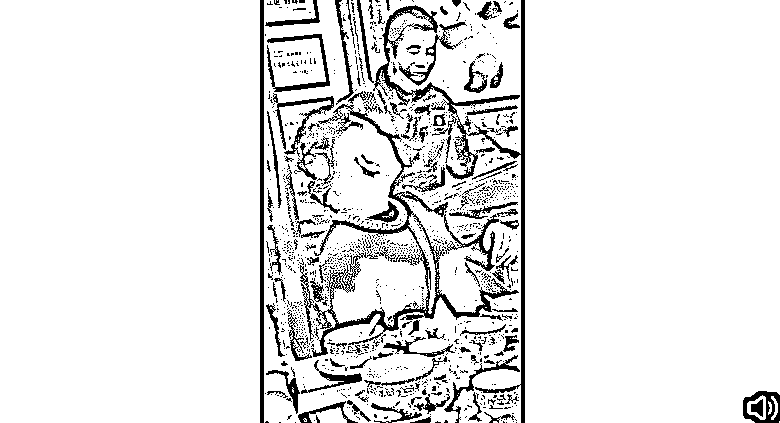

而做完这一动作的@Yvng_Huncho 却在转身坐正后，忍不住捂嘴笑了。他身旁的一位同伴则看了他一眼，没有说话。

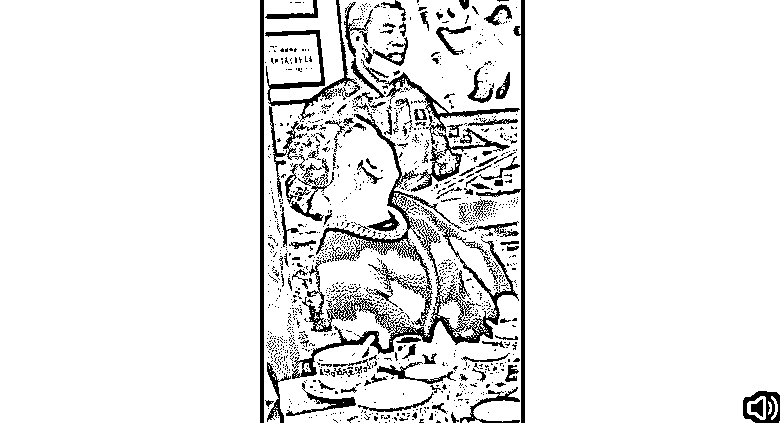

第二小段视频展现了此事的后续发展，在该男子演奏结束后，@Yvng_Huncho 拿着手机给其转账。在输入金额后，他把手机屏幕转向拍摄视频的同伴，笑着展示 0.01 元的转账金额。同伴见状，开始大笑。

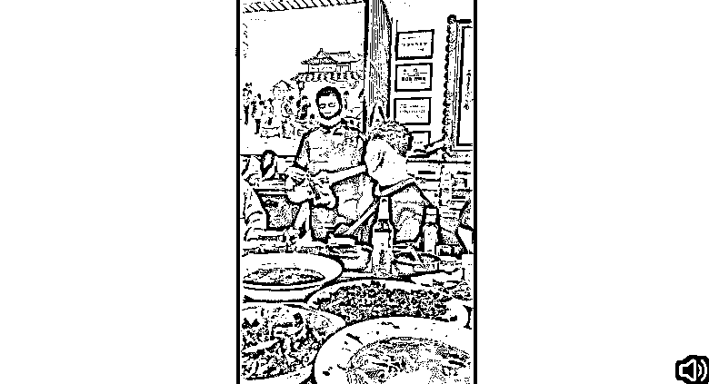

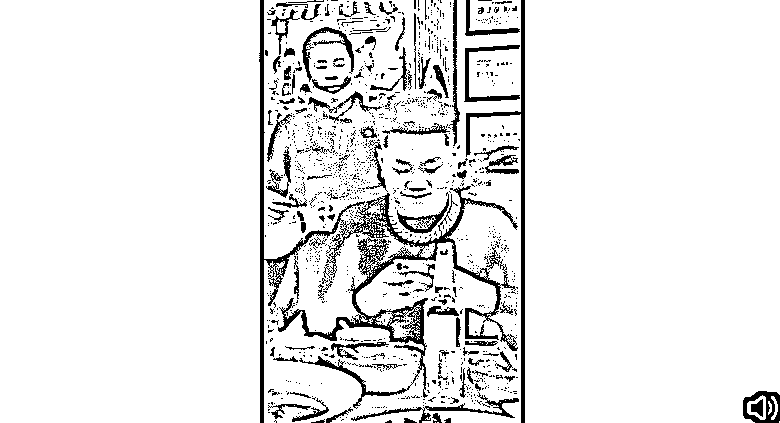

不过，看到这一视频的人则笑不出来。众多说唱歌手对@Yvng_Huncho 的行为感到不满，@邓云峰峰峰 @YOUNG13DBABY 等人纷纷在 2 日发文，怒怼他 “素质低”、“脏了（Rapper）文化”。

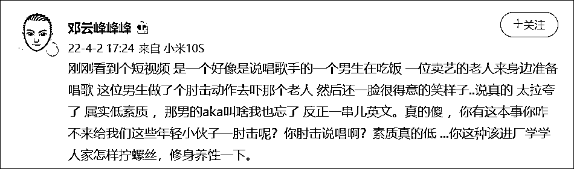

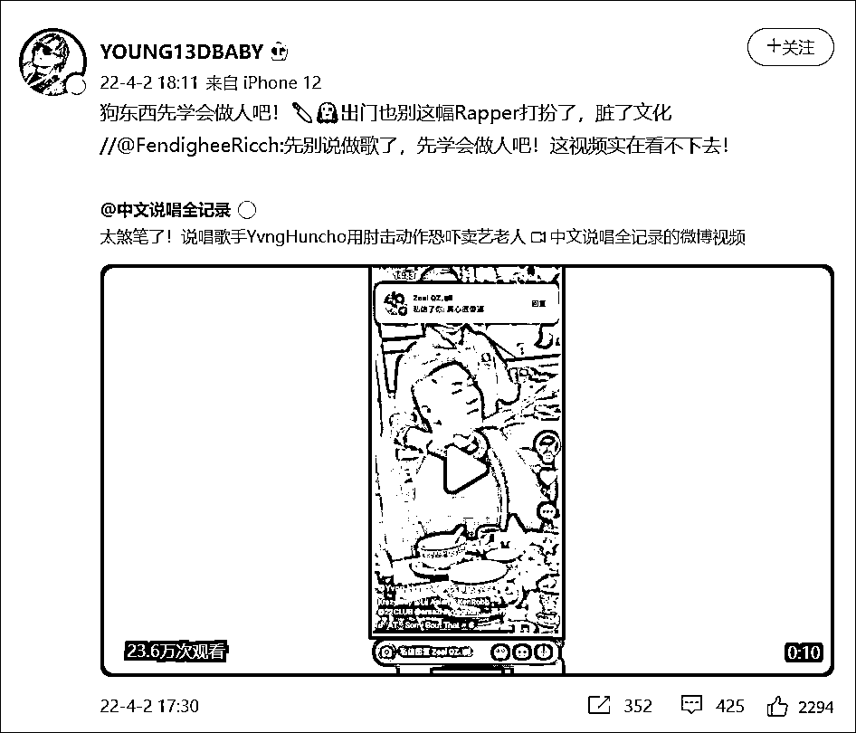

面对众人声讨，@Yvng_Huncho 在 2 日晚间发布一则道歉视频，并配文称：“十分抱歉，给所有的藏族同胞和视频里卖艺的老爷爷以及所有人道歉，十分抱歉！”

在视频中，他进一步解释称，网上流传的视频是其在 3 月 29 日发布，对于他表现出的“涉嫌歧视或侮辱的行为举止”，他感到“十分抱歉”。他还称“此举动并不是有意而为”，称他深知这种行为“非常幼稚、无知和愚蠢”，会深度反省所作所为。“引以为戒，不会带着任何有色眼镜，以及侮辱或歧视的心态看待所有人。”

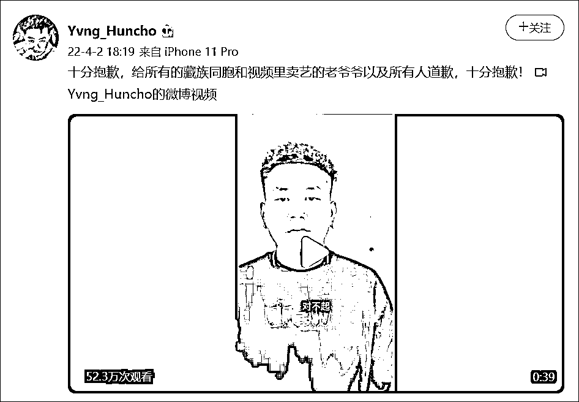

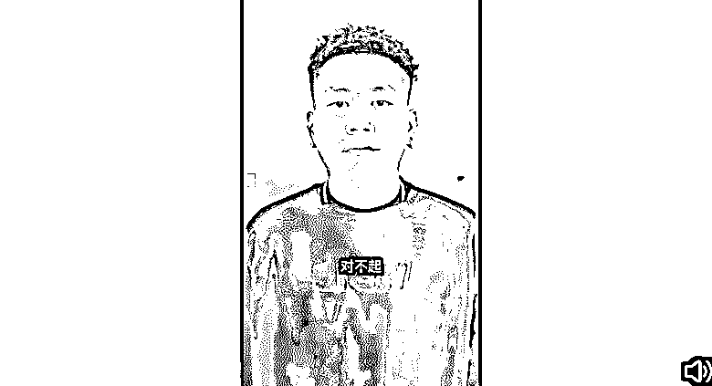

另外，他还在 2 日深夜发文，称他欲找到卖艺男子当面道歉，但由于找不到人，只能通过微信支付的历史交易记录给他留言，进行道歉。在这条留言中，他称自己“喝多了酒”，才做出了不尊重人的行为。

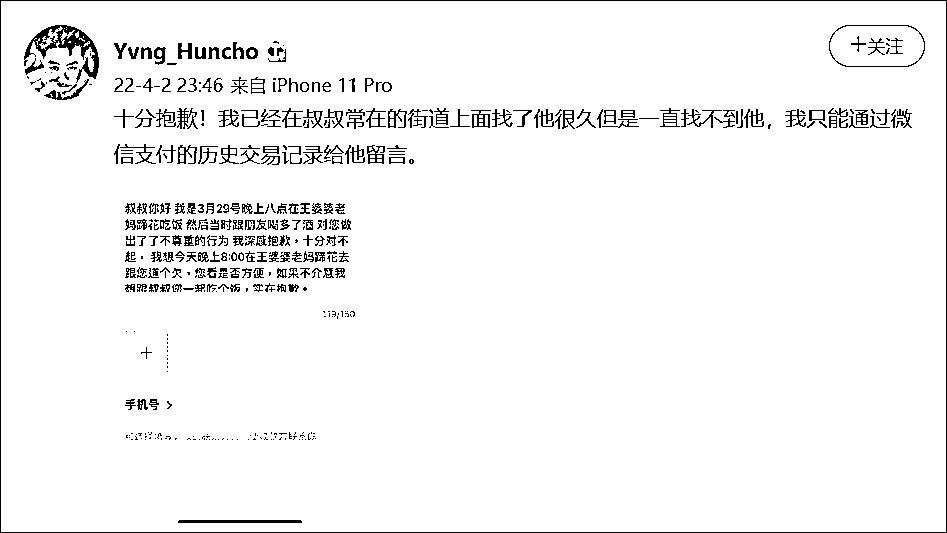 

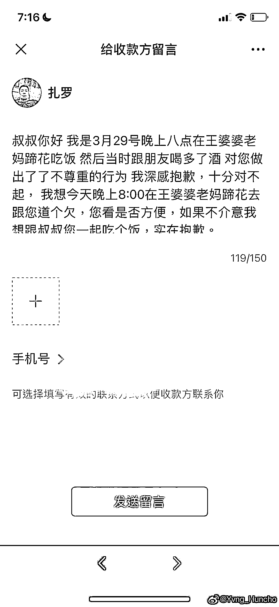

不过，对于@Yvng_Huncho 的这番道歉，许多网友并不买账。不少网友让他先提升素质和教养，“学会做人”，再去当 Rapper。另外，网友们也批他和同伴都是“施暴者”，要求他们一起亲自向卖艺男子道歉，诚恳认错。

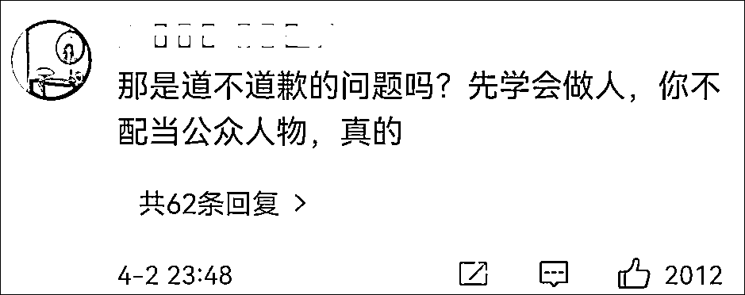

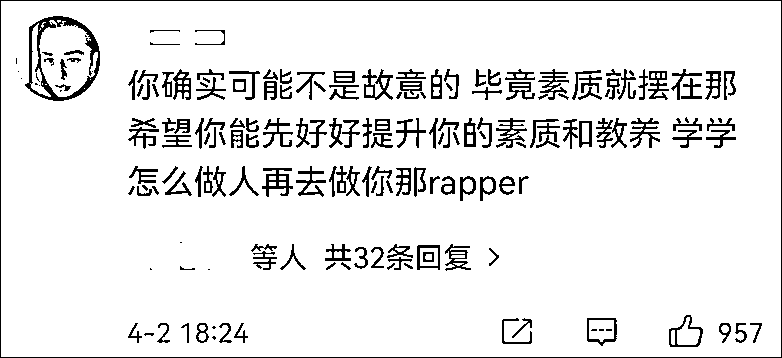

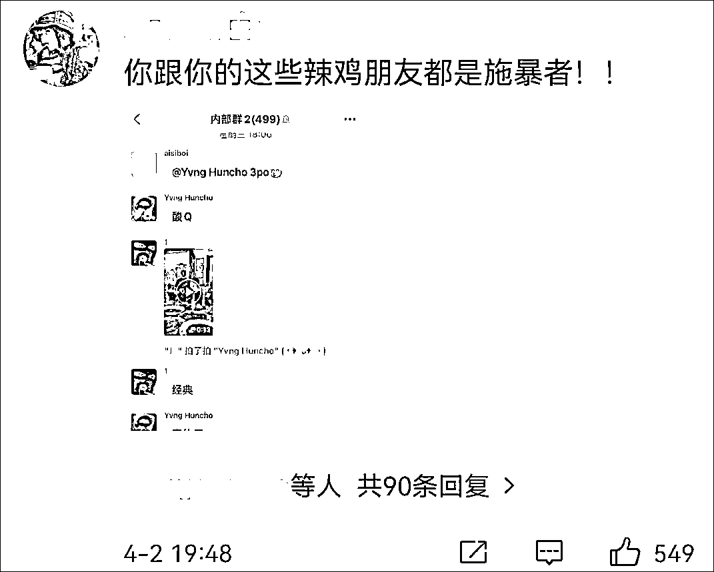

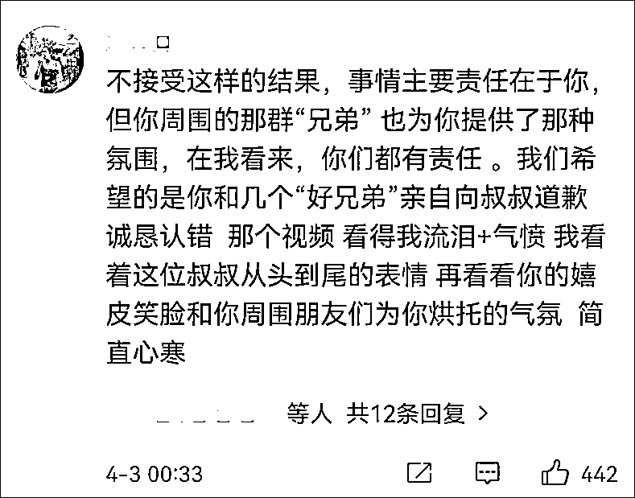

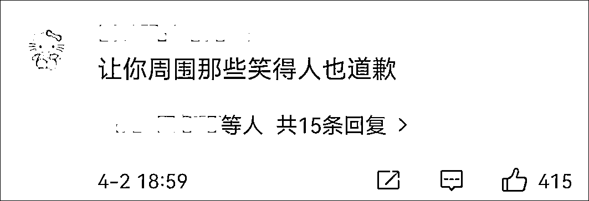

还有不少人提到他辱骂女主播事件，质问他是否也为此道了歉。

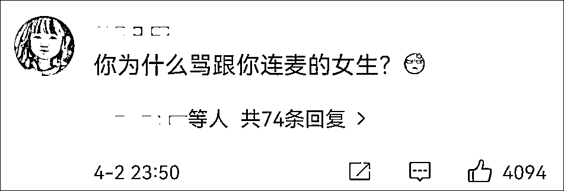

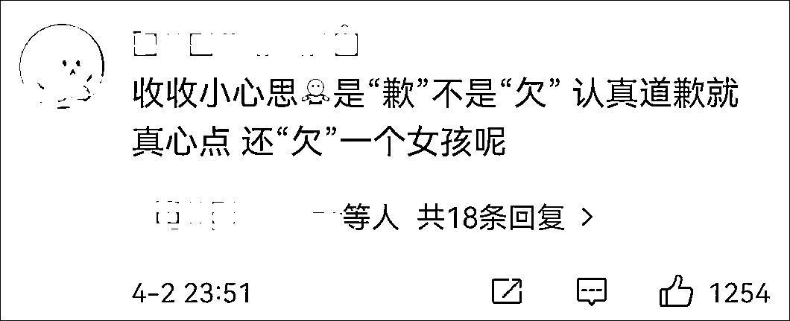

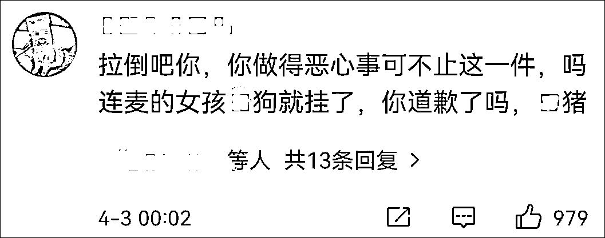

据@嘻笑堂 HipHop 3 日称，@Yvng_Huncho 曾在与女主播连线时，不仅故意对人竖中指，还用脏话骂人。

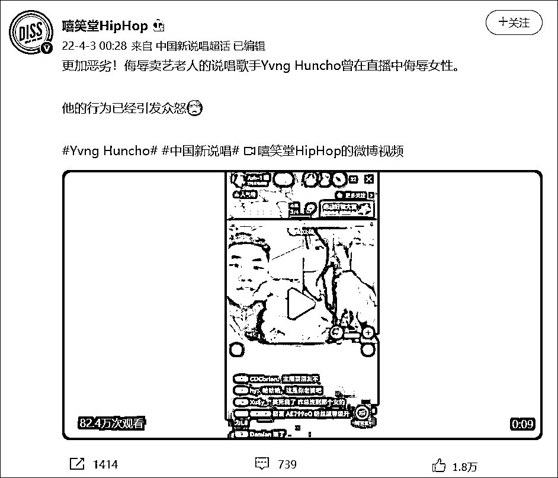

而对于网友让其向女主播道歉的要求，@Yvng_Huncho 并未回应，只是在 3 日针对网友称其疑似用小号骂人一事，发文称，“没有任何的小号，别造谣了。”

来源：潇湘晨报、新晚报、新闻晨报、观察者网

← 向右滑动与灰产圈互动交流 →

