# 南京一高校副教授偷窥女厕所？八十年代定你个流氓罪

> 原文：[`mp.weixin.qq.com/s?__biz=MzIyMDYwMTk0Mw==&mid=2247532986&idx=1&sn=217c72a9c3ad3c0638cc3e70305403ec&chksm=97cb8a82a0bc03947c1f36aad75492725b129263baaaf20c4740dd5f09d5e4e98e24c966acfd&scene=27#wechat_redirect`](http://mp.weixin.qq.com/s?__biz=MzIyMDYwMTk0Mw==&mid=2247532986&idx=1&sn=217c72a9c3ad3c0638cc3e70305403ec&chksm=97cb8a82a0bc03947c1f36aad75492725b129263baaaf20c4740dd5f09d5e4e98e24c966acfd&scene=27#wechat_redirect)

流氓罪没了，但耍流氓的人还在。 

疫情之下，最近高校的舆情不少。

据多个网络大 V 爆料，南京信息工程大学数统院（数学与统计学院）副教授刘某迎被拍到偷窥女厕所。

该校一名女生在上厕所时，突然察觉门口有人，于是便掏出手机打开摄像头，通过厕所门下的缝隙向外拍摄，果然发现了一名戴眼镜的男性正歪着脑袋往女厕所里偷窥。

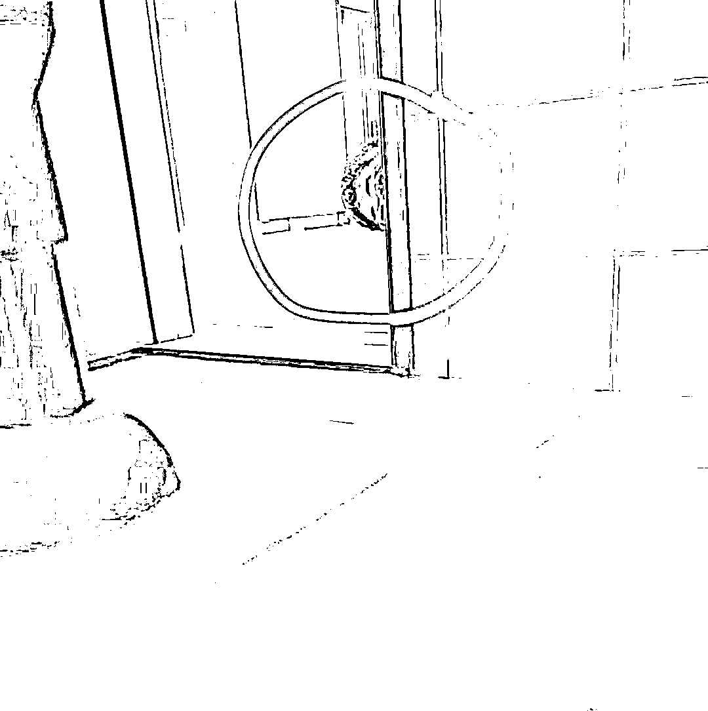

这名男性发现自己被拍后，马上就把头缩了回去。

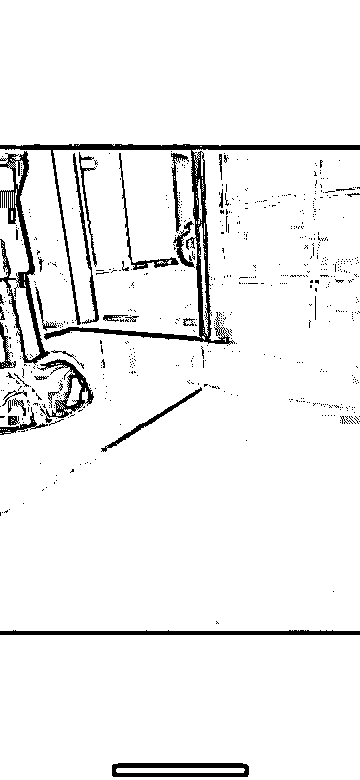

从照片的原图我们能看出，一个戴眼镜的男子，正以一种奇怪的角度露出脑袋，小眼睛不断地往女厕瞟！

女学生没有忍气吞声，出去就把这名男性拦住了。

经过反复询问，该男子表示，自己是本校数统院的数学老师名叫刘某迎，刚才自己并没有偷窥女厕，而是刚好系鞋带。 

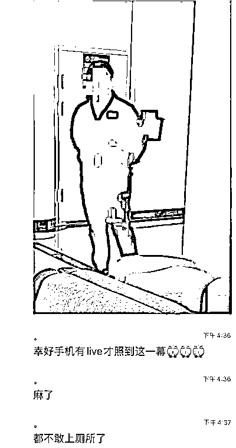

随后，女学生把这件事告诉了同学，让女生们上厕所时小心一点，避免再次发生这样的事情。

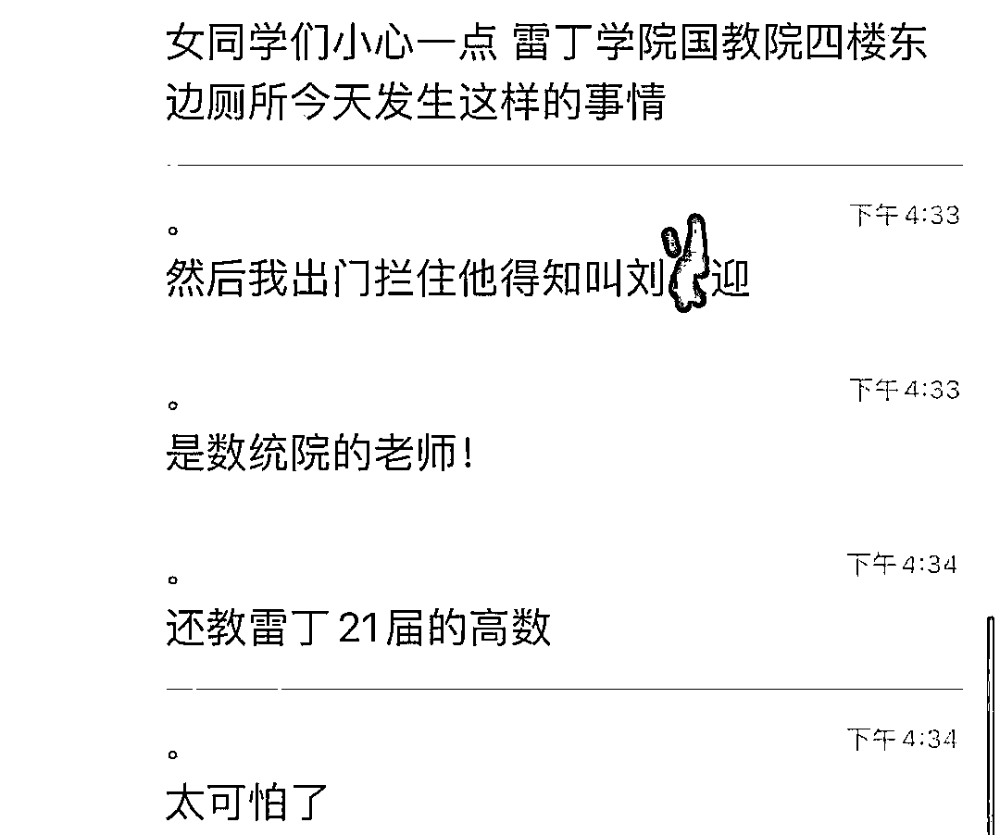

在网上搜到了该男子未打码的照片，从照片我们能看到，该男子一脸淡定面露不屑，双手背后以示清白。

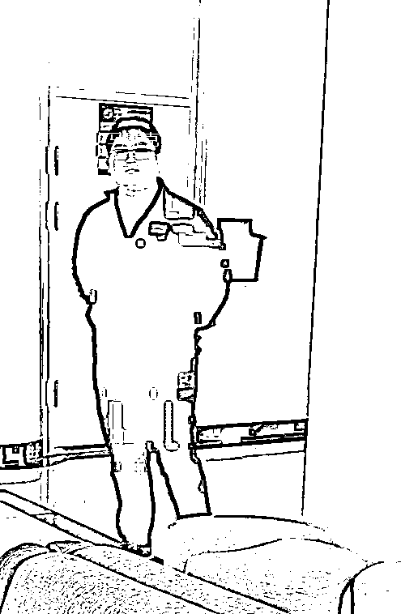

我还特意找到这位教师的信息，确实网传信息无误。 

可以看出，此人 1988 年出生，南京大学数学系博士学位，目前在南京信息工程大学担任讲师（现已升为副教授）。

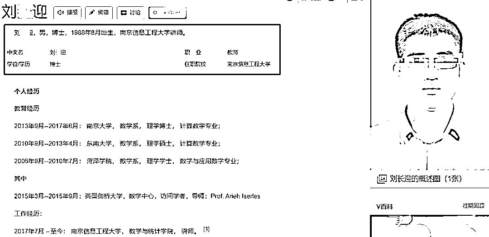

最搞笑的是，被偷窥的女生向学校保卫处报告，但学校保卫处表示没有证据能证明该男子是偷窥狂，他当时在系鞋带。

**我也是不懂，为什么系鞋带头要扭成那个角度？明显学校却想息事宁人，禁止学生传播此事。**

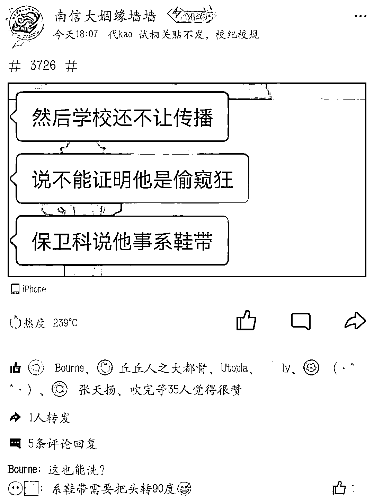

不知道你看到那个画面第一反应是什么？

我绝对是《熔炉》里那个偷窥小女孩上厕所的老变态！

据说当事人刘某迎已报警，警方也已经介入调查。

**刘教授有没有偷窥，官方没通报前我们先不要下结论。**

4 月 4 日，南京信息工程大学保卫处工作人员回复记者，4 月 3 日确实接到相关同学反映该情况，得知此事后，学校已成立调查组，也联系了涉事教师，相关情况正进一步调查中。

**如果属实，学校方面估计是开除公职了事。**

**如果报了警的话，警方最多也就拘留十天。**

《中华人民共和国治安管理处罚法》：**偷窥、偷拍**、窃听、散布他人隐私的，处五日以下拘留或者五百元以下罚款；**情节较重的，处五日以上十日以下拘留，可以并处五百元以下罚款。**

也就这样了，真没啥好办法。

但如果在 80 年代，如果有偷窥偷拍被抓现行，那就不死也要脱层皮了。

把时间拨回 1979 年。 

1979 年 7 月 1 日，历时 25 年 38 稿，《中华人民共和国刑法》终于在第五届全国人大第二次会议上表决通过，**在该版本刑法的第一百六十条里的便是中国刑法史上令人瞩目的罪行——流氓罪。**

**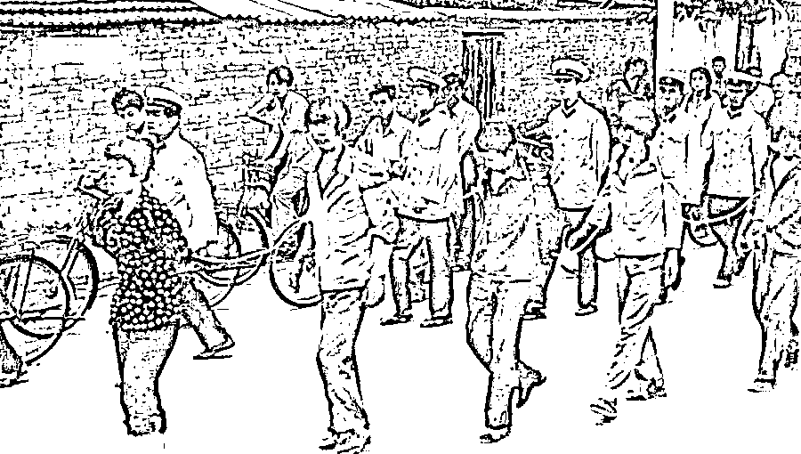**

在汉语里，"流氓"有两层含义：**一是职业方面"无业"，二是行为方面有"不务正业，手段下流，为非作歹"的行为。**

当时的刑法规定："聚众斗殴，寻衅滋事，侮辱妇女或者进行其他流氓活动，破坏公共秩序，情节恶劣的，处七年以下有期徒刑、拘役或者管制。流氓集团的首要分子，处七年以上有期徒刑。"

1983 年《全国人民代表大会常务委员会关于严惩严重危害社会治安的犯罪分子的决定》规定了 6 种提高量刑幅度的犯罪，流氓罪列于首位。

**在 1983 的严打运动中，流氓罪的刑罚变成可以处死刑，内容被扩大化。**

像强奸这种，肯定是可以死刑的。 

一位名叫翟曼霞的女孩，因在河中裸泳被警方抓获，后供述出与 18 名男子存在男女关系而被以流氓罪被判处死刑。

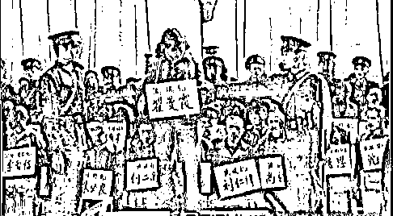

面对死刑判决，该女子说了这么一段话：**“性自由是我选择的一种生活方式，我的这种行为现在也许是超前的，但几十年以后人们就不会这样看了。”**

**后被依法枪毙。**

在该女子被执行死刑的三十九年后（也就是今年 2022 年），只要不是进行发生男女关系的多人运动**（聚众淫乱罪）**，只要不是与现役军人配偶发生性关系**（破坏军婚罪）**、只要不是**接受性贿赂、滥交**已经不再属于犯罪。

诸如此类的奇葩判决还有很多，**比如偷看小姑娘洗澡，死刑；画裸体画，死刑；马路上小便，无期徒刑......**

我第一次知道“流氓罪”还是通过罗翔老师讲的一个案例：

四川一男子和朋友打赌，朋友说你胆子太小了，是个怂人。该男子不服气开始和朋友争论，朋友说你不怂的话，你敢去亲前面走的那个女同志吗？说时迟那是快，四川男子上去就亲了那个女子一口。

**该四川男子犯流氓罪，被枪决。**

[`mp.weixin.qq.com/mp/readtemplate?t=pages/video_player_tmpl&action=mpvideo&auto=0&vid=wxv_1971441788418588674`](https://mp.weixin.qq.com/mp/readtemplate?t=pages/video_player_tmpl&action=mpvideo&auto=0&vid=wxv_1971441788418588674)

**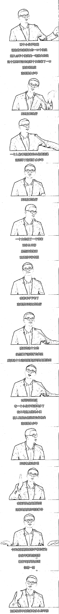**

**随着国家法制建设的不断完善，在一片质疑声中，1997 年修订的《刑法》”流氓罪“被取消，将其分解为**强制猥亵侮辱妇女罪、猥亵儿童罪、聚众淫乱罪、聚众斗殴罪、寻衅滋事罪**等罪。**

****自此，“流氓罪是个筐，什么都可以往里装”的时代成为过去，流氓罪享年 18 岁。****

**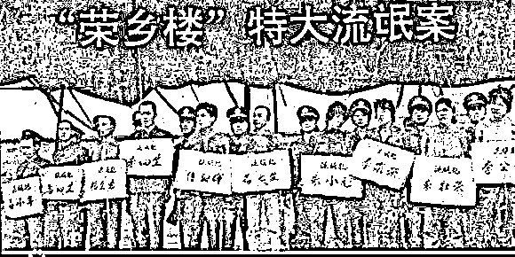**

**时代在变迁，我国的法制也在不断完善和健全。**

****虽然没有了流氓罪，但总有一条条法律来维护我们的人身权利，也同样有一条法律来约束我们的行为。****

**如今，少了很多约束的 90 后，00 后应该感到庆幸，对于更容易获得的自由和幸福，我们应该更加珍惜。**

****所以，要多学点法律。****

****思考：假如生活在 1983 年，这位老师会怎么判？你现在的行为是否很危险？****

**来源：昌南大队长**

****

**← 向右滑动与灰产圈互动交流 →**

****