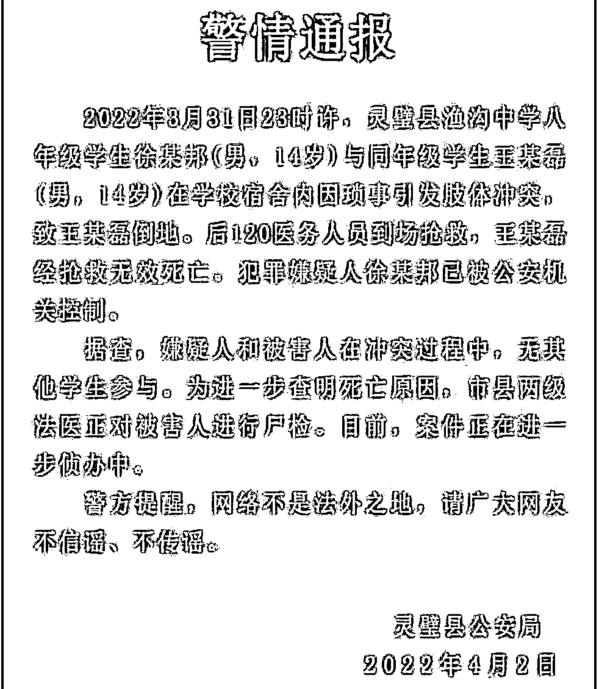

# “渔沟中学一学生死亡”，对灵壁来说，最棘手的不是调查真相，最棘手的是这个……

> 原文：[`mp.weixin.qq.com/s?__biz=MzIyMDYwMTk0Mw==&mid=2247532986&idx=2&sn=c219ce3d654cc4fc2548d5b8a1af4df2&chksm=97cb8a82a0bc039469373f96e8d148bdffbc0341b9cd181e5edf0fa1f618490b17b20e6415d0&scene=27#wechat_redirect`](http://mp.weixin.qq.com/s?__biz=MzIyMDYwMTk0Mw==&mid=2247532986&idx=2&sn=c219ce3d654cc4fc2548d5b8a1af4df2&chksm=97cb8a82a0bc039469373f96e8d148bdffbc0341b9cd181e5edf0fa1f618490b17b20e6415d0&scene=27#wechat_redirect)

昨晚有好友发微信给我，问我对 6+1=1 怎么看？

当时我一头雾水，什么 6+1=1 啊？1+1=2，我还没研究好呢，哪里有空研究 6+1=1？

好友告我：“抖音上传疯了。你还是写一点罢，读者们很爱看你写的评论文章。”我基本上不上抖音的，既然好友郑重其事告诉我一个事情，我就去抖音上溜达下，一到抖音上，还没搜索关键词，立马就是一股股“49 中事件”的味道扑面而来。于是乎斩钉截铁退出抖音了。

人生在世 3 万天，过一天少一天，天天看这些乌七八糟的信息烦不烦？让这些抖友们闹腾去，大乱必有大治。

今天凌晨 4 点 24 分，灵壁县委县政府调查组发布《关于“渔沟中学一学生死亡”案件调查处置情况的通报》（以下简称《通报》），通报很长，对事件娓娓道来，针对网络的热点和谣点逐一梳理。笔者认为，《通报》的文字表述是很有水平的，更有水平的是及时发布。昨天网络上此事件深度发酵，灵壁县连夜将相关信息整理到位，并且发布，很不容易的。

辟谣必须抢速度，本来辟谣就干不过造谣，如果再慢腾腾辟谣那就更干不过造谣了。张爱玲说过一句话：**出名要趁早。辟谣也要趁早**，已调查核实的信息能尽快释放就尽快释放，不一定非等到全面信息到位再发布。等你全面信息到位再辟谣，网民早对这个事情不关注了，他们又去追下一个谣了，比如秦始皇爱上了杨贵妃。

灵壁《通报》称：关于“是否多人殴打 1 人”的问题。经公安机关调查走访、现场勘查、技术检验以及犯罪嫌疑人供述，查明案件发生过程中，仅有**王某磊、徐某邦二人发生肢体冲突，其他学生均未参与打斗**。

此节情况，此前 4 月 2 日的《警情通报》已有认定，“**据查，嫌疑人和被害人在冲突过程中，无其他学生参与。**”警方在调查是否多人殴打问题上办法多的是，这是小 case，不要怀疑警方的本事。你如果笃定认为有暗箱，我也没办法，我没义务对你心理疏导。

《通报》又称：关于“犯罪嫌疑人是否为校长外甥”的问题。经公安机关对渔沟中学校长吴某卫、犯罪嫌疑人徐某邦以及其他六名在场的学生家庭社会关系进行调查，查明犯罪嫌疑人徐某邦以及其他六名在场的学生与渔沟中学校长吴某卫均无亲属关系。

渔沟中心是一所农村中学，就算“外甥”之说成立，校长有一手遮天的本事？校长有多大神通？关于农村学校校长的神通，几年前我曾经写过一个微博：

不要把一所乡中学校长想成多么神通，如果你把校长想成一手遮天的神通，我只能说你有一个很神奇的脑子。

刚我在饭店吃中饭，还听厨师们神侃：校长外甥带 6 个人打死人……今天的辟谣已经出来，可惜人们还只记得昨天的谣言。

从《通报》所称，显然不存在 6+1=1 的情况。其实认真思考下，6+1=1，逻辑上是很难成立的。我的一个粉丝对此说得好：“真的是 6+1 打死人，你作为家长，愿意让你的孩子做那个 1 吗？”相信拿再多的钱收买，家长也不会干这样影响孩子前途的事来。

这就是逻辑。两人以上是没有秘密可言的，何况现场有这么多学生还有宿管，强行将 6+1=1，弄得起来？弄得顺畅？弄得天衣无缝？

学生的年龄都很小，14 周岁左右，很多网民认为不是群殴的话，这么小的孩子不会把人打死，只有群殴才能将人打死。关于死因，《通报》称：“根据尸体检验，王某磊**系左胸部遭钝性外力作用致心脏震荡引发心律失常死亡**。下一步将根据法医病理学检验结果作出最终鉴定。”

初步认定，受害人系左胸部遭钝性外力作用致心脏震荡引发心律失常死亡。“心脏震荡”这个专业术语我不懂，还好我的互粉好友、网络大 V“法医秦明”有这个知识点的介绍。

“法医秦明”说：通报里写的心脏震荡，我在这里给大家解释一下。**心脏震荡死是指由****“****能量较低****”****的****“****钝力****”****作用于****“****心前区****”****后导致的以心电生理紊乱为主的一种钝力性心损伤。**伤后即刻出现严重的心律失常，严重室颤或即刻发生心室纤颤而死亡。有文献报道：“这种死亡发生高峰为青少年，有 70%小于 16 岁，且几乎都是男性，多数于棒球、冰球、足球、拳击等体育运动中发生，少数于打斗或交通事故中发生。”

“法医秦明”接着说：很多人说一个孩子赤手空拳打不死人，这显然是不科学的。且不说赤手空拳完全是可以形成绝对致命伤的，即便是没有形成绝对致命伤，也可以造成如本案中的心脏震荡而死亡。又或者也可以因为刺激迷走神经抑制死、挤压综合征、诱发疾病等等诸多原因而导致机体死亡。这个了解法医知识的朋友都应该明白。

我在网上搜索“一拳打死人”关键词，也搜到了不少案例，可见一拳打死人，实际生活中不是孤例。很久很久以前，我的两个邻居打架，其中一个就是被对方一拳打死。我对一拳打死人的现象是不怀疑的。

但在网络流量上，理性从来战不胜冲动，网民是很难深入思考的，因为很容易被带节奏。

昨天我在抖音上居然看到听到多人殴打一人的视频和音频，网民习惯“有图有真相”，多人打人的视频都有了，“公安机关还怎么抵赖？”

今天《通报》澄清：关于“网上流传的多人殴打学生视频是否与此次案件有关”的问题。经公安机关核查，网上流传的多人殴打学生视频系恶意嫁接，与本案无关。**目前公安机关已介入调查，将依法追究造谣者法律责任。**

这就是我昨天上了抖音，又很快退出的原因，因为那上面的视频实在太假，我一眼就判断出来了，所以昨晚我发了个微博帖子：

“#灵璧渔沟中学事件#今天抖音上很火，**有 49 中事件的味道**。有空我得看看。。”

一觉醒来，还没等我认真研究呢，灵壁的《通报》都出来澄清了。

我说到的“49 中事件”大家可以了解下，渔沟中学事件和“49 中事件”很相仿。我很难理解抖音平台是如何管理的，对这样一起低端谣言居然无能为力、束手无策，是真的无能为力、束手无策吗？

笔者发现，新浪微博上反贼多，抖音上谣客多。不过平心而论，这两大平台也最有热度，最好玩。造谣与辟谣同在，冲动和理性同台，这就是网络生态。

对于此案，探究真相不是最难的，难的是后续定性。

刑法规定：

“已满十六周岁的人犯罪，应当负刑事责任。**已满十四周岁不满十六周岁的人，犯故意杀人、故意伤害致人重伤或者死亡**、强奸、抢劫、贩卖毒品、放火、爆炸、投放危险物质罪的，**应当负刑事责任。**”

本案的“犯罪嫌疑人：徐某邦，男，2007 年 10 月出生，”已满 14 周岁未满 16 周岁。所以只有在其构成故意杀人、故意伤害致人重伤或者死亡犯罪行为时，才可追究刑事责任。

笔者毫不讳言，对徐某邦定这个罪名基本上不可能。读者若查阅此类于同学、邻居、同事、亲友之间一拳致死的案例可知，大多数定的是过失致人死亡。如果徐某邦的行为属于过失致人死亡，依照刑法的规定，其无需承担刑事责任。

需要不需要对徐某邦追究刑事责任，对灵壁县来说，这个问题更棘手。

来源：法之剑

← 向右滑动与灰产圈互动交流 →

