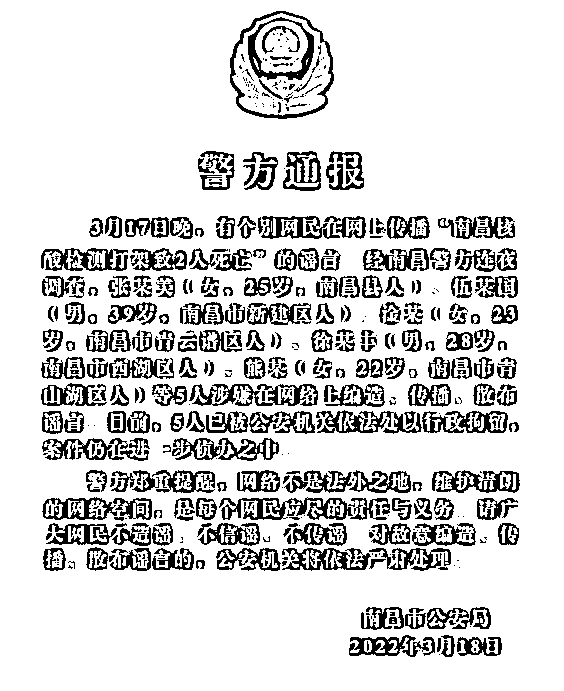

# 疫情诈骗再升级，“犯人”竟是我自己？

> 原文：[`mp.weixin.qq.com/s?__biz=MzIyMDYwMTk0Mw==&mid=2247533039&idx=4&sn=1c464a053dc60c8d50582267dac5640d&chksm=97cb8ad7a0bc03c19e3dc492e92d575197b0294b3d781567b3534e098610b974ef9e72cd83bc&scene=27#wechat_redirect`](http://mp.weixin.qq.com/s?__biz=MzIyMDYwMTk0Mw==&mid=2247533039&idx=4&sn=1c464a053dc60c8d50582267dac5640d&chksm=97cb8ad7a0bc03c19e3dc492e92d575197b0294b3d781567b3534e098610b974ef9e72cd83bc&scene=27#wechat_redirect)

‍

**‍01**

‍

说起近期关注度最高的公共事件，还得是疫情。 

而借助疫情实施诈骗的不法分子，也瞅准了时机。

平日里，每当病毒汹涌而来时，网络上总有一堆真真假假的消息让人摸不着头脑。

有道是“造谣一张嘴，辟谣跑断腿”。

谣言的危害性有目共睹。

因此大家伙可以看到，国家最近几年惩罚造谣的力度明显加大。

**不少人逞一时嘴快，然后喜提银手镯一双。**

那么如果有一天，你白天刚好心给爸妈好友分享了疫情动态，晚上就有“公安机关”突然打来电话，说你涉嫌“传播不实信息”，警方马上就要请你去局子喝茶。

**你慌不慌？**

前不久，家住丽水的小张便遇到了这样的情况。

某天，一个以“00”开头的陌生的电话出现在小张的手机屏幕上。**（注：以“00”或者“+”开头的号码是境外来电，普通人接到此类电话时应当保持警惕）**

接通之后，对方自称是“浙江省疫情防控中心”的工作人员，现有重要信息告知。

听到疫情两字，小张的神经立马紧绷了起来：

莫不是自己要被隔离了？

然而，听了“工作人员”接下来的一番话，小张发现自己还是太天真了：

**“你名下的手机号码 XXXXXX，现在涉嫌在网络上发布涉疫情不当言论!”**

**“我们会将你的信息转交给公安机关，请配合警方的调查！”**

面对突入其来的恐吓，小张一下子懵了。

自己平日里也没乱发什么消息啊，怎么就被警察盯上了呢？

尽管无比疑惑，但联想到那些发布不当消息者的下场，小张内心还是慌得不要不要的。

毕竟，没人愿意接受自己稀里糊涂就成为犯人。

**现在的他，只想着赶紧洗清自己身上的嫌疑。**

而电话那头的“防疫工作人员”自然是邪魅一笑：慌吗？慌了就上钩了！（小呸脑补）

接下来，小张配合联系上他的“民警”接受“调查”。 

**对方要求他出示包括银行账户在内的详细个人信息，并要求他通过向“安全账户”转钱的方式证明自己的“清白”。**

说时迟，那时快。

就在骗子即将得手之时，公安机关反诈中心的预警及时到位，当地派出所民警上门劝阻。

最终，小张逃过一劫。

据浙江警方公布的消息，在 3 月 28 日这天，省内一共有 8 位市民接到了类似的电话，其诈骗的套路如出一辙。

冒充公检法+利用疫情的诈骗组合拳，值得大家警惕。

**02**

复盘这起案件，小呸最大的感受就是：

**这年头，诈骗的套路虽在不断升级，但大都还是很容易识别的。**

比如那个万能的“安全账户”，不知道在各类诈骗案例中出现了多少次：

**征信出了问题，把钱转到安全账户；**

**涉嫌洗钱犯罪，把钱转到安全账户；**

**在网络上造谣滋事，解决手段居然还是安全账户…**

无论骗子多么能说会道，最终的一步都是薅走你账户里的血汗钱。

如果我们打开“上帝视角”，就会发现诸如“安全账户”之类的骗术并不高明，其中的逻辑漏洞已经达到可笑的程度。

然而在现实生活中，却依旧有无数人因为这个栽了跟头。

**出现这种局面的原因并非社会上“傻子太多”，而是骗子实在擅长利用人性的弱点。**

从 2020 年开始，疫情深刻地改变了我们所有人的生活状态乃至于思维模式。

时至今日，国民对“疫情”二字的敏感程度依然居高不下。

疫情话题长期占据着各大新闻的头条。

任何与疫情有关的消息，都会得到大众的高度关注，更别说自身与疫情沾上关系了。

这样一个极其容易引发恐慌情绪的话题，自然也就得到了骗子的青睐。

毕竟人一慌张、一焦急，警惕心与判断力就会直线降低。

**面对一个被恐慌情绪淹没的人，再低劣的话术也会变得威力异常。**

就拿小张的遭遇来讲，骗子在一开始就祭出了“大招”。

**“涉嫌发布涉疫情不当言论”这个噱头，在国内多地疫情抬头、舆论风向复杂的大环境下，比传统的“征信问题”显然更有杀伤力。**

一旦被骗子最开始的“三板斧”唬住了，接下来就是乖乖地被对方牵着鼻子走。

很多网友在回顾被骗的经历时都提到：

自己突然陷入了一种“魔怔”的状态中任人摆布，对方提出什么要求就答应什么，完全不经思考，最后莫名其妙就向对方转了钱。

这并非骗子会巫术魔法，而是受害人被自己的情绪左右了判断。

试想，一个满脑袋都想着“洗清嫌疑”的人，还能注意到骗子话术里的漏洞吗？

**有时候，比起恶补各种防骗套路，养成遇事冷静思考的习惯更重要。**

骗子的手段可以五花八门，但骗术的原理万变不离其宗。

希望各位读者，更希望我们身边的所有人都能远离诈骗之害。

来源：黑白呸

← 向右滑动与灰产圈互动交流 →

