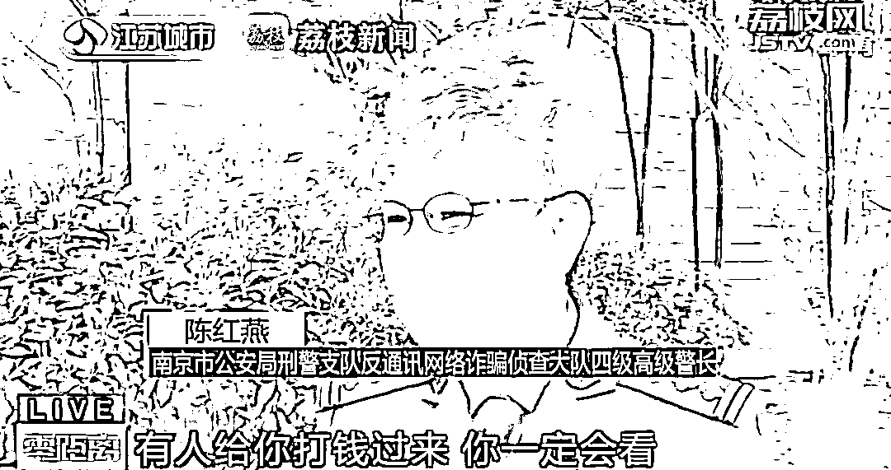

# 陈警官转账+1，+1，+1，+1，+1，+1，+1，+1，+1，+1

> 原文：[`mp.weixin.qq.com/s?__biz=MzIyMDYwMTk0Mw==&mid=2247533039&idx=5&sn=61a153a05c87be5477706bd6de9985a5&chksm=97cb8ad7a0bc03c13d0c53fb78f8ce262e32e23157f892e831ea0bd04922e21c67a372590b44&scene=27#wechat_redirect`](http://mp.weixin.qq.com/s?__biz=MzIyMDYwMTk0Mw==&mid=2247533039&idx=5&sn=61a153a05c87be5477706bd6de9985a5&chksm=97cb8ad7a0bc03c13d0c53fb78f8ce262e32e23157f892e831ea0bd04922e21c67a372590b44&scene=27#wechat_redirect)

该公众号已被封禁

[`mp.weixin.qq.com/mp/readtemplate?t=pages/video_player_tmpl&action=mpvideo&auto=0&vid=wxv_2341496429699170306`](https://mp.weixin.qq.com/mp/readtemplate?t=pages/video_player_tmpl&action=mpvideo&auto=0&vid=wxv_2341496429699170306)

近日 

南京警方接到一市民报警称

怀疑其国外的朋友吴女士遭遇诈骗

但吴女士不接警方电话

也不回信息

**陈警官便想到**

**以转账的方式引起其注意**

支付宝每转账 1 次

可留言 50 个字

**陈警官转了 10 次账**

**留言近 500 字**

**吴女士终于回复了**

原来

吴女士果真遭遇了“杀猪盘”诈骗

已给对方转账 52 万元

正准备继续给骗子转账 7 万美金

幸好看到了陈警官的一条条留言

才保住了这笔钱

**网友：**

**民警真的是为了反诈**

**用尽“**洪荒之力**”了**

来源：人民日报，@荔枝新闻，中国青年网微信（ID：youthzqw）

← 向右滑动与灰产圈互动交流 →

