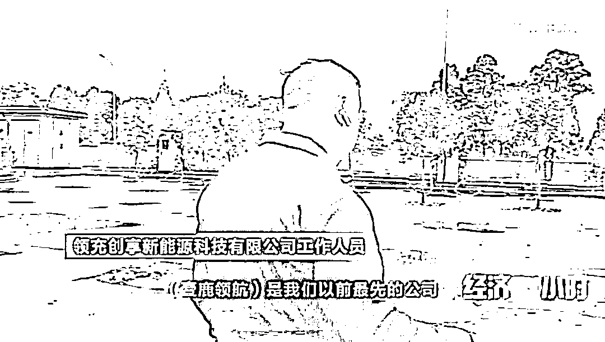
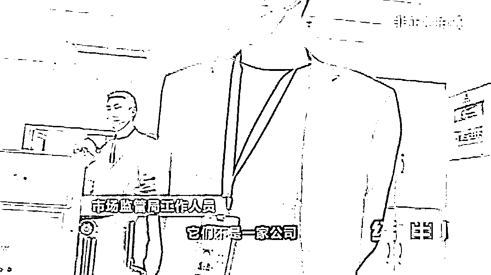
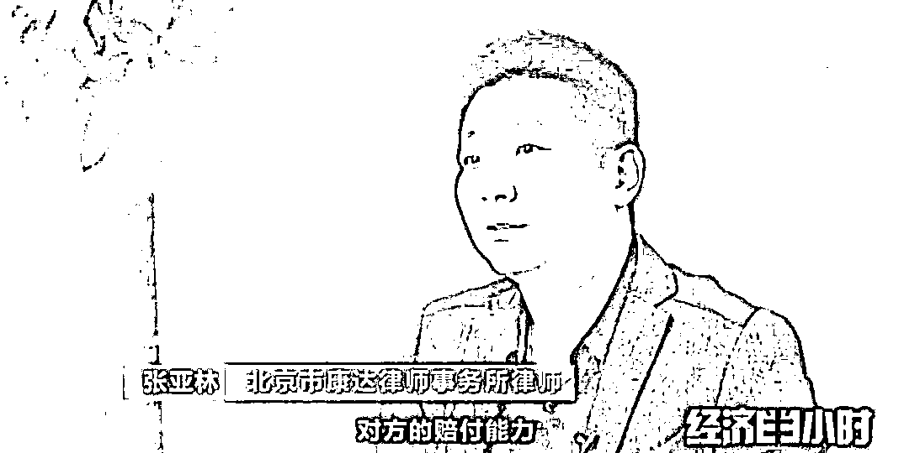
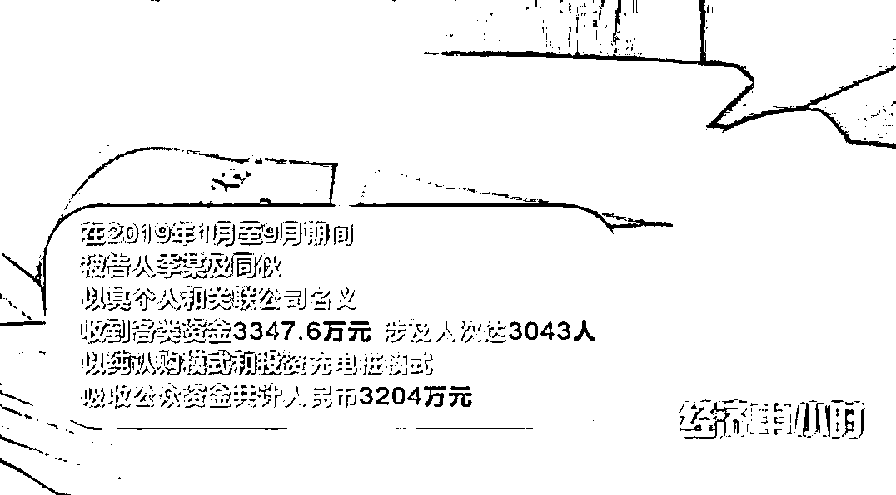

# 警惕！新型诈骗！充电桩投资骗局大起底！有人已被骗 160 万…

> 原文：[`mp.weixin.qq.com/s?__biz=MzIyMDYwMTk0Mw==&mid=2247533039&idx=7&sn=daf58cfa14a9ea3e0c842220913bb393&chksm=97cb8ad7a0bc03c127c0f1e137d2e593e03b9bf838fa059906938e1acfd81d6d8c08f8e49187&scene=27#wechat_redirect`](http://mp.weixin.qq.com/s?__biz=MzIyMDYwMTk0Mw==&mid=2247533039&idx=7&sn=daf58cfa14a9ea3e0c842220913bb393&chksm=97cb8ad7a0bc03c127c0f1e137d2e593e03b9bf838fa059906938e1acfd81d6d8c08f8e49187&scene=27#wechat_redirect)

最近，《经济半小时》栏目接到群众举报，称有人在推销一种新能源汽车充电桩的投资项目。推销人员宣称只要你认购共享充电桩、投资建设充电站，就会有高回报、高返利。真的有这样的好事吗？投资充电桩到底是“馅饼”还是陷阱呢？

**·**

**打着新能源的幌子，充电桩投资可能是集资诈骗**

[`mp.weixin.qq.com/mp/readtemplate?t=pages/video_player_tmpl&action=mpvideo&auto=0&vid=wxv_1806534159004139526`](https://mp.weixin.qq.com/mp/readtemplate?t=pages/video_player_tmpl&action=mpvideo&auto=0&vid=wxv_1806534159004139526)

△央视财经《经济半小时》栏目视频

在一家社交平台上，一个名叫“王美人新能源充电桩招募合伙人”的账号，几乎每天都在发布招募充电桩合伙人的视频，视频里 “你只管出资，我们负责建站，你坐等赚钱”的字眼，看起来极具诱惑性。

 

3 月中旬，记者来到了领充创享新能源科技有限公司，见到了社交平台上以“王美人”作为昵称，招揽投资人的销售人员王玲。

  

王玲告诉记者，投资模式有两种，既可以投资建设充电站，也可以单独认购充电桩。随后，她给记者计算了认购充电桩的收益账：认购一根充电桩 18 万元，按照一度电收 0.4 元的服务费，一台 120 千瓦的充电桩一天使用 5 小时计算，一个月一根充电桩的服务费为 7200 元，其中投资人可以分得 60%也就是 4320 元。

为了说服记者投资，王玲随后带记者来到了位于双流区的白家新能源汽车产业园。这个充电站的 33 台充电桩目前已经投入使用。

王玲介绍说，消费者可以通过扫描充电桩上的二维码进行充电，费用会直接打入公司的账户，目前这个充电站还有 9 根充电桩可以认购。但记者在现场却发现，这些充电桩上标注的是壹鹿领航新能源，而且通过二维码扫码之后出现的也是壹鹿领航的小程序，并非王玲所在的“领充”公司。

随后，记者又跟着王玲来到了位于郫都区香草湖的第二个站点，这个充电站一共有 24 根充电桩，虽然充电桩上标注的是“领充”，但是扫描二维码以后，弹出的依旧是“壹鹿领航”的小程序。

为了打消记者的疑虑，王玲让领充公司的行政人员拿出了香草湖充电站的建站手续，但记者发现，这个充电站从立项、审批到完成验收，都是以“壹鹿领航”的名义完成的。但王玲一再向记者强调，领充和“壹鹿领航”其实就是一家企业。

为了让记者尽快投资，领充的工作人员还拿出了他们和其他投资人签订的合同，这摞厚厚的合同大概有 20 多份，记者仔细查看后发现，绝大部分都是跟这家叫做“壹鹿领航”的公司签订的。

经过了之前的一番考察，王玲又给记者抛出了一个更大的诱惑。她介绍说：相比投资一根充电桩，投资一个充电站的收益更大。紧接着，这位行政人员拿来了电脑，开始向记者介绍一个还没有动工建设的充电站项目。

看记者还是犹豫不决，王玲又带着记者来到了该项目所在地，双流汽车站进行了实地考察。王玲告诉记者，眼前这片空地，他们公司已经签订租地合同，很快就将在这里建设 20 根充电桩，以 396.6 万元的价格整站出售。

为了让记者早点下定决心，王玲拿出了领充公司与甲方签订的租地合同，以及领充双流汽车站充换电服务区项目在双流区发展和改革局提交的备案表。

双流汽车站充电站项目究竟靠不靠谱？领充创享跟壹鹿领航真的就是一家公司吗？带着一连串的疑问，记者随后到政府部门进行了走访求证。

位于双流车站的充电站项目，已经提交了项目备案表，是否就意味着这个投资项目安全可靠呢？记者又来到了当地发展和改革委员会继续求证。

新能源汽车充电站的资质审核到底由哪个部门负责？当地经信局工作人员介绍说，他们只负责全市电动汽车充换电设施布局的规划和补贴工作，有关资质审核由哪个单位负责她也不清楚，但一听到投资涉及“领充”和“壹鹿领航”，她连忙给记者进行了善意的提醒。

工作人员告诉记者，已经有投资人因为收益达不到预期，来当地经信局投诉过这两家公司，经信局也对“壹鹿领航”的工作人员进行过约谈。但是，因为公司的经营活动不在他们的监管范围之内，眼见着这些推销人员现在还在市场上推销产品，经信局电力处的工作人员对此也感到无能无力。

北京市康达律师事务所张亚林律师在查看了相关资料后，很轻易发现了其中的漏洞。他告诉记者，合同上有关充电站配套设施收益的具体条款，与工作人员在宣传材料和口头承诺的并不一致。

从领充公司出示的合同来看，这个投资项目根本就不像宣传的那样“只投资，坐等收益”。而且公司的注册地跟实际经营地不一样，上级控股公司跟这个公司基本上同一时间成立，每一个公司的注册资本目前都是零，都是认缴制的，也没有真实出资的情况。

领充公司的宣传资料还显示：公司拥有 400 多项与充电桩有关专利技术和 17 位院士的加持。然而，记者在天眼查的系统中查询后发现，这家成立于 2020 年 7 月的领充创享新能源科技有限公司名下并没有显示持有专利。

张亚林律师认为，除了这个项目存在虚假宣传以外，还有可能存在更严重的问题。

管理部门的工作人发出提醒，专业的法律人士也看到了存在的问题，但眼下成都的市场上，这个充电桩投资项目的推销，依旧在火热进行。我们提醒当地的监管部门，及早管理市场上出现的这类现象，如存在风险，应及时维护百姓的权益。

**·**

**多起投资充电桩骗局爆出，投资需谨慎**

[`mp.weixin.qq.com/mp/readtemplate?t=pages/video_player_tmpl&action=mpvideo&auto=0&vid=wxv_1806534487971790853`](https://mp.weixin.qq.com/mp/readtemplate?t=pages/video_player_tmpl&action=mpvideo&auto=0&vid=wxv_1806534487971790853)

△央视财经《经济半小时》栏目视频  

天下掉不下馅饼，只要掉下馅饼后面跟着的就是陷阱。事实上，打着“响应政府号召，提倡节能减排”的旗号，制造高额返利的投资充电桩骗局实施诈骗，在一些地方早已不是新闻，已有不少百姓上当受骗。

2018 年 10 月，天津的董先生就和一家叫做“途客”的公司签订了合作协议，花 160 万元投资了充电桩。

公司承诺，如果投资过了一年之后，董先生想转让投资的充电桩，公司可以出资进行回收。董先生回忆，当时自己最关心的是投资回报的问题。至于自己所投资的充电桩，究竟有没有安装？安装在了哪里？董先生并不清楚，合同里也并没有做出约定。

时隔半年，就在董先生心里美滋滋，每个月都等着领固定收益的时候。突然来了一通电话，犹如晴天霹雳，瞬间击碎董先生的发财梦。也就是从这一刻起，他的噩梦开始了。

董先生第一时间找到了公司，发现原来八九十人的公司团队已缩减到不足十人，办公地点也挪到了更小的办公室里。公司的负责人告诉董先生，要想拿到钱，必须转股，把股份转到一家叫做广州电易生活的公司。

走投无路的董先生只能选择转股。但之后广州电易生活科技有限公司给出的答复让董先生彻底认清了这场骗局。

160 万买的 8 根充电桩就这么凭空消失了？还是说这 8 根充电桩根本就没存在过？目前天津市南开区人民法院，已经以非法吸收公众存款罪判决，下一步何时把钱追回来，董先生也只能苦苦等待着结果。

2020 年 10 月，重庆市潼南区人民法院宣判了一起非法吸收公众存款案。涉案企业打着新能源的旗号，向当地百姓大力宣传认购模式。

受害人丁先生参与投资认购的公司叫做重庆云佳汇科技有限公司，这家公司在 2018 年 11 月成立之初，就在潼南区及周边打着新能源的幌子大肆做广告、办活动，先后成立了 8 个专卖店，发展了 100 多名业务员，向周边百姓宣传认购返利模式。

丁先生带着记者来到了当时他认购电动车签合同的门店，门店早已人去楼空，变成了临时的仓房。

法官提醒，涉案的这类企业往往都是利用“新能源、共享经济”等时髦的概念，不断设局，而投资者被高额的投资回报率所吸引，也放松了警惕。骗局的产生，往往是利用了人们非理性地追逐利益。因此投资者在投资过程中，一定要擦亮眼睛、不要被高收益、高回报所蒙蔽。

**擦亮双眼，天上不会掉馅饼**

预计到 2030 年，我国新能源汽车保有量将达 6420 万辆。根据车桩比 1:1 的建设目标，未来十年，我国充电桩建设存在 6300 万的缺口，这巨大的“蛋糕”被盯上之后，市场上的种种乱象也层出不穷。

对于这样的市场乱象，我们提醒有关部门，能够完善制度、加强监管，及早发现问题，解决问题。同时我们也提醒广大投资者，任何金钱。

来源：央视财经，巴蜀反诈

← 向右滑动与灰产圈互动交流 →

