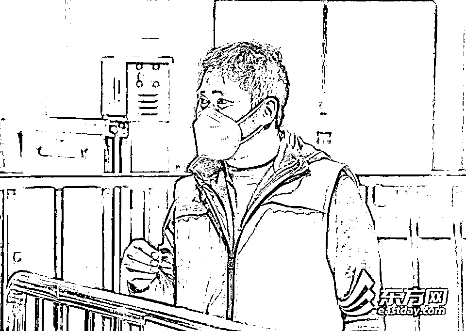
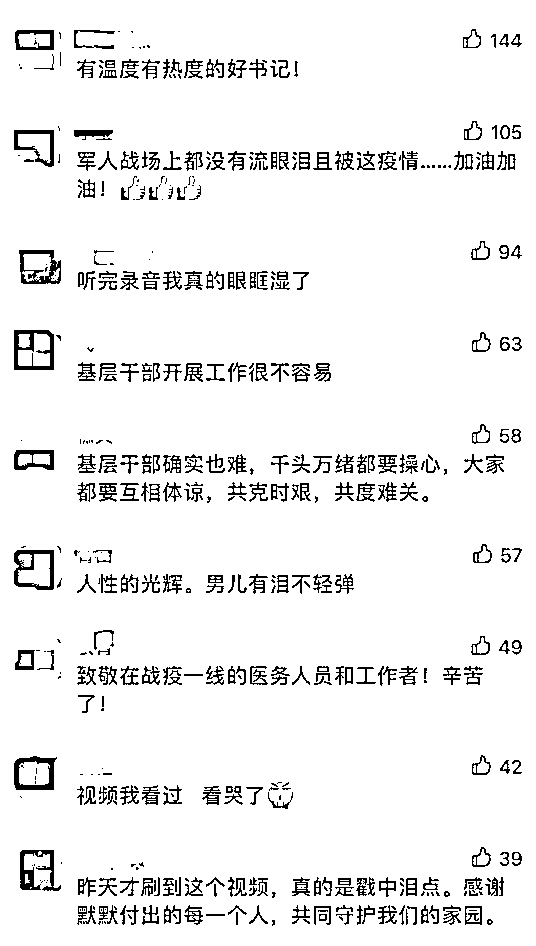
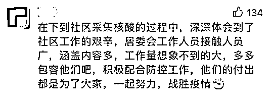

# “哭了”的居委书记找到了！他还有另一个身份

> 原文：[`mp.weixin.qq.com/s?__biz=MzIyMDYwMTk0Mw==&mid=2247533039&idx=8&sn=270c78b0e71d3d8839fbe3c6c60444d4&chksm=97cb8ad7a0bc03c1d09c788b460e6774989c52a8dbbe37a900aefa3d45682aaf84002388a2ee&scene=27#wechat_redirect`](http://mp.weixin.qq.com/s?__biz=MzIyMDYwMTk0Mw==&mid=2247533039&idx=8&sn=270c78b0e71d3d8839fbe3c6c60444d4&chksm=97cb8ad7a0bc03c1d09c788b460e6774989c52a8dbbe37a900aefa3d45682aaf84002388a2ee&scene=27#wechat_redirect)

近日，一段电话录音刷屏

一位被医院急召的护士与

所在小区居委书记的对话

感动了无数人

↓↓↓

[`v.qq.com/iframe/preview.html?width=500&height=375&auto=0&vid=y3331fwq084`](https://v.qq.com/iframe/preview.html?width=500&height=375&auto=0&vid=y3331fwq084)

**“这个事情我知道，我不能讲了，再讲我要哭了。”**

“但是我不敢做主，现在只要你能够承诺，你能够确确实实是返岗，那我就放你出去。”

“你出去了也可以回来，但你不可以去其他地方，纯粹是为了工作才可以出去。”

**“你既然是医务工作者，为了上前线你就去。”**

5 日，记者在上海市虹口区一小区里找到了录音里“哭了”的**居民区党总支书记刘苗**。

**记者：什么时候知道这个录音火了？**

**刘苗：**事情是发生在 4 月 4 日上午，那天一整天上海全市核酸筛查，我们小区也在做检测，一直到当天晚上才听说。

**记者：录音里当时是什么情况？**

**刘苗：**打电话的护士是我们小区居民，她住的楼是封控状态，她之前已经跟我沟通过几次。当天是打电话，我说，你住的楼是有感染者的，要跟工作单位讲清楚。**说实话她是护士，医院这时候叫她回去，我们一定是支持的。但我需要对我们居民区负责，所以我要确定一下。**

**记者：说着说着怎么会掉眼泪的？**

**刘苗：****当时确实感觉有点压力，怎么做居民工作我懂，但防疫技术不是我的专长。**当时小区在做核酸，我穿着“大白”的衣服，接电话开了免提，听不太清，所以有点着急。

**记者：后来放她出去了吗？**

**刘苗：**我想了一下，还是建议她先把核酸筛查做了再出去，因为我想她返回医院，肯定也需要出示 48 小时核酸报告的，之后她把承诺书和相关证明都发给我，就可以放她出去了。

**记者：这样的情况在封控期间多吗？**

**刘苗：**今天又仔细看了一下我们的出入登记，我们小区有 30 多个这样的情况，都写了承诺书、登记了资料。**到目前为止从我手上放出去的人，没有一个是放错的，他们回来后都向我们报备了。**不管是谁，他出去是确确实实有需要的，或者说疾病重病，包括我们有个孕妇，小区封控第一天就有早产征兆，我们了解后及时放行了，当天孩子就生下来了，现在已经回来。

**刘苗曾是一名军人。1995 年入伍、2012 年转业，在部队待了 16 年。**2019 年 10 月，他来到社区，从书记助理做起，自 2021 年夏天开始当了居委书记。

**刘苗说，3 月 28 日小区就因为有感染者封控了。“我们小区有 1383 户，人数基本稳定在 3650 人，居委会人手不多，都住在了居委会，我们在这里，老百姓就觉得有感觉了，一点不慌了。”**

**此外，这次让刘苗特别感动的是，小区有 160 多位居民举手帮忙，“以前大家都忙着上班，没想到这一次都来报到了，还给我们送物资送慰问，怕我们吃不饱。”**

****

**许多网友听完这段录音纷纷表示，“这是一位有温度的好书记”。身在上海的网友也写下了自己对医务人员和社区工作者的理解和谢意。**

****

****

**来源：央视新闻（ID：cctvnewscenter）**

****

**← 向右滑动与灰产圈互动交流 →**

****