# 两个人毁了半个城！两人刻意隐瞒行程被杭州警方立案调查，俩人心太大了

> 原文：[`mp.weixin.qq.com/s?__biz=MzIyMDYwMTk0Mw==&mid=2247533132&idx=2&sn=85e6aeec0e263bf0d8aeba18336b09e0&chksm=97cb8974a0bc00628cfd4b2b652fbf112b4a3e2386a6bea9284b525bda7cb85db63b7583e992&scene=27#wechat_redirect`](http://mp.weixin.qq.com/s?__biz=MzIyMDYwMTk0Mw==&mid=2247533132&idx=2&sn=85e6aeec0e263bf0d8aeba18336b09e0&chksm=97cb8974a0bc00628cfd4b2b652fbf112b4a3e2386a6bea9284b525bda7cb85db63b7583e992&scene=27#wechat_redirect)

杭州城西银泰上热搜，杭州来福士上热搜，一对疫情重点区来的阳性母女这是沸了整个杭州！ 

（这俩母女不是上海人，是在上海待了几天的其他省份人员，请勿地域攻击。）

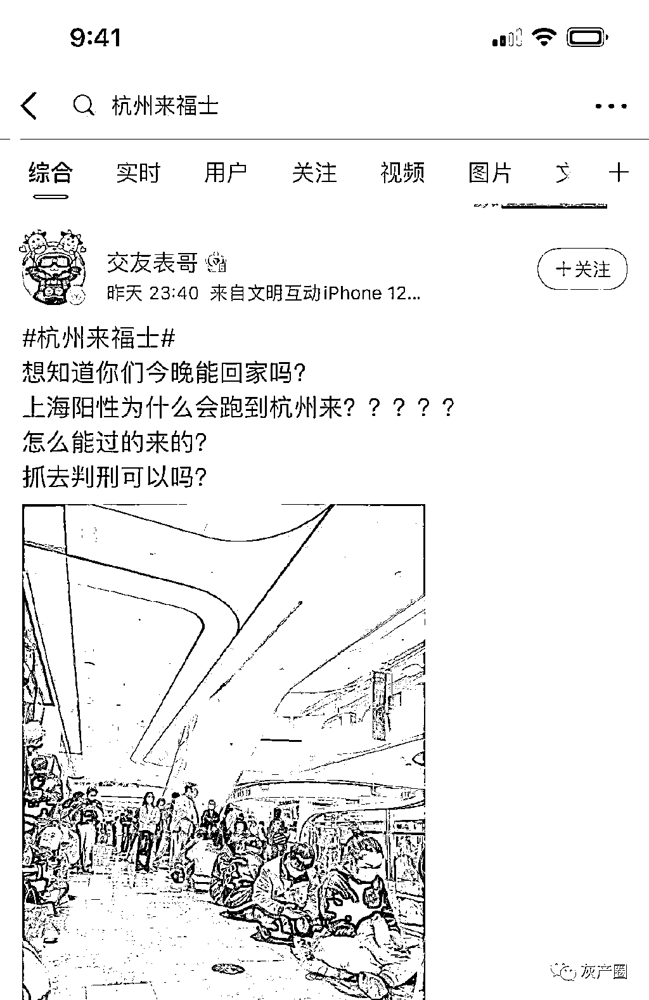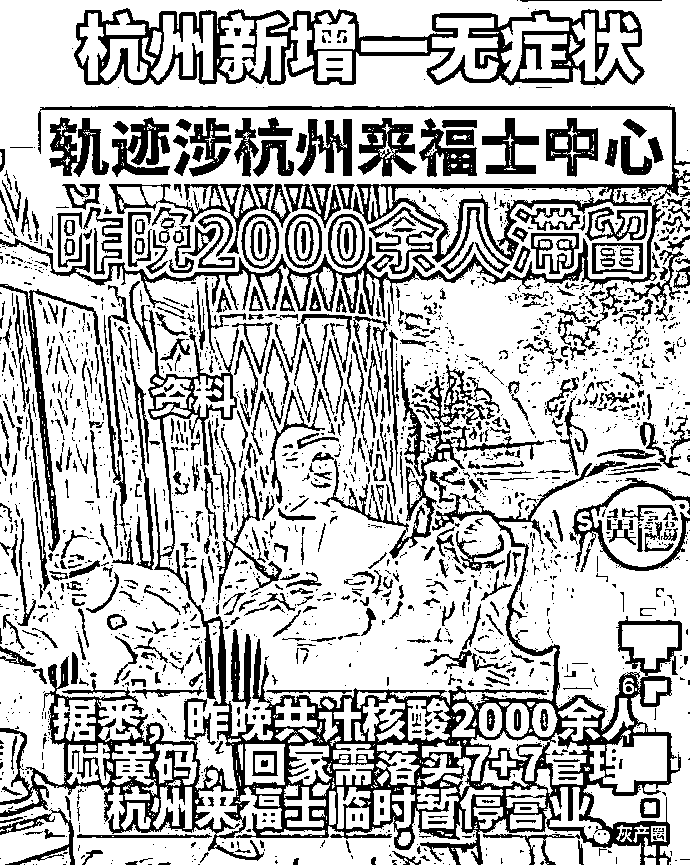

网传的事情经过

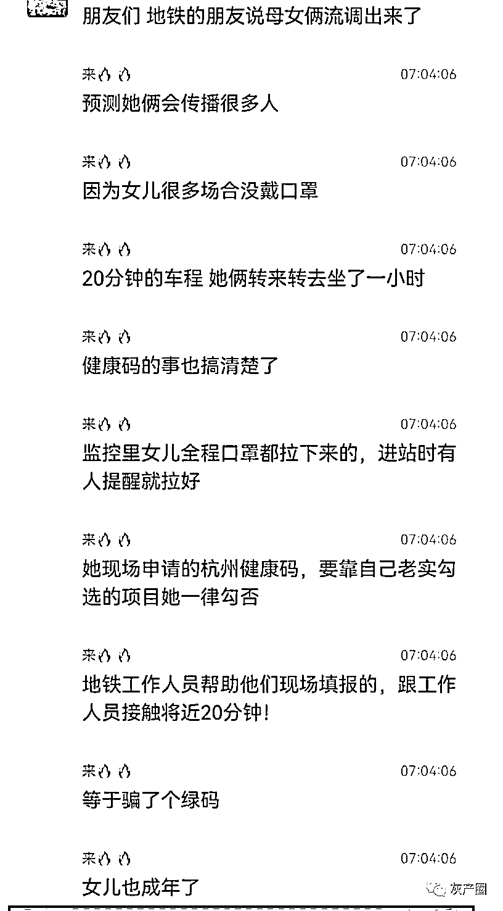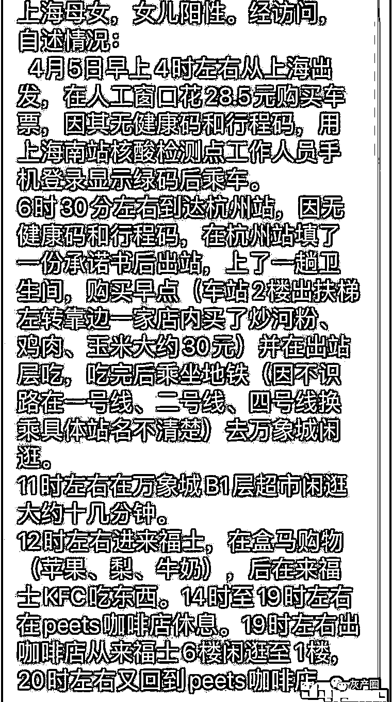

网友的解读路径

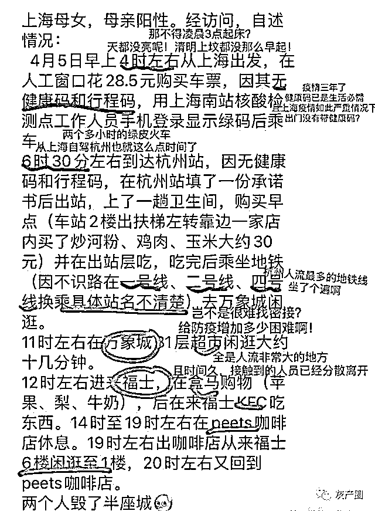

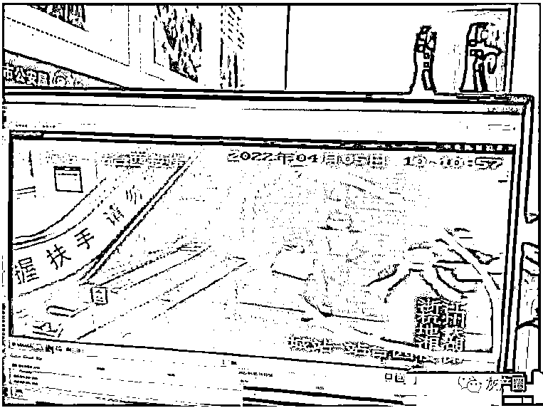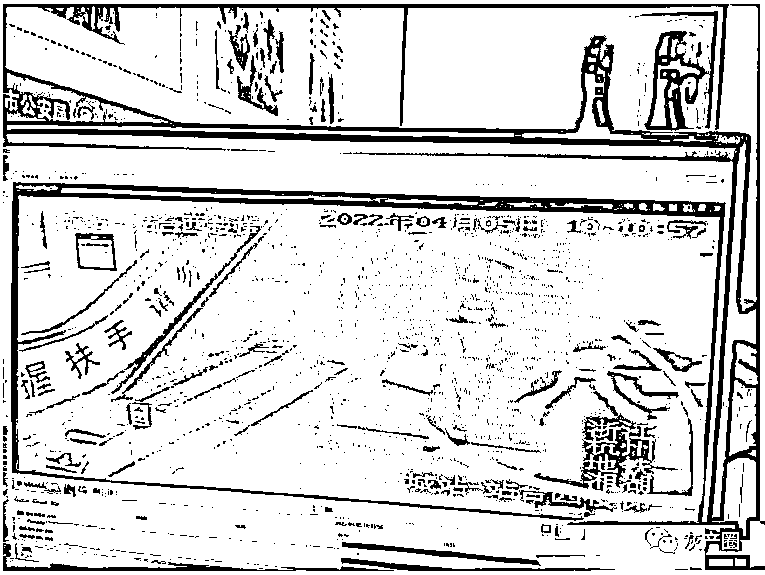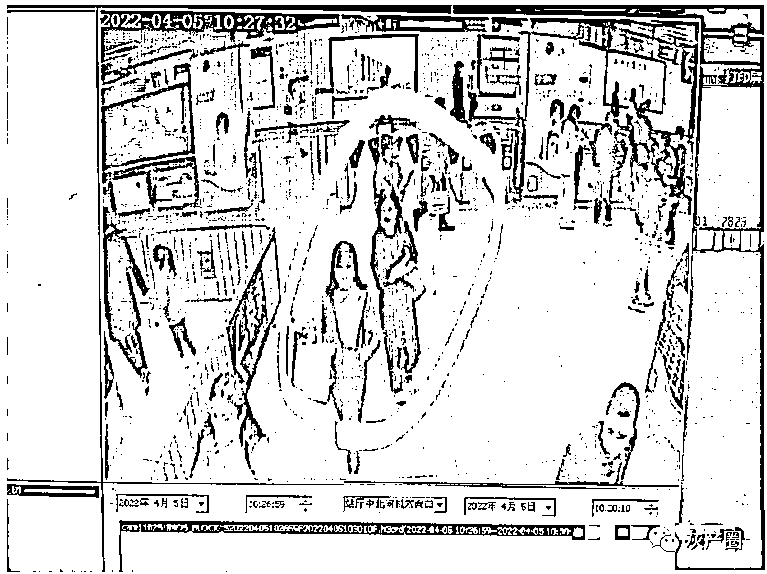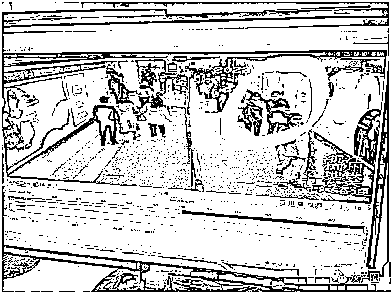

杭州的一线医务工作人员在咖啡店内找到她们

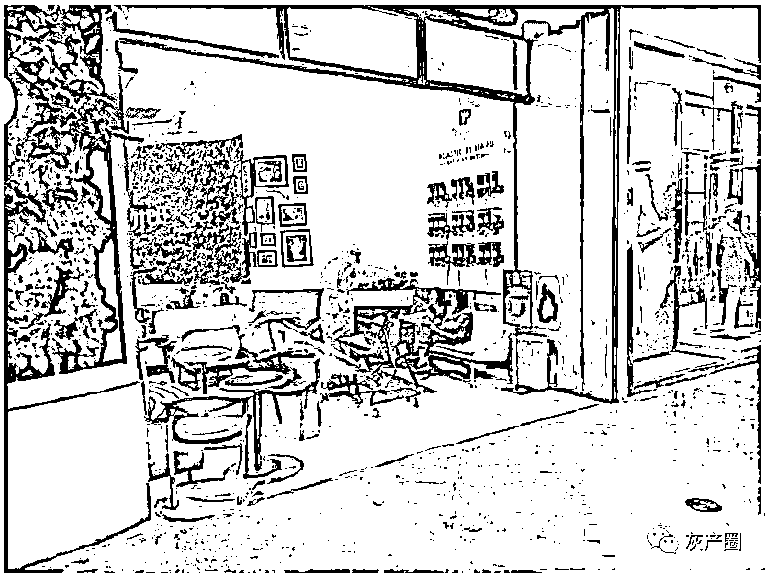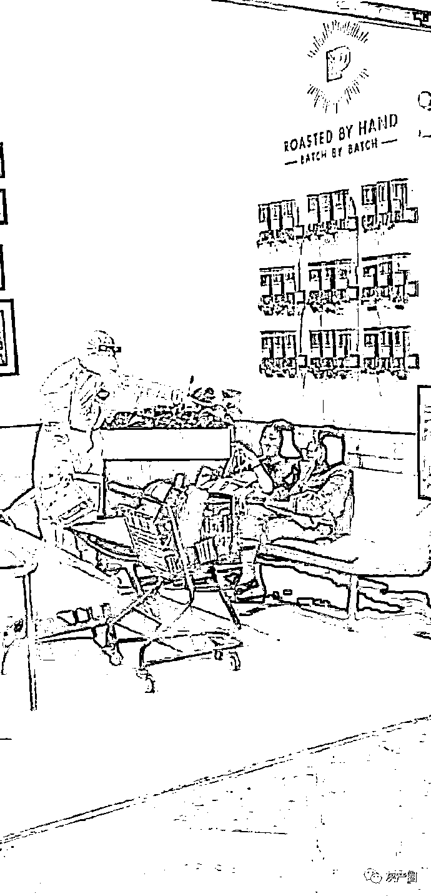

给她们提供了防护服后，在皮爷咖啡店内接受了杭州一线医务人员的问询。视频对话很清楚，

1、俩母女是从上海入杭。

2、她们的健康码为绿码。

3、她说她们在上海隔离了很多天，每天都做了核酸，都是阴性。

[`mp.weixin.qq.com/mp/readtemplate?t=pages/video_player_tmpl&action=mpvideo&auto=0&vid=wxv_2343712373448065024`](https://mp.weixin.qq.com/mp/readtemplate?t=pages/video_player_tmpl&action=mpvideo&auto=0&vid=wxv_2343712373448065024)

对此，网友有了阴谋论的想法

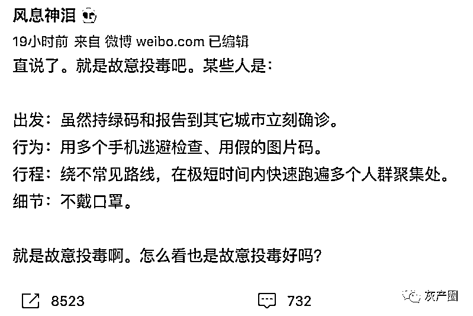

据杭州发布，4 月 5 日，宁某某、党某某从省外疫情中高风险地区来杭，接受防疫工作人员调查期间刻意隐瞒行程，造成社会面传播风险，已被上城区公安分局依法立案调查。

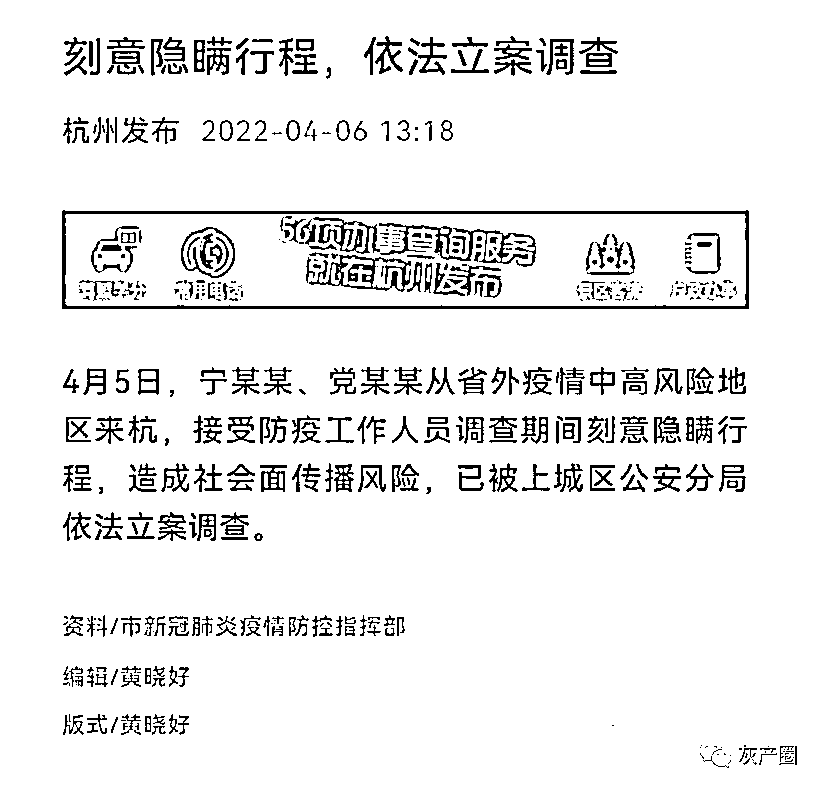

来源：微博那些事儿

← 向右滑动与灰产圈互动交流 →

